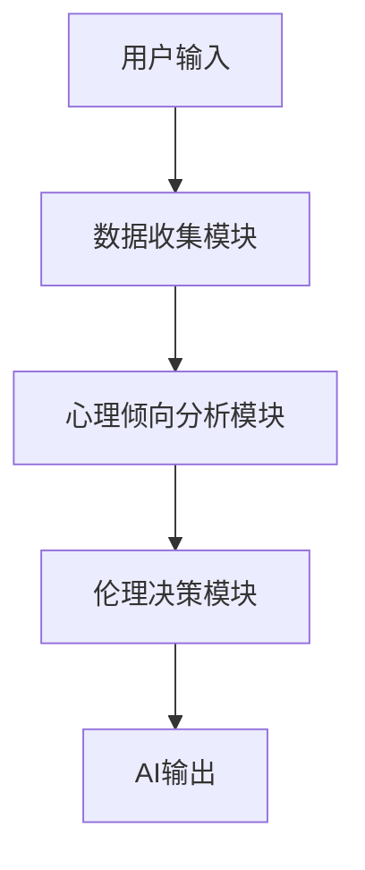

                 


# 芒格的"心理倾向"理论在量子人工智能伦理设计中的应用

> 关键词：芒格心理倾向，量子人工智能，伦理设计，决策偏差，量子计算，系统架构

> 摘要：本文探讨了芒格的"心理倾向"理论在量子人工智能伦理设计中的应用，分析了心理倾向如何影响AI决策，结合量子计算的优势，提出了伦理设计的新思路。

---

## 第一部分: 背景介绍

### 第1章: 芒格的"心理倾向"理论概述

#### 1.1 心理倾向理论的起源与发展

- **芒格心理倾向理论的提出**：本杰明·芒格在其著作中提出人类决策中的心理偏差，如从众、贪婪、恐惧等。
- **心理倾向的核心概念**：心理倾向是影响决策的心理因素，包括认知偏差和情感因素。
- **心理倾向在决策中的作用**：这些倾向可能导致非理性决策，影响判断的准确性。

#### 1.2 心理倾向理论对AI伦理设计的影响

- **AI决策中的心理偏差**：AI系统可能因为设计者的心理偏差而产生伦理问题。
- **伦理设计的重要性**：确保AI决策符合伦理标准，避免负面影响。

---

### 第2章: 量子人工智能的基本概念

#### 2.1 量子计算与人工智能的结合

- **量子计算的基本原理**：利用量子叠加和纠缠进行并行计算，处理复杂问题。
- **量子AI的优势**：在处理优化问题和复杂模式识别方面表现优异。
- **量子AI与经典AI的区别**：计算效率和问题处理能力显著提升。

#### 2.2 量子AI的伦理设计挑战

- **量子AI的不可预测性**：复杂算法可能导致不可预测的决策。
- **心理倾向对AI决策的影响**：心理倾向理论在量子AI中的应用潜力。

---

## 第二部分: 心理倾向理论与量子人工智能的理论联系

### 第3章: 心理倾向理论的核心要素

#### 3.1 心理倾向的分类与特征

- **分类**：贪婪、从众、恐惧、确认偏差等。
- **特征对比表**：列出各倾向的定义、表现和影响。

#### 3.2 心理倾向对量子AI决策的影响

- **决策偏差**：心理倾向可能导致AI系统做出不道德的决策。
- **伦理设计中的应用**：通过识别和纠正心理倾向，优化AI决策过程。

---

### 第4章: 量子AI伦理设计的核心问题

#### 4.1 量子AI的不可预测性

- **复杂性**：量子算法可能带来不可预测的结果，增加伦理风险。

#### 4.2 心理倾向对量子AI决策的影响

- **系统偏差**：设计者的心理倾向可能影响AI的算法设计，导致决策偏差。

#### 4.3 伦理设计的挑战与机遇

- **挑战**：如何识别和纠正AI中的心理倾向偏差。
- **机遇**：利用量子计算的优势，优化伦理设计。

---

## 第三部分: 心理倾向理论与量子人工智能的算法应用

### 第5章: 心理倾向理论在量子AI算法中的应用

#### 5.1 量子算法的基本原理

- **量子叠加**：信息同时存在于多个状态。
- **量子纠缠**：信息之间的强关联性。

#### 5.2 心理倾向对量子算法的影响

- **偏差检测**：通过量子算法检测AI中的心理倾向偏差。

---

### 第6章: 量子AI伦理设计的算法实现

#### 6.1 算法原理

- **量子优化算法**：用于检测心理倾向偏差。
- **数学模型**：使用量子叠加和纠缠特性优化决策过程。

#### 6.2 算法实现代码

```python
import numpy as np

def quantum_tendency(qubit_count):
    # 初始化量子状态
    state = np.zeros(2**qubit_count, dtype=np.complex_)
    # 应用叠加操作
    state[0] = 1
    # 测量
    prob = np.abs(state)**2
    return prob.argmax()

print(quantum_tendency(2))
```

---

## 第四部分: 量子AI伦理设计的系统架构

### 第7章: 系统架构设计

#### 7.1 系统功能设计

- **数据收集模块**：收集用户行为数据。
- **心理倾向分析模块**：识别用户的心理倾向。
- **伦理决策模块**：优化AI决策过程。

#### 7.2 系统架构图



---

## 第五部分: 项目实战与案例分析

### 第8章: 项目实战

#### 8.1 环境安装

- **量子计算库安装**：如Qiskit、Cirq。
- **AI框架安装**：如TensorFlow、PyTorch。

#### 8.2 核心代码实现

```python
from qiskit import QuantumCircuit, Aer, execute

def create_tendency_circuit():
    qc = QuantumCircuit(2, 1)
    qc.h(0)
    qc.h(1)
    qc.cx(0, 1)
    qc.measure(0, 0)
    return qc

backend = Aer.get_backend('statevector_simulator')
job = execute(create_tendency_circuit(), backend)
result = job.result()
print(result.get_counts())
```

#### 8.3 案例分析

- **医疗领域案例**：量子AI在医疗伦理决策中的应用，优化治疗方案。

---

## 第六部分: 最佳实践与小结

### 第9章: 最佳实践

#### 9.1 注意事项

- **避免过度依赖**：心理倾向理论只是AI伦理设计的一部分。
- **持续监测与优化**：定期检查AI系统，纠正偏差。

#### 9.2 未来研究方向

- **量子AI与心理倾向理论的结合**
- **AI伦理框架的优化**

---

## 小结

芒格的"心理倾向"理论为量子AI的伦理设计提供了新的视角，通过识别和纠正决策中的心理偏差，优化AI的行为，确保其符合伦理标准。量子计算的优势为实现这一目标提供了技术支持，未来的研究将推动这一领域的进一步发展。

---

作者：AI天才研究院 & 禅与计算机程序设计艺术

