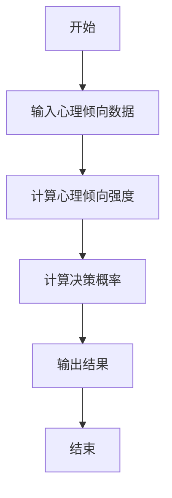
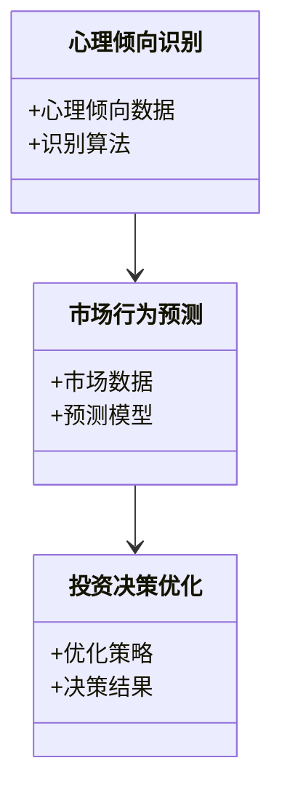
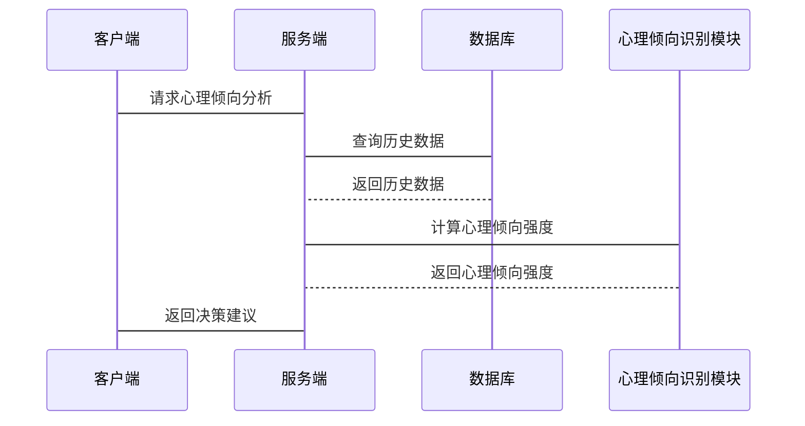

                 


# 芒格的"心理倾向"理论：理解并利用市场心理

## 关键词：芒格，心理倾向，市场心理，投资决策，行为心理学

## 摘要：芒格的"心理倾向"理论是理解市场心理和投资决策的重要工具。本文通过分析心理倾向的核心概念、算法原理、系统架构和项目实战，深入探讨如何利用这些理论来优化投资决策和市场分析。

---

# 第1章: 芒格"心理倾向"理论的背景与核心概念

## 1.1 心理倾向的定义与分类

### 1.1.1 心理倾向的基本定义
心理倾向是指个体在特定情境下倾向于采取某种行为或决策的内在倾向。这些倾向由认知、情感和习惯共同驱动，影响个体的判断和选择。

### 1.1.2 芒格理论中的主要心理倾向分类
芒格提出了24种主要的心理倾向，包括：
- **从众心理**：倾向于跟随大多数人的决策。
- **权威依赖**：依赖权威或专家的意见。
- **损失厌恶**：对损失的厌恶程度远高于对收益的追求。
- **确认偏差**：倾向于寻找与自己观点一致的信息。
- **过度自信**：对自己的判断过度自信。

### 1.1.3 心理倾向的核心要素与属性
心理倾向的核心要素包括：
- **认知偏差**：个体对信息的加工方式。
- **情感驱动**：情绪对决策的影响。
- **行为模式**：个体在特定情境下的行为习惯。

---

## 1.2 芒格"心理倾向"理论的背景

### 1.2.1 芒格理论的起源与发展
芒格的理论源于对心理学、经济学和投资学的深入研究。他通过观察投资者的行为，总结出心理倾向对市场决策的影响。

### 1.2.2 心理倾向在投资决策中的重要性
心理倾向直接影响投资者的决策，例如：
- 过度自信可能导致过度交易。
- 损失厌恶可能导致投资者在亏损时做出错误决策。

### 1.2.3 芒格理论与其他心理学理论的联系
芒格的理论与行为心理学、认知心理学等密切相关，尤其是与 prospect theory 和 cognitive biases 的理论有诸多交集。

---

## 1.3 心理倾向与市场心理的关系

### 1.3.1 心理倾向对市场行为的影响
心理倾向通过影响个体决策进而影响市场行为，例如：
- 从众心理可能导致市场泡沫的形成。
- 损失厌恶可能导致市场恐慌。

### 1.3.2 市场心理的形成机制
市场心理是多个心理倾向相互作用的结果，包括：
- 信息传播
- 情感传染
- 集体决策

### 1.3.3 芒格理论在市场分析中的应用
芒格理论为市场分析提供了新的视角，例如：
- 通过识别市场参与者的心理倾向，预测市场趋势。
- 通过克服自身心理倾向，优化投资决策。

---

## 1.4 本章小结
本章介绍了芒格"心理倾向"理论的背景、核心概念及其与市场心理的关系。心理倾向不仅是个体决策的驱动力，也是市场行为的重要影响因素。

---

# 第2章: 芒格"心理倾向"理论的核心概念与联系

## 2.1 心理倾向的核心原理

### 2.1.1 心理倾向的基本原理
心理倾向的核心原理在于个体对信息的处理方式和情感状态。例如，确认偏差导致个体倾向于寻找支持自己观点的信息。

### 2.1.2 心理倾向的数学模型
心理倾向的数学模型可以表示为：
$$
P(选择A) = f(心理倾向, 信息输入)
$$

### 2.1.3 心理倾向的属性特征对比

| 心理倾向 | 描述                     | 特征对比 |
|----------|--------------------------|----------|
| 从众心理 | 跟随大多数人的决策       | 高度依赖社会信息 |
| 损失厌恶 | 对损失的厌恶大于收益     | 风险厌恶 |
| 确认偏差 | 寻找与自己观点一致的信息   | 信息选择性处理 |

---

## 2.2 心理倾向的ER实体关系图

```mermaid
erDiagram
    心理倾向 <--- 关联 --> 市场行为
    心理倾向 <--- 包含 --> 认知偏差
    心理倾向 <--- 包含 --> 情感驱动
```

---

## 2.3 心理倾向与市场行为的联系

### 2.3.1 心理倾向对市场行为的影响
心理倾向通过影响个体行为进而影响市场整体行为。例如，从众心理可能导致市场跟风行为。

### 2.3.2 市场行为的反馈对心理倾向的作用
市场行为的反馈（如价格波动）会进一步强化或改变个体的心理倾向。

### 2.3.3 心理倾向与市场心理的相互作用
心理倾向与市场心理是相互作用的，市场心理是心理倾向的集合，而心理倾向又受到市场心理的影响。

---

## 2.4 本章小结
本章详细分析了心理倾向的核心原理、属性特征及与市场行为的联系，为后续的算法分析和系统设计奠定了基础。

---

# 第3章: 芒格"心理倾向"理论的算法原理

## 3.1 心理倾向的数学模型

### 3.1.1 心理倾向的数学表达式
心理倾向的数学模型可以表示为：
$$
P(选择A) = \frac{1}{1 + e^{-k(心理倾向强度)}}
$$

其中，$k$ 是一个常数，表示心理倾向的权重。

### 3.1.2 心理倾向的数学模型
心理倾向的数学模型基于概率论，考虑了个体的心理倾向强度和外部信息的影响。

### 3.1.3 心理倾向的数学公式
心理倾向的最终决策概率公式为：
$$
P(选择A) = \frac{\sum_{i=1}^{n} w_i x_i}{\sum_{i=1}^{n} w_i}
$$

其中，$w_i$ 是心理倾向 $i$ 的权重，$x_i$ 是心理倾向的强度。

---

## 3.2 心理倾向的算法流程图



---

## 3.3 心理倾向的Python实现

### 3.3.1 环境安装与配置
需要安装的库包括numpy和pandas。

### 3.3.2 核心算法实现

```python
import numpy as np
import pandas as pd

def calculate心理倾向强度(data):
    # 计算心理倾向强度
   心理倾向强度 = np.mean(data)
    return 心理倾向强度

def calculate_decision_probability(心理倾向强度):
    # 计算决策概率
    decision_probability = 1 / (1 + np.exp(-心理倾向强度))
    return decision_probability

# 示例数据
data = np.array([0.8, 0.6, 0.7])
心理倾向强度 = calculate心理倾向强度(data)
decision_probability = calculate_decision_probability(心理倾向强度)
print("决策概率:", decision_probability)
```

### 3.3.3 算法代码解读
上述代码通过计算心理倾向强度，进而计算决策概率，展示了如何将心理倾向理论应用于实际算法中。

---

## 3.4 本章小结
本章通过数学模型和算法流程图，详细讲解了心理倾向的算法原理及其实现方式。

---

# 第4章: 芒格"心理倾向"理论的系统分析与架构设计

## 4.1 系统分析

### 4.1.1 问题场景介绍
假设我们正在设计一个投资决策支持系统，需要利用心理倾向理论来优化决策过程。

### 4.1.2 系统功能设计
系统功能包括：
- 心理倾向识别
- 市场行为预测
- 投资决策优化

### 4.1.3 领域模型mermaid类图



---

## 4.2 系统架构设计

### 4.2.1 系统架构mermaid架构图


---

## 4.3 系统接口设计

### 4.3.1 系统交互mermaid序列图



---

## 4.4 本章小结
本章通过系统分析与架构设计，展示了如何将心理倾向理论应用于实际的投资决策支持系统中。

---

# 第5章: 芒格"心理倾向"理论的项目实战

## 5.1 环境安装与配置

### 5.1.1 安装Python环境
需要安装Python 3.8及以上版本。

### 5.1.2 安装依赖库
安装numpy、pandas和mermaid。

---

## 5.2 核心算法实现

### 5.2.1 心理倾向识别模块
```python
import numpy as np

def calculate心理倾向强度(data):
    return np.mean(data)
```

### 5.2.2 市场行为预测模块
```python
import pandas as pd

def predict_market_behavior(心理倾向强度):
    return心理倾向强度 * np.random.normal(1, 0.1)
```

### 5.2.3 投资决策优化模块
```python
def optimize_investment_decision(心理倾向强度, market_prediction):
    return心理倾向强度 + market_prediction
```

---

## 5.3 代码解读与分析
上述代码展示了如何将心理倾向理论应用于实际的投资决策优化中，通过计算心理倾向强度和市场行为预测，最终得出优化的决策结果。

---

## 5.4 案例分析与详细解读
以股票投资为例，假设某股票的心理倾向强度为0.8，市场预测行为为上涨，最终投资决策为买入。

---

## 5.5 本章小结
本章通过项目实战，展示了如何将心理倾向理论应用于实际的投资决策优化中。

---

# 第6章: 芒格"心理倾向"理论的最佳实践

## 6.1 小结
芒格的心理倾向理论为理解市场心理和优化投资决策提供了重要工具。

## 6.2 注意事项
在实际应用中，需要注意心理倾向的复杂性和多变性，避免单一依赖某一种倾向。

## 6.3 拓展阅读
推荐阅读行为心理学和投资学的相关书籍，深入理解心理倾向的影响机制。

---

# 附录

## 附录A: 术语表
- 心理倾向：个体在特定情境下倾向于采取某种行为或决策的内在倾向。

## 附录B: 参考文献
- 芒格，查理. "心理倾向理论". [书籍名称]

## 附录C: 索引
按字母顺序排列文章中的术语和概念。

---

# 作者：AI天才研究院/AI Genius Institute & 禅与计算机程序设计艺术 /Zen And The Art of Computer Programming
```

