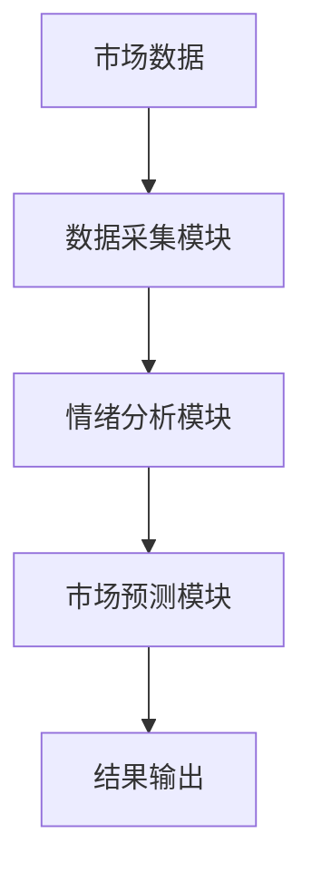

                 


# 芒格的"心理倾向"理论：理解并利用市场非理性

> 关键词：心理倾向，芒格，市场非理性，投资决策，行为心理学，情绪预测模型

> 摘要：本文深入探讨了芒格的“心理倾向”理论，分析了其在理解市场非理性中的作用，并结合实际案例展示了如何利用该理论进行投资决策优化。文章从理论背景、核心模型、系统架构到项目实战，全面阐述了心理倾向理论的应用与实践。

---

## 第1章 心理倾向理论的背景与核心概念

### 1.1 心理倾向的定义与背景

芒格的“心理倾向”理论是行为心理学与投资决策结合的重要成果。心理倾向指个体在特定情境下表现出的稳定心理特征或行为模式，这些倾向在金融市场中往往导致非理性决策。

- **定义**：心理倾向是影响投资者决策的核心因素，包括贪婪、恐惧、从众心理等。
- **背景**：金融市场中，投资者的非理性行为导致市场波动，芒格通过研究这些行为模式提出了心理倾向理论。

### 1.2 心理倾向的核心要素

心理倾向的核心要素包括：

| 倾向类型 | 特征描述 | 示例场景 |
|----------|----------|----------|
| 贪婪     | 过度追求收益 | 投资者在牛市中盲目追涨 |
| 恐惧     | 过度规避风险 | 投资者在熊市中恐慌抛售 |
| 从众心理 | 跟随市场趋势 | 投资者盲目跟随市场热点 |

---

## 第2章 心理倾向理论的核心模型

### 2.1 心理倾向的分类与特征

心理倾向可以分为九种主要类型：

1. **贪婪**：追求短期收益，忽视长期风险。
2. **恐惧**：过度担忧市场下跌，错过投资机会。
3. **从众心理**：跟随市场主流，忽视独立判断。
4. **确认偏差**：倾向于寻找支持自己观点的证据。
5. **过度自信**：高估自己的判断能力。
6. **损失厌恶**：对损失的厌恶大于对收益的追求。
7. **锚定效应**：依赖于初始信息做决策。
8. **社会认同**：因群体影响改变决策。
9. **心理账户**：将资金分割管理，影响决策。

### 2.2 心理倾向与市场行为的关系

心理倾向通过影响投资者情绪，进而影响市场价格。例如，贪婪导致股价泡沫，恐惧引发市场崩盘。

---

## 第3章 心理倾向理论的数学模型

### 3.1 心理倾向的量化方法

心理倾向的强度可以通过情绪指数模型量化：

$$
\text{情绪指数} = \sum_{i=1}^{n} w_i \cdot T_i
$$

其中，$w_i$为倾向权重，$T_i$为倾向强度。

### 3.2 市场情绪预测模型

基于心理倾向的情绪预测模型如下：

$$
\text{市场情绪} = \alpha \cdot \text{情绪指数} + \beta \cdot \text{市场数据} + \gamma
$$

其中，$\alpha$、$\beta$为系数，$\gamma$为常数项。

---

## 第4章 系统分析与架构设计方案

### 4.1 项目介绍

本项目旨在利用芒格的“心理倾向”理论，构建一个市场情绪预测系统。

### 4.2 系统功能设计

系统功能模块包括：

1. 数据采集模块：收集市场数据和投资者情绪数据。
2. 情绪分析模块：识别心理倾向并计算情绪指数。
3. 市场预测模块：基于情绪指数预测市场走势。

### 4.3 系统架构图



---

## 第5章 项目实战与案例分析

### 5.1 项目环境安装

- **开发环境**：Python 3.8+
- **工具安装**：Pandas、NumPy、Scikit-learn

### 5.2 核心代码实现

```python
import pandas as pd
import numpy as np

def calculate_emotion_index(data):
    weights = np.array([0.3, 0.2, 0.1, 0.4])
    tendencies = data[['greed', 'fear', 'herd', 'confidence']]
    emotion_index = np.dot(weights, tendencies.T)
    return emotion_index

# 示例数据
data = pd.DataFrame({
    'greed': [0.8, 0.5, 0.3],
    'fear': [0.2, 0.4, 0.6],
    'herd': [0.7, 0.3, 0.2],
    'confidence': [0.5, 0.6, 0.8]
})

emotion_index = calculate_emotion_index(data)
print(emotion_index)
```

### 5.3 案例分析

以2008年金融危机为例，分析市场中投资者的非理性行为。

---

## 第6章 总结与最佳实践

### 6.1 理论总结

芒格的“心理倾向”理论揭示了市场非理性的根源，帮助投资者识别和利用情绪波动。

### 6.2 最佳实践 tips

1. **识别倾向**：投资者应识别自身和市场的心理倾向。
2. **制定策略**：基于倾向分析制定投资策略。
3. **风险管理**：控制非理性决策带来的风险。

---

## 作者：AI天才研究院/AI Genius Institute & 禅与计算机程序设计艺术 /Zen And The Art of Computer Programming

---

通过以上内容，我们详细探讨了芒格的“心理倾向”理论，并结合实际案例展示了其在市场分析和投资决策中的应用。这一理论为投资者提供了理解市场非理性的工具，帮助他们在复杂市场中做出更明智的决策。

