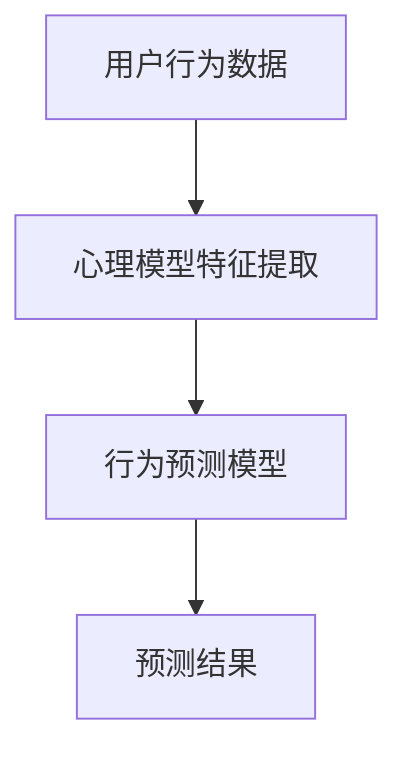
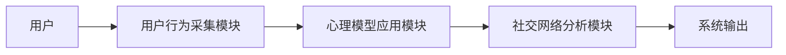

                 

# 芒格的"心理模型"在元宇宙社交行为分析中的应用

> 关键词：芒格心理模型、元宇宙、社交行为分析、人工智能、社会网络分析、虚拟现实社交

> 摘要：本文探讨了如何将芒格的心理模型应用于元宇宙社交行为分析中，通过心理模型理解用户行为，优化社交体验。结合人工智能算法和社会网络分析，提出基于心理模型的社交行为预测与优化方法，为元宇宙社交系统的开发提供理论支持和实践指导。

---

# 第一部分: 芒格心理模型与元宇宙社交行为分析基础

## 第1章: 芒格心理模型的核心概念与应用

### 1.1 芒格心理模型的定义与核心要素

#### 1.1.1 心理模型的起源与核心理念

芒格的心理模型是一种基于人类认知和决策的理论框架，强调通过简化和抽象的方式来理解复杂系统的运行规律。其核心理念包括：

- **认知偏差**：人类在决策过程中往往受到认知偏差的影响，例如确认偏差、锚定效应等。
- **决策框架**：芒格提出了一系列分析问题的框架，例如“决策树”和“反事实推理”，帮助人们更好地理解决策的逻辑。
- **多元思维模型**：芒格提倡通过多个不同的思维模型来分析问题，避免单一视角的局限性。

#### 1.1.2 心理模型在社交行为中的作用

心理模型在社交行为中的作用体现在以下几个方面：

- **行为预测**：通过分析个体的认知和动机，预测其在社交场景中的行为。
- **行为解释**：帮助理解个体行为背后的动机和心理因素。
- **行为优化**：通过调整环境和反馈机制，优化个体的社交行为。

#### 1.1.3 心理模型的核心要素与特征对比表格

| 核心要素       | 描述                                                                 |
|----------------|----------------------------------------------------------------------|
| 认知偏差         | 个体在决策过程中常见的认知错误，如确认偏差、锚定效应等。                 |
| 社交动机         | 个体参与社交活动的内在驱动力，如归属需求、成就需求等。                   |
| 反馈机制         | 社交行为后的结果对个体行为的影响，包括正反馈和负反馈。                   |

---

### 1.2 元宇宙社交行为分析的背景与特点

#### 1.2.1 元宇宙的概念与特点

元宇宙（Metaverse）是一个虚拟的、去中心化的数字世界，用户可以通过虚拟现实技术（VR）或增强现实技术（AR）参与其中。元宇宙的特点包括：

- **虚拟性**：用户以虚拟身份参与社交活动。
- **沉浸性**：通过VR/AR技术实现高度沉浸的体验。
- **互动性**：用户之间可以进行实时互动，包括社交、游戏、 commerce 等。

#### 1.2.2 元宇宙社交行为的定义与分类

元宇宙社交行为是指用户在虚拟环境中进行的社交活动，包括：

- **社交互动**：用户之间的交流、合作或竞争。
- **社交网络构建**：用户在虚拟环境中建立和维护社交关系。
- **虚拟身份管理**：用户对虚拟身份的塑造和维护。

#### 1.2.3 元宇宙社交行为分析的挑战与机遇

分析元宇宙社交行为的挑战包括数据获取难度、行为复杂性和隐私保护等问题。而机遇则体现在通过心理模型优化社交体验、提升用户粘性和实现个性化服务。

---

## 第2章: 芒格心理模型与元宇宙社交行为的关联

### 2.1 心理模型在社交行为中的应用框架

#### 2.1.1 心理模型在社交决策中的作用

芒格心理模型通过分析个体的动机、认知偏差和反馈机制，帮助理解其在社交决策中的行为逻辑。例如，用户在选择社交伙伴时，可能会受到确认偏差的影响，倾向于选择与自己相似的人。

#### 2.1.2 元宇宙社交行为的多维度分析

元宇宙社交行为的多维度分析包括：

- **动机分析**：分析用户参与社交活动的内在动机。
- **行为模式分析**：研究用户在虚拟环境中的行为模式。
- **社交网络结构分析**：分析用户之间的社交网络结构。

#### 2.1.3 心理模型与元宇宙社交行为的交互关系

心理模型与元宇宙社交行为的交互关系可以通过以下步骤进行：

1. **数据采集**：收集用户的社交行为数据。
2. **特征提取**：提取与心理模型相关的特征。
3. **行为预测**：基于心理模型预测用户的社交行为。
4. **反馈优化**：根据预测结果优化社交体验。

---

### 2.2 心理模型在元宇宙社交行为分析中的具体应用

#### 2.2.1 社交动机与行为预测

通过分析用户的社交动机，可以预测其在元宇宙中的社交行为。例如，用户具有强烈的归属需求时，可能会倾向于参与更多的社交活动。

#### 2.2.2 社交压力与行为调整

心理模型可以帮助识别用户在社交过程中感受到的压力，并通过调整虚拟环境的参数来减轻压力，从而优化用户的社交体验。

#### 2.2.3 社交反馈与行为优化

通过分析用户的社交反馈，可以优化其行为。例如，用户在虚拟社交中收到积极的反馈时，可能会增加社交互动的频率。

---

## 第3章: 元宇宙社交行为分析的算法原理

### 3.1 心理模型驱动的社交行为分析框架

#### 3.1.1 基于心理模型的社交行为预测模型

基于心理模型的社交行为预测模型包括以下几个步骤：

1. **数据采集**：收集用户的社交行为数据。
2. **特征提取**：提取与心理模型相关的特征。
3. **行为预测**：基于心理模型预测用户的社交行为。
4. **结果输出**：输出预测结果。

#### 3.1.2 心理模型与社交网络的关联分析

心理模型与社交网络的关联分析可以通过以下步骤进行：

1. **社交网络构建**：构建用户的社交网络。
2. **心理模型应用**：将心理模型应用于社交网络分析。
3. **结果分析**：分析心理模型对社交网络的影响。

#### 3.1.3 心理模型在社交行为数据中的特征提取

心理模型在社交行为数据中的特征提取包括：

- **用户行为特征**：用户的社交频率、互动深度等。
- **用户心理特征**：用户的认知偏差、社交动机等。

### 3.2 算法原理与数学模型

#### 3.2.1 基于心理模型的社交行为预测算法流程图（mermaid）

#### 3.2.2 数学模型与公式

社交行为预测公式：

$$ P(\text{行为发生}) = \frac{\sum_{i=1}^{n} w_i \cdot f_i}{\sum_{i=1}^{n} w_i} $$

其中，\( w_i \) 是第 \( i \) 个特征的权重，\( f_i \) 是第 \( i \) 个特征的值。

---

## 第4章: 基于心理模型的元宇宙社交行为分析系统设计

### 4.1 系统功能设计

#### 4.1.1 用户行为采集模块

用户行为采集模块负责收集用户的社交行为数据，包括用户的社交频率、互动深度等。

#### 4.1.2 心理模型应用模块

心理模型应用模块将心理模型应用于社交行为分析，包括特征提取、行为预测和反馈优化。

#### 4.1.3 社交网络分析模块

社交网络分析模块负责分析用户的社交网络结构，包括社交网络的构建和优化。

---

### 4.2 系统架构设计

#### 4.2.1 系统架构图（mermaid）

---

## 第5章: 项目实战与总结

### 5.1 项目实战

#### 5.1.1 项目背景与目标

项目目标是通过心理模型优化元宇宙中的社交行为，提升用户的社交体验。

#### 5.1.2 项目实现

项目实现包括数据采集、特征提取、行为预测和反馈优化等步骤。

#### 5.1.3 项目总结

项目总结包括项目的成功经验、遇到的挑战和未来优化方向。

---

## 第6章: 总结与展望

### 6.1 总结

本文通过分析芒格心理模型在元宇宙社交行为分析中的应用，提出了基于心理模型的社交行为预测与优化方法。

### 6.2 展望

未来的研究方向包括心理模型的动态调整、多模态数据的融合以及与其他人工智能技术的结合。

---

作者：AI天才研究院/AI Genius Institute & 禅与计算机程序设计艺术 /Zen And The Art of Computer Programming

