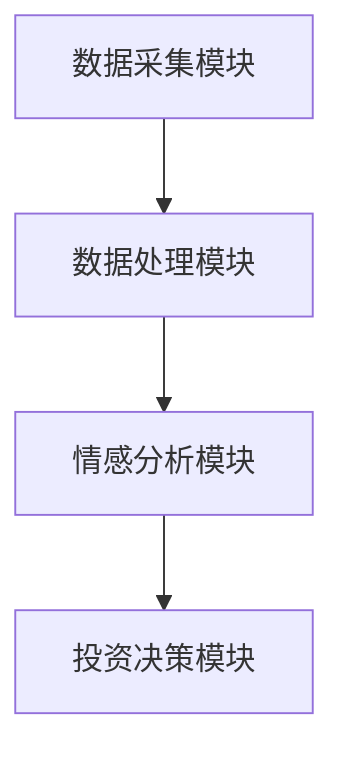
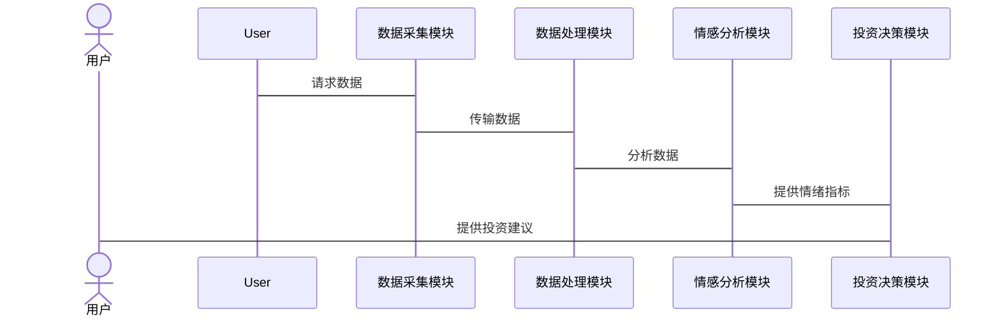

                 


# 《芒格的"心理模型"在社交媒体投资分析中的应用》

---

## 关键词
- 芒格心理模型
- 投资分析
- 社交媒体
- 情绪分析
- 投资决策

---

## 摘要
芒格的“心理模型”是一种强大的投资决策框架，强调多元思维、逆向思维和风险管理。在社交媒体时代，投资分析不再局限于传统方法，海量的社交媒体数据为投资者提供了新的视角。本文探讨了芒格心理模型在社交媒体投资分析中的应用，结合具体案例，分析了如何利用社交媒体数据进行情绪分析、信息筛选和投资决策优化，为投资者提供了新的思路和工具。

---

# 目录大纲

## 第一部分：芒格的“心理模型”概述

### 第1章：芒格“心理模型”的定义与核心概念

#### 1.1 心理模型的定义与核心要素
- 心理模型的定义：投资者通过构建多元思维模型，理解企业的内在价值和市场行为。
- 核心要素：多元思维模型、逆向思维、风险管理。

#### 1.2 心理模型在投资中的作用
- 帮助投资者避免常见错误：避免从众心理、避免过度自信。
- 提供全面的视角：通过多个角度分析企业，降低决策风险。

#### 1.3 芒格心理模型与其他投资方法的对比
- 传统价值投资：侧重企业基本面分析。
- 技术分析：侧重价格走势和交易信号。
- 心理模型的优势：结合心理因素和市场情绪，提供更全面的决策依据。

---

## 第二部分：社交媒体投资分析的背景与趋势

### 第2章：社交媒体在投资分析中的兴起

#### 2.1 社交媒体数据的特点
- 数据量大：海量用户评论、帖子、点赞等数据。
- 数据多样性：包含文字、图片、视频等多种形式。
- 数据实时性：实时反映市场情绪和投资者心态。

#### 2.2 社交媒体投资分析的优势
- 提供情绪指标：通过分析社交媒体数据，获取市场情绪指标。
- 识别市场趋势：提前发现市场趋势和投资者行为变化。
- 补充传统分析：结合传统基本面和技术分析，提供更全面的视角。

#### 2.3 芒格心理模型在社交媒体投资中的应用前景
- 利用社交媒体数据优化心理模型：通过大数据分析，丰富多元思维模型。
- 提高情绪分析的准确性：通过自然语言处理技术，提升情绪分析的精度。
- 实时监控市场情绪：利用实时数据，动态调整投资策略。

---

## 第三部分：芒格心理模型在社交媒体投资分析中的具体应用

### 第3章：信息筛选与情绪分析

#### 3.1 社交媒体数据的获取与处理
- 数据获取：通过API接口获取社交媒体数据。
- 数据清洗：去除噪音数据，提取有用信息。
- 数据预处理：文本分词、去停用词等。

#### 3.2 情绪分析的实现
- 基于自然语言处理的情绪分析：使用词袋模型、TF-IDF等方法。
- 情感分类算法：如朴素贝叶斯、支持向量机（SVM）等。
- 情感强度分析：量化情绪强度，如情感得分。

#### 3.3 情绪分析在投资决策中的应用
- 市场情绪指标：通过分析社交媒体情绪，判断市场整体情绪。
- 个股情绪分析：分析特定股票的情绪变化。
- 情绪拐点识别：识别情绪变化的关键点，提前布局投资策略。

---

## 第四部分：基于芒格心理模型的投资策略优化

### 第4章：风险管理与投资组合优化

#### 4.1 风险管理的核心理念
- 避免过度风险：通过心理模型控制风险敞口。
- 分散投资：通过多元投资降低风险。
- 情绪风险管理：通过情绪分析，避免情绪驱动的决策错误。

#### 4.2 投资组合优化的实现
- 基于心理模型的资产配置：根据心理模型分析结果，优化资产配置。
- 动态调整投资组合：根据市场情绪变化，动态调整投资组合。
- 风险指标监控：设置风险指标，实时监控投资组合风险。

---

## 第五部分：算法实现与技术细节

### 第5章：基于自然语言处理的情绪分析算法

#### 5.1 算法原理
- 文本预处理：分词、去停用词、词干提取。
- 特征提取：TF-IDF、Word2Vec等。
- 情感分类：使用机器学习算法（如SVM、随机森林）进行分类。

#### 5.2 算法实现步骤
1. 数据清洗与预处理。
2. 特征提取与向量化。
3. 模型训练与评估。
4. 情感分类与强度分析。

#### 5.3 实现代码示例
```python
from sklearn.feature_extraction.text import TfidfVectorizer
from sklearn.svm import SVC
from sklearn.metrics import accuracy_score

# 数据清洗与预处理
def preprocess(text):
    return text.lower().split()

# 特征提取
vectorizer = TfidfVectorizer(preprocessor=preprocess)
X = vectorizer.fit_transform(corpus)

# 模型训练
model = SVC()
model.fit(X, labels)

# 模型评估
predicted = model.predict(vectorizer.transform(test_corpus))
print(accuracy_score(test_labels, predicted))
```

#### 5.4 情感强度分析
- 使用情感词典或情感评分模型（如VADER）进行情感强度分析。
- 根据情感强度调整投资策略。

---

## 第六部分：系统架构与项目实战

### 第6章：系统架构设计

#### 6.1 系统功能设计
- 数据采集模块：获取社交媒体数据。
- 数据处理模块：清洗、预处理数据。
- 情感分析模块：分析数据情绪。
- 投资决策模块：根据情绪分析结果，优化投资策略。

#### 6.2 系统架构图


#### 6.3 系统交互流程图


---

## 第七部分：项目实战与案例分析

### 第7章：项目实战

#### 7.1 环境安装与配置
- 安装Python和相关库（如NLTK、Scikit-learn、Twitter API）。
- 配置API密钥，获取社交媒体数据。

#### 7.2 核心代码实现
```python
import tweepy
from textblob import TextBlob

# 授权认证
auth = tweepy.OAuth1UserHandler(consumer_key, consumer_secret, access_token, access_token_secret)

# 获取API对象
api = tweepy.API(auth)

# 获取推文
tweets = api.search(q=keyword, count=100)

# 情感分析
for tweet in tweets:
    blob = TextBlob(tweet.text)
    print(tweet.text, blob.sentiment.polarity)
```

#### 7.3 案例分析
- 选取特定股票的社交媒体数据，分析其情绪变化。
- 对比情绪分析结果与实际股价走势，验证模型的有效性。

---

## 第八部分：总结与展望

### 第8章：总结与展望

#### 8.1 本章小结
- 芒格心理模型在社交媒体投资分析中的应用，提供了新的视角和工具。
- 结合大数据和人工智能技术，投资者可以更高效地进行情绪分析和决策优化。

#### 8.2 注意事项
- 数据质量：确保数据清洗和预处理的准确性。
- 模型选择：根据不同场景选择合适的情绪分析模型。
- 风险管理：结合心理模型，合理控制投资风险。

#### 8.3 拓展阅读
- 推荐书籍：《穷查理宝典》、《投资学原理》。
- 推荐技术资料：自然语言处理与情感分析相关论文。

---

## 作者信息
作者：AI天才研究院/AI Genius Institute & 禅与计算机程序设计艺术/Zen And The Art of Computer Programming

---

希望这个目录大纲能够满足你的需求！如果需要进一步调整或补充，请随时告诉我。

