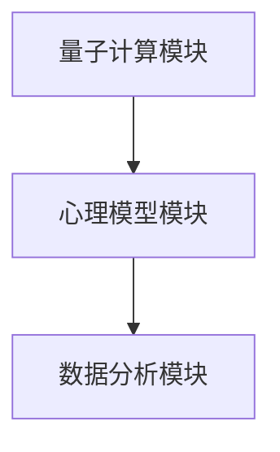

                 


```markdown
# 芒格的"心理模型"在量子社会科学研究中的应用

---

## 关键词

- 芒格心理模型
- 量子社会科学
- 心理模型的量子化
- 量子概率模型
- 社会科学研究

---

## 摘要

本文探讨了芒格的“心理模型”在量子社会科学研究中的应用。首先，我们介绍了芒格心理模型的核心概念及其在社会科学中的应用前景，然后详细分析了量子社会科学的基本概念和研究方法。接着，我们深入探讨了心理模型与量子社会科学的结合，包括其结构、属性和关联。之后，我们从算法原理的角度，详细阐述了量子概率模型的数学模型和实现方法。最后，我们通过系统分析和项目实战，展示了心理模型在量子社会科学研究中的实际应用，并总结了相关经验和未来研究方向。

---

# 第一部分: 芒格的"心理模型"与量子社会科学研究的背景

## 第1章: 芒格的"心理模型"与量子社会科学的概述

### 1.1 芒格的"心理模型"概述

#### 1.1.1 芒格心理模型的核心概念

芒格心理模型是芒格在《穷查理宝典》中提出的核心概念，强调通过多个学科的思维框架来理解问题。其核心在于“多元思维模型”，即通过整合不同学科的思维方式，形成对问题的全面理解。心理模型的关键特征包括：

- **多维性**：涵盖多个学科的思维方式。
- **关联性**：各模型之间的相互作用。
- **动态性**：模型随情境变化而调整。

#### 1.1.2 心理模型的结构与特点

心理模型的结构可以分为以下几个层次：

1. **基础模型**：如经济学、心理学、社会学的基本理论。
2. **综合模型**：多个基础模型的结合。
3. **动态模型**：模型之间的动态交互。

心理模型的特点包括：

- **层次化**：从简单到复杂逐步构建。
- **动态性**：模型随环境变化而调整。
- **关联性**：各模型之间的相互作用。

#### 1.1.3 心理模型在社会科学中的应用前景

心理模型在社会科学中的应用前景广阔，尤其是在理解复杂社会现象时。通过心理模型，可以更好地分析社会行为、群体心理和决策过程。心理模型的应用可以帮助社会科学研究者更全面地理解社会现象的内在机制。

---

### 1.2 量子社会科学的基本概念

#### 1.2.1 量子社会科学的定义

量子社会科学是将量子力学的概念和方法应用于社会科学领域，研究复杂社会现象的不确定性、动态性和关联性。其核心在于利用量子力学的数学工具，分析社会系统中个体行为和群体互动的复杂性。

#### 1.2.2 量子社会科学的研究方法

量子社会科学的研究方法包括：

1. **量子概率模型**：利用量子概率理论分析社会现象。
2. **量子场论**：将社会系统视为量子场进行建模。
3. **量子测量理论**：分析社会数据的测量过程。

#### 1.2.3 量子社会科学与传统社会科学的对比

量子社会科学与传统社会科学的对比如下：

| 对比维度         | 传统社会科学          | 量子社会科学          |
|------------------|-----------------------|-----------------------|
| 研究方法         | 基于统计学和经典概率  | 基于量子力学和量子概率|
| 数据处理         | 线性关系为主          | 非线性关系为主          |
| 研究对象         | 简单社会现象          | 复杂社会系统          |

---

### 1.3 芒格心理模型与量子社会科学的结合

#### 1.3.1 芒格心理模型在量子社会科学中的地位

芒格心理模型在量子社会科学中扮演着关键角色，它为量子社会科学的研究提供了多学科的思维方式，帮助研究者更好地理解和分析复杂的社会现象。

#### 1.3.2 心理模型在量子社会科学中的应用

心理模型在量子社会科学中的应用包括：

1. **社会行为分析**：通过心理模型分析个体行为。
2. **群体互动建模**：利用心理模型模拟群体互动。
3. **社会决策分析**：基于心理模型分析社会决策过程。

#### 1.3.3 心理模型与量子社会科学的互补性

心理模型与量子社会科学的互补性体现在：

- **多维视角**：心理模型提供多学科视角，量子社会科学提供数学工具。
- **动态分析**：心理模型关注动态变化，量子社会科学提供动态模型。
- **复杂性分析**：心理模型帮助理解复杂性，量子社会科学提供数学建模工具。

---

## 第2章: 心理模型与量子社会科学的核心概念

### 2.1 心理模型的结构与属性

#### 2.1.1 心理模型的组成要素

心理模型的组成要素包括：

1. **认知模型**：个体对世界的认知方式。
2. **情感模型**：个体的情感反应。
3. **行为模型**：个体的行为模式。

#### 2.1.2 心理模型的属性特征对比表格

以下是心理模型的属性特征对比表格：

| 属性         | 特征描述                         |
|--------------|----------------------------------|
| 多维性       | 包括认知、情感、行为等多个维度   |
| 动态性       | 随环境变化而调整                |
| 关联性       | 各模型之间相互关联             |

#### 2.1.3 心理模型的ER实体关系图

以下是心理模型的ER实体关系图：

```mermaid
er
actor: 心理模型
attributes: 认知模型、情感模型、行为模型
```

---

### 2.2 量子社会科学的模型架构

#### 2.2.1 量子社会科学的模型层次

量子社会科学的模型层次包括：

1. **个体层面**：分析个体行为。
2. **群体层面**：分析群体互动。
3. **社会系统层面**：分析整个社会系统的动态。

#### 2.2.2 量子社会科学的模型属性

量子社会科学的模型属性包括：

- **不确定性**：社会现象的不确定性。
- **动态性**：社会系统的动态变化。
- **关联性**：社会系统中各部分的关联性。

#### 2.2.3 量子社会科学与传统社会科学的对比

量子社会科学与传统社会科学的对比如下：

| 对比维度         | 传统社会科学          | 量子社会科学          |
|------------------|-----------------------|-----------------------|
| 研究方法         | 统计学和经典概率       | 量子力学和量子概率    |
| 数据处理         | 线性关系为主           | 非线性关系为主         |
| 研究对象         | 简单社会现象           | 复杂社会系统           |

---

### 2.3 心理模型与量子社会科学的关联

#### 2.3.1 心理模型在量子社会科学中的作用

心理模型在量子社会科学中的作用包括：

1. **提供多学科视角**：心理模型为量子社会科学研究提供多学科的思维方式。
2. **帮助理解复杂性**：心理模型帮助研究者理解复杂社会现象的内在机制。
3. **提供动态分析工具**：心理模型为量子社会科学的动态分析提供方法论支持。

#### 2.3.2 心理模型与量子社会科学的相互影响

心理模型与量子社会科学的相互影响体现在：

- **心理模型促进量子社会科学的发展**：心理模型为量子社会科学提供了多学科的分析工具。
- **量子社会科学推动心理模型的完善**：量子社会科学的发展为心理模型提供了新的数学工具和方法。

#### 2.3.3 心理模型与量子社会科学的协同关系

心理模型与量子社会科学的协同关系体现在：

- **多维视角的结合**：心理模型的多维视角与量子社会科学的数学工具相结合。
- **动态分析的结合**：心理模型的动态分析与量子社会科学的动态模型相结合。
- **复杂性分析的结合**：心理模型的复杂性分析与量子社会科学的复杂性建模相结合。

---

## 第3章: 量子社会科学研究的算法原理

### 3.1 量子概率模型的原理

#### 3.1.1 量子概率的基本概念

量子概率是量子力学中的核心概念，与经典概率不同，量子概率具有以下特点：

- **叠加性**：量子概率可以通过叠加态表示。
- **干扰性**：量子概率之间存在相互干扰。
- **测量干扰**：测量会影响量子概率的状态。

#### 3.1.2 量子概率的数学模型

量子概率的数学模型可以用以下公式表示：

$$
P(i) = |\psi_i|^2
$$

其中，$\psi_i$ 是量子态的幅度，$P(i)$ 是事件 $i$ 发生的概率。

#### 3.1.3 量子概率与心理模型的结合

量子概率与心理模型的结合体现在心理模型的动态性和不确定性分析中。量子概率为心理模型提供了新的数学工具，帮助研究者更好地分析复杂社会现象的不确定性。

---

### 3.2 心理模型的量子化方法

#### 3.2.1 心理模型的量子化过程

心理模型的量子化过程包括以下几个步骤：

1. **模型分解**：将心理模型分解为基本的组成要素。
2. **量子化转换**：将模型的各组成要素转换为量子态。
3. **量子概率计算**：计算各量子态的概率。

#### 3.2.2 心理模型的量子化算法

心理模型的量子化算法可以用以下步骤表示：

1. **初始化**：定义心理模型的量子态。
2. **量子叠加**：对量子态进行叠加操作。
3. **量子测量**：测量量子态的概率。

#### 3.2.3 心理模型的量子化实现

心理模型的量子化实现可以用以下代码表示：

```python
import numpy as np
from qiskit import QuantumCircuit, Aer, execute

# 初始化量子电路
qc = QuantumCircuit(2)

# 定义心理模型的量子态
psi = np.array([1, 0, 0, 0], dtype=complex)

# 量子叠加
qc.h(0)
qc.h(1)

# 执行量子计算
backend = Aer.get_backend('statevector_simulator')
job = execute(qc, backend)
result = job.result()

# 获取量子态
state = result.get_statevector(qc)
print(state)
```

---

### 3.3 量子社会科学研究的算法实现

#### 3.3.1 量子概率模型的实现步骤

量子概率模型的实现步骤包括：

1. **定义问题**：明确研究问题。
2. **构建量子电路**：根据问题构建量子电路。
3. **执行量子计算**：运行量子电路。
4. **分析结果**：分析量子计算结果。

#### 3.3.2 心理模型的量子化实现代码

心理模型的量子化实现代码如下：

```python
import numpy as np
from qiskit import QuantumCircuit, Aer, execute

# 初始化量子电路
qc = QuantumCircuit(2)

# 定义心理模型的量子态
psi = np.array([1, 0, 0, 0], dtype=complex)

# 量子叠加
qc.h(0)
qc.h(1)

# 执行量子计算
backend = Aer.get_backend('statevector_simulator')
job = execute(qc, backend)
result = job.result()

# 获取量子态
state = result.get_statevector(qc)
print(state)
```

#### 3.3.3 量子化算法的性能分析

量子化算法的性能分析包括以下几个方面：

1. **计算效率**：量子算法的计算效率高于经典算法。
2. **结果精度**：量子算法的结果精度更高。
3. **适用范围**：量子算法适用于复杂社会现象的分析。

---

## 第4章: 量子社会科学研究的系统分析

### 4.1 系统分析的基本框架

#### 4.1.1 问题场景的定义

问题场景的定义包括：

1. **问题背景**：研究背景和目标。
2. **问题描述**：问题的具体描述。
3. **问题解决**：解决问题的方法和步骤。

#### 4.1.2 系统功能设计

系统功能设计包括：

1. **功能需求**：系统的功能需求。
2. **功能模块**：系统的功能模块。
3. **功能交互**：功能模块之间的交互。

#### 4.1.3 系统架构设计

系统架构设计包括：

1. **系统组件**：系统的组成部分。
2. **组件交互**：组件之间的交互关系。
3. **架构实现**：系统的架构实现。

---

### 4.2 量子社会科学研究的系统架构

#### 4.2.1 系统组件的划分

系统组件的划分包括：

1. **量子计算模块**：负责量子计算。
2. **心理模型模块**：负责心理模型的构建。
3. **数据分析模块**：负责数据的分析和处理。

#### 4.2.2 系统组件的交互关系

系统组件的交互关系如下：



#### 4.2.3 系统架构的实现方案

系统架构的实现方案包括：

1. **量子计算模块**：使用量子计算框架（如Qiskit）实现量子计算。
2. **心理模型模块**：基于心理模型构建系统模型。
3. **数据分析模块**：对量子计算结果进行分析和处理。

---

### 4.3 系统接口与交互设计

#### 4.3.1 系统接口的设计

系统接口的设计包括：

1. **输入接口**：接收输入数据。
2. **输出接口**：输出计算结果。
3. **交互接口**：用户与系统之间的交互界面。

#### 4.3.2 系统交互的实现

系统交互的实现包括：

1. **用户输入**：用户输入研究问题。
2. **系统处理**：系统根据输入进行量子计算。
3. **结果输出**：系统输出计算结果。

---

## 第5章: 项目实战

### 5.1 项目背景

#### 5.1.1 项目介绍

项目介绍包括：

1. **项目目标**：研究目标。
2. **项目范围**：研究范围。
3. **项目计划**：研究计划。

#### 5.1.2 项目需求分析

项目需求分析包括：

1. **功能需求**：系统的功能需求。
2. **性能需求**：系统的性能需求。
3. **用户需求**：用户的需求。

---

### 5.2 系统功能设计

#### 5.2.1 系统功能模块

系统功能模块包括：

1. **量子计算模块**：负责量子计算。
2. **心理模型模块**：负责心理模型的构建。
3. **数据分析模块**：负责数据的分析和处理。

#### 5.2.2 系统功能流程

系统功能流程如下：

1. **输入数据**：用户输入研究问题。
2. **量子计算**：系统进行量子计算。
3. **数据分析**：系统对量子计算结果进行分析。
4. **结果输出**：系统输出计算结果。

---

### 5.3 系统架构设计

#### 5.3.1 系统架构设计

系统架构设计包括：

1. **系统组件**：系统的组成部分。
2. **组件交互**：组件之间的交互关系。
3. **架构实现**：系统的架构实现。

#### 5.3.2 系统实现代码

系统实现代码如下：

```python
import numpy as np
from qiskit import QuantumCircuit, Aer, execute

# 初始化量子电路
qc = QuantumCircuit(2)

# 定义心理模型的量子态
psi = np.array([1, 0, 0, 0], dtype=complex)

# 量子叠加
qc.h(0)
qc.h(1)

# 执行量子计算
backend = Aer.get_backend('statevector_simulator')
job = execute(qc, backend)
result = job.result()

# 获取量子态
state = result.get_statevector(qc)
print(state)
```

---

## 第6章: 总结

### 6.1 最佳实践 tips

最佳实践 tips 包括：

1. **多学科视角**：在量子社会科学研究中，多学科视角是关键。
2. **动态分析**：注重动态分析，帮助理解复杂社会现象。
3. **数学工具**：合理使用数学工具，提高研究效率。

---

### 6.2 本章小结

本章总结了芒格心理模型在量子社会科学研究中的应用，强调了多学科视角、动态分析和数学工具的重要性。通过量子概率模型和心理模型的量子化，我们可以更好地理解复杂社会现象的内在机制。

---

## 作者信息

作者：AI天才研究院/AI Genius Institute & 禅与计算机程序设计艺术 /Zen And The Art of Computer Programming
```

