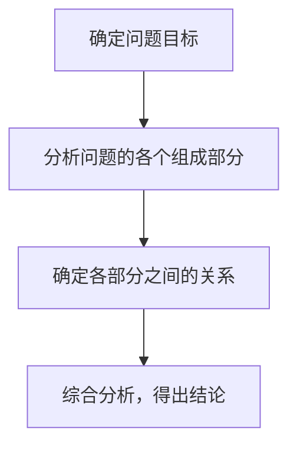
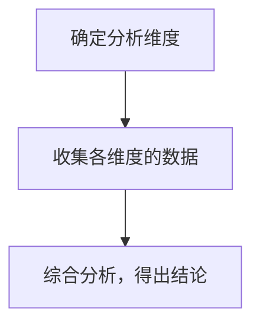
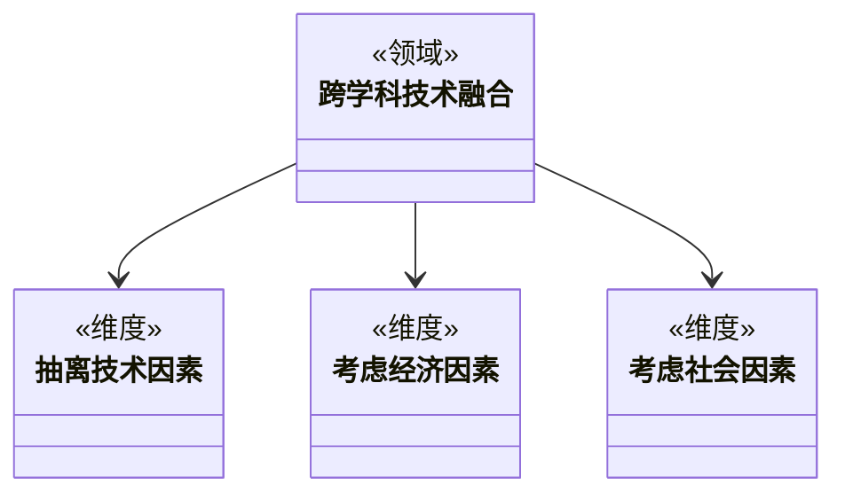
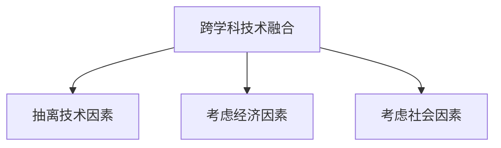
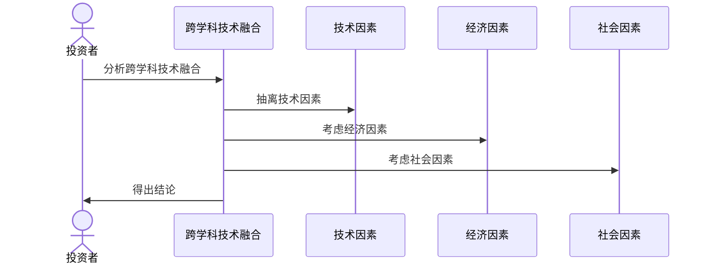

                 


# 芒格的"思维复杂性"在跨学科技术融合投资中的重要性

---

## 关键词：
芒格思维复杂性，跨学科技术融合，投资策略，系统性思维，算法原理

---

## 摘要：
本文探讨了芒格的"思维复杂性"在跨学科技术融合投资中的重要性。通过分析芒格的系统性思维、多维度分析和跨学科视角，结合实际案例和算法原理，展示了如何将芒格的思维复杂性应用于跨学科技术融合投资中，以提升投资决策的准确性和效率。本文适合对投资、跨学科技术融合和系统性思维感兴趣的读者。

---

## 第1章: 引言

### 1.1 芒格的思维复杂性概述
#### 1.1.1 芒格的思维复杂性定义
芒格的思维复杂性是指在决策过程中，通过多维度、跨学科的思维方式，综合考虑各种因素，以达到更全面、更深入的分析和判断。这种思维模式强调系统性、整体性和动态性，避免单一视角的局限性。

#### 1.1.2 芒格思维复杂性的核心特征
- **系统性**：将问题视为一个整体系统，考虑各个部分之间的相互关系。
- **多维度性**：从多个维度（技术、经济、社会等）进行分析。
- **动态性**：根据变化的环境和条件，调整思维方式和决策策略。

#### 1.1.3 本书的目标读者与结构安排
本书旨在帮助投资者、技术专家和跨学科研究者理解芒格思维复杂性在跨学科技术融合投资中的应用。结构安排如下：
1. 引言：介绍芒格思维复杂性及其重要性。
2. 核心概念：详细阐述思维复杂性的定义、特征和作用。
3. 跨学科技术融合的背景与趋势：分析跨学科技术融合的现状和对投资的影响。
4. 芒格思维复杂性在跨学科投资中的应用：结合案例分析其实际应用。
5. 算法原理：通过系统性思维的算法实现，展示其技术基础。
6. 实际案例分析：通过具体案例展示芒格思维复杂性的应用效果。
7. 系统分析与架构设计：从系统角度分析问题场景和架构设计。
8. 项目实战：提供环境安装、核心代码实现和案例分析。
9. 最佳实践与总结：总结最佳实践，提出小结、注意事项和未来展望。

### 1.2 问题背景与重要性
#### 1.2.1 跨学科技术融合的背景介绍
跨学科技术融合是指不同学科之间的技术相互结合、相互促进，形成新的技术体系和应用领域。例如，人工智能与生物学的结合催生了生物信息学，物理学与计算机科学的结合推动了量子计算的发展。

#### 1.2.2 投资领域中的思维复杂性问题
在传统投资中，投资者往往依赖单一学科的分析方法，忽视了技术融合带来的复杂性和不确定性。这种单一视角可能导致决策失误，尤其是在技术快速发展的今天。

#### 1.2.3 芒格思维复杂性对投资的重要作用
芒格的思维复杂性通过系统性思维和多维度分析，帮助投资者更好地理解跨学科技术融合的内在逻辑，从而做出更科学的投资决策。

#### 1.2.4 本书的边界与外延
本书主要聚焦于芒格思维复杂性在跨学科技术融合投资中的应用，不涉及其他领域的具体技术细节。外延方面，本书的方法论可应用于其他领域的复杂决策问题。

### 1.3 本章小结
本章介绍了芒格思维复杂性的定义、核心特征及其在跨学科技术融合投资中的重要性。通过本书的结构安排，读者可以系统地理解芒格思维复杂性的应用和价值。

---

## 第2章: 芒格思维复杂性核心概念

### 2.1 思维复杂性的定义与特征
#### 2.1.1 思维复杂性的定义
思维复杂性是指在决策过程中，通过综合考虑多个维度的因素，形成一个动态、系统化的思维方式。

#### 2.1.2 思维复杂性的核心特征对比表

| 特征 | 单一维度思维 | 多维度思维 |
|------|--------------|------------|
| 系统性 | 非系统性      | 系统性      |
| 多维度 | 单一维度      | 多维度      |
| 动态性 | 静态性        | 动态性       |

#### 2.1.3 思维复杂性与其他思维模式的联系
- **系统性思维**：与系统性思维密切相关，强调整体性分析。
- **多维度分析**：是多维度分析的基础，帮助投资者全面考虑问题。
- **跨学科视角**：是跨学科技术融合的核心，促进不同领域的知识整合。

### 2.2 芒格思维复杂性在投资中的作用
#### 2.2.1 投资决策中的多因素考量
- 技术因素：分析技术的可行性和创新性。
- 经济因素：考虑市场的需求和经济环境。
- 社会因素：评估社会接受度和政策影响。

#### 2.2.2 芒格思维复杂性对风险控制的影响
通过系统性思维和多维度分析，投资者可以更早识别潜在风险，并制定有效的应对策略。

#### 2.2.3 芒格思维复杂性对投资回报的提升作用
通过全面分析和技术融合的洞察，投资者能够发现更多高回报的投资机会。

### 2.3 本章小结
本章详细阐述了芒格思维复杂性的定义、特征及其在投资中的作用，强调了系统性思维和多维度分析的重要性。

---

## 第3章: 跨学科技术融合的背景与趋势

### 3.1 跨学科技术融合的定义与特征
#### 3.1.1 跨学科技术融合的定义
跨学科技术融合是指不同学科之间的技术相互结合、相互促进，形成新的技术体系和应用领域。

#### 3.1.2 跨学科技术融合的核心特征
- **跨学科性**：涉及多个学科的技术和知识。
- **融合性**：不同学科的技术相互结合，形成新的技术解决方案。
- **创新性**：通过技术融合产生新的创新点。

#### 3.1.3 跨学科技术融合的分类与层次
跨学科技术融合可以分为低层次融合和高层次融合，低层次融合是指简单的技术叠加，高层次融合是指技术的深度融合和创新。

### 3.2 跨学科技术融合的现状与趋势
#### 3.2.1 当前主要的跨学科技术融合领域
- 人工智能与生物学：生物信息学、精准医疗。
- 物理学与计算机科学：量子计算、高性能计算。
- 化学与材料科学：新型材料、纳米技术。

#### 3.2.2 跨学科技术融合的发展趋势
- **技术融合的深度化**：不同学科之间的融合越来越紧密。
- **技术融合的产业化**：跨学科技术融合逐渐应用于实际产业中。
- **技术融合的全球化**：跨学科技术融合成为全球技术发展的趋势。

#### 3.2.3 跨学科技术融合对投资的影响
- **投资机会的增加**：跨学科技术融合创造了新的投资机会。
- **投资风险的复杂化**：技术融合的不确定性增加了投资风险。
- **投资策略的多样化**：投资者需要制定多样化的投资策略以应对技术融合的挑战。

### 3.3 本章小结
本章分析了跨学科技术融合的定义、特征、现状和趋势，强调了其对投资的重要影响。

---

## 第4章: 芒格思维复杂性在跨学科投资中的应用

### 4.1 芒格思维复杂性的核心要素
#### 4.1.1 系统性思维
系统性思维是芒格思维复杂性的核心要素之一，强调从整体的角度分析问题，考虑各个部分之间的相互关系。

#### 4.1.2 多维度分析
多维度分析是指从多个维度（技术、经济、社会等）进行分析，确保决策的全面性和准确性。

#### 4.1.3 跨学科视角
跨学科视角是指通过不同学科的视角进行分析，促进知识的整合和创新。

### 4.2 芒格思维复杂性在跨学科投资中的应用案例
#### 4.2.1 案例分析：人工智能与生物学的结合
- **技术融合**：人工智能技术与生物学的结合，推动了生物信息学的发展。
- **投资策略**：投资者通过芒格思维复杂性，分析技术融合的潜力和风险，制定相应的投资策略。

#### 4.2.2 案例分析：量子计算与计算机科学的结合
- **技术融合**：量子计算与计算机科学的结合，推动了高性能计算的发展。
- **投资策略**：投资者通过系统性思维和多维度分析，评估技术融合的市场潜力和投资风险。

### 4.3 本章小结
本章通过具体案例分析，展示了芒格思维复杂性在跨学科投资中的实际应用，强调了系统性思维和多维度分析的重要性。

---

## 第5章: 芒格思维复杂性的算法原理

### 5.1 系统性思维的算法实现
#### 5.1.1 系统性思维的算法流程
1. 确定问题目标。
2. 分析问题的各个组成部分。
3. 确定各部分之间的关系。
4. 综合分析，得出结论。

#### 5.1.2 系统性思维的mermaid流程图


#### 5.1.3 系统性思维的Python实现
```python
def systematic_thinking(problem):
    parts = decompose(problem)
    relationships = analyze_relationships(parts)
    conclusion = integrate(parts, relationships)
    return conclusion

def decompose(problem):
    # 分解问题为各个部分
    pass

def analyze_relationships(parts):
    # 分析各部分之间的关系
    pass

def integrate(parts, relationships):
    # 综合分析，得出结论
    pass
```

### 5.2 多维度分析的算法实现
#### 5.2.1 多维度分析的算法流程
1. 确定分析维度。
2. 收集各维度的数据。
3. 综合分析，得出结论。

#### 5.2.2 多维度分析的mermaid流程图


#### 5.2.3 多维度分析的Python实现
```python
def multi_dimensional_analysis(dimensions):
    data = collect_data(dimensions)
    conclusion = analyze(data)
    return conclusion

def collect_data(dimensions):
    # 收集各维度的数据
    pass

def analyze(data):
    # 综合分析，得出结论
    pass
```

### 5.3 芒格思维复杂性的数学模型
#### 5.3.1 系统性思维的数学模型
$$
\text{结论} = f(\text{问题目标}, \text{各部分关系})
$$

#### 5.3.2 多维度分析的数学模型
$$
\text{结论} = g(\text{维度1}, \text{维度2}, \ldots, \text{维度n})
$$

### 5.4 本章小结
本章通过算法实现和数学模型，详细阐述了芒格思维复杂性在跨学科投资中的技术基础。

---

## 第6章: 实际案例分析

### 6.1 案例分析：人工智能与生物学的结合
#### 6.1.1 案例背景
人工智能技术与生物学的结合，推动了生物信息学的发展。

#### 6.1.2 芒格思维复杂性的应用
- 系统性思维：分析人工智能与生物学结合的整体系统。
- 多维度分析：考虑技术、经济、社会等多个维度的影响。
- 跨学科视角：从生物学和计算机科学的双重视角进行分析。

#### 6.1.3 投资策略的制定
- 技术可行性分析：评估人工智能技术在生物学中的应用潜力。
- 市场需求分析：了解生物信息学的市场需求。
- 风险评估：识别潜在的技术和市场风险。

#### 6.1.4 投资效果评估
通过芒格思维复杂性的应用，投资者能够更准确地评估投资机会，制定科学的投资策略。

### 6.2 案例分析：量子计算与计算机科学的结合
#### 6.2.1 案例背景
量子计算与计算机科学的结合，推动了高性能计算的发展。

#### 6.2.2 芒格思维复杂性的应用
- 系统性思维：分析量子计算与计算机科学结合的整体系统。
- 多维度分析：考虑技术、经济、社会等多个维度的影响。
- 跨学科视角：从物理学和计算机科学的双重视角进行分析。

#### 6.2.3 投资策略的制定
- 技术可行性分析：评估量子计算技术的可行性。
- 市场需求分析：了解高性能计算的市场需求。
- 风险评估：识别潜在的技术和市场风险。

#### 6.2.4 投资效果评估
通过芒格思维复杂性的应用，投资者能够更准确地评估投资机会，制定科学的投资策略。

### 6.3 本章小结
本章通过具体案例分析，展示了芒格思维复杂性在跨学科投资中的实际应用，强调了系统性思维和多维度分析的重要性。

---

## 第7章: 系统分析与架构设计

### 7.1 问题场景介绍
跨学科技术融合的投资决策需要考虑多个维度的因素，包括技术、经济、社会等。

### 7.2 系统功能设计
#### 7.2.1 领域模型mermaid类图


#### 7.2.2 系统架构设计mermaid架构图


#### 7.2.3 系统接口设计
-抽离技术因素接口：从技术角度分析跨学科技术融合的可能性。
-考虑经济因素接口：从经济角度分析跨学科技术融合的市场潜力。
-考虑社会因素接口：从社会角度分析跨学科技术融合的社会影响。

#### 7.2.4 系统交互mermaid序列图


### 7.3 本章小结
本章通过系统分析与架构设计，展示了跨学科技术融合的投资决策过程。

---

## 第8章: 项目实战

### 8.1 环境安装
- **Python环境**：安装Python 3.8及以上版本。
- **依赖库安装**：安装numpy、pandas、scikit-learn等库。

### 8.2 系统核心实现
#### 8.2.1 系统核心代码实现
```python
import numpy as np
import pandas as pd
from sklearn import linear_model

def main():
    # 数据加载
    data = pd.read_csv('data.csv')
    # 特征提取
    features = data[['feature1', 'feature2', 'feature3']]
    target = data['target']
    # 模型训练
    model = linear_model.LinearRegression()
    model.fit(features, target)
    # 预测结果
    predictions = model.predict(features)
    print('预测结果:', predictions)

if __name__ == '__main__':
    main()
```

#### 8.2.2 代码应用解读与分析
- 数据加载：读取数据集。
- 特征提取：选择相关特征。
- 模型训练：使用线性回归模型进行训练。
- 预测结果：输出预测结果。

### 8.3 案例分析
#### 8.3.1 案例背景
以人工智能与生物学的结合为例，分析技术融合的投资机会。

#### 8.3.2 代码实现
```python
import numpy as np
import pandas as pd
from sklearn import linear_model

def analyze_investment():
    # 数据加载
    data = pd.read_csv('investment_data.csv')
    # 特征提取
    features = data[['technical_factors', 'economic_factors', 'social_factors']]
    target = data['investment_return']
    # 模型训练
    model = linear_model.LinearRegression()
    model.fit(features, target)
    # 预测结果
    predictions = model.predict(features)
    print('预测投资回报:', predictions)

if __name__ == '__main__':
    analyze_investment()
```

#### 8.3.3 投资效果评估
通过模型预测的投资回报，评估投资策略的有效性。

### 8.4 本章小结
本章通过项目实战，展示了如何将芒格思维复杂性应用于跨学科技术融合投资中，提供了具体的代码实现和案例分析。

---

## 第9章: 最佳实践与总结

### 9.1 最佳实践
- **系统性思维**：从整体角度分析问题。
- **多维度分析**：考虑技术、经济、社会等多个维度。
- **跨学科视角**：促进不同学科的知识整合和创新。

### 9.2 小结
通过芒格思维复杂性的应用，投资者能够更全面、更深入地分析跨学科技术融合的投资机会和风险，制定科学的投资策略。

### 9.3 注意事项
- **数据质量**：确保数据的准确性和完整性。
- **模型选择**：根据具体情况选择合适的模型和方法。
- **风险控制**：制定有效的风险控制策略。

### 9.4 未来展望
随着技术的不断发展，跨学科技术融合的投资决策将更加复杂和动态化。未来的研究可以进一步探索芒格思维复杂性在更多领域的应用。

### 9.5 拓展阅读
- 《芒格的思维模型》
- 《系统性思维与跨学科研究》
- 《技术融合与投资策略》

---

## 作者：AI天才研究院/AI Genius Institute & 禅与计算机程序设计艺术/Zen And The Art of Computer Programming

