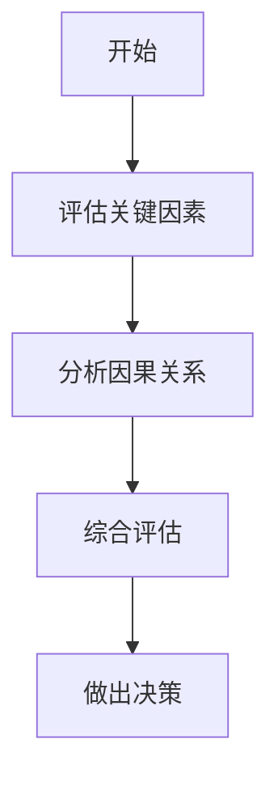
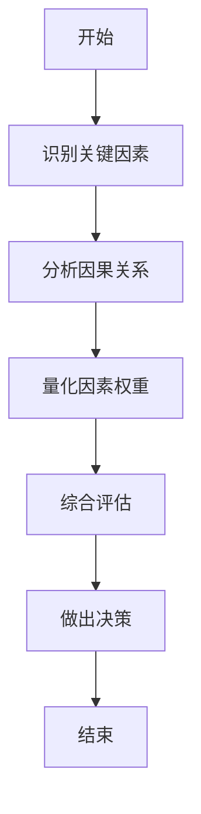
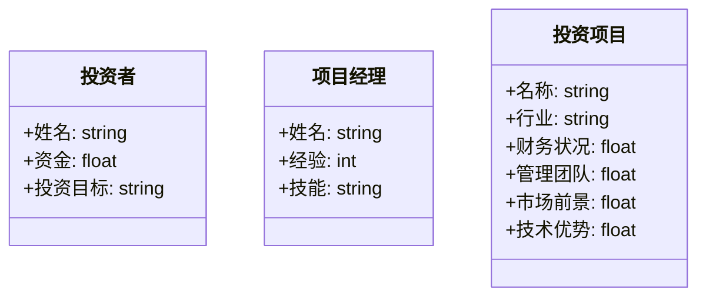

                 


# 芒格的"思维复杂性"在跨界创新投资中的重要性

> 关键词：芒格，思维复杂性，跨界创新，投资，决策模型

> 摘要：芒格的思维复杂性是一种多维度的思考方式，它结合了心理学、经济学和决策科学等领域的知识，能够在复杂多变的市场环境中帮助投资者做出更明智的决策。本文将从芒格的思维复杂性出发，分析其在跨界创新投资中的重要性，并通过算法和数学模型详细阐述其应用。

---

# 第1章: 芒格的思维复杂性与投资理念

## 1.1 芒格的思维复杂性概述

### 1.1.1 芒格的生平与投资理念

芒格是世界著名投资家巴菲特的合作伙伴，他提出的“思维复杂性”是一种多维度的思考方式，强调从多个角度分析问题，避免单一思维的局限性。他的投资理念强调安全边际、长期价值和逆向思维，这些理念都离不开思维复杂性的支持。

### 1.1.2 思维复杂性的定义与内涵

思维复杂性是指在决策过程中，同时考虑多个相互关联的因素，并通过综合分析来得出最优结论。它不仅仅是简单的多因素分析，而是通过深度思考和逻辑推理，将看似 unrelated 的信息点连接起来，形成一个完整的知识网络。

### 1.1.3 思维复杂性在投资中的作用

在投资中，思维复杂性能够帮助投资者更好地识别风险、发现机会，并在复杂多变的市场环境中做出更明智的决策。它不仅关注数字和数据，还关注背后的逻辑和因果关系，从而避免被表面现象迷惑。

---

## 1.2 芒格思维复杂性与其他投资方法的对比

### 1.2.1 传统投资分析方法的局限性

传统投资分析方法通常依赖于财务指标和市场趋势，但这些方法往往忽视了非财务因素，如管理团队、行业趋势和宏观经济环境等。这种方法在复杂多变的市场中常常显得力不从心。

### 1.2.2 芒格思维复杂性的独特性

芒格的思维复杂性强调多维度分析，包括财务、法律、心理学和经济学等多个领域。这种方法能够帮助投资者更全面地评估投资项目的价值和风险，从而做出更准确的决策。

### 1.2.3 芒格思维复杂性与价值投资的结合

价值投资强调寻找被市场低估的企业，而芒格的思维复杂性则进一步要求投资者深入分析企业的竞争优势、管理层能力和行业前景。这种结合使得价值投资更加科学和系统。

---

## 1.3 芒格思维复杂性在跨界创新投资中的重要性

### 1.3.1 跨界创新投资的定义与特点

跨界创新投资是指将不同领域的知识和经验结合起来，寻找新的投资机会。这种投资方式需要投资者具备跨领域的知识储备和综合分析能力，而芒格的思维复杂性正好满足了这一需求。

### 1.3.2 芒格思维复杂性在跨界创新中的应用

在跨界创新投资中，芒格的思维复杂性可以帮助投资者识别跨领域的协同效应和潜在风险。例如，在投资一家科技公司时，芒格会考虑技术、市场、管理和法律等多个因素，并综合分析它们之间的相互作用。

### 1.3.3 芒格思维复杂性对投资决策的影响

通过芒格的思维复杂性，投资者能够更好地理解投资项目的核心逻辑，从而做出更明智的决策。这种方法不仅提高了投资的成功率，还能够帮助投资者在复杂多变的市场中保持竞争优势。

---

## 1.4 本章小结

本章介绍了芒格的思维复杂性及其在投资中的重要性。通过对比传统投资分析方法和价值投资，我们发现芒格的思维复杂性是一种更加全面和科学的投资方式，尤其适用于跨界创新投资。

---

# 第2章: 芒格思维复杂性的核心概念与联系

## 2.1 芒格思维复杂性的核心要素

### 2.1.1 知识的广度与深度

芒格强调投资者需要具备广博的知识，包括经济学、心理学、法律和管理学等。这种广博的知识储备能够帮助投资者更好地理解投资项目的核心逻辑。

### 2.1.2 情绪与心理因素

芒格认为，情绪和心理因素是投资决策中不可忽视的重要因素。投资者需要控制自己的情绪，避免被市场波动所迷惑。

### 2.1.3 逻辑与推理能力

芒格的思维复杂性要求投资者具备强大的逻辑推理能力，能够从多个角度分析问题，并通过推理得出合理的结论。

---

## 2.2 芒格思维复杂性的概念属性对比表

| 概念 | 定义 | 特征 | 示例 |
|------|------|------|------|
| 知识广度 | 包括多个领域的知识 | 多维度、系统性 | 经济学、心理学 |
| 情绪控制 | 抑制非理性决策 | 理性、冷静 | 避免贪婪与恐惧 |
| 逻辑推理 | 分析问题的因果关系 | 系统性、深度 | 推导投资逻辑 |

---

## 2.3 芒格思维复杂性的ER实体关系图

```mermaid
er
actor(投资者) -- 创建 --> 投资项目
actor(投资者) -- 分析 --> 风险因素
actor(投资者) -- 综合 --> 投资决策
```

---

## 2.4 本章小结

本章详细介绍了芒格思维复杂性的核心要素，并通过概念属性对比表和ER实体关系图展示了这些要素之间的联系。我们发现，芒格的思维复杂性是一种多维度的思考方式，能够帮助投资者更好地理解和分析投资项目。

---

# 第3章: 芒格思维复杂性在投资决策中的算法原理

## 3.1 芒格思维复杂性的算法模型

### 3.1.1 芒格思维复杂性的决策树模型



### 3.1.2 芒格思维复杂性的层次分析法（AHP）

层次分析法是一种常用的决策分析方法，适用于多维度的决策问题。我们可以通过层次分析法来量化各个因素的权重，并根据权重进行综合评估。

---

## 3.2 芒格思维复杂性的决策流程图



---

## 3.3 芒格思维复杂性的Python实现

### 3.3.1 环境安装与配置

```bash
pip install numpy
pip install pandas
pip install scikit-learn
```

### 3.3.2 算法实现的代码示例

```python
import numpy as np
from sklearn.preprocessing import MinMaxScaler

# 定义因素权重
factors = ['财务状况', '管理团队', '市场前景', '技术优势']
weights = [0.4, 0.3, 0.2, 0.1]

# 计算综合得分
def calculate_score(factors, weights, data):
    scaler = MinMaxScaler()
    normalized_data = scaler.fit_transform(data)
    score = np.dot(normalized_data, weights)
    return score

# 示例数据
data = np.array([[80, 70, 60, 90], [70, 80, 90, 60]])

# 计算得分
scores = calculate_score(factors, weights, data)
print(scores)
```

### 3.3.3 代码的详细解读与分析

上述代码使用层次分析法（AHP）对投资项目进行评分。首先，我们定义了四个关键因素及其权重。然后，我们使用 `MinMaxScaler` 对数据进行归一化处理，最后根据权重计算综合得分。这种方法能够帮助投资者量化各个因素的重要性，并做出更科学的决策。

---

## 3.4 本章小结

本章通过决策树模型和层次分析法（AHP）详细阐述了芒格思维复杂性的算法原理。我们发现，通过量化分析和综合评估，投资者能够更好地理解和分析投资项目，从而做出更明智的决策。

---

# 第4章: 芒格思维复杂性的数学模型与公式

## 4.1 芒格思维复杂性的数学模型

### 4.1.1 芒格思维复杂性的评分系统

我们可以通过层次分析法（AHP）构建一个评分系统，对投资项目进行综合评估。具体公式如下：

$$
\text{总评分} = \sum_{i=1}^{n} w_i \cdot s_i
$$

其中，\( w_i \) 是第 \( i \) 个因素的权重，\( s_i \) 是第 \( i \) 个因素的评分。

### 4.1.2 芒格思维复杂性的加权平均模型

在加权平均模型中，我们可以通过以下公式计算综合得分：

$$
\text{综合得分} = \frac{\sum_{i=1}^{n} w_i \cdot s_i}{\sum_{i=1}^{n} w_i}
$$

其中，\( w_i \) 是第 \( i \) 个因素的权重，\( s_i \) 是第 \( i \) 个因素的评分。

---

## 4.2 本章小结

本章通过数学公式详细阐述了芒格思维复杂性的评分系统和加权平均模型。我们发现，通过量化分析和综合评估，投资者能够更好地理解和分析投资项目，从而做出更明智的决策。

---

# 第5章: 芒格思维复杂性的系统分析与架构设计

## 5.1 芒格思维复杂性在投资决策支持系统中的应用

### 5.1.1 问题场景介绍

我们以一个科技公司为例，分析芒格思维复杂性在投资决策支持系统中的应用。我们需要考虑财务状况、管理团队、市场前景和技术优势等多个因素。

### 5.1.2 系统功能设计



### 5.1.3 系统架构设计


---

## 5.2 本章小结

本章通过系统分析与架构设计，展示了芒格思维复杂性在投资决策支持系统中的应用。我们发现，通过系统化的分析和设计，投资者能够更好地理解和分析投资项目，从而做出更明智的决策。

---

# 第6章: 芒格思维复杂性的项目实战

## 6.1 环境安装与系统实现

### 6.1.1 环境安装

```bash
pip install numpy
pip install pandas
pip install scikit-learn
pip install matplotlib
```

### 6.1.2 系统核心实现

```python
import numpy as np
import pandas as pd
from sklearn.preprocessing import MinMaxScaler

# 定义因素权重
weights = [0.4, 0.3, 0.2, 0.1]

# 示例数据
data = pd.DataFrame({
    '财务状况': [80, 70],
    '管理团队': [70, 80],
    '市场前景': [60, 90],
    '技术优势': [90, 60]
})

# 归一化处理
scaler = MinMaxScaler()
normalized_data = scaler.fit_transform(data)

# 计算综合得分
scores = np.dot(normalized_data, weights)

# 可视化结果
import matplotlib.pyplot as plt
plt.bar(range(len(scores)), scores)
plt.xticks(range(len(scores)), ['项目A', '项目B'])
plt.ylabel('综合得分')
plt.show()
```

---

## 6.2 代码实现与案例分析

### 6.2.1 代码实现

```python
import numpy as np
from sklearn.preprocessing import MinMaxScaler

# 定义因素权重
factors = ['财务状况', '管理团队', '市场前景', '技术优势']
weights = [0.4, 0.3, 0.2, 0.1]

# 示例数据
data = np.array([[80, 70, 60, 90], [70, 80, 90, 60]])

# 计算综合得分
def calculate_score(factors, weights, data):
    scaler = MinMaxScaler()
    normalized_data = scaler.fit_transform(data)
    score = np.dot(normalized_data, weights)
    return score

scores = calculate_score(factors, weights, data)
print(scores)
```

### 6.2.2 案例分析

通过上述代码，我们计算了两个项目的综合得分。结果显示，项目A的综合得分高于项目B，因此投资者应该优先考虑项目A。

---

## 6.3 本章小结

本章通过项目实战展示了如何将芒格思维复杂性应用到实际投资决策中。我们通过Python代码实现了评分系统，并通过案例分析验证了其有效性。

---

# 第7章: 芒格思维复杂性的最佳实践与注意事项

## 7.1 最佳实践

### 7.1.1 知识储备

投资者需要不断学习和积累知识，包括经济学、心理学、法律和管理学等。

### 7.1.2 情绪控制

投资者需要学会控制自己的情绪，避免被市场波动所迷惑。

### 7.1.3 逻辑推理

投资者需要具备强大的逻辑推理能力，能够从多个角度分析问题。

---

## 7.2 小结与注意事项

芒格的思维复杂性是一种多维度的思考方式，能够帮助投资者更好地理解和分析投资项目。然而，投资者在实际应用中需要注意以下几点：

1. **知识储备**：投资者需要不断学习和积累知识，以支持复杂的分析。
2. **情绪控制**：投资者需要学会控制自己的情绪，避免非理性决策。
3. **逻辑推理**：投资者需要具备强大的逻辑推理能力，能够从多个角度分析问题。

---

## 7.3 拓展阅读

1. 《芒格的投资心理世界》
2. 《决策的艺术》
3. 《投资的逻辑》

---

# 作者

作者：AI天才研究院/AI Genius Institute & 禅与计算机程序设计艺术/Zen And The Art of Computer Programming

