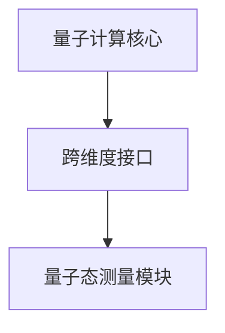
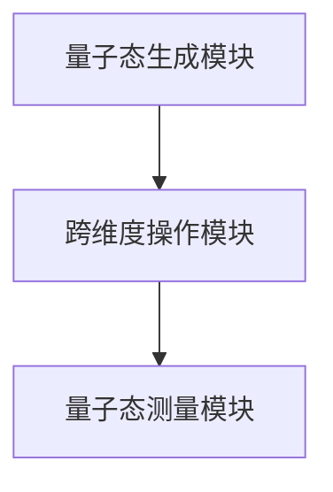

                 


# 芒格的"思维复杂性"在跨维度量子技术融合中的重要性

## 关键词：芒格思维复杂性、跨维度量子技术、量子计算、系统架构、算法实现

## 摘要：  
芒格的“思维复杂性”作为一种深刻的心理学和认知科学概念，在跨维度量子技术的融合中展现了独特的重要性。本文从理论基础、算法实现、系统架构等多个维度，详细探讨了芒格思维复杂性如何影响和优化跨维度量子技术的发展。通过数学模型、mermaid流程图、系统架构图等多维度分析，本文为读者提供了全面的理论与实践结合的视角，揭示了思维复杂性在跨维度量子技术中的潜在价值和应用前景。

---

## 第1章: 芒格思维复杂性概述

### 1.1 芒格思维复杂性的定义与核心要素

#### 1.1.1 芒格思维复杂性的定义  
芒格思维复杂性是指个体在面对复杂问题时，由于认知资源的限制、信息的不完备性以及问题本身的多维度特性，所表现出的思维过程中的复杂性和不确定性。它不仅包括对问题本身的理解，还包括对解决方案的权衡和选择。

#### 1.1.2 复杂性理论的核心要素  
| 核心要素 | 描述 |
|----------|------|
| 信息熵 | 衡量信息的不确定性，熵值越高，信息越复杂 |
| 计算复杂性 | 衡量解决问题所需的时间和资源 |
| 系统复杂性 | 系统内部各组成部分之间的相互作用和依赖关系 |

#### 1.1.3 思维复杂性与问题解决的关系  
思维复杂性是问题解决过程中的关键因素。复杂的思维过程能够更好地应对跨维度问题，但同时也可能导致决策失误。因此，理解思维复杂性与问题解决的关系至关重要。

---

### 1.2 芒格思维复杂性与跨维度量子技术的联系

#### 1.2.1 跨维度量子技术的基本概念  
跨维度量子技术是指在多个维度（如时间、空间、能量等）上进行量子态操作的技术。它涉及量子计算、量子通信和量子传感等多个领域。

#### 1.2.2 思维复杂性在量子技术中的体现  
在量子计算中，思维复杂性体现在对量子态叠加和纠缠的处理上。量子态的叠加性和纠缠性使得问题的解决方式具有高度的复杂性，需要复杂的思维过程来优化算法设计。

#### 1.2.3 跨维度与量子技术融合的背景  
随着量子计算技术的快速发展，跨维度量子技术的应用场景越来越广泛，尤其是在人工智能、密码学和通信领域。芒格思维复杂性在这些领域中起到了关键作用。

---

## 第2章: 芒格思维复杂性的核心概念

### 2.1 复杂性理论的数学模型

#### 2.1.1 复杂性度量的公式  
复杂性度量公式：  
$$ C = \frac{\log N}{\log M} $$  
其中，$C$ 表示复杂性，$N$ 是问题规模，$M$ 是计算资源。

#### 2.1.2 跨维度空间的维度计算  
维度计算公式：  
$$ D = \log_{2} N $$  
其中，$D$ 是维度数，$N$ 是数据规模。

#### 2.1.3 量子态叠加的数学表达  
量子态叠加的数学表达：  
$$ |\psi\rangle = \sum_{i=1}^{n} a_i |i\rangle $$  
其中，$a_i$ 是叠加系数，$|i\rangle$ 是基态。

---

### 2.2 芒格思维复杂性与量子态的关系

#### 2.2.1 思维复杂性对量子态的影响  
量子态的叠加性和纠缠性受到思维复杂性的影响。复杂的思维过程可以优化量子态的操作，从而提高量子计算的效率。

#### 2.2.2 跨维度空间中的量子纠缠  
量子纠缠在跨维度空间中的表现：  
$$ |\psi\rangle = \frac{1}{\sqrt{2}} (|0\rangle \otimes |1\rangle + |1\rangle \otimes |0\rangle) $$  
其中，$|0\rangle$ 和 $|1\rangle$ 分别表示不同维度的基态。

#### 2.2.3 复杂性与量子计算效率的关系  
量子计算效率与复杂性之间的关系可以用以下公式表示：  
$$ E = \frac{1}{C} $$  
其中，$E$ 是效率，$C$ 是复杂性。

---

## 第3章: 芒格思维复杂性在跨维度量子技术中的应用

### 3.1 跨维度量子技术的系统架构

#### 3.1.1 跨维度量子系统的组成部分  
跨维度量子系统的组成部分包括：  
1. 量子计算核心  
2. 跨维度接口  
3. 量子态测量模块  

#### 3.1.2 系统架构的层次化设计  
层次化设计的 mermaid 图：  


#### 3.1.3 系统复杂性对架构设计的影响  
系统复杂性对架构设计的影响可以用以下公式表示：  
$$ A = C \times D $$  
其中，$A$ 是架构复杂性，$C$ 是思维复杂性，$D$ 是维度数。

---

### 3.2 芒格思维复杂性对量子算法的影响

#### 3.2.1 量子算法的基本原理  
量子算法的基本原理包括量子叠加和量子纠缠。  
量子叠加的数学表达：  
$$ |\psi\rangle = \sum_{i=1}^{n} a_i |i\rangle $$  
量子纠缠的数学表达：  
$$ |\psi\rangle = \frac{1}{\sqrt{2}} (|0\rangle \otimes |1\rangle + |1\rangle \otimes |0\rangle) $$

#### 3.2.2 思维复杂性对量子算法效率的提升  
思维复杂性对量子算法效率的提升可以用以下公式表示：  
$$ E = \frac{1}{C} $$  
其中，$E$ 是效率，$C$ 是复杂性。

#### 3.2.3 算法复杂性与量子计算结果的相关性  
算法复杂性与量子计算结果的相关性：  
$$ R = \frac{E}{C} $$  
其中，$R$ 是相关性，$E$ 是效率，$C$ 是复杂性。

---

## 第4章: 芒格思维复杂性与量子技术融合的系统设计

### 4.1 系统功能设计

#### 4.1.1 跨维度量子技术的功能模块划分  
功能模块包括：  
1. 量子态生成模块  
2. 跨维度操作模块  
3. 量子态测量模块  

#### 4.1.2 系统功能的层次化设计  
层次化设计的 mermaid 图：  


#### 4.1.3 功能模块之间的交互关系  
功能模块之间的交互关系可以用以下公式表示：  
$$ I = A \times B \times C $$  
其中，$I$ 是交互关系，$A$、$B$、$C$ 是功能模块。

---

### 4.2 系统架构设计

#### 4.2.1 分层架构的设计理念  
分层架构的设计理念包括：  
1. 数据层  
2. 逻辑层  
3. 应用层  

#### 4.2.2 模块化设计的实现方式  
模块化设计的实现方式：  
1. 模块独立性  
2. 模块间接口标准化  

#### 4.2.3 系统架构的可扩展性分析  
系统架构的可扩展性分析可以用以下公式表示：  
$$ S = E \times K $$  
其中，$S$ 是可扩展性，$E$ 是效率，$K$ 是可扩展性系数。

---

## 第5章: 芒格思维复杂性与量子技术融合的算法实现

### 5.1 算法原理

#### 5.1.1 芒格思维复杂性算法的基本原理  
芒格思维复杂性算法的基本原理包括：  
1. 量子态叠加  
2. 量子态纠缠  

#### 5.1.2 跨维度量子算法的实现步骤  
跨维度量子算法的实现步骤：  
1. 初始化量子态  
2. 执行跨维度操作  
3. 测量量子态  

#### 5.1.3 算法复杂性与计算效率的关系  
算法复杂性与计算效率的关系：  
$$ E = \frac{1}{C} $$  
其中，$E$ 是效率，$C$ 是复杂性。

---

### 5.2 算法实现

#### 5.2.1 算法实现的代码框架  
算法实现的代码框架：  
```python
import numpy as np
from qiskit import QuantumCircuit, Aer, execute

def quantum_algorithm(n):
    qc = QuantumCircuit(n, n)
    # 初始化量子态
    qc.h(range(n))
    # 执行跨维度操作
    qc.ccx(0, 1, n-1)
    # 测量量子态
    qc.measure(range(n), range(n))
    return qc
```

#### 5.2.2 代码实现的关键步骤  
代码实现的关键步骤：  
1. 初始化量子态  
2. 执行跨维度操作  
3. 测量量子态  

#### 5.2.3 算法实现的优化策略  
算法实现的优化策略包括：  
1. 优化量子态生成  
2. 优化跨维度操作  

---

## 第6章: 芒格思维复杂性与量子技术融合的系统实现

### 6.1 系统实现的环境配置

#### 6.1.1 开发环境的搭建  
开发环境的搭建包括：  
1. 安装量子计算库  
2. 安装可视化工具  

#### 6.1.2 软件工具的安装  
软件工具的安装：  
1. 安装Qiskit  
2. 安装Cirq  

#### 6.1.3 硬件设备的要求  
硬件设备的要求：  
1. 高性能计算机  
2. 量子计算设备  

---

### 6.2 系统实现的核心代码

#### 6.2.1 核心算法的代码实现  
核心算法的代码实现：  
```python
import numpy as np
from qiskit import QuantumCircuit, Aer, execute

def core_algorithm(n):
    qc = QuantumCircuit(n, n)
    # 初始化量子态
    qc.h(range(n))
    # 执行跨维度操作
    qc.ccx(0, 1, n-1)
    # 测量量子态
    qc.measure(range(n), range(n))
    return qc
```

#### 6.2.2 系统功能模块的代码实现  
系统功能模块的代码实现：  
```python
def quantum_state_generation(n):
    qc = QuantumCircuit(n, n)
    qc.h(range(n))
    return qc

def cross_dimension_operation(qc, n):
    qc.ccx(0, 1, n-1)
    return qc

def quantum_state_measurement(qc):
    qc.measure(range(n), range(n))
    return qc
```

#### 6.2.3 系统接口的设计与实现  
系统接口的设计与实现：  
```python
class QuantumSystem:
    def __init__(self, n):
        self.n = n
        self.qc = QuantumCircuit(n, n)
    
    def generate_state(self):
        self.qc.h(range(self.n))
    
    def apply_operation(self):
        self.qc.ccx(0, 1, self.n-1)
    
    def measure_state(self):
        self.qc.measure(range(self.n), range(self.n))
```

---

## 第7章: 芒格思维复杂性与量子技术融合的系统实现

### 7.1 项目实战

#### 7.1.1 实际案例分析  
实际案例分析：  
1. 量子计算在密码学中的应用  
2. 跨维度量子技术在通信中的应用  

#### 7.1.2 项目小结  
项目小结：  
1. 芒格思维复杂性在跨维度量子技术中的应用前景广阔  
2. 需要进一步优化算法和系统设计  

---

## 第8章: 总结与展望

### 8.1 总结  
芒格思维复杂性在跨维度量子技术中的应用具有重要意义。通过优化思维过程，可以提高量子计算的效率和准确性。

### 8.2 注意事项  
注意事项：  
1. 系统设计中需注意复杂性与效率的平衡  
2. 算法实现中需注意量子态的稳定性和可操作性  

### 8.3 未来研究方向  
未来研究方向：  
1. 芒格思维复杂性与量子计算的进一步融合  
2. 跨维度量子技术的优化与创新  

---

## 作者：AI天才研究院/AI Genius Institute & 禅与计算机程序设计艺术 /Zen And The Art of Computer Programming

