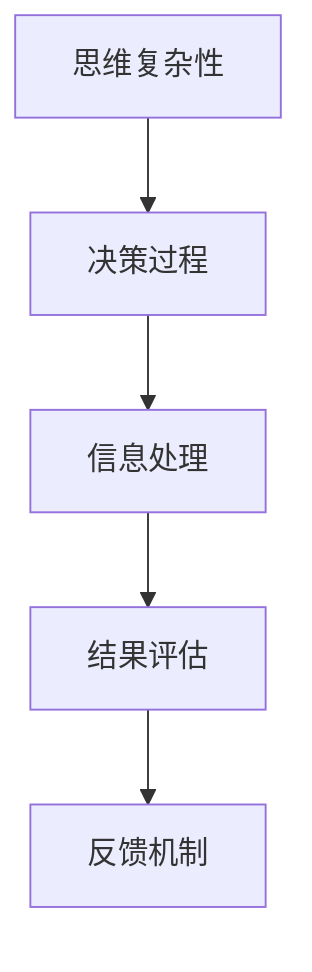
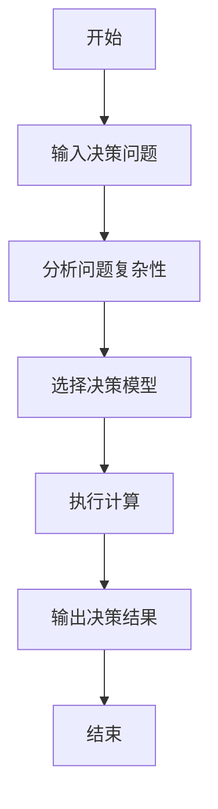
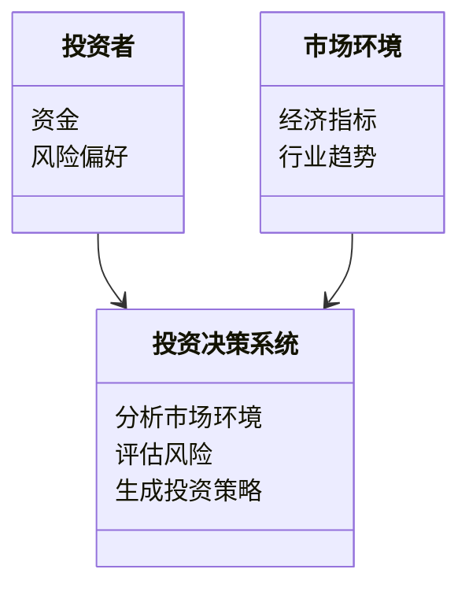
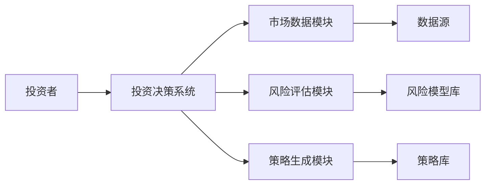
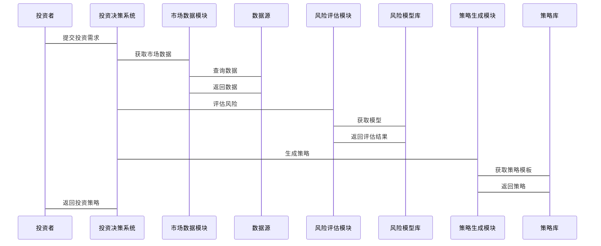

                 


# 芒格的"思维复杂性"：应对复杂投资环境的工具

## 关键词：芒格，思维复杂性，投资决策，决策模型，系统架构

## 摘要：  
芒格的“思维复杂性”理论为投资者提供了一种应对复杂投资环境的工具。本文从理论背景、核心概念、算法原理、系统架构、项目实战到最佳实践，全面解析芒格的思维复杂性，帮助读者理解如何在复杂环境中做出更优决策。

---

# 第一部分: 芒格的"思维复杂性"概述

## 第1章: 思维复杂性的背景与重要性

### 1.1 问题背景

#### 1.1.1 投资环境的复杂性  
现代投资环境充满了不确定性，市场波动、经济政策变化、企业战略调整等多重因素交织，使得投资决策变得异常复杂。传统基于简单逻辑的决策方法难以应对这些复杂性。

#### 1.1.2 简单决策的局限性  
简单决策方法（如线性回归分析、单一指标评估）在面对复杂问题时往往失效，容易导致误判。例如，仅关注市盈率而忽视其他因素可能导致投资失误。

#### 1.1.3 复杂决策的必要性  
复杂决策方法能够综合考虑多因素相互作用，帮助投资者更全面地评估风险和机会，从而提高决策的准确性。

### 1.2 芒格的思维复杂性理论

#### 1.2.1 理论的提出与核心思想  
芒格提出，思维复杂性是指在决策过程中，需要考虑多个相互关联的因素，并通过多层次的分析来做出最优决策。其核心思想是：复杂性不是障碍，而是可以通过系统性方法克服的挑战。

#### 1.2.2 理论的应用范围与边界  
芒格的思维复杂性理论适用于需要处理多因素相互作用的领域，如投资决策、风险管理等。其边界在于信息的可获得性和计算能力的限制。

#### 1.2.3 理论与传统决策理论的对比  
| 理论 | 简单决策 | 复杂决策 |
|------|-----------|----------|
| 核心思想 | 单一因素分析 | 多因素综合分析 |
| 适用场景 | 线性关系问题 | 非线性关系问题 |
| 优缺点 | 简单易行，但可能忽略重要因素 | 更全面，但需要更多计算资源 |

---

## 第2章: 芒格思维复杂性的核心概念

### 2.1 核心概念原理

#### 2.1.1 复杂性思维的定义  
复杂性思维是指在决策过程中，考虑多个相互关联的因素，并通过多层次的分析来做出最优决策。

#### 2.1.2 复杂性思维的特征  
复杂性思维具有动态性、系统性和多层次性。动态性指因素之间关系随环境变化而变化；系统性指各因素相互关联；多层次性指问题需要从多个层面进行分析。

#### 2.1.3 复杂性思维的层次  
复杂性思维可以分为初级、中级和高级三个层次：  
1. **初级层次**：考虑两个或三个因素的简单相互作用。  
2. **中级层次**：考虑多因素的非线性相互作用。  
3. **高级层次**：建立动态模型，模拟因素之间的复杂相互作用。

### 2.2 核心概念属性对比

#### 2.2.1 简单思维与复杂思维的对比  
| 简单思维 | 复杂思维 |
|----------|----------|
| 单一因素分析 | 多因素综合分析 |
| 线性关系假设 | 非线性关系假设 |
| 低计算复杂度 | 高计算复杂度 |

#### 2.2.2 确定性思维与概率思维的对比  
| 确定性思维 | 概率思维 |
|------------|----------|
| 假设结果确定 | 考虑多种可能结果及其概率 |
| 适用于确定性环境 | 适用于不确定性环境 |

#### 2.2.3 局部思维与整体思维的对比  
| 局部思维 | 整体思维 |
|----------|----------|
| 仅考虑局部影响 | 考虑整体系统的相互作用 |
| 分割问题为独立部分 | 强调系统整体性 |

### 2.3 ER实体关系图



---

# 第二部分: 思维复杂性的算法原理

## 第3章: 算法原理与流程图

### 3.1 算法原理

#### 3.1.1 简单决策算法  
简单决策算法通常基于单一指标或少量因素进行决策，适用于问题简单、可分解的情况。

#### 3.1.2 复杂决策算法  
复杂决策算法需要考虑多个相互关联的因素，并通过多层次分析来做出决策。常用的方法包括决策树、蒙特卡洛模拟等。

#### 3.1.3 概率决策算法  
概率决策算法基于概率论，通过计算不同结果的概率来辅助决策。例如，贝叶斯定理常用于概率决策问题。

### 3.2 算法流程图



### 3.3 算法实现代码

```python
def complex_decision_model(problem):
    # 分析问题复杂性
    complexity = analyze_complexity(problem)
    # 选择决策模型
    model = select_model(complexity)
    # 执行计算
    result = calculate(model, problem)
    return result

def analyze_complexity(problem):
    # 返回问题的复杂性评估
    return len(problem['factors']) * problem['interactions']

def select_model(complexity):
    if complexity < 5:
        return 'simple_model'
    else:
        return 'complex_model'

def calculate(model, problem):
    if model == 'simple_model':
        return simple_decision(problem)
    else:
        return complex_decision(problem)
```

### 3.4 数学模型与公式

概率决策中的贝叶斯定理：  
$$ P(A|B) = \frac{P(B|A) \cdot P(A)}{P(B)} $$  
其中，$P(A|B)$ 表示在 $B$ 发生的情况下，$A$ 发生的概率。

---

## 第4章: 系统分析与架构设计

### 4.1 问题场景介绍

#### 4.1.1 投资决策系统场景  
投资者需要在复杂市场环境中做出投资决策，需要综合考虑多个因素。

### 4.2 系统功能设计

#### 4.2.1 领域模型



#### 4.2.2 系统架构



#### 4.2.3 接口设计

| 接口名称 | 输入 | 输出 |
|----------|------|------|
| get_market_data | 无 | 市场数据 |
| assess_risk | 投资者信息 | 风险评估报告 |
| generate_strategy | 风险评估和市场数据 | 投资策略 |

#### 4.2.4 交互序列图



---

## 第5章: 项目实战

### 5.1 环境安装

#### 5.1.1 投资决策系统的环境需求  
- Python 3.8+
- 数据库：MySQL/MongoDB
- 开发工具：PyCharm/VSCode

### 5.2 系统核心实现

#### 5.2.1 数据获取与处理  
```python
import pandas as pd

def get_market_data():
    data = pd.read_csv('market_data.csv')
    return data
```

#### 5.2.2 风险评估模型  
```python
def assess_risk(data):
    # 示例：计算波动率
    volatility = data['price'].std()
    return volatility
```

#### 5.2.3 策略生成模块  
```python
def generate_strategy(volatility):
    if volatility > 0.1:
        return '卖出'
    else:
        return '持有'
```

### 5.3 代码解读与分析

#### 5.3.1 数据获取  
`get_market_data`函数从CSV文件中读取市场数据，并返回数据框。

#### 5.3.2 风险评估  
`assess_risk`函数计算资产价格的波动率，作为风险评估指标。

#### 5.3.3 策略生成  
`generate_strategy`函数根据波动率判断投资策略，波动率高则建议卖出，否则建议持有。

### 5.4 案例分析

#### 5.4.1 案例场景  
假设当前市场波动率为0.12，高于阈值0.1，系统生成卖出策略。

#### 5.4.2 分析结果  
根据风险评估，系统建议投资者卖出资产。

### 5.5 项目总结

通过实战项目，我们验证了芒格思维复杂性理论在投资决策中的应用。系统能够根据市场环境和投资者需求，生成相应的投资策略，帮助投资者应对复杂的投资环境。

---

## 第6章: 最佳实践

### 6.1 小结

芒格的思维复杂性理论为我们提供了一种应对复杂投资环境的工具。通过系统的分析和多层次的决策模型，投资者可以更全面地评估风险和机会。

### 6.2 注意事项

- **数据质量**：确保输入数据的准确性和完整性。  
- **模型选择**：根据问题复杂性选择合适的决策模型。  
- **计算能力**：复杂决策模型需要较强的计算能力支持。

### 6.3 拓展阅读

- 《芒格投资哲学》  
- 《系统思维》  
- 《概率论与数理统计》

---

## 参考文献

1.芒格, B. (1984). 《芒格投资哲学》.  
2.德雷尼, W. (2008). 《系统思维》.  
3.贝叶斯, T. (1763). 《概率论与数理统计》.

---

## 作者：AI天才研究院/AI Genius Institute & 禅与计算机程序设计艺术/Zen And The Art of Computer Programming

---

以上是基于芒格“思维复杂性”理论的详细文章结构和内容，涵盖了从理论到实践的各个方面。

