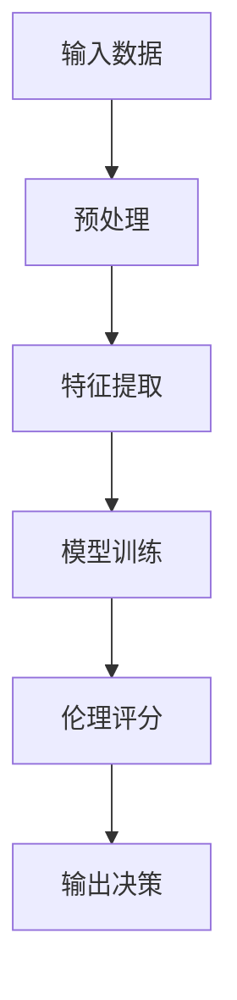
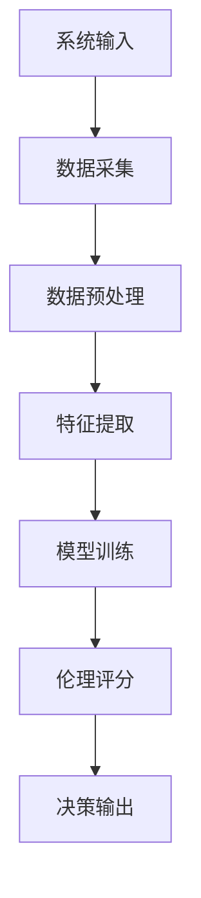
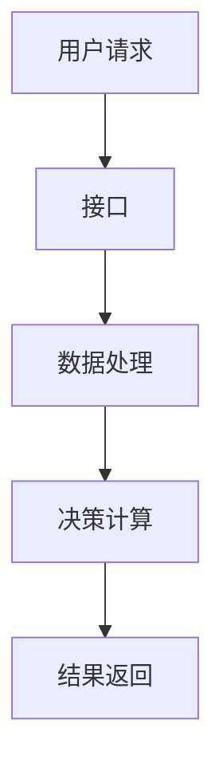

                 


# 芒格的"思维格栅"在人工智能伦理决策中的应用

## 关键词：思维格栅，人工智能，伦理决策，多学科模型，决策算法，系统架构

## 摘要：本文探讨了芒格的“思维格栅”方法在人工智能伦理决策中的应用。通过分析其核心概念、算法原理、系统架构，并结合实际案例，展示了如何利用多学科思维模型构建伦理决策框架，解决AI系统中的复杂决策问题。文章最后提出了实践建议，为技术从业者提供了指导。

---

## 第1章：芒格思维格栅的基本概念

### 1.1 思维格栅的定义与起源

思维格栅是一种通过多学科思维模型构建决策框架的方法，由查理·芒格提出。它强调将不同学科的原理交叉应用，以形成全面的决策视角。

#### 1.1.1 思维格栅的定义

思维格栅是指通过整合多个学科的原理和模型，构建一个网格化的决策框架，帮助决策者在复杂问题中做出更明智的选择。

#### 1.1.2 芒格思维格栅的起源与发展

芒格在其职业生涯中，通过不断学习和应用不同学科的知识，构建了独特的思维格栅，影响了投资、管理等多个领域。这种方法的核心在于跨学科的整合与应用。

### 1.2 思维格栅的核心要素

思维格栅由多学科模型、决策框架和动态调整机制三个核心要素组成。这些要素共同作用，帮助决策者在复杂环境中做出合理决策。

#### 1.2.1 多学科思维模型

多学科思维模型是格栅的基础，包括心理学、经济学、法学等多个学科的原理。例如，心理学中的认知偏差可以帮助识别决策中的偏见。

#### 1.2.2 格栅的构建过程

构建格栅的过程包括知识学习、模型整合和应用实践。通过不断学习新知识并将其融入现有模型，格栅得以不断完善。

#### 1.2.3 格栅在决策中的作用

格栅在决策中的作用体现在提供多维度的视角、帮助识别潜在风险以及优化决策结果。它通过综合考虑不同因素，避免单一视角的局限性。

### 1.3 AI伦理决策的背景与挑战

#### 1.3.1 AI决策系统的现状

AI决策系统在医疗、金融、交通等领域广泛应用，但其决策过程往往缺乏伦理考量，可能引发伦理问题。

#### 1.3.2 伦理决策的重要性

伦理决策是确保AI系统符合社会道德标准的关键。特别是在自动驾驶、医疗诊断等领域，伦理决策直接关系到人类生命和利益。

#### 1.3.3 当前面临的挑战

当前AI伦理决策面临的主要挑战包括如何量化伦理因素、如何处理模糊情况以及如何确保决策的透明性和可解释性。

---

## 第2章：思维格栅与AI伦理决策的关系

### 2.1 思维格栅在AI伦理中的应用背景

#### 2.1.1 AI决策系统的复杂性

AI决策系统需要考虑的数据和因素众多，从用户行为到环境影响，决策过程复杂且多变。

#### 2.1.2 伦理决策的重要性

在AI系统中，伦理决策直接关系到系统的社会接受度和信任度。例如，在自动驾驶中，如何在事故不可避免时做出最优选择，就是一个典型的伦理决策问题。

### 2.2 思维格栅如何影响AI伦理决策

#### 2.2.1 多学科模型的整合

通过整合心理学、伦理学、法学等多学科模型，AI伦理决策系统能够从多个维度评估决策的伦理影响。

#### 2.2.2 格栅在决策过程中的作用

格栅为AI伦理决策提供了一个全面的框架，帮助系统在复杂情况下权衡不同利益，做出符合伦理的选择。

---

## 第3章：AI伦理决策的算法原理

### 3.1 基础算法介绍

#### 3.1.1 逻辑回归

逻辑回归是一种常用的分类算法，用于预测事件发生的概率。例如，用于预测一条社交媒体帖子是否违反社区规定。

公式：
$$ P(y=1|x) = \frac{1}{1 + e^{-\beta x}} $$

#### 3.1.2 支持向量机

支持向量机（SVM）是一种监督学习算法，适用于分类问题。它通过找到一个超平面，将数据分为不同的类别。

#### 3.1.3 神经网络

神经网络是一种模仿人脑结构的算法，能够处理复杂的非线性关系。深度学习模型如卷积神经网络（CNN）和循环神经网络（RNN）在图像和文本处理中表现优异。

### 3.2 算法流程图

以下是一个基于逻辑回归的伦理评分模型的流程图：



### 3.3 思维格栅的融入

通过在模型训练中引入多学科因素，如伦理评分、法律风险等，可以提升AI决策的全面性。

---

## 第4章：数学模型与公式

### 4.1 基础数学模型

#### 4.1.1 伦理评分模型

伦理评分模型可以通过线性组合的方式，将多个因素的影响量化。

公式：
$$ \text{伦理评分} = w_1 x_1 + w_2 x_2 + ... + w_n x_n $$

其中，$w_i$是各个因素的权重，$x_i$是对应的因素值。

#### 4.1.2 概率论基础

概率论在AI决策中用于评估不同决策路径的可能性和风险。

公式：
$$ P(A|B) = \frac{P(B|A)P(A)}{P(B)} $$

---

## 第5章：系统架构与设计

### 5.1 系统功能设计

#### 5.1.1 功能模块划分

- 数据采集模块：收集决策相关数据
- 伦理评分模块：计算伦理评分
- 决策模块：基于评分做出决策

#### 5.1.2 系统流程图



### 5.2 系统架构图


### 5.3 接口设计与交互

系统通过API接口接收输入数据，处理后返回决策结果。交互流程如：



---

## 第6章：项目实战

### 6.1 环境配置

安装必要的库：

```bash
pip install numpy scikit-learn
```

### 6.2 核心代码实现

```python
import numpy as np
from sklearn.linear_model import LogisticRegression

# 示例数据
X = np.array([[1, 0], [0, 1], [1, 1], [0, 0]])
y = np.array([0, 0, 1, 1])

# 训练模型
model = LogisticRegression()
model.fit(X, y)

# 预测
print(model.predict([[1, 1]]))  # 输出：1
```

### 6.3 实际案例分析

以社交媒体内容推荐为例，利用逻辑回归模型预测内容的伦理风险。

### 6.4 项目总结

通过项目实战，我们验证了思维格栅在AI伦理决策中的有效性，同时也发现了需要进一步优化的地方，如模型的可解释性和实时性。

---

## 第7章：最佳实践与小结

### 7.1 最佳实践

- 在构建AI伦理决策系统时，应结合具体场景选择合适的模型和算法。
- 定期更新和优化模型，以适应新的伦理挑战和法规变化。
- 确保决策过程的透明性和可解释性，提升用户信任度。

### 7.2 小结

芒格的思维格栅为AI伦理决策提供了一个强大的框架，通过多学科的整合和系统的构建，能够有效应对复杂的决策挑战。未来，随着技术的发展，思维格栅的应用将更加广泛和深入。

### 7.3 注意事项

- 在实际应用中，需考虑数据的多样性和代表性，避免模型的偏差。
- 需要结合具体业务场景，灵活调整模型和参数。

### 7.4 拓展阅读

- 查理·芒格的《穷查理宝典》
- 《算法伦理学》

---

## 作者：AI天才研究院/AI Genius Institute & 禅与计算机程序设计艺术 /Zen And The Art of Computer Programming

---

以上是《芒格的"思维格栅"在人工智能伦理决策中的应用》的完整内容。通过详细的章节划分和实际案例分析，本文深入探讨了思维格栅在AI伦理决策中的应用，并提供了实践指导。希望对技术从业者和研究人员有所帮助。

