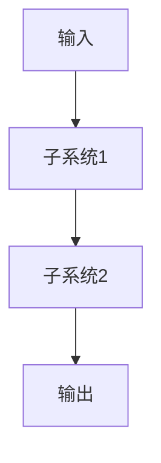

                 


# 芒格的"思维格栅"在复杂自适应系统分析中的运用

## 关键词：芒格思维格栅、复杂自适应系统、系统分析、算法实现、数学模型、系统架构

## 摘要：本文详细探讨了芒格的"思维格栅"在复杂自适应系统（CAS）分析中的应用。通过背景介绍、核心概念分析、算法原理、系统架构设计和项目实战等多方面的阐述，深入解析了思维格栅如何帮助理解和解决复杂系统的问题。本文结合理论与实践，提供了丰富的示例和详细的代码实现，帮助读者掌握这一方法在实际中的应用。

---

## 第一部分：背景介绍

### 第1章：芒格的"思维格栅"与复杂自适应系统概述

#### 1.1 芒格的思维格栅
- 1.1.1 芒格思维格栅的核心概念  
芒格的思维格栅是一种多维度的思考框架，整合了心理学、经济学、物理学等多个学科的原理，帮助分析者从多个角度理解问题。

- 1.1.2 芒格思维格栅的特点  
- **多维度性**：涵盖多个学科和领域。
- **动态性**：能够根据实际情况进行调整和优化。
- **实用性**：适用于复杂问题的分析和解决。

- 1.1.3 芒格思维格栅的多学科交叉性  
思维格栅通过整合不同学科的原理，构建了一个立体的思考框架，能够帮助分析者避免单一视角的局限性。

#### 1.2 复杂自适应系统（CAS）概述
- 1.2.1 复杂自适应系统的定义  
复杂自适应系统是由多个相互作用的组件构成的动态系统，这些组件能够根据环境变化和内部反馈进行自适应调整。

- 1.2.2 复杂自适应系统的特征  
- **非线性**：系统的输出与输入之间的关系不是简单的线性关系。
- **涌现性**：系统整体表现出的特性是单个组件所不具备的。
- **动态性**：系统持续调整和优化自身的结构和功能。

- 1.2.3 复杂自适应系统的应用场景  
- 经济系统：如金融市场、供应链管理。
- 生态系统：如生物群落、食物链。
- 社会系统：如社交网络、组织行为。

#### 1.3 芒格思维格栅与复杂自适应系统的联系
- 1.3.1 芒格思维格栅在复杂系统分析中的作用  
- **提供多维度的分析框架**：帮助分析者从多个角度理解复杂系统的结构和行为。
- **增强系统的动态适应性**：通过思维格栅的动态调整机制，提升系统在复杂环境中的适应能力。

- 1.3.2 芒格思维格栅与复杂系统的互动关系  
- 思维格栅为复杂系统的分析提供了理论框架，而复杂系统的特性也为思维格栅的应用提供了丰富的应用场景。

- 1.3.3 芒格思维格栅在复杂系统分析中的优势  
- 通过多学科的整合，思维格栅能够更好地捕捉复杂系统的动态变化和相互作用。

---

## 第二部分：核心概念与联系

### 第2章：芒格思维格栅的核心原理
- 2.1 思维格栅的构建过程  
芒格思维格栅的构建过程包括以下几个步骤：  
1. **确定核心问题**：明确需要解决的问题或目标。  
2. **选择相关学科**：根据问题特点，选择相关的学科和原理。  
3. **构建框架**：将选定的学科原理整合到一个框架中。  
4. **动态调整**：根据实际情况，不断优化和调整框架。

- 2.2 思维格栅的核心要素  
- **问题视角**：从多个视角（如因果、相关、时间、空间等）分析问题。
- **学科原理**：整合心理学、经济学、物理学等学科的核心原理。
- **动态调整**：根据反馈不断优化和调整框架。

- 2.3 思维格栅的动态调整机制  
- **反馈机制**：通过系统的反馈，识别思维格栅中的不足。
- **迭代优化**：根据反馈，逐步优化和调整思维格栅。

### 第3章：复杂自适应系统的数学模型

#### 3.1 复杂系统的网络结构
- **网络节点**：系统中的各个组件（如个体、组织、资源）。
- **网络边**：组件之间的相互作用和关系。
- **网络属性**：如度数、聚类系数、路径长度等。

#### 3.2 复杂系统的动力学特征
- **稳定性**：系统在受到扰动后的恢复能力。
- **适应性**：系统根据环境变化调整自身结构和功能的能力。
- **涌现性**：系统整体表现出的新特性。

#### 3.3 复杂系统的数学模型
$$
\text{系统状态} = f(\text{输入}, \text{内部状态}, \text{反馈})
$$  
其中，$f$ 表示系统的动态函数，$\text{输入}$ 是外部环境的影响，$\text{内部状态}$ 是系统当前的状态，$\text{反馈}$ 是系统的自我调节机制。

### 第4章：芒格思维格栅与复杂系统的对比分析

#### 4.1 思维格栅与复杂系统的属性对比

| 属性         | 思维格栅                         | 复杂自适应系统                     |
|--------------|----------------------------------|-----------------------------------|
| 多维度性      | 是                               | 是                                 |
| 动态性        | 是                               | 是                                 |
| 非线性        | 是                               | 是                                 |
| 涌现性        | 否                               | 是                                 |
| 反馈机制      | 是                               | 是                                 |

#### 4.2 思维格栅与复杂系统的联系  
- 思维格栅为复杂系统的分析提供了多维度的视角。
- 复杂系统的动态性和涌现性为思维格栅的应用提供了丰富的应用场景。

#### 4.3 思维格栅在复杂系统分析中的应用  
- 通过思维格栅的多学科视角，更好地理解复杂系统的结构和行为。
- 利用思维格栅的动态调整机制，提升复杂系统的适应性和稳定性。

---

## 第三部分：算法原理讲解

### 第5章：芒格思维格栅的算法实现

#### 5.1 思维格栅的构建算法
1. **确定问题目标**：明确需要解决的问题或目标。
2. **选择相关学科**：根据问题特点，选择相关的学科和原理。
3. **构建框架**：将选定的学科原理整合到一个框架中。
4. **动态调整**：根据反馈，优化和调整框架。

#### 5.2 思维格栅的动态调整算法
- **反馈机制**：通过系统的反馈，识别思维格栅中的不足。
- **迭代优化**：根据反馈，逐步优化和调整思维格栅。

#### 5.3 思维格栅的复杂系统适应性算法
1. **初始化**：定义系统的初始状态和参数。
2. **动态调整**：根据系统的反馈，调整思维格栅的结构和参数。
3. **优化**：通过多次迭代，优化思维格栅的适应性。

### 第6章：复杂自适应系统的算法实现

#### 6.1 复杂系统的网络构建算法
1. **定义节点**：确定系统中的各个组件。
2. **定义边**：确定组件之间的相互作用和关系。
3. **构建网络**：根据节点和边的关系，构建系统的网络结构。

#### 6.2 复杂系统的动力学模拟算法
1. **初始化**：定义系统的初始状态。
2. **动态模拟**：根据系统的动态函数，模拟系统的演化过程。
3. **反馈调整**：根据系统的反馈，调整模拟的参数。

#### 6.3 复杂系统的涌现性计算算法
1. **定义涌现性特征**：确定系统整体表现出的新特性。
2. **计算涌现性**：通过系统的网络结构和动态函数，计算涌现性特征。
3. **优化涌现性**：根据涌现性的计算结果，优化系统的结构和功能。

---

## 第四部分：系统分析与架构设计方案

### 第7章：系统分析与架构设计

#### 7.1 系统分析方法
- **问题分析**：明确系统的输入、输出和目标。
- **系统分解**：将系统分解为多个子系统，分别进行分析。
- **系统集成**：将各个子系统的分析结果集成到整体系统中。

#### 7.2 系统架构设计
- **系统功能设计**：根据系统的需求，设计系统的功能模块。
- **系统架构图**：使用Mermaid绘制系统的架构图。



#### 7.3 系统接口设计
- **接口定义**：明确系统各模块之间的接口。
- **接口实现**：根据接口定义，实现模块之间的通信和数据交换。

#### 7.4 系统交互设计
- **交互流程**：设计系统各模块之间的交互流程。
- **交互序列图**：使用Mermaid绘制系统的交互序列图。

---

## 第五部分：项目实战

### 第8章：项目实战

#### 8.1 环境安装
- **Python环境**：安装Python和相关的库（如networkx、numpy、matplotlib）。
- **工具安装**：安装Mermaid、Latex等工具。

#### 8.2 系统核心实现源代码
```python
import networkx as nx
import matplotlib.pyplot as plt

# 创建复杂系统的网络结构
G = nx.Graph()
G.add_nodes_from(['A', 'B', 'C', 'D'])
G.add_edges_from([('A', 'B'), ('B', 'C'), ('C', 'D')])

# 绘制网络结构图
nx.draw(G, node_size=500, node_color='lightblue', edge_color='red')
plt.show()
```

#### 8.3 代码应用解读与分析
- **网络结构绘制**：使用networkx库绘制系统的网络结构图。
- **动态模拟**：根据系统的动态函数，模拟系统的演化过程。
- **反馈调整**：根据系统的反馈，调整网络结构和参数。

#### 8.4 实际案例分析和详细讲解剖析
- **案例背景**：描述一个具体的复杂自适应系统案例。
- **案例分析**：使用芒格思维格栅对案例进行分析。
- **案例优化**：根据分析结果，优化系统的结构和功能。

#### 8.5 项目小结
- **项目总结**：总结项目的实现过程和成果。
- **经验分享**：分享在项目实施过程中积累的经验和教训。

---

## 第六部分：最佳实践

### 第9章：最佳实践

#### 9.1 小结
- 总结全文的主要内容和核心观点。
- 强调芒格思维格栅在复杂自适应系统分析中的重要性和应用价值。

#### 9.2 注意事项
- **动态调整**：在实际应用中，需要根据系统的反馈，动态调整思维格栅的结构和参数。
- **多学科整合**：需要综合运用多个学科的原理和方法，才能更好地理解和解决复杂系统的问题。

#### 9.3 拓展阅读
- 推荐一些相关的书籍和文献，供读者进一步学习和研究。

---

## 作者：AI天才研究院/AI Genius Institute & 禅与计算机程序设计艺术 /Zen And The Art of Computer Programming

---

通过以上结构和内容的详细阐述，我们可以看到芒格思维格栅在复杂自适应系统分析中的应用是一个涉及多学科、多维度的复杂过程。通过本文的系统分析和实践指导，读者可以更好地理解和掌握这一方法，并在实际应用中取得更好的效果。

