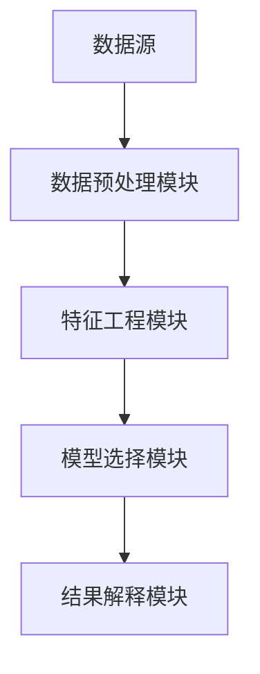

                 


# 芮格的"思维格栅"在大数据分析中的运用

> 关键词：芒格思维格栅、大数据分析、数据分析框架、多学科思维、数据驱动决策

> 摘要：本文探讨了芒格的“思维格栅”在大数据分析中的应用，分析了其在数据预处理、特征工程、模型选择和结果解释等环节的优势，并通过实际案例展示了其在提升分析效率和准确性中的价值。

---

## 第1章: 背景介绍

### 1.1 芮格思维格栅的定义与核心概念

芒格的“思维格栅”是一种多维度的分析框架，强调通过多个学科的交叉视角来解决问题。它由多个“格子”组成，每个格子代表一个分析维度或工具。这种框架的特点是灵活、可扩展，并且能够帮助分析者避免单一视角的局限性。

### 1.2 大数据分析的背景与现状

大数据分析是指对海量、多样化、高速变化的数据进行处理和分析，以提取有价值的信息。随着数据量的爆炸式增长，大数据分析在商业、金融、医疗等领域发挥着越来越重要的作用。然而，数据分析过程中常常面临数据质量差、计算复杂度高、模型解释性弱等挑战。

### 1.3 芮格思维格栅在大数据分析中的意义

将芒格的“思维格栅”应用于大数据分析，可以帮助分析者更全面地理解数据，避免片面的结论。通过结合统计学、机器学习、可视化等多种方法，能够提升分析的准确性和效率。

---

## 第2章: 芮格思维格栅的核心概念与联系

### 2.1 芮格思维格栅的核心原理

芒格的“思维格栅”强调多维度分析，每个“格子”代表一种分析工具或方法。分析者可以根据具体问题选择合适的格子，形成个性化的分析框架。这种框架具有动态调整的能力，能够适应不同场景的需求。

### 2.2 芮格思维格栅与大数据分析的核心联系

在大数据分析中，芒格的“思维格栅”提供了以下几点优势：

1. **数据预处理**：通过多维度分析，能够更有效地识别和处理数据中的噪声和异常值。
2. **特征工程**：结合统计学和机器学习方法，可以提取更有代表性的特征，提升模型的性能。
3. **模型选择**：通过多维度评估，可以选择最适合数据的模型，避免过拟合或欠拟合的问题。
4. **结果解释**：利用多学科的视角，可以更深入地解释分析结果，提高决策的科学性。

### 2.3 芮格思维格栅与大数据分析的对比分析

传统的数据分析方法通常依赖单一的工具或方法，容易忽略数据的复杂性。而芒格的“思维格栅”则强调多工具和多方法的结合，能够更好地应对复杂的数据问题。此外，与机器学习算法相比，芒格的“思维格栅”更注重分析过程中的逻辑性和可解释性，适合需要深入理解数据本质的场景。

---

## 第3章: 芮格思维格栅在大数据分析中的算法原理

### 3.1 芮格思维格栅的数学模型

芒格的“思维格栅”可以看作是一种多维度的分析框架，其数学模型可以表示为：

$$
\text{总结果} = \sum_{i=1}^{n} (\text{维度}_i \times \text{权重}_i)
$$

其中，$\text{维度}_i$ 表示第 $i$ 个分析维度，$\text{权重}_i$ 表示该维度的重要性。

### 3.2 芮格思维格栅在大数据分析中的具体应用

#### 3.2.1 数据预处理中的应用

在数据预处理阶段，分析者可以通过芒格的“思维格栅”框架，结合统计学和机器学习方法，对数据进行清洗和转换。例如：

1. **数据清洗**：使用统计学方法识别异常值，并结合领域知识进行处理。
2. **数据转换**：将数据转换为更适合建模的形式，如标准化或分箱处理。

#### 3.2.2 数据特征提取中的应用

在特征工程阶段，分析者可以利用芒格的“思维格栅”框架，结合统计学和机器学习方法，提取更有代表性的特征。例如：

1. **特征选择**：使用统计学方法（如卡方检验）和机器学习方法（如LASSO回归）进行特征选择。
2. **特征组合**：将多个特征组合成新的特征，例如将“年龄”和“收入”组合成“年龄段”特征。

#### 3.2.3 数据建模中的应用

在建模阶段，分析者可以利用芒格的“思维格栅”框架，结合多种算法进行模型选择和优化。例如：

1. **模型选择**：比较线性回归、随机森林和神经网络等算法的性能，选择最适合数据的模型。
2. **模型优化**：通过交叉验证调整模型的超参数，提高模型的准确性和稳定性。

---

## 第4章: 芮格思维格栅在大数据分析中的系统架构

### 4.1 系统功能设计

在系统功能设计方面，芒格的“思维格栅”框架可以划分为以下几个模块：

1. **数据预处理模块**：负责数据清洗、转换和特征工程。
2. **模型选择模块**：负责算法选择和优化。
3. **结果解释模块**：负责分析结果的可视化和解释。

### 4.2 系统架构设计

以下是芒格的“思维格栅”框架的系统架构图：



### 4.3 系统接口设计

系统接口设计主要涉及以下几个方面：

1. **数据输入接口**：接收原始数据，格式可以是CSV、JSON等。
2. **数据输出接口**：输出处理后的数据和分析结果，格式可以是CSV、JSON等。
3. **用户界面接口**：提供可视化界面，供用户进行参数设置和结果查看。

---

## 第5章: 项目实战

### 5.1 环境安装

要实现芒格的“思维格栅”框架，需要安装以下工具：

1. **Python**：用于编程和数据分析。
2. **Pandas**：用于数据处理。
3. **Scikit-learn**：用于机器学习算法。
4. **Matplotlib/Seaborn**：用于数据可视化。

### 5.2 核心实现代码

以下是芒格的“思维格栅”框架的核心实现代码：

```python
import pandas as pd
from sklearn.model_selection import train_test_split
from sklearn.ensemble import RandomForestClassifier
from sklearn.metrics import accuracy_score

# 数据预处理
def data_preprocessing(data):
    # 数据清洗
    data = data.dropna()
    # 特征工程
    data['age_category'] = data['age'].apply(lambda x: 'young' if x < 30 else 'adult' if x < 60 else 'senior')
    return data

# 模型选择
def model_selection(data):
    X = data.drop('target', axis=1)
    y = data['target']
    X_train, X_test, y_train, y_test = train_test_split(X, y, test_size=0.2)
    model = RandomForestClassifier()
    model.fit(X_train, y_train)
    return model

# 结果解释
def result_interpretation(model, X_test, y_test):
    predictions = model.predict(X_test)
    print(f"Accuracy: {accuracy_score(y_test, predictions)}")
    # 特征重要性分析
    print(f"Feature importances: {model.feature_importances_}")

# 主函数
def main():
    data = pd.read_csv('data.csv')
    data = data_preprocessing(data)
    model = model_selection(data)
    result_interpretation(model, X_test, y_test)

if __name__ == "__main__":
    main()
```

### 5.3 代码解读与分析

1. **数据预处理**：使用`data_preprocessing`函数对数据进行清洗和特征工程。
2. **模型选择**：使用`model_selection`函数进行模型训练和优化。
3. **结果解释**：使用`result_interpretation`函数输出模型的准确率和特征重要性。

### 5.4 实际案例分析

以一个客户 churn 预测的案例为例，使用芒格的“思维格栅”框架进行分析：

1. **数据预处理**：清洗数据，处理缺失值和异常值。
2. **特征工程**：将年龄分箱为 young、adult 和 senior。
3. **模型选择**：使用随机森林算法进行分类。
4. **结果解释**：输出模型的准确率和特征重要性。

---

## 第6章: 总结与展望

### 6.1 最佳实践 tips

1. 在大数据分析中，结合芒格的“思维格栅”框架，可以提升分析的全面性和准确性。
2. 数据预处理和特征工程是关键步骤，需要投入足够的精力。
3. 结果解释是数据分析的核心，需要深入理解和可视化。

### 6.2 小结

芒格的“思维格栅”框架为大数据分析提供了一种系统化的分析方法，通过多维度的视角和灵活的工具组合，能够有效应对复杂的数据问题。

### 6.3 注意事项

1. 分析者需要具备跨学科的知识储备，才能更好地应用芒格的“思维格栅”框架。
2. 在实际应用中，需要根据具体问题调整分析框架，避免机械化的应用。

### 6.4 拓展阅读

1. 《芒格投资哲学》：深入理解芒格的思维方式。
2. 《大数据分析实战》：学习更多大数据分析的技巧和方法。

---

作者：AI天才研究院/AI Genius Institute & 禅与计算机程序设计艺术 /Zen And The Art of Computer Programming

