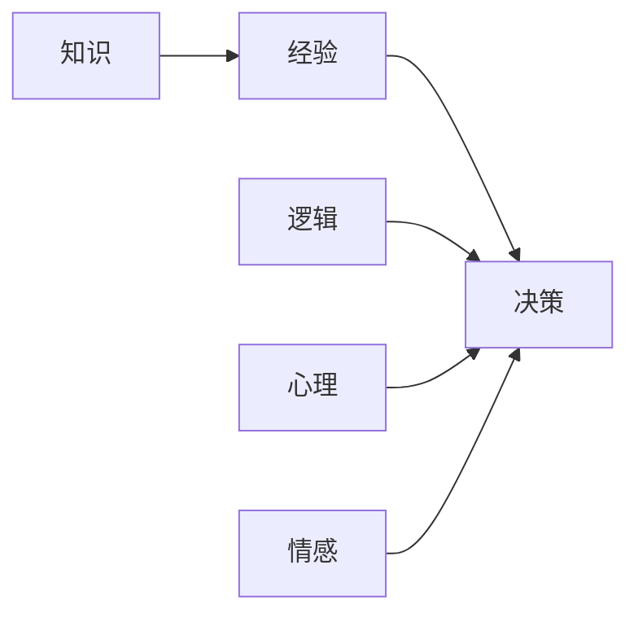
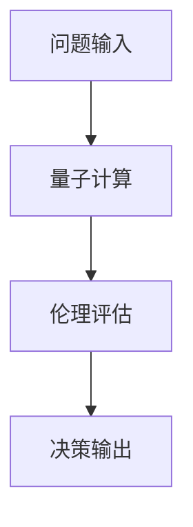

                 


# 芒格的"思维格栅"在量子伦理决策框架设计中的应用

---

## 关键词：
芒格思维格栅、量子伦理决策、决策框架设计、多学科模型、量子计算、伦理学

---

## 摘要：
本文探讨了芒格的“思维格栅”在量子伦理决策框架设计中的应用。通过分析思维格栅的多学科模型和量子伦理决策框架的核心原理，揭示了两者之间的内在联系。文章详细阐述了量子伦理决策框架的算法原理、系统架构设计以及实际应用场景，并通过具体案例分析展示了如何将芒格的思维格栅应用于量子伦理决策系统的开发。本文为量子伦理决策领域的研究和实践提供了新的思路和方法。

---

## 正文：

---

### 第1章：芒格的“思维格栅”概述

#### 1.1 芒格的思维格栅的定义与特点
芒格的思维格栅是由查理·芒格提出的多学科思维模型，是一种将不同学科的知识相互关联、相互印证的思维方式。其核心在于通过跨学科的视角，帮助决策者更好地理解问题的本质，并做出更合理的决策。

思维格栅的特点包括：
1. **多维度性**：涵盖多个学科领域，如心理学、经济学、物理学等。
2. **系统性**：强调知识的系统性，而非零散的知识点。
3. **实用性**：注重实际应用，帮助决策者在复杂问题中找到解决方案。
4. **动态性**：随着问题的变化，思维格栅可以不断调整和优化。

#### 1.2 思维格栅的核心要素与组成
思维格栅的核心要素包括：
1. **知识网络**：构建跨学科的知识网络。
2. **经验积累**：通过实践积累决策经验。
3. **逻辑推理**：基于逻辑和事实进行推理。
4. **心理模型**：理解人类行为和决策的心理机制。
5. **情感与直觉**：情感和直觉在决策中的作用。

#### 1.3 思维格栅在决策中的应用领域
思维格栅广泛应用于投资、管理、法律等多个领域。其在决策中的应用特点包括：
1. **复杂问题的简化**：通过多学科视角，将复杂问题分解为简单易懂的模块。
2. **风险控制**：通过系统性分析，降低决策中的风险。
3. **决策优化**：通过知识的交叉验证，提高决策的科学性和合理性。

---

### 第2章：量子伦理决策框架的定义与特点

#### 2.1 量子伦理决策框架的定义
量子伦理决策框架是一种基于量子计算和伦理学相结合的决策框架，旨在通过量子计算的高效性解决复杂的伦理决策问题。

其核心特点包括：
1. **高效性**：利用量子计算的并行性，快速处理复杂问题。
2. **不确定性**：量子决策框架能够处理决策中的不确定性问题。
3. **伦理导向**：框架的设计以伦理学为核心，确保决策的道德性和社会影响。

#### 2.2 量子伦理决策框架的核心要素
1. **量子计算引擎**：用于处理复杂的计算问题。
2. **伦理评估模块**：对决策进行伦理评估。
3. **决策优化算法**：优化决策结果。
4. **知识库**：包含多学科的知识和伦理规范。

#### 2.3 量子伦理决策框架与传统伦理决策的区别
量子伦理决策框架与传统伦理决策的主要区别在于：
1. **计算能力**：量子计算的并行性使得决策过程更加高效。
2. **处理复杂性**：能够处理传统方法难以应对的复杂伦理问题。
3. **动态调整**：框架能够根据实时数据动态调整决策。

---

### 第3章：芒格思维格栅与量子伦理决策框架的关联

#### 3.1 思维格栅在量子伦理决策中的作用
芒格思维格栅在量子伦理决策中的作用体现在以下几个方面：
1. **知识整合**：将多学科知识整合到量子决策框架中。
2. **问题分析**：帮助分析量子伦理决策中的复杂问题。
3. **决策优化**：通过系统的思维方式优化决策结果。

#### 3.2 量子伦理决策框架的边界与外延
量子伦理决策框架的边界包括：
1. **技术限制**：量子计算技术的成熟度限制了框架的应用范围。
2. **伦理规范**：框架的设计受到伦理规范的限制。
3. **数据输入**：决策结果的高度依赖于输入数据的质量。

框架的外延包括：
1. **跨学科应用**：扩展到更多领域，如医学、法律等。
2. **实时决策**：支持实时的伦理决策需求。
3. **智能化**：结合人工智能技术，实现更智能的决策。

#### 3.3 思维格栅与量子伦理决策框架的概念结构对比
以下是思维格栅与量子伦理决策框架的概念结构对比：

| 要素         | 思维格栅                     | 量子伦理决策框架             |
|--------------|-----------------------------|------------------------------|
| 核心目标     | 帮助决策者做出合理决策       | 提供高效的伦理决策方案         |
| 依赖技术     | 多学科知识                   | 量子计算与伦理学             |
| 决策特点     | 系统性、多维度               | 高效性、动态性                 |
| 应用领域     | 投资、管理、法律等           | 科技伦理、医疗伦理等           |

---

### 第4章：芒格思维格栅的原理与模型

#### 4.1 思维格栅的多学科模型特点
芒格思维格栅的多学科模型特点如下：
1. **跨学科整合**：将不同学科的知识点整合在一起。
2. **相互印证**：通过不同学科的交叉验证，提高决策的准确性。
3. **动态调整**：根据实际情况调整模型结构。

#### 4.2 思维格栅的实体关系图
以下是芒格思维格栅的实体关系图：



从图中可以看出，知识、经验、逻辑、心理和情感等因素共同作用于决策过程。

#### 4.3 思维格栅与量子伦理决策框架的联系
思维格栅与量子伦理决策框架的联系主要体现在：
1. **知识整合**：思维格栅为量子决策框架提供了跨学科的知识支持。
2. **决策优化**：思维格栅的系统性思维方式优化了量子决策框架的决策过程。
3. **动态调整**：思维格栅的动态调整能力使得量子决策框架能够适应复杂的变化。

---

### 第5章：量子伦理决策框架的算法原理

#### 5.1 量子伦理决策框架的算法流程
以下是量子伦理决策框架的算法流程图：



从图中可以看出，问题输入经过量子计算后，进入伦理评估阶段，最终输出决策结果。

#### 5.2 量子伦理决策框架的数学模型
量子伦理决策框架的数学模型如下：

$$ V = \sum_{i=1}^{n} w_i x_i $$

其中，\( V \) 是决策的总价值，\( w_i \) 是第 \( i \) 个因素的权重，\( x_i \) 是第 \( i \) 个因素的值。

#### 5.3 量子伦理决策框架的实现代码
以下是量子伦理决策框架的实现代码示例：

```python
def quantum_ethics_decision():
    input = get_input()
    quantum_calculation = compute_quantum(input)
    ethics_assessment = assess_ethics(quantum_calculation)
    return decision_output(ethics_assessment)
```

---

### 第6章：量子伦理决策框架的系统分析与架构设计

#### 6.1 问题场景
量子伦理决策框架主要应用于复杂的伦理决策场景，例如自动驾驶汽车的伦理决策、医疗伦理决策等。

#### 6.2 系统功能设计
量子伦理决策系统的功能模块包括：
1. **输入模块**：接收决策问题的输入。
2. **量子计算模块**：进行量子计算。
3. **伦理评估模块**：对决策结果进行伦理评估。
4. **输出模块**：输出最终的决策结果。

---

### 第7章：项目实战

#### 7.1 环境安装
为了运行量子伦理决策框架，需要安装以下环境：
1. **量子计算库**：例如Qiskit。
2. **Python编程语言**。
3. **相关依赖库**：根据具体需求安装。

#### 7.2 系统核心实现
以下是系统核心功能的实现代码：

```python
def compute_quantum(input):
    # 量子计算核心算法
    return result

def assess_ethics(result):
    # 伦理评估算法
    return ethics_score

def decision_output(ethics_score):
    # 决策输出
    return decision
```

#### 7.3 案例分析
以自动驾驶汽车的伦理决策为例，假设汽车在紧急情况下需要选择撞向一侧还是另一侧。通过量子计算评估两种情况的伦理得分，最终选择得分更高的方案。

---

### 第8章：总结与展望

#### 8.1 总结
本文探讨了芒格的思维格栅在量子伦理决策框架设计中的应用，详细阐述了量子伦理决策框架的核心原理和实现方法。通过具体的案例分析，展示了思维格栅在量子决策中的重要作用。

#### 8.2 展望
未来，随着量子计算技术的不断发展，量子伦理决策框架将在更多领域得到应用。同时，思维格栅的多学科模型也将进一步优化，为更复杂的决策问题提供支持。

---

## 作者信息：
作者：AI天才研究院/AI Genius Institute & 禅与计算机程序设计艺术 /Zen And The Art of Computer Programming  
邮箱：contact@aignit.com  
LinkedIn：https://www.linkedin.com/in/aignit-institute/  

---

**参考文献**：
1. 芒格，查理. 《穷查理宝典》
2. 量子计算相关文献
3. 伦理学相关文献

---

**附录**：
1. 术语表
2. 算法代码

