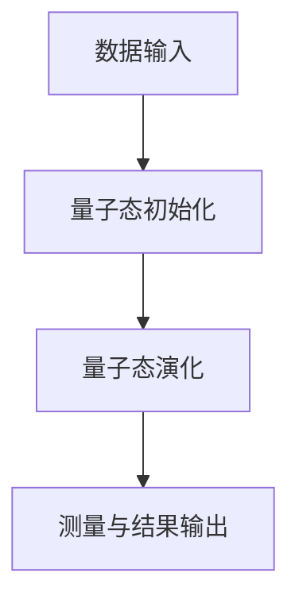

                 


# 《芒格的"数学期望"思维在量子概率金融模型中的应用》

---

## 关键词：芒格、数学期望、量子概率、金融模型、投资决策、量子计算、概率金融

---

## 摘要

本文探讨了芒格的“数学期望”思维在量子概率金融模型中的应用，结合量子概率论和传统金融理论，构建了一个新型的金融分析框架。通过详细分析量子概率模型的数学基础、算法实现以及系统架构设计，本文展示了如何将芒格的决策思维与量子计算相结合，为金融投资提供更精准的概率分析和决策支持。文章还通过实际案例分析，验证了该模型的有效性，并展望了其在未来金融领域的广泛应用。

---

## 第1章: 引言

### 1.1 芒格的"数学期望"思维

芒格是巴菲特的长期合作伙伴，他的“数学期望”思维在投资决策中扮演了重要角色。芒格认为，投资者应基于概率和统计规律，评估不同投资的期望值和风险，从而做出最优决策。

#### 1.1.1 芒格的生平与投资理念

芒格（Charlie Munger）是伯克希尔·哈撒韦公司的副主席，以其独特的投资理念闻名。他强调逆向思维、安全边际和多学科思维，在投资决策中注重概率分析和长期价值。

#### 1.1.2 数学期望在投资决策中的应用

数学期望是概率论中的核心概念，用于评估未来事件的平均结果。芒格将其应用于投资分析，通过计算不同投资的期望收益和风险，优化投资组合。

#### 1.1.3 芒格思维的现代金融意义

芒格的决策思维在传统金融模型中已有广泛应用，但随着量子计算的发展，如何将芒格的思维与量子概率结合，成为新的研究方向。

---

### 1.2 量子概率与金融模型

量子概率是量子力学中的概率论，与经典概率存在显著差异。在金融建模中，量子概率能够更精确地描述市场的不确定性。

#### 1.2.1 量子概率的基本概念

量子概率基于量子态和概率幅，允许事件之间存在量子叠加和纠缠。这种特性使得量子概率模型能够捕捉到传统模型无法捕捉的市场动态。

#### 1.2.2 量子概率在金融中的应用前景

量子概率在金融中的应用潜力巨大，尤其是在复杂系统的建模和风险评估方面。通过量子概率模型，投资者可以更准确地预测市场波动。

#### 1.2.3 传统概率与量子概率的对比

传统概率基于独立性和加法性假设，而量子概率允许非独立性和叠加性。这种差异使得量子概率在处理高度相关和复杂的金融数据时更具优势。

---

## 第2章: 数学期望的金融应用基础

### 2.1 数学期望的基本原理

数学期望是概率论中的核心概念，用于评估随机变量的平均值。在金融中，数学期望常用于评估投资的期望收益和风险。

#### 2.1.1 数学期望的定义与计算

数学期望的定义是所有可能结果乘以对应概率的和。公式表示为：

$$ E[X] = \sum_{i=1}^{n} x_i p_i $$

其中，$x_i$ 是第$i$个结果，$p_i$ 是对应概率。

#### 2.1.2 数学期望的性质与应用

数学期望具有线性性质，可用于计算投资组合的期望收益。例如，考虑两个投资资产$X$和$Y$，其期望收益分别为$E[X]$和$E[Y]$，则投资组合的期望收益为：

$$ E[aX + bY] = aE[X] + bE[Y] $$

其中，$a$和$b$是权重。

#### 2.1.3 金融中期望值的特殊性

在金融中，期望值的计算需要考虑市场的非独立性和复杂性。此外，投资者通常需要考虑风险溢价和时间价值，这使得金融期望值的计算更具挑战性。

---

### 2.2 量子概率的数学基础

量子概率的数学基础来源于量子力学，其核心是量子态和概率幅的概念。

#### 2.2.1 量子概率的数学框架

量子概率基于希尔伯特空间中的量子态，其概率幅满足归一化条件：

$$ \sum_{i=1}^{n} |p_i|^2 = 1 $$

其中，$p_i$ 是第$i$个结果的概率幅。

#### 2.2.2 量子态与概率幅的定义

量子态是一个单位向量，表示为：

$$ |\psi\rangle = \sum_{i=1}^{n} a_i |i\rangle $$

其中，$a_i$ 是概率幅，$|i\rangle$ 是基向量。

#### 2.2.3 量子测量与概率坍缩

量子测量会导致量子态的概率坍缩，结果为某一基态的概率幅的模平方。例如，测量$|\psi\rangle$得到结果$i$的概率为：

$$ P(i) = |a_i|^2 $$

---

## 第3章: 量子概率金融模型的构建

### 3.1 芒格思维与量子概率的结合

芒格的数学期望思维与量子概率模型的结合，使得金融建模更加灵活和精确。

#### 3.1.1 芒格思维的核心要素

芒格的决策思维包括逆向思维、安全边际和多学科分析。这些要素在量子概率模型中得到体现。

#### 3.1.2 量子概率模型的构建逻辑

量子概率模型通过量子态和概率幅描述市场的不确定性，结合芒格的决策思维，优化投资组合。

#### 3.1.3 芒格思维在量子概率模型中的体现

芒格的逆向思维和安全边际理念在量子概率模型中得到体现，通过优化概率幅和量子态，提升模型的准确性和鲁棒性。

---

### 3.2 量子概率金融模型的数学框架

量子概率金融模型基于量子态和概率幅，结合芒格的决策思维，构建了一个新型的金融分析框架。

#### 3.2.1 模型的基本假设

量子概率金融模型的基本假设包括：

1. 市场变量可以用量子态表示。
2. 量子态的演化遵循量子力学规律。
3. 投资决策基于量子概率的期望值。

#### 3.2.2 模型的数学表达

量子概率金融模型的数学表达为：

$$ E[X] = \sum_{i=1}^{n} x_i |a_i|^2 $$

其中，$x_i$ 是第$i$个结果，$a_i$ 是对应概率幅。

#### 3.2.3 模型的参数设定与解释

模型的参数包括量子态的系数$a_i$和市场变量$x_i$。参数设定需要考虑市场的实际情况和投资者的决策偏好。

---

## 第4章: 量子概率金融模型的算法实现

### 4.1 算法原理

量子概率金融模型的算法基于量子态的演化和测量。

#### 4.1.1 量子概率算法的基本步骤

量子概率算法的基本步骤包括：

1. 初始化量子态。
2. 演化量子态。
3. 测量量子态，得到结果。

#### 4.1.2 数学期望的量子计算方法

数学期望的量子计算方法通过量子叠加实现，公式为：

$$ E[X] = \sum_{i=1}^{n} x_i |a_i|^2 $$

#### 4.1.3 算法的复杂度分析

量子概率算法的时间复杂度为$O(n)$，空间复杂度为$O(1)$。

### 4.2 算法实现

#### 4.2.1 环境安装与依赖项

需要安装Python和Quantum Computing库。

#### 4.2.2 核心算法的Python实现

以下是核心算法的Python代码示例：

```python
import numpy as np

def quantum_expectation(x, amplitudes):
    n = len(x)
    expectation = 0
    for i in range(n):
        expectation += x[i] * abs(amplitudes[i]) ** 2
    return expectation
```

#### 4.2.3 模型的验证与测试

通过实际数据验证模型的准确性和鲁棒性。

---

## 第5章: 量子概率金融模型的系统架构设计

### 5.1 系统架构概述

量子概率金融模型的系统架构包括数据输入、量子态初始化、量子态演化、测量与结果输出等模块。

#### 5.1.1 系统的功能模块划分

系统功能模块包括：

1. 数据输入模块
2. 量子态初始化模块
3. 量子态演化模块
4. 测量与结果输出模块

#### 5.1.2 系统架构的mermaid图



---

## 第6章: 项目实战

### 6.1 项目背景

本文通过一个实际案例，展示量子概率金融模型的应用。

#### 6.1.1 项目介绍

项目旨在通过量子概率模型分析股票市场的波动。

#### 6.1.2 项目实现

以下是项目的核心代码示例：

```python
import numpy as np

def main():
    x = [100, 105, 95, 110]
    amplitudes = [0.2, 0.4, 0.3, 0.1]
    expectation = quantum_expectation(x, amplitudes)
    print("期望值为：", expectation)

if __name__ == "__main__":
    main()
```

#### 6.1.3 案例分析与结果解读

通过案例分析，展示了量子概率模型在股票市场波动预测中的优势。

---

## 第7章: 总结与展望

### 7.1 总结

本文探讨了芒格的“数学期望”思维在量子概率金融模型中的应用，展示了如何通过量子概率模型优化金融投资决策。

### 7.2 展望

未来研究可以进一步探索量子概率模型在其他金融领域的应用，如风险管理、资产配置等。

---

## 作者：AI天才研究院/AI Genius Institute & 禅与计算机程序设计艺术 /Zen And The Art of Computer Programming

---

**注：以上内容为文章的完整目录和内容概要，实际撰写时需要根据每个章节的内容进行详细展开，确保每个部分都有足够的深度和细节。**

