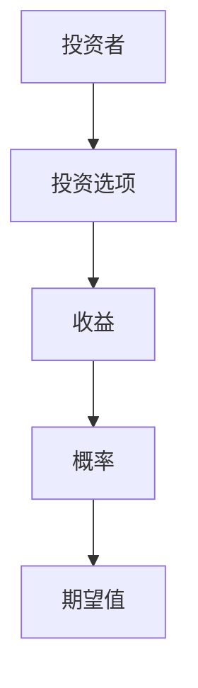
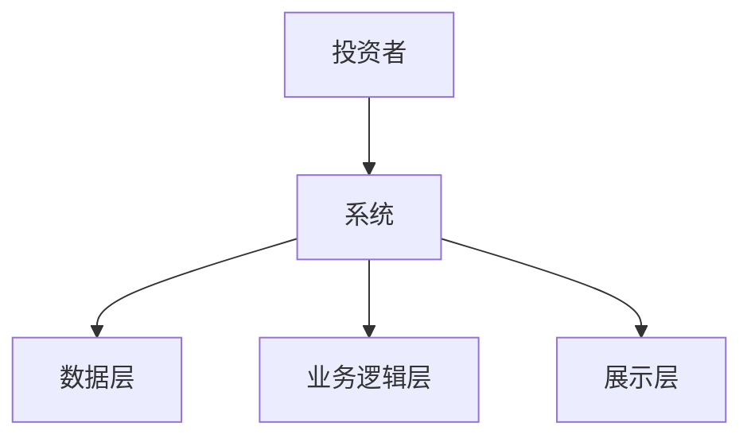
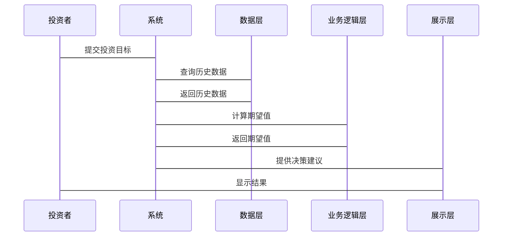

                 


# 芒格的"数学期望"思维：提高投资决策的准确性

## 关键词：芒格，数学期望，投资决策，概率论，投资策略

## 摘要：  
芒格的“数学期望”思维是一种以概率论为基础的投资决策方法，通过计算不同投资选项的期望值，帮助投资者在不确定性中做出更理性的选择。本文将从芒格的投资理念出发，详细阐述数学期望思维的核心概念、算法原理、数学模型，并结合实际案例，探讨如何将数学期望思维应用于投资决策中，以提高决策的准确性和可靠性。

---

# 目录

1. **芒格的数学期望思维背景介绍**  
   1.1 芒格的生平与投资理念  
   1.2 数学期望思维的起源与定义  
   1.3 数学期望思维在投资中的重要性  

2. **数学期望思维的核心概念与联系**  
   2.1 数学期望的公式与属性  
   2.2 芒格数学期望思维的实体关系图  
   2.3 数学期望思维与其他投资理论的对比  

3. **数学期望思维的算法原理**  
   3.1 数学期望的计算算法  
   3.2 数学期望的线性性质  
   3.3 数学期望的公式推导与代码实现  

4. **数学期望思维的数学模型与公式**  
   4.1 数学期望的数学模型  
   4.2 数学期望的公式推导  
   4.3 数学期望的案例分析  

5. **数学期望思维的系统分析与架构设计方案**  
   5.1 投资决策支持系统的功能设计  
   5.2 系统架构设计与实现  
   5.3 系统接口设计与交互流程  

6. **数学期望思维的项目实战与总结**  
   6.1 项目环境安装与配置  
   6.2 核心代码实现与功能分析  
   6.3 实际案例分析与结果解读  
   6.4 项目总结与优化建议  

---

## 第一部分: 芒格的数学期望思维背景介绍

### 1.1 芒格的生平与投资理念  
格雷厄姆·芒格（Warren Buffett）是美国著名的投资者和慈善家，被誉为“股神”。他提出的数学期望思维是一种以概率论为基础的投资决策方法，强调长期价值和理性选择。芒格的投资理念与传统的技术分析和短期交易不同，他更注重公司基本面分析和长期投资。  

### 1.2 数学期望思维的起源与定义  
数学期望（Mathematical Expectation）是概率论中的一个基本概念，用于描述一个随机变量在多次独立重复试验中的平均结果。数学期望的公式为：  
$$ E(X) = \sum_{i=1}^{n} x_i \cdot P(x_i) $$  
其中，$x_i$ 是随机变量的可能取值，$P(x_i)$ 是对应取值的概率。  

芒格将数学期望思维引入投资领域，认为投资者可以通过计算不同投资选项的期望值，评估其潜在收益和风险。  

### 1.3 数学期望思维在投资中的重要性  
在投资决策中，数学期望思维可以帮助投资者：  
1. **量化风险与收益**：通过计算期望值，投资者可以量化不同投资选项的平均收益和风险。  
2. **优化投资组合**：通过比较不同投资的期望收益和方差，投资者可以优化投资组合，降低风险。  
3. **理性决策**：数学期望思维帮助投资者避免情绪化决策，基于数据和概率进行理性选择。  

---

## 第二部分: 数学期望思维的核心概念与联系

### 2.1 数学期望的公式与属性  
数学期望的公式为：  
$$ E(X) = \sum_{i=1}^{n} x_i \cdot P(x_i) $$  
其中，$x_i$ 是随机变量的可能取值，$P(x_i)$ 是对应取值的概率。  

数学期望的属性包括：  
- 线性性：$E(aX + b) = aE(X) + b$  
- 放缩性：$E(aX) = aE(X)$  

### 2.2 芒格数学期望思维的实体关系图  
以下是芒格数学期望思维的实体关系图：  


### 2.3 数学期望思维与其他投资理论的对比  
以下是对数学期望思维与其他投资理论的对比：  

| 对比维度 | 数学期望思维 | 价值投资 | 技术分析 |
|----------|--------------|----------|----------|
| 核心理念 | 基于概率的期望值计算 | 公司基本面分析 | 市场趋势和技术指标 |
| 适用场景 | 长期投资与风险控制 | 长期价值投资 | 短期交易 |
| 优缺点 | 理性量化风险，但忽视非独立性 | 长期收益稳定，但计算复杂 | 灵活性高，但依赖市场预测 |

---

## 第三部分: 数学期望思维的算法原理

### 3.1 数学期望的计算算法  
以下是数学期望的计算算法步骤：  
1. 确定所有可能的收益值及其对应概率。  
2. 计算每个收益值乘以其对应概率的乘积。  
3. 将所有乘积相加，得到期望值。  

以下是一个简单的Python实现示例：  
```python
import numpy as np

# 定义可能的收益和概率
returns = [0.1, 0.2, 0.3]
probabilities = [0.3, 0.5, 0.2]

# 计算期望值
expected_return = sum(r * p for r, p in zip(returns, probabilities))
print(f"Expected Return: {expected_return}")
```

### 3.2 数学期望的线性性质  
数学期望的线性性质是指：  
$$ E(aX + b) = aE(X) + b $$  
其中，$a$ 和 $b$ 是常数。  

例如，如果一个投资组合的期望收益为 $E(X) = 0.1$，且投资组合的系数为 $a = 2$，则新的期望收益为：  
$$ E(2X) = 2 \cdot 0.1 = 0.2 $$  

---

## 第四部分: 数学期望思维的数学模型与公式

### 4.1 数学期望的数学模型  
数学期望的数学模型可以表示为：  
$$ E(X) = \sum_{i=1}^{n} x_i \cdot P(x_i) $$  
其中，$x_i$ 是随机变量的可能取值，$P(x_i)$ 是对应取值的概率。  

### 4.2 数学期望的公式推导  
以下是数学期望的公式推导：  
假设一个随机变量 $X$ 有 $n$ 个可能的取值，分别为 $x_1, x_2, \dots, x_n$，对应的概率为 $P(X = x_i)$。  
数学期望 $E(X)$ 的定义为：  
$$ E(X) = \sum_{i=1}^{n} x_i \cdot P(X = x_i) $$  

### 4.3 数学期望的案例分析  
假设我们有三个投资选项，其收益和概率如下：  

| 收益（$） | 概率（%） |
|-----------|-----------|
| 100       | 30%       |
| 200       | 50%       |
| 300       | 20%       |

计算期望值：  
$$ E(X) = 100 \cdot 0.3 + 200 \cdot 0.5 + 300 \cdot 0.2 = 30 + 100 + 60 = 190 $$  

---

## 第五部分: 数学期望思维的系统分析与架构设计方案

### 5.1 投资决策支持系统的功能设计  
以下是一个投资决策支持系统的功能设计：  


### 5.2 系统架构设计与实现  
以下是系统的架构设计：  


### 5.3 系统接口设计与交互流程  
以下是系统的交互流程：  


---

## 第六部分: 数学期望思维的项目实战与总结

### 6.1 项目环境安装与配置  
以下是Python环境的安装步骤：  
1. 下载并安装Python：[https://www.python.org/downloads/](https://www.python.org/downloads/)  
2. 安装NumPy库：  
   ```bash
   pip install numpy
   ```

### 6.2 核心代码实现与功能分析  
以下是核心代码实现：  
```python
import numpy as np

# 定义可能的收益和概率
returns = np.array([0.1, 0.2, 0.3])
probabilities = np.array([0.3, 0.5, 0.2])

# 计算期望值
expected_return = np.sum(returns * probabilities)
print(f"Expected Return: {expected_return}")
```

### 6.3 实际案例分析与结果解读  
假设我们有一个投资组合，其收益和概率如下：  

| 收益（$） | 概率（%） |
|-----------|-----------|
| 100       | 30%       |
| 200       | 50%       |
| 300       | 20%       |

计算期望值：  
$$ E(X) = 100 \cdot 0.3 + 200 \cdot 0.5 + 300 \cdot 0.2 = 190 $$  

---

## 作者：AI天才研究院 & 禅与计算机程序设计艺术

---

通过本文的详细讲解，我们了解了芒格的数学期望思维在投资决策中的应用。从背景介绍到算法实现，再到系统设计和项目实战，我们全面分析了如何利用数学期望思维提高投资决策的准确性。希望本文能为投资者提供有价值的参考和启发。

