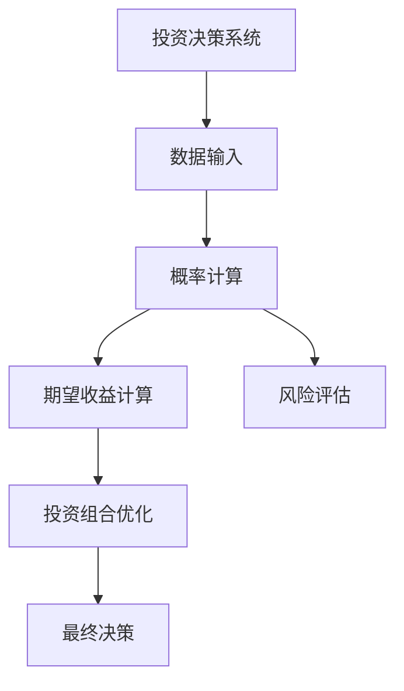

                 


# 芒格的"数学期望"思维：提高投资决策质量

> 关键词：芒格，数学期望，投资决策，风险管理，投资组合优化，概率论，决策模型

> 摘要：本文深入探讨了芒格如何运用数学期望思维来优化投资决策。通过分析数学期望的基本概念、芒格的决策模型、投资组合优化以及风险管理，本文为投资者提供了一种基于概率论的科学投资方法，帮助他们在复杂多变的市场中做出更明智的决策。

---

## 第一章：芒格与数学期望思维的背景介绍

### 1.1 芒格的生平与投资理念

查理·芒格（Charlie Munger）是伯克希尔·哈撒韦公司（Berkshire Hathaway）的副主席，被誉为“巴菲特的导师”。芒格的投资理念以价值投资为核心，强调安全边际和长期主义。他善于从跨学科的角度分析问题，尤其注重心理学和经济学的结合。

### 1.2 数学期望的基本概念

数学期望是概率论中的核心概念，用于预测未来事件的平均结果。公式为：

$$E[X] = \sum_{i=1}^{n} P_i \cdot X_i$$

其中，$P_i$ 是事件 $i$ 的概率，$X_i$ 是事件 $i$ 的结果。

### 1.3 芒格与“数学期望”思维的关联

芒格将数学期望应用于投资决策，认为通过分析概率和结果，投资者可以更理性地做出选择。他强调避免“情绪化”决策，而是基于数据和概率进行判断。

---

## 第二章：数学期望的原理与计算方法

### 2.1 数学期望的原理

数学期望反映了所有可能结果的加权平均值，帮助我们理解事件的长期平均表现。例如，掷一枚公平的骰子，期望值为3.5。

### 2.2 投资决策中的数学期望

在投资中，数学期望用于评估项目的预期收益。例如，投资A的期望收益为10%，而投资B的期望收益为12%，但B的风险更高。投资者需要在期望收益和风险之间权衡。

---

## 第三章：芒格的决策模型与数学期望

### 3.1 芒格的决策模型

芒格的决策模型基于概率和价值评估，分为以下几个步骤：

1. **识别机会**：寻找具有安全边际的投资标的。
2. **分析概率**：评估成功的概率。
3. **计算期望收益**：结合概率和收益，计算期望值。
4. **比较选项**：选择期望收益最高的投资。

### 3.2 投资决策中的数学期望模型

使用数学期望模型评估投资项目时，需要考虑所有可能的结果及其概率。例如：

- 投资A：50%概率获得20%收益，50%概率亏损5%。
- 期望收益为：$0.5 \times 0.2 + 0.5 \times (-0.05) = 0.075$，即7.5%。

---

## 第四章：数学期望与投资组合优化

### 4.1 投资组合优化的基本原理

投资组合优化的目标是最大化期望收益，同时最小化风险。常用方法是均值-方差优化，公式如下：

$$\text{Minimize } \sigma^2 \text{ subject to } E[R] \geq R_{\text{target}}$$

其中，$\sigma^2$ 是投资组合的方差，$E[R]$ 是期望收益。

### 4.2 芒格的数学期望优化方法

芒格强调分散投资以降低风险。通过计算不同资产的期望收益和方差，构建最优投资组合。例如，投资股票和债券的组合，可以在期望收益和风险之间找到平衡。

---

## 第五章：数学期望与风险管理

### 5.1 风险管理的基本概念

风险是投资结果的不确定性，数学期望可以帮助评估潜在损失。例如，投资组合的期望损失可以通过概率分布计算。

### 5.2 芒格的风险管理策略

芒格通过分析极端情况（如经济衰退）来评估风险，并调整投资组合以应对潜在损失。他强调保守估计概率和结果，避免过度乐观。

---

## 第六章：系统分析与架构设计

### 6.1 投资决策系统的架构图

以下是一个投资决策系统的架构图：



### 6.2 投资组合优化的代码实现

以下是一个简单的投资组合优化的Python代码示例：

```python
import numpy as np
import pandas as pd
from scipy.optimize import minimize

# 假设投资组合的期望收益和协方差矩阵
returns = pd.Series([0.1, 0.15, 0.08], index=['股票', '债券', '现金'])
covariance_matrix = pd.DataFrame({
    '股票': [0.04, 0, 0],
    '债券': [0, 0.02, 0],
    '现金': [0, 0, 0]
})

def portfolio_variance(weights, covariance_matrix):
    return (weights.T @ covariance_matrix @ weights).item()

# 约束条件：权重之和为1
constraints = [{'type': 'eq', 'fun': lambda w: sum(w) - 1}]

# 优化目标：最小化方差
result = minimize(portfolio_variance, 
                 x0=[1/3, 1/3, 1/3], 
                 args=(covariance_matrix,),
                 constraints=constraints)

print("最优权重：", result.x)
print("最小方差：", result.fun)
```

---

## 第七章：实战案例分析

### 7.1 案例背景

假设我们有三个投资选项：股票、债券和现金。股票的期望收益为15%，债券为10%，现金为5%。股票和债券的风险较高，而现金几乎没有风险。

### 7.2 数学期望计算

计算每个资产的期望收益：

- 股票：$E[R] = 0.15$
- 债券：$E[R] = 0.10$
- 现金：$E[R] = 0.05$

### 7.3 投资组合优化

假设我们投资60%股票，30%债券，10%现金。计算期望收益：

$$E[R] = 0.6 \times 0.15 + 0.3 \times 0.10 + 0.1 \times 0.05 = 0.105$$

即10.5%的期望收益。

---

## 第八章：总结与最佳实践

### 8.1 总结

芒格通过数学期望思维，帮助投资者在复杂市场中做出更理性的决策。他强调概率分析和风险控制，避免情绪化投资。

### 8.2 最佳实践

1. **持续学习**：关注市场变化，更新概率模型。
2. **分散投资**：降低单一资产的风险。
3. **保守估计**：避免过度乐观的期望收益。

### 8.3 注意事项

- 数学期望是基于假设的，实际结果可能不同。
- 风险管理是投资成功的关键。

### 8.4 拓展阅读

- 《投资学原理》
- 《概率论与随机过程》

---

## 作者

作者：AI天才研究院/AI Genius Institute & 禅与计算机程序设计艺术 /Zen And The Art of Computer Programming

---

通过本文，读者可以深入了解芒格的数学期望思维，并将其应用于实际投资决策中，提升投资的科学性和效率。

