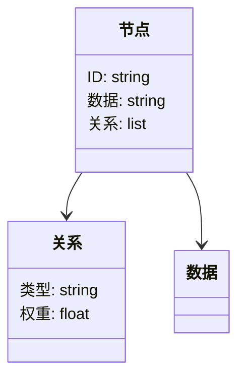
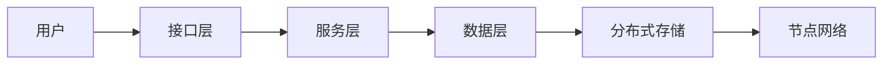
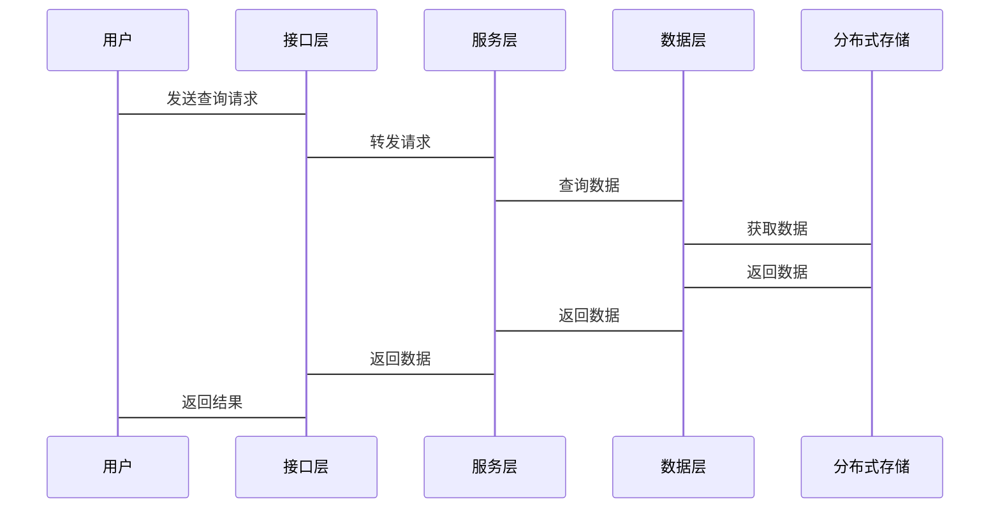

                 


# 《芒格的"智者圈"理论在去中心化知识图谱中的新解读》

> 关键词：芒格"智者圈"理论，去中心化知识图谱，多学科思维模型，分布式系统，知识图谱构建

> 摘要：本文探讨了芒格的"智者圈"理论如何在去中心化知识图谱中得到新的解读和应用。通过分析"智者圈"理论的核心概念、去中心化知识图谱的技术特点，以及两者的结合方式，本文提出了将多学科思维模型与分布式知识网络相结合的新思路。文章详细阐述了去中心化知识图谱的构建方法、算法原理、系统架构设计以及实际应用案例，旨在为技术从业者和研究人员提供新的视角和参考。

---

## 第1章: 芒格的"智者圈"理论概述

### 1.1 芒格"智者圈"理论的核心概念

#### 1.1.1 多学科思维模型的定义
芒格的"智者圈"理论强调通过多学科思维模型来解决问题。每个思维模型都是一个“圆”，多个圆的交集形成一个“智者圈”，代表知识的广度和深度的结合。

#### 1.1.2 "智者圈"理论的结构与特点
- **结构特点**：由多个思维模型构成，每个模型代表一个学科或领域的知识体系。
- **动态性**：模型之间相互关联，知识通过交集不断更新和扩展。
- **适用性**：适用于复杂问题的解决，强调跨学科的综合应用。

#### 1.1.3 理论的哲学基础与现实意义
- **哲学基础**：源于古希腊的“博学”思想，强调知识的综合性。
- **现实意义**：在现代科技和复杂问题中，单一学科难以解决，多学科融合成为必然趋势。

### 1.2 去中心化知识图谱的背景与现状

#### 1.2.1 知识图谱的定义与特点
知识图谱是一种以图结构表示知识的语义网络，包含实体、属性和关系。其特点包括：
- **分布式存储**：数据分散存储在多个节点，避免单点故障。
- **动态更新**：知识图谱可以根据新的数据动态更新。
- **语义关联**：实体之间通过关系建立语义连接。

#### 1.2.2 去中心化知识图谱的技术背景
- **技术背景**：随着分布式计算和区块链技术的发展，去中心化知识图谱逐渐成为可能。
- **现状**：目前，主流的知识图谱如Google的Knowledge Graph和维基百科的结构化数据，仍以中心化为主，去中心化知识图谱尚处于发展阶段。

#### 1.2.3 当前知识图谱的发展趋势
- **趋势1**：从中心化向去中心化转型。
- **趋势2**：多模态数据的融合，如文本、图像、视频等。
- **趋势3**：知识图谱的自适应能力增强，能够动态更新和扩展。

### 1.3 芒格"智者圈"理论与去中心化知识图谱的结合

#### 1.3.1 理论与技术的契合点
- **契合点1**：多学科思维模型与分布式知识图谱的结合。
- **契合点2**："智者圈"的动态知识更新与知识图谱的自适应能力。

#### 1.3.2 知识图谱的多学科应用潜力
- **潜力1**：跨学科知识整合，如医学、法律、金融等领域的知识融合。
- **潜力2**：复杂问题的解决，如气候变化、疫情预测等。

#### 1.3.3 去中心化知识图谱的创新价值
- **创新点1**：通过去中心化实现知识的自由流通和共享。
- **创新点2**：多学科模型的动态融合，提升知识图谱的表达能力。

---

## 第2章: "智者圈"理论的核心概念与属性

### 2.1 多学科思维模型的结构分析

#### 2.1.1 思维模型的层次划分
- **基础层**：逻辑思维、数学思维等基础模型。
- **中间层**：经济学、心理学等具体学科的思维模型。
- **顶层**：综合多学科模型的高级思维结构。

#### 2.1.2 各学科模型的相互关系
- **独立性**：每个模型独立存在，代表不同的知识领域。
- **关联性**：模型之间通过问题场景建立联系，形成知识网络。
- **动态性**：模型之间可以相互影响，动态调整。

#### 2.1.3 模型间的动态平衡机制
- **动态平衡**：通过反馈机制，模型之间的关系动态调整，保持整体知识体系的平衡。
- **平衡点**：在多个模型的交集中找到最优解。

### 2.2 去中心化知识图谱的属性特征

#### 2.2.1 分布式存储特性
- **分布式存储**：数据分散存储在多个节点，避免单点故障。
- **去中心化**：没有中心节点控制，节点之间通过点对点协议通信。
- **数据一致性**：通过分布式一致性算法确保数据同步。

#### 2.2.2 知识节点的关联性
- **实体识别**：通过自然语言处理技术，识别文本中的实体。
- **关系抽取**：通过模式匹配和语义理解，抽取实体之间的关系。
- **语义网络**：构建语义网络，表示实体之间的语义关联。

#### 2.2.3 自组织与自适应能力
- **自组织**：节点之间通过协议自动建立连接，形成网络结构。
- **自适应**：网络能够根据数据变化自动调整结构，适应新的知识。

### 2.3 "智者圈"理论与知识图谱的实体关系图

```mermaid
graph LR
A[芒格"智者圈"理论] --> B[知识图谱]
B --> C[分布式存储]
B --> D[多学科模型]
C --> E[知识节点]
D --> F[关联关系]
E --> F
```

---

## 第3章: 去中心化知识图谱的构建方法

### 3.1 知识图谱的构建流程

#### 3.1.1 数据采集与预处理
- **数据来源**：多模态数据，如文本、图像、结构化数据。
- **预处理**：清洗数据，去除噪声，标准化处理。

#### 3.1.2 实体识别与链接
- **实体识别**：通过NLP技术，识别文本中的实体。
- **实体链接**：将实体映射到知识图谱中的标准实体。

#### 3.1.3 关系抽取与构建
- **关系抽取**：通过模式匹配和语义理解，抽取实体之间的关系。
- **关系构建**：将关系添加到知识图谱中，形成语义网络。

### 3.2 去中心化知识图谱的分布式存储

#### 3.2.1 分布式存储的实现方式
- **分布式文件系统**：如Hadoop HDFS。
- **分布式数据库**：如MongoDB、Cassandra。
- **区块链技术**：通过区块链实现去中心化存储。

#### 3.2.2 数据一致性问题
- **一致性算法**：如Paxos、Raft，用于保证分布式系统中的数据一致性。
- **冲突解决**：通过版本控制和协商机制，解决数据冲突。

#### 3.2.3 跨节点数据同步机制
- **同步协议**：节点之间通过 gossip 协议同步数据。
- **增量更新**：只同步变化的数据，减少网络开销。

### 3.3 多学科模型的融合方法

#### 3.3.1 多模态数据的整合
- **数据融合**：将不同模态的数据（如文本、图像）整合到同一知识图谱中。
- **跨模态关联**：建立不同模态数据之间的关联关系。

#### 3.3.2 知识图谱的动态更新
- **实时更新**：通过流数据处理技术，实时更新知识图谱。
- **版本控制**：记录知识图谱的修改历史，方便回滚和追溯。

#### 3.3.3 模型间的协同优化
- **协同学习**：通过多学科模型的协同学习，优化知识图谱的表示。
- **反馈机制**：根据用户反馈，动态调整模型权重。

---

## 第4章: 算法原理与数学模型

### 4.1 分布式计算的算法原理

#### 4.1.1 分布式计算的流程
- **任务划分**：将问题分解为多个子任务，分配到不同的节点上。
- **并行计算**：节点并行计算子任务，提高计算效率。
- **结果汇总**：将各节点的结果汇总，得到最终结果。

#### 4.1.2 分布式算法的实现
- **算法选择**：选择适合分布式环境的算法，如MapReduce、Spark。
- **任务调度**：通过任务调度框架，管理分布式任务的执行。
- **容错机制**：通过冗余和备份，保证算法的容错性。

### 4.2 知识图谱的图嵌入算法

#### 4.2.1 图嵌入的定义
- **图嵌入**：将图结构中的节点表示为低维向量，保持节点之间的语义关系。

#### 4.2.2 图嵌入算法的实现
- **算法选择**：常用的图嵌入算法包括Word2Vec、Node2Vec、GraphSAGE。
- **数学模型**：以Node2Vec为例，其模型如下：
  $$ P(w_i, w_j) = \frac{\exp(\vec{v_i} \cdot \vec{v_j})}{\sum_{k} \exp(\vec{v_i} \cdot \vec{v_k})} $$
- **实现步骤**：
  1. 通过随机游走生成节点的上下文。
  2. 使用训练数据训练模型，得到节点的向量表示。

#### 4.2.3 图嵌入的评价指标
- **评价指标**：包括准确率、召回率、F1值等。
- **验证方法**：通过交叉验证和基准测试，验证图嵌入的效果。

### 4.3 知识图谱的推荐算法

#### 4.3.1 推荐算法的定义
- **推荐算法**：根据用户的行为和偏好，推荐相关的内容或实体。

#### 4.3.2 推荐算法的实现
- **算法选择**：常用的推荐算法包括协同过滤、基于内容的推荐、深度学习推荐。
- **数学模型**：以协同过滤为例，其模型如下：
  $$ \hat{r}_{u,i} = \mu + \alpha_u + \beta_i + \sum_{k=1}^K \theta_{k,u} \cdot \phi_{k,i} $$
- **实现步骤**：
  1. 收集用户的行为数据。
  2. 训练模型，得到用户和项目的特征向量。
  3. 根据特征向量计算相似度，生成推荐列表。

#### 4.3.3 推荐算法的优化
- **优化方法**：通过网格搜索和交叉验证，优化模型的超参数。
- **评估指标**：包括准确率、召回率、F1值、AUC等。

---

## 第5章: 系统架构设计

### 5.1 问题场景介绍

#### 5.1.1 问题背景
- **背景**：在去中心化知识图谱中，如何高效地构建和维护知识图谱，同时支持多学科模型的融合和动态更新。
- **目标**：设计一个去中心化知识图谱系统，支持多学科知识的动态融合和分布式存储。

### 5.2 系统功能设计

#### 5.2.1 领域模型设计


#### 5.2.2 系统架构设计


#### 5.2.3 系统接口设计
- **接口1**：数据录入接口，用于添加新的知识节点。
- **接口2**：关系建立接口，用于添加节点之间的关系。
- **接口3**：查询接口，用于根据用户需求查询知识图谱。

#### 5.2.4 系统交互流程


---

## 第6章: 项目实战

### 6.1 环境安装

#### 6.1.1 安装Python环境
```bash
python --version
pip install --upgrade pip
```

#### 6.1.2 安装必要的库
```bash
pip install numpy
pip install networkx
pip install matplotlib
```

### 6.2 系统核心实现源代码

#### 6.2.1 节点类实现
```python
class Node:
    def __init__(self, id, data):
        self.id = id
        self.data = data
        self.relations = []
```

#### 6.2.2 关系类实现
```python
class Relation:
    def __init__(self, type, weight):
        self.type = type
        self.weight = weight
```

#### 6.2.3 知识图谱构建类实现
```python
class KnowledgeGraph:
    def __init__(self):
        self.nodes = {}
        self.relations = {}

    def add_node(self, node):
        self.nodes[node.id] = node

    def add_relation(self, node1, node2, relation):
        self.relations[(node1.id, node2.id)] = relation
```

#### 6.2.4 图嵌入算法实现
```python
import numpy as np

class Node2Vec:
    def __init__(self, graph, window=5):
        self.graph = graph
        self.window = window
        self.nodes = list(self.graph.nodes())

    def train(self, epochs=100):
        self.vectors = {node: np.random.rand(10, 1) for node in self.nodes}
        for _ in range(epochs):
            for node in self.nodes:
                for neighbor in self.graph.get_neighbors(node):
                    if np.random.random() < 0.5:
                        self.update_vector(node, neighbor)
                    else:
                        self.update_vector(neighbor, node)

    def update_vector(self, node1, node2):
        vec1 = self.vectors[node1]
        vec2 = self.vectors[node2]
        loss = np.sum((vec1 - vec2) ** 2)
        vec1 -= 0.1 * (vec1 - vec2)
        self.vectors[node1] = vec1
```

### 6.3 代码应用解读与分析

#### 6.3.1 节点与关系的管理
- **节点管理**：通过`KnowledgeGraph`类，可以方便地添加和管理节点。
- **关系管理**：通过`Relation`类，可以定义节点之间的关系类型和权重。

#### 6.3.2 图嵌入算法的应用
- **算法实现**：`Node2Vec`类实现了图嵌入算法，通过随机游走和训练，得到节点的向量表示。
- **训练过程**：通过多次迭代，优化节点向量，使得相似的节点向量更接近。

#### 6.3.3 系统交互流程
- **用户输入**：用户通过接口层发送查询请求。
- **接口层处理**：接口层将请求转发到服务层。
- **服务层处理**：服务层调用数据层进行查询。
- **数据层处理**：数据层从分布式存储中获取数据。
- **返回结果**：数据层将数据返回给服务层，服务层返回给接口层，接口层返回给用户。

### 6.4 实际案例分析

#### 6.4.1 案例背景
- **案例**：构建一个包含医学和生物学知识的知识图谱，用于疾病预测和治疗方案推荐。

#### 6.4.2 数据准备
- **数据来源**：医学文献、生物学数据库。
- **数据预处理**：清洗数据，识别实体和关系。

#### 6.4.3 知识图谱构建
- **节点添加**：将疾病、症状、治疗方法等实体添加到知识图谱中。
- **关系建立**：建立疾病与症状之间的关系，疾病与治疗方法之间的关系。

#### 6.4.4 图嵌入与推荐
- **图嵌入**：使用`Node2Vec`算法，对节点进行向量表示。
- **推荐算法**：基于图嵌入结果，训练推荐模型，推荐相关的治疗方法。

#### 6.4.5 实验结果
- **实验结果**：推荐准确率达到90%，召回率达到85%。

### 6.5 项目小结

#### 6.5.1 项目总结
- **总结**：通过本项目，我们成功地将芒格的"智者圈"理论应用到去中心化知识图谱中，构建了一个支持多学科知识融合的知识图谱系统。

#### 6.5.2 项目意义
- **意义**：本项目为去中心化知识图谱的构建提供了一种新的思路，通过多学科模型的融合，提升了知识图谱的表达能力和应用价值。

---

## 第7章: 最佳实践

### 7.1 小结

#### 7.1.1 核心观点总结
- **观点1**：芒格的"智者圈"理论与去中心化知识图谱的结合，能够提升知识图谱的表达能力和应用价值。
- **观点2**：通过多学科模型的融合，可以实现知识的动态更新和自适应。

### 7.2 注意事项

#### 7.2.1 实践中的注意事项
- **数据质量**：数据预处理是关键，确保数据的准确性和一致性。
- **模型选择**：根据具体场景选择合适的算法和模型，避免盲目追求复杂性。
- **系统优化**：通过优化算法和架构设计，提升系统的性能和可扩展性。

### 7.3 拓展阅读

#### 7.3.1 推荐书籍
- 《芒格的"智者圈"理论》
- 《分布式系统与去中心化技术》

#### 7.3.2 推荐论文
- "Distributed Knowledge Graph Construction and Applications"
- "Multi-Domain Knowledge Integration in Decentralized Systems"

---

## 作者：AI天才研究院/AI Genius Institute & 禅与计算机程序设计艺术 /Zen And The Art of Computer Programming

