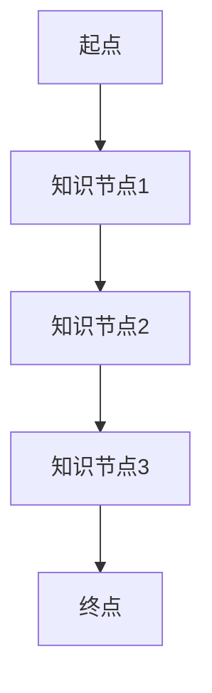

                 


# 芒格的"智者圈"理论在去中心化知识网络中的新解读

> 关键词：芒格，智者圈理论，去中心化知识网络，分布式系统，知识管理，算法原理

> 摘要：本文从芒格的“智者圈”理论出发，结合现代去中心化知识网络的技术背景，分析该理论在去中心化环境中的新应用。通过详细阐述理论的逻辑框架、算法实现、数学模型以及系统设计，本文旨在为去中心化知识管理提供一种新的思维方式，并通过实际案例展示其在区块链等技术中的潜在应用。

---

## 第一部分: 芒格的"智者圈"理论与去中心化知识网络的背景介绍

### 第1章: 芒格的"智者圈"理论概述

#### 1.1 "智者圈"理论的核心概念
- **理论的定义与核心要素**：芒格的“智者圈”理论强调在决策过程中，要充分考虑多个因素和观点，避免单一视角的局限性。其核心在于通过多维度的分析，构建一个全面的认知框架。
- **理论的哲学基础**：该理论源于芒格对人类认知局限性的深刻理解，强调通过多维度思考来减少认知偏差。
- **理论的现代应用领域**：广泛应用于投资决策、知识管理等领域，尤其适合需要复杂决策的场景。

#### 1.2 去中心化知识网络的定义与特点
- **知识网络的基本概念**：知识网络是将分散的知识点通过关联关系构建的网络结构，旨在通过节点之间的关系揭示知识的内在联系。
- **去中心化网络的特征**：与传统中心化网络不同，去中心化知识网络没有单一的控制中心，节点之间通过分布式协议进行通信和数据交换。
- **知识网络的构建与维护**：依赖于分布式算法和区块链技术，确保网络的安全性和高效性。

### 第2章: 芒格"智者圈"理论与去中心化知识网络的结合背景

#### 2.1 当代知识管理的挑战
- **知识碎片化的现状**：现代知识的分散存储和管理导致知识碎片化，难以形成系统的认知框架。
- **中心化知识管理的局限性**：传统知识管理系统依赖于中心化的存储和管理，容易成为单点故障，且难以扩展。
- **去中心化知识管理的必要性**：通过去中心化技术，可以实现知识的分布式存储和管理，提升系统的可靠性和安全性。

#### 2.2 去中心化技术的发展与应用
- **区块链技术的崛起**：区块链技术为去中心化知识网络提供了可靠的数据存储和传输机制。
- **分布式系统的优势**：分布式系统通过去中心化的架构，提升了系统的容错性和扩展性。
- **去中心化知识网络的潜力**：结合区块链和分布式技术，去中心化知识网络有望成为未来知识管理的重要方式。

### 第3章: "智者圈"理论在去中心化知识网络中的问题背景

#### 3.1 知识网络中的认知偏差问题
- **认知偏差的定义与分类**：认知偏差是指个体在信息处理过程中产生的系统性偏差，常见的有确认偏差、选择性偏见等。
- **知识网络中的认知偏差表现**：在去中心化知识网络中，节点之间的信息传递可能导致认知偏差的传播和放大。
- **认知偏差对知识网络的影响**：认知偏差可能导致知识网络的不准确性和片面性，影响网络的整体质量。

#### 3.2 去中心化知识网络中的信息孤岛问题
- **信息孤岛的定义与成因**：信息孤岛是指数据在不同系统或节点之间无法有效共享和集成的现象。
- **信息孤岛对知识网络的阻碍**：信息孤岛会导致知识网络的碎片化，降低网络的整体效率和价值。
- **解决信息孤岛的必要性**：通过去中心化技术和跨链通信，可以有效解决信息孤岛问题，提升知识网络的连通性和协同性。

---

## 第二部分: "智者圈"理论与去中心化知识网络的核心概念与联系

### 第4章: "智者圈"理论的核心原理

#### 4.1 "智者圈"理论的逻辑框架
- **理论的逻辑起点**：从多维度分析问题，构建全面的认知框架。
- **理论的推理过程**：通过不断扩展和交叉验证，确保认知的全面性和准确性。
- **理论的结论与应用**：将多维度分析结果综合，形成最终的决策或知识框架。

#### 4.2 "智者圈"理论与知识网络的关联
- **理论在知识网络中的适用性**：适用于去中心化知识网络中的多节点协作和知识整合。
- **理论对知识网络的影响**：通过多维度分析，提升知识网络的准确性和完整性。
- **理论在知识网络中的具体应用**：应用于去中心化知识网络的节点间信息共享和协同决策。

### 第5章: 去中心化知识网络的实体关系与流程图

#### 5.1 实体关系图（ER图）
- **知识节点的定义与属性**：知识节点是网络中的基本单元，具有标识符、内容、关联关系等属性。
- **知识边的定义与属性**：知识边表示节点之间的关联关系，具有权重、类型、方向等属性。
- **网络结构的层次划分**：知识网络分为基础层、关联层和应用层，每一层都有其特定的结构和功能。

#### 5.2 流程图（Mermaid）


---

## 第三部分: 去中心化知识网络的算法原理与数学模型

### 第6章: 算法原理讲解

#### 6.1 知识网络构建算法
- **算法的基本思想**：通过分布式协议和区块链技术，构建去中心化的知识网络。
- **算法的实现步骤**：
  1. 初始化网络节点。
  2. 通过共识算法（如PoW、PoS）建立节点间的信任关系。
  3. 知识节点通过关联关系构建知识网络。
  4. 通过智能合约实现知识的共享和协同。
- **算法的复杂度分析**：算法的时间复杂度和空间复杂度取决于网络规模和共识算法的选择。

#### 6.2 "智者圈"理论的算法实现
- **理论的算法化**：将“智者圈”理论转化为算法步骤，实现多维度分析和知识整合。
- **算法的优化与改进**：通过优化算法结构，提升计算效率和准确性。
- **算法的测试与验证**：通过实验验证算法的有效性和适用性。

### 第7章: 数学模型与公式

#### 7.1 知识网络的数学表示
- **知识网络的图论模型**：知识网络可以表示为一个有向图，节点代表知识单元，边代表关联关系。
- **知识网络的权重计算公式**：
  $$ weight(i,j) = \frac{count(i,j)}{max(count(i,j))} $$
  其中，$count(i,j)$表示节点$i$和$j$之间的关联次数，$max(count(i,j))$是关联次数的最大值。

#### 7.2 "智者圈"理论的数学模型
- **理论的多维度分析模型**：通过多个维度的分析，构建知识网络的多维表示。
- **理论的综合评价公式**：
  $$ score = \sum_{i=1}^{n} w_i \cdot f_i $$
  其中，$w_i$是第$i$个维度的权重，$f_i$是第$i$个维度的评估函数。

---

## 第四部分: 系统分析与架构设计方案

### 第8章: 系统分析与架构设计

#### 8.1 系统功能设计
- **领域模型设计（Mermaid类图）**：
  ```mermaid
  classDiagram
      class 知识节点 {
          id: string
          content: string
          relations: map
      }
      class 关系边 {
          source: 知识节点
          target: 知识节点
          weight: number
      }
      class 网络协议 {
          establishConnection()
          transferKnowledge()
      }
      知识节点 --> 关系边
      网络协议 --> 知识节点
  ```

- **系统架构设计（Mermaid架构图）**：
  ```mermaid
  architecture
      Client/前端 --> API Gateway
      API Gateway --> Knowledge Node
      Knowledge Node --> Blockchain
      Blockchain --> 共识节点
  ```

- **系统交互设计（Mermaid序列图）**：
  ```mermaid
  sequenceDiagram
      participant 客户端
      participant 网络协议
      participant 知识节点
      participant 区块链
      客户端 -> 网络协议: 请求知识
      网络协议 -> 知识节点: 获取知识
      知识节点 -> 区块链: 验证知识
      区块链 -> 网络协议: 返回验证结果
      网络协议 -> 客户端: 返回知识
  ```

---

## 第五部分: 项目实战

### 第9章: 项目实战

#### 9.1 环境安装与配置
- **区块链环境**：安装以太坊或EOS等区块链平台。
- **分布式系统环境**：安装Docker和Kubernetes等分布式系统工具。

#### 9.2 核心实现源代码
```python
class KnowledgeNode:
    def __init__(self, id):
        self.id = id
        self.content = ""
        self.relations = {}
    
    def add_relation(self, node, weight):
        self.relations[node.id] = weight

class RelationEdge:
    def __init__(self, source, target, weight):
        self.source = source
        self.target = target
        self.weight = weight

class KnowledgeNetwork:
    def __init__(self):
        self.nodes = {}
        self.edges = []
    
    def add_node(self, node):
        self.nodes[node.id] = node
    
    def add_edge(self, edge):
        self.edges.append(edge)

# 示例代码
node1 = KnowledgeNode("Node1")
node2 = KnowledgeNode("Node2")
edge = RelationEdge(node1, node2, 0.8)
network = KnowledgeNetwork()
network.add_node(node1)
network.add_node(node2)
network.add_edge(edge)
```

#### 9.3 代码解读与分析
- **代码功能解读**：上述代码定义了知识节点、关系边和知识网络类，展示了如何通过对象关系构建知识网络。
- **代码实现细节**：通过节点和边的关系，实现知识网络的构建和管理。

#### 9.4 实际案例分析
- **案例背景**：假设我们有一个去中心化的知识问答平台，每个问题和答案都是一个知识节点。
- **案例分析**：通过“智者圈”理论，平台可以整合多个节点的知识，形成完整的知识框架。
- **案例小结**：通过实际案例分析，展示了“智者圈”理论在去中心化知识网络中的具体应用。

---

## 第六部分: 总结与展望

### 第10章: 总结与展望

#### 10.1 最佳实践 tips
- **理论与实践结合**：在实际应用中，应结合具体场景，灵活运用“智者圈”理论。
- **技术与管理结合**：去中心化知识网络的成功依赖于技术与管理的双重优化。

#### 10.2 小结
- 本文从理论背景、算法实现、系统设计和项目实战四个方面，详细探讨了“智者圈”理论在去中心化知识网络中的新应用。
- 通过理论与实践的结合，展示了该理论在现代知识管理中的潜力和价值。

#### 10.3 注意事项
- 在实际应用中，应关注去中心化知识网络的安全性和隐私保护问题。
- 理论的应用需要结合具体场景，避免生搬硬套。

#### 10.4 拓展阅读
- 推荐阅读区块链和分布式系统相关的书籍，深入理解去中心化技术的核心原理。
- 关注最新的去中心化知识管理研究，保持对新技术的敏感性。

---

## 作者：AI天才研究院/AI Genius Institute & 禅与计算机程序设计艺术 /Zen And The Art of Computer Programming

