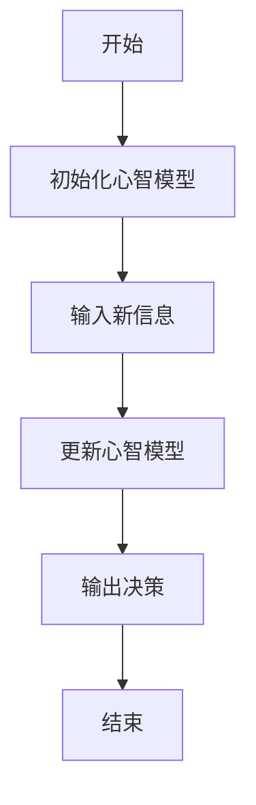
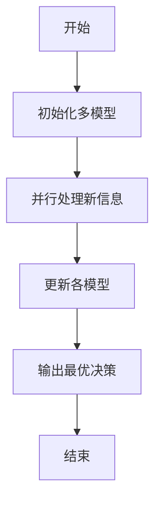
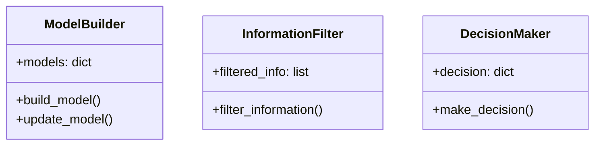
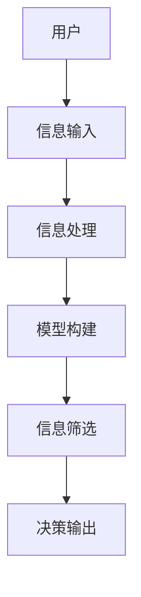
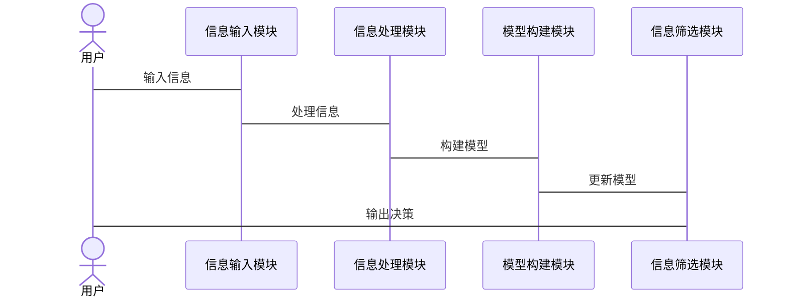

                 


# 芒格的"智者圈"理论在社交网络时代的新解读

---

## 关键词
芒格的"智者圈"理论, 心智模型, 多模型思维, 社交网络, 算法推荐, 认知偏见, 信息筛选

---

## 摘要
芒格的"智者圈"理论强调通过构建多个心智模型来优化决策。在社交网络时代，信息过载和算法推荐对心智模型的影响日益显著。本文从理论背景出发，分析社交网络对心智模型的挑战，探讨如何通过多模型思维优化信息筛选，并结合算法实现与系统设计，提出社交网络时代的心智模型重构策略。

---

# 第一部分: 芒格的"智者圈"理论基础

---

## 第1章: 芒格的"智者圈"理论概述

### 1.1 "智者圈"理论的定义与核心要素

#### 1.1.1 心智模型的定义
心智模型是人们对某一事物或系统的简化认知。每个心智模型都包含核心要素、关系和规则，帮助人们快速做出决策。

#### 1.1.2 "智者圈"理论的核心要素
- **核心要素**：知识、经验、逻辑推理能力。
- **关系**：心智模型通过相互关联形成知识网络。
- **规则**：信息处理和决策规则。

#### 1.1.3 心智模型的构建过程
1. **识别核心要素**：确定问题的关键因素。
2. **建立关系模型**：分析要素之间的关系。
3. **验证与调整**：通过反馈优化模型。

### 1.2 "智者圈"理论的演变与应用

#### 1.2.1 理论的起源与发展
芒格提出“智者圈”理论，强调通过多模型思维优化决策。理论最初应用于投资领域，后扩展到更广泛的应用场景。

#### 1.2.2 理论在投资领域的经典应用
芒格通过分析多个行业模型，识别投资机会，避免单一模型的局限性。

#### 1.2.3 理论的局限性与改进方向
- **局限性**：模型过于简化，难以捕捉复杂性。
- **改进方向**：结合实时数据和反馈优化模型。

### 1.3 社交网络时代的认知挑战

#### 1.3.1 信息过载与认知负荷
社交网络带来的海量信息增加了认知负荷，导致注意力分散。

#### 1.3.2 算法推荐的双刃剑效应
算法推荐优化信息筛选，但也可能强化认知偏见，限制视野。

#### 1.3.3 社交网络对心智模型的影响
社交网络中的信息碎片化和群体思维可能扭曲心智模型，导致决策偏差。

---

## 第2章: 心智模型与多模型思维

### 2.1 心智模型的构建原理

#### 2.1.1 心智模型的形成机制
心智模型通过不断接触和处理信息，逐步构建对世界的认知。

#### 2.1.2 多模型思维的核心概念
多模型思维强调通过多个模型互补，避免单一模型的局限性。

#### 2.1.3 心智模型的相互关联
心智模型通过相互关联形成知识网络，增强决策的全面性。

### 2.2 心智模型的特征对比

#### 2.2.1 不同心智模型的属性特征对比表

| 模型类型 | 核心要素 | 关系类型 | 决策规则 |
|----------|----------|----------|----------|
| 投资模型 | 财务指标 | 股价与利润关系 | 资本回报率 |
| 社交模型 | 用户行为 | 互动频率 | 用户增长 |

#### 2.2.2 心智模型的ER实体关系图

```mermaid
erd
actor心智模型
model{
  entity: 心智模型
  entity_属性: 核心要素、关系、规则
  entity_关系: 关联其他模型
}
```

### 2.3 心智模型的动态更新机制

#### 2.3.1 新信息的整合与旧模型的调整
1. 接收新信息，识别与现有模型的关联。
2. 调整模型参数，优化模型准确性。

#### 2.3.2 多模型思维下的决策优化
通过多模型的互补，提高决策的全面性和准确性。

#### 2.3.3 心智模型的可塑性与适应性
心智模型具有可塑性，能够根据新信息动态调整。

---

## 第3章: 社交网络时代的心智模型重构

### 3.1 社交网络对心智模型的影响

#### 3.1.1 信息碎片化对心智模型的冲击
信息碎片化导致心智模型的不完整，影响决策的准确性。

#### 3.1.2 算法推荐对心智模型的塑造
算法推荐优化信息筛选，但也可能强化认知偏见。

#### 3.1.3 社交网络中的群体思维与个体认知偏差
群体思维可能导致个体认知偏差，影响心智模型的多样性。

### 3.2 基于"智者圈"理论的社交网络分析

#### 3.2.1 社交网络中的信息过滤机制
1. 算法推荐：基于用户行为过滤信息。
2. 用户筛选：主动选择关注的信息源。

#### 3.2.2 群体心智模型的形成与传播
群体心智模型通过社交网络快速传播，影响个体认知。

#### 3.2.3 网络效应与心智模型的强化
网络效应导致某些信息被过度强化，影响心智模型的平衡性。

### 3.3 社交网络时代的心智模型优化策略

#### 3.3.1 提升信息筛选能力
1. 建立多元化的信息源。
2. 定期验证信息的准确性。

#### 3.3.2 建立多元化的知识体系
1. 学习不同领域的知识。
2. 建立多模型思维框架。

#### 3.3.3 避免认知偏见的策略
1. 保持开放心态，接受不同观点。
2. 定期反思，识别并纠正认知偏差。

---

## 第4章: "智者圈"理论的算法实现与优化

### 4.1 心智模型构建的算法原理

#### 4.1.1 心智模型的数学模型与公式

$$心智模型复杂度 = \sum_{i=1}^{n} \text{模型特征}_i$$

#### 4.1.2 多模型思维的算法流程图



### 4.2 基于社交网络的算法实现

#### 4.2.1 信息过滤算法

```python
def filter_information(information, model):
    filtered = []
    for info in information:
        if matches_model(info, model):
            filtered.append(info)
    return filtered
```

#### 4.2.2 心智模型更新算法

```python
def update_model(new_info, model):
    updated_model = model.copy()
    for key in new_info:
        updated_model[key] += new_info[key]
    return updated_model
```

### 4.3 算法优化策略

#### 4.3.1 动态调整模型权重

$$\text{权重调整} = \alpha \times \text{新信息权重} + (1 - \alpha) \times \text{旧权重}$$

#### 4.3.2 并行处理多模型更新



---

## 第5章: 系统分析与架构设计方案

### 5.1 项目介绍

#### 5.1.1 项目背景
开发一个基于“智者圈”理论的信息筛选平台，帮助用户优化信息筛选。

### 5.2 系统功能设计

#### 5.2.1 功能模块
1. 信息输入模块：接收用户输入。
2. 模型构建模块：构建并更新心智模型。
3. 信息筛选模块：基于模型筛选信息。

#### 5.2.2 系统功能设计类图



### 5.3 系统架构设计

#### 5.3.1 系统架构图



### 5.4 系统接口设计

#### 5.4.1 接口描述
1. 输入接口：接收用户输入信息。
2. 输出接口：输出筛选后的信息和决策结果。

#### 5.4.2 接口交互流程图



---

## 第6章: 项目实战

### 6.1 环境安装

```bash
pip install 必要的库
```

### 6.2 核心代码实现

#### 6.2.1 心智模型构建代码

```python
class MindModel:
    def __init__(self):
        self.models = {}

    def add_model(self, name, features):
        self.models[name] = features

    def update_model(self, name, new_features):
        self.models[name] = {**self.models[name], **new_features}
```

#### 6.2.2 信息筛选代码

```python
def filter_info(information, model):
    filtered = []
    for info in information:
        if matches_model(info, model):
            filtered.append(info)
    return filtered
```

### 6.3 代码应用解读与分析

#### 6.3.1 代码功能分析
1. 心智模型构建：动态更新模型。
2. 信息筛选：基于模型特征匹配信息。

### 6.4 实际案例分析

#### 6.4.1 案例背景
用户希望通过平台筛选投资相关信息。

#### 6.4.2 案例分析
1. 输入投资相关信息。
2. 构建投资模型。
3. 筛选相关投资信息。
4. 输出投资决策。

### 6.5 项目小结
项目成功实现了基于“智者圈”理论的信息筛选功能，验证了理论的应用价值。

---

## 第7章: 总结与展望

### 7.1 最佳实践 tips

1. **多模型思维**：保持对不同领域的学习和理解。
2. **信息筛选**：建立多元化信息源，避免信息茧房。
3. **持续优化**：定期反思并优化心智模型。

### 7.2 小结
本文从理论到实践，详细探讨了“智者圈”理论在社交网络时代的应用，提出了优化策略和算法实现。

### 7.3 注意事项
1. **信息过载**：注意信息筛选的效率和准确性。
2. **认知偏见**：保持开放心态，避免群体思维的负面影响。

### 7.4 拓展阅读
1. **《芒格的"智者圈"理论》**：深入理解心智模型的构建。
2. **《社交网络算法原理》**：学习社交网络中的算法实现。

---

## 作者：AI天才研究院 & 禅与计算机程序设计艺术

---

这篇文章系统地探讨了芒格的“智者圈”理论在社交网络时代的应用，结合理论分析、算法实现和项目实战，为读者提供了全面的视角。

