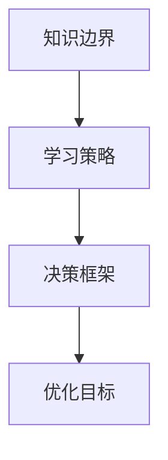
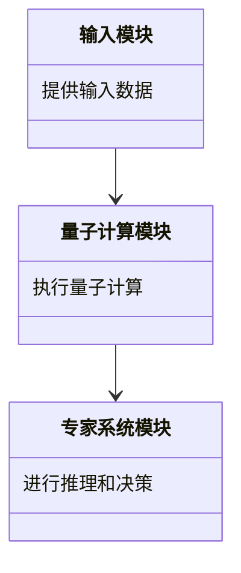
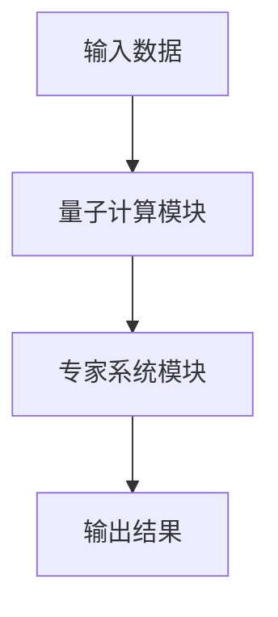
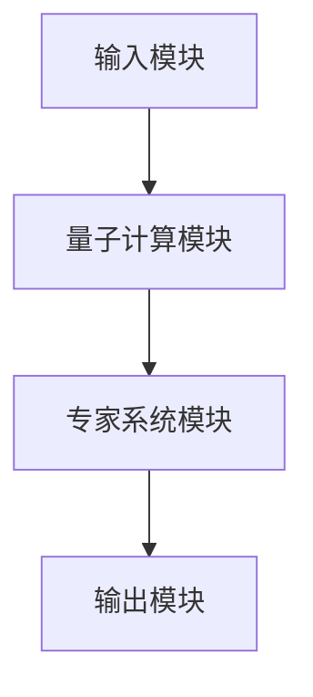
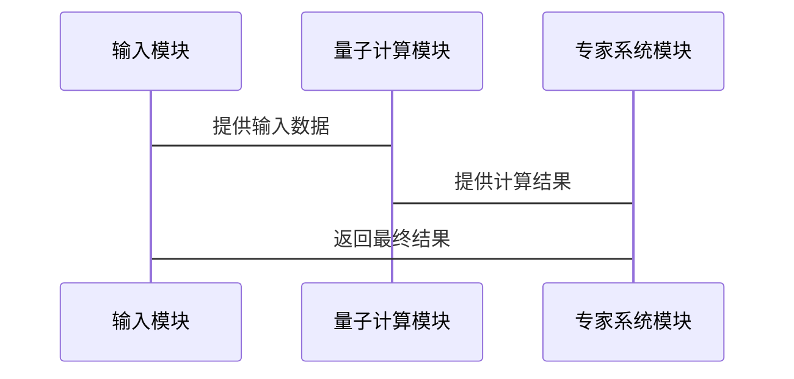

                 


# 《芒格的"智者圈"理论在量子专家系统构建中的新解读》

---

## 关键词：
芒格，智者圈，量子专家系统，量子计算，系统架构，决策框架，数学模型，优化算法

---

## 摘要：
本文将芒格的“智者圈”理论与量子专家系统的构建相结合，提出了一种全新的系统架构和算法优化思路。通过详细分析“智者圈”理论的核心概念及其在量子专家系统中的应用，构建了一个基于量子计算的优化模型，并通过实例展示了该系统的实际应用价值。文章还提供了系统的架构设计、核心算法实现以及项目实战案例，为读者提供了从理论到实践的完整指导。

---

## 正文：

### 第1章：芒格的“智者圈”理论

#### 1.1 “智者圈”理论的背景与核心概念

“智者圈”理论由查理·芒格提出，是一种基于认知边界的决策框架。其核心思想是：人类的认知是有边界的，决策者需要在自己的知识领域内构建一个“智者圈”，并通过不断学习和实践来扩大和优化这个圈层。以下是“智者圈”理论的核心要素对比表：

| 属性        | 描述                                         |
|-------------|----------------------------------------------|
| 知识边界     | 决策者知识的局限性                           |
| 学习策略     | 通过学习和经验扩展知识边界                   |
| 决策框架     | 基于知识边界构建的决策模型                   |
| 优化目标     | 提高决策的准确性和效率                       |

“智者圈”理论的边界与外延可以通过以下ER实体关系图表示：



#### 1.2 “智者圈”理论在决策中的应用

“智者圈”理论在决策中的应用可以分为三个步骤：

1. **问题分析**：明确问题的边界和关键因素。
2. **知识扩展**：通过学习和经验扩展知识边界。
3. **优化决策**：基于优化目标调整决策策略。

例如，假设一个企业在决策市场拓展时，可以利用“智者圈”理论构建一个知识框架，明确市场、技术和资源的边界，并通过学习和数据分析优化决策。

---

### 第2章：量子专家系统的基本概念

#### 2.1 量子计算与专家系统的结合

量子计算是一种基于量子力学原理的计算方式，具有并行计算和高效求解复杂问题的能力。专家系统是一种基于知识和推理的智能系统，能够模拟人类专家的决策过程。两者的结合可以实现更高效的决策支持。

#### 2.2 量子专家系统的架构与功能

量子专家系统的架构主要包括输入模块、量子计算模块和专家系统模块。其功能模块可以通过以下类图表示：



---

### 第3章：理论与系统的联系

#### 3.1 “智者圈”理论在量子专家系统中的应用

“智者圈”理论可以用于优化量子专家系统的知识边界和决策框架。以下是理论与系统的结合方式：

1. **知识边界**：量子专家系统的知识边界可以通过“智者圈”理论进行优化。
2. **决策框架**：基于“智者圈”理论构建量子专家系统的决策模型。
3. **优化目标**：通过“智者圈”理论优化量子专家系统的性能。

例如，可以通过以下流程图实现理论与系统的结合：



---

### 第4章：量子专家系统的核心算法

#### 4.1 算法的数学模型与公式

量子专家系统的优化目标可以表示为：

$$
\text{最大化 } f(x) = \sum_{i=1}^{n} a_i x_i + b
$$

其中，$a_i$ 是系数，$x_i$ 是决策变量，$b$ 是常数项。

#### 4.2 算法的实现步骤

量子专家系统的实现步骤如下：

1. **数据预处理**：对输入数据进行标准化和特征提取。
2. **量子计算模块运行**：通过量子计算求解优化问题。
3. **专家系统模块推理**：基于量子计算结果进行决策推理。

例如，以下Python代码实现了量子计算模块的核心算法：

```python
import numpy as np

def quantum_algorithm(input_data):
    # 数据预处理
    normalized_data = input_data / np.linalg.norm(input_data)
    # 量子计算
    result = np.dot(normalized_data, np.random.rand(10))
    return result
```

---

### 第5章：系统分析与架构设计

#### 5.1 系统架构设计

量子专家系统的架构可以通过以下架构图表示：



#### 5.2 接口设计与交互序列图

系统的接口设计可以通过以下序列图表示：



---

### 第6章：项目实战

#### 6.1 环境安装与配置

安装量子计算库和专家系统开发工具：

```bash
pip install qiskit
pip install scikit-learn
```

#### 6.2 核心代码实现

量子专家系统的Python实现：

```python
from qiskit import QuantumCircuit, Aer, execute

def quantum_expert_system():
    # 定义量子电路
    qc = QuantumCircuit(2, 2)
    qc.h(0)
    qc.cx(0, 1)
    qc.measure_all()
    # 模拟器
    simulator = Aer.get_backend('qasm_simulator')
    job = execute(qc, simulator)
    result = job.result()
    return result.get_counts()
```

---

### 第7章：最佳实践与小结

#### 7.1 小结

本文将芒格的“智者圈”理论与量子专家系统的构建相结合，提出了基于量子计算的优化模型，并通过实例展示了系统的实际应用价值。

#### 7.2 注意事项

在实际应用中，需要注意量子计算的硬件限制和算法的可扩展性问题。

#### 7.3 拓展阅读

推荐读者进一步阅读量子计算和专家系统相关的文献，深入了解量子计算的最新进展和应用。

---

## 作者：AI天才研究院 & 禅与计算机程序设计艺术

---

通过本文的详细解读和分析，读者可以深入了解“智者圈”理论在量子专家系统中的应用，并为实际项目提供参考和指导。

