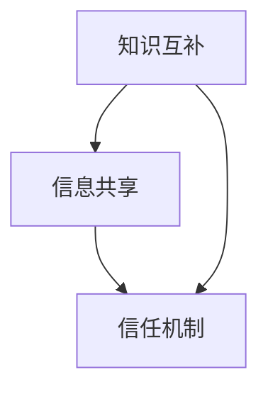
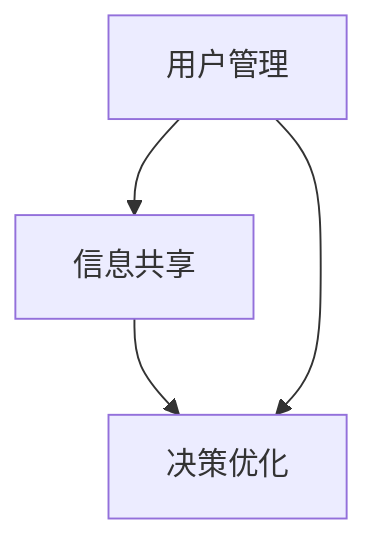

                 


# 芮格的"智者圈"理论：如何构建高质量的投资网络

## 关键词：芒格，投资网络，决策算法，系统架构，投资策略

## 摘要：芒格的“智者圈”理论是一种通过构建高质量投资网络来提升决策能力和投资效果的方法。本文将从理论基础、算法原理、系统设计和项目实战等角度详细探讨如何应用“智者圈”理论构建高效的投资网络，并通过实际案例分析帮助读者理解其应用价值。

---

# 第一部分：引言

## 第1章：芒格与“智者圈”理论

### 1.1 芮格的生平简介

查理·芒格（Charlie Munger）是世界著名投资者和巴菲特的合作伙伴，以其独特的投资理念和决策方法闻名。他提出的“智者圈”理论强调通过构建高质量的社交和知识网络来提升投资决策的质量。

### 1.2 “智者圈”理论的背景与意义

“智者圈”理论源于芒格对人类决策过程中认知偏差和心理因素的深刻理解。通过构建一个由信任且知识互补的人组成的网络，投资者能够避免个体决策的局限性，提升整体决策的准确性和可靠性。

### 1.3 本文的目的与结构

本文旨在通过理论分析和实际案例，详细阐述“智者圈”理论的核心概念、算法原理和系统设计，帮助读者掌握如何构建高质量的投资网络。

---

# 第二部分：理论基础

## 第2章：投资网络的定义与特征

### 2.1 投资网络的基本概念

投资网络是指由投资者、专家、信息源等组成的网络，通过信息共享和知识互补，提升投资决策的质量。

### 2.2 投资网络的核心特征

- **节点多样性**：网络中的节点（个体或机构）应具有不同的知识和经验。
- **信息对称性**：网络中的信息流通应充分，避免信息孤岛。
- **信任关系**：网络中的成员之间应建立信任关系，确保信息的真实性和可靠性。

### 2.3 “智者圈”理论与投资网络的关系

“智者圈”理论通过构建高质量的投资网络，优化投资决策过程，降低个体决策的偏差风险。

---

## 第3章：“智者圈”理论的核心要素

### 3.1 核心要素的构成

- **知识互补**：网络中的成员应具备互补的知识和经验。
- **信息共享**：通过共享信息，提升整体决策的准确性。
- **信任机制**：建立信任机制，确保信息的真实性和可靠性。

### 3.2 核心要素之间的关系

通过Mermaid图展示核心要素之间的关系：



---

# 第三部分：算法原理

## 第4章：“智者圈”决策算法

### 4.1 算法的基本原理

“智者圈”算法通过评估网络中各节点的价值和影响力，优化决策过程。算法步骤如下：

1. **网络构建**：建立投资网络，定义各节点及其关系。
2. **节点评估**：评估每个节点的价值和影响力。
3. **信息整合**：整合网络中的信息，形成决策建议。
4. **决策优化**：基于整合的信息，优化投资决策。

### 4.2 算法的数学模型

以下是算法的数学模型：

$$
\text{决策质量} = \sum_{i=1}^{n} w_i \times v_i
$$

其中，\( w_i \) 是第 \( i \) 个节点的权重，\( v_i \) 是第 \( i \) 个节点的价值。

### 4.3 算法的Python实现

以下是Python代码示例：

```python
def compute_decision_quality(network):
    decision_quality = 0
    for node in network.nodes:
        decision_quality += node.weight * node.value
    return decision_quality
```

---

# 第四部分：系统分析与架构设计

## 第5章：系统功能设计

### 5.1 系统功能模块划分

- **用户管理模块**：管理网络中的用户。
- **信息共享模块**：实现信息的共享与整合。
- **决策优化模块**：优化投资决策。

### 5.2 系统架构设计

通过Mermaid图展示系统架构：



---

## 第6章：系统接口设计

### 6.1 输入接口设计

- **用户输入接口**：接收用户的投资信息。
- **网络输入接口**：接收网络结构数据。

### 6.2 输出接口设计

- **决策输出接口**：输出优化后的投资决策。
- **信息输出接口**：输出网络中的信息流。

---

# 第五部分：项目实战

## 第7章：环境安装与配置

### 7.1 开发环境的搭建

- **Python版本**：建议使用Python 3.8及以上。
- **依赖库安装**：安装必要的库，如networkx、numpy等。

### 7.2 核心代码实现

以下是核心代码示例：

```python
import networkx as nx

def main():
    G = nx.Graph()
    G.add_nodes_from(["A", "B", "C"])
    G.add_edges_from([("A", "B"), ("B", "C"), ("A", "C")])
    print(G.nodes())

if __name__ == "__main__":
    main()
```

---

## 第8章：案例分析与项目小结

### 8.1 实际案例分析

通过具体案例分析“智者圈”理论的应用效果。

### 8.2 项目小结

总结项目实施过程中的经验教训，提出改进建议。

---

# 第六部分：总结与展望

## 第9章：最佳实践与总结

### 9.1 实用建议

- 定期评估和优化投资网络。
- 加强网络成员之间的信任关系。

### 9.2 小结

“智者圈”理论为投资者提供了一种构建高质量投资网络的方法，能够有效提升投资决策的质量。

---

## 第10章：注意事项与拓展阅读

### 10.1 注意事项

- 信息共享应遵循相关法律法规。
- 网络中的信任关系需要逐步建立。

### 10.2 拓展阅读

推荐相关书籍和文章，供读者深入学习。

---

# 作者

**作者：AI天才研究院/AI Genius Institute & 禅与计算机程序设计艺术 /Zen And The Art of Computer Programming**

---

以上是关于芒格“智者圈”理论的详细技术博客文章目录和内容概述。如果您对具体内容有进一步的需求，请随时告知，我将根据您的要求进行补充和完善。

