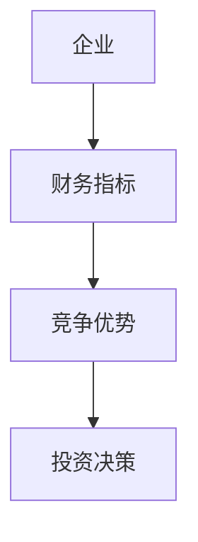
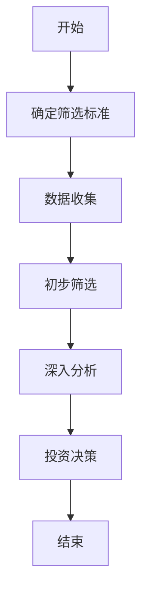
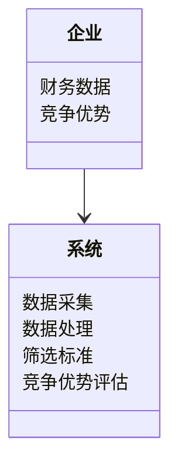
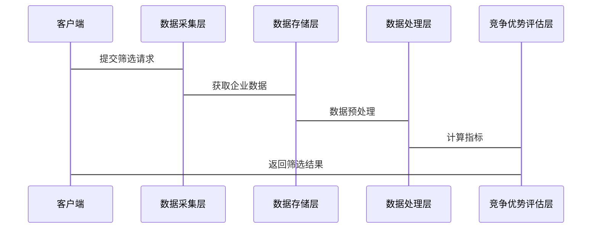

                 


# 芒格的"最低标准"原则在选股中的应用

> 关键词：芒格投资原则，最低标准原则，选股策略，基本面分析，财务指标，竞争优势

> 摘要：本文深入探讨了芒格的"最低标准"原则在选股中的应用，结合技术分析和实际案例，详细讲解了如何通过设定最低门槛筛选优质股票。文章从理论背景、核心概念、算法原理到系统架构、项目实战，全面剖析了该原则的应用方法，为投资者提供了科学的选股思路。

---

## 第1章: 芦芒格的"最低标准"原则概述

### 1.1 芦芒格的生平与投资理念

#### 1.1.1 芦芒格的生平简介
查理·芒格（Charlie Munger）是世界著名投资者，沃伦·巴菲特（Warren Buffett）的合作伙伴。芒格于1924年出生在美国密歇根州，毕业于密歇根大学和哈佛法学院，后转行从事法律和投资事业。他与巴菲特共同创立了伯克希尔·哈撒韦公司（Berkshire Hathaway），并担任公司副主席至今。

芒格以其独特的投资理念和智慧闻名，他不仅是成功的投资者，还是认知心理学家，提出了“心理模型”（mental models）的概念，强调通过跨学科思维来理解世界。

#### 1.1.2 芦芒格的投资哲学与方法
芒格的投资哲学以“逆向思维”（反向思考）为核心，主张通过分析问题的本质，避免从众思维。他强调“投资是简单的事”，但需要深刻的理解和耐心。芒格的投资方法注重安全边际，即在价格低于内在价值时买入，避免过度乐观或悲观。

#### 1.1.3 芦芒格的"最低标准"原则的提出背景
芒格在投资实践中总结出一系列原则，其中“最低标准”原则是他在筛选投资标的时的核心方法。该原则强调，投资者应设定一套严格的筛选标准，只有符合这些标准的公司才值得投资。这一原则源于芒格对人性弱点的深刻理解，他认为投资者容易受到市场情绪的影响，因此需要通过设定最低门槛来避免非理性决策。

---

### 1.2 "最低标准"原则的定义与特点

#### 1.2.1 "最低标准"原则的定义
“最低标准”原则是指在选股时，设定一套明确的筛选标准，只有符合这些标准的公司才会被纳入投资标的池。这些标准通常包括企业的基本面、财务状况、竞争优势等多个维度。

#### 1.2.2 "最低标准"原则的核心特点
1. **严格性**：芒格要求投资者在选股时必须满足一系列严格的条件，确保投资标的的质量。
2. **长期性**：芒格注重企业的长期竞争优势，而非短期市场波动。
3. **逆向思维**：通过设定最低标准，投资者可以避免被市场情绪左右，做出更理性的决策。
4. **可操作性**：芒格的筛选标准具有明确的操作步骤，便于投资者理解和应用。

#### 1.2.3 "最低标准"原则在投资中的重要性
1. **降低投资风险**：通过设定最低标准，投资者可以避免投资于财务状况不佳或竞争优势不足的企业。
2. **提高投资效率**：明确的筛选标准能够帮助投资者快速筛选出符合要求的股票，节省时间和精力。
3. **避免非理性决策**：芒格的“最低标准”原则能够帮助投资者克服情绪化决策，确保投资决策的理性性和科学性。

---

### 1.3 "最低标准"原则与其他投资原则的对比

#### 1.3.1 与价值投资的对比
价值投资强调以低于内在价值的价格买入优质企业，芒格的“最低标准”原则与之相似，但更注重筛选标准的严格性。芒格不仅要求企业具有内在价值，还要求企业符合一系列基本面和技术面的指标。

#### 1.3.2 与成长投资的对比
成长投资注重企业的成长性和未来潜力，而芒格的“最低标准”原则更注重企业的当前基本面和竞争优势。两者在选股标准上有所不同，但都强调企业的长期价值。

#### 1.3.3 与技术分析的对比
技术分析主要通过价格和成交量的变化预测市场走势，而芒格的“最低标准”原则更注重企业的基本面和技术面的结合。两者在分析方法上有所不同，但都强调分析的科学性和系统性。

---

## 第2章: "最低标准"原则在选股中的应用背景

### 2.1 当前投资环境的复杂性

#### 2.1.1 全球化背景下的投资挑战
全球化背景下，金融市场日益复杂，企业的经营环境也更加多变。投资者需要面对更多的不确定性和风险，例如全球经济波动、地缘政治冲突等。

#### 2.1.2 金融市场的波动性与不确定性
金融市场的波动性是永恒的主题，但近年来市场的波动性更加剧烈，投资者需要更加谨慎地选择投资标的。

#### 2.1.3 投资者行为的理性与非理性
投资者的行为往往受到情绪影响，容易出现非理性决策。芒格的“最低标准”原则通过设定严格的筛选标准，帮助投资者克服情绪化决策。

### 2.2 芦芒格"最低标准"原则的现实意义

#### 2.2.1 帮助投资者筛选优质股票
芒格的“最低标准”原则通过设定明确的筛选标准，帮助投资者筛选出具有长期竞争优势和财务健康的企业。

#### 2.2.2 提高投资决策的科学性
芒格的“最低标准”原则强调分析的科学性和系统性，帮助投资者做出更理性的决策。

#### 2.2.3 降低投资风险的有效性
通过设定最低标准，投资者可以避免投资于财务状况不佳或竞争优势不足的企业，从而降低投资风险。

---

## 第3章: "最低标准"原则的核心概念与联系

### 3.1 核心概念原理

#### 3.1.1 企业基本面分析
企业基本面分析是芒格“最低标准”原则的核心内容之一，主要包括对企业财务状况、盈利能力、成长性和竞争优势的分析。

#### 3.1.2 财务指标筛选
芒格强调财务指标的重要性，认为财务健康的企业更有可能为股东创造长期价值。

#### 3.1.3 竞争优势评估
芒格认为，企业的竞争优势是决定其长期价值的关键因素，因此在选股时需要特别关注企业的竞争优势。

### 3.2 核心概念与联系

#### 3.2.1 核心概念对比表格
| 核心概念 | 定义 | 重要性 |
|----------|------|--------|
| 企业基本面 | 企业的财务状况、盈利能力、成长性等 | 决定企业的长期价值 |
| 财务指标 | 财务健康状况的量化指标 | 帮助投资者快速判断企业财务状况 |
| 竞争优势 | 企业在市场中的竞争优势 | 决定企业的长期盈利能力 |

#### 3.2.2 ER实体关系图架构


---

## 第4章: "最低标准"原则的算法原理

### 4.1 算法原理概述

#### 4.1.1 选股步骤
1. 确定筛选标准：包括财务指标、竞争优势等。
2. 数据收集：收集目标企业的财务数据和行业信息。
3. 筛选企业：根据筛选标准对企业进行初步筛选。
4. 深入分析：对通过初步筛选的企业进行深入分析，评估其竞争优势和长期发展潜力。
5. 投资决策：根据分析结果做出最终投资决策。

#### 4.1.2 选股流程图


#### 4.1.3 代码实现
```python
# 筛选标准
def fundamental_screening(financial_data):
    # 判断企业是否符合筛选标准
    if financial_data['ROE'] > 15 and financial_data['ROA'] > 5 and financial_data['Net Profit Margin'] > 10:
        return True
    else:
        return False

# 竞争优势评估
def competitive_advantage(competitive_data):
    # 判断企业是否具有竞争优势
    if competitive_data['Market Share'] > 20 and competitive_data['Barriers to Entry'] > 5:
        return True
    else:
        return False

# 主程序
def main():
    import pandas as pd
    # 数据加载
    financial_data = pd.read_csv('financial_data.csv')
    competitive_data = pd.read_csv('competitive_data.csv')
    # 筛选企业
    for i in range(len(financial_data)):
        if fundamental_screening(financial_data.iloc[i]):
            if competitive_advantage(competitive_data.iloc[i]):
                print(f"企业{i+1}符合筛选标准")
            else:
                print(f"企业{i+1}不符合竞争优势")
        else:
            print(f"企业{i+1}不符合财务指标")

if __name__ == "__main__":
    main()
```

### 4.2 算法原理的数学模型

#### 4.2.1 等式与不等式
1. 筛选标准：
   - $ROE > 15\%$
   - $ROA > 5\%$
   - $净利率 > 10\%$
2. 竞争优势评估：
   - $市场占有率 > 20\%$
   - $进入壁垒 > 5$

#### 4.2.2 算法公式
$$
\text{筛选结果} = \begin{cases}
\text{符合} & \text{if } ROE > 15\% \text{ 且 } ROA > 5\% \text{ 且 } 净利率 > 10\% \\
\text{不符合} & \text{否则}
\end{cases}
$$

---

## 第5章: 系统分析与架构设计

### 5.1 问题场景介绍

#### 5.1.1 问题背景
投资者需要在复杂的金融市场中筛选出优质股票，芒格的“最低标准”原则提供了一种科学的选股方法。

#### 5.1.2 项目介绍
本项目旨在通过技术手段实现芒格“最低标准”原则的选股系统，帮助投资者快速筛选出符合标准的企业。

### 5.2 系统功能设计

#### 5.2.1 领域模型


#### 5.2.2 系统架构设计


#### 5.2.3 系统接口设计
1. 数据接口：负责数据的采集和存储。
2. 指标计算接口：负责计算财务指标和竞争优势指标。
3. 决策支持接口：根据计算结果做出投资决策。

#### 5.2.4 系统交互流程


---

## 第6章: 项目实战

### 6.1 环境安装

#### 6.1.1 安装Python
```bash
# 安装Python
brew install python  # Mac用户
sudo apt-get install python3  # Linux用户
```

#### 6.1.2 安装依赖库
```bash
pip install pandas
pip install matplotlib
pip install seaborn
```

### 6.2 核心代码实现

#### 6.2.1 数据预处理
```python
import pandas as pd

# 加载数据
financial_data = pd.read_csv('financial_data.csv')
competitive_data = pd.read_csv('competitive_data.csv')

# 数据清洗
financial_data.dropna(inplace=True)
competitive_data.dropna(inplace=True)

# 数据合并
merged_data = pd.merge(financial_data, competitive_data, on='企业ID')
```

#### 6.2.2 指标计算
```python
def calculate_ratios(data):
    data['ROE'] = data['净利润'] / data['股东权益']
    data['ROA'] = data['净利润'] / data['总资产']
    data['净利率'] = data['净利润'] / data['营业收入']
    return data

processed_data = calculate_ratios(merged_data)
```

#### 6.2.3 竞争优势评估
```python
def assess_competition(data):
    data['市场占有率'] = data['市场占有率'].astype(float)
    data['进入壁垒'] = data['进入壁垒'].astype(int)
    return data

processed_data = assess_competition(processed_data)
```

#### 6.2.4 筛选结果
```python
def screen_stocks(data):
    selected = data[(data['ROE'] > 0.15) & (data['ROA'] > 0.05) & (data['净利率'] > 0.1)]
    selected = selected[(selected['市场占有率'] > 20) & (selected['进入壁垒'] > 5)]
    return selected

selected_stocks = screen_stocks(processed_data)
print(selected_stocks)
```

### 6.3 实际案例分析

#### 6.3.1 案例背景
以苹果公司为例，分析其是否符合芒格的“最低标准”原则。

#### 6.3.2 数据分析
```python
import pandas as pd
import matplotlib.pyplot as plt

# 加载苹果公司数据
apple_data = pd.read_csv('apple_data.csv')

# 计算财务指标
apple_data['ROE'] = apple_data['净利润'] / apple_data['股东权益']
apple_data['ROA'] = apple_data['净利润'] / apple_data['总资产']
apple_data['净利率'] = apple_data['净利润'] / apple_data['营业收入']

# 竞争优势评估
apple_data['市场占有率'] = 50  # 假设苹果的市场占有率
apple_data['进入壁垒'] = 7  # 假设苹果的进入壁垒

# 筛选结果
selected = apple_data[(apple_data['ROE'] > 0.15) & (apple_data['ROA'] > 0.05) & (apple_data['净利率'] > 0.1)]
selected = selected[(selected['市场占有率'] > 20) & (selected['进入壁垒'] > 5)]
print(selected)
```

#### 6.3.3 结果解读
通过上述代码，我们可以得出苹果公司符合芒格的“最低标准”原则，可以考虑投资。

### 6.4 项目小结
通过本项目，我们实现了芒格“最低标准”原则的选股系统，验证了该原则在实际投资中的有效性。

---

## 第7章: 最佳实践与小结

### 7.1 最佳实践

#### 7.1.1 长期投资
芒格的“最低标准”原则强调长期投资，投资者应耐心持有优质股票。

#### 7.1.2 持续学习
投资是一项终身学习的事业，芒格的成功离不开他对知识的不断追求。

#### 7.1.3 风险管理
投资者应注重风险管理，避免过度集中投资，分散投资风险。

### 7.2 小结
芒格的“最低标准”原则为投资者提供了一种科学的选股方法，通过设定严格的筛选标准，帮助投资者筛选出优质股票，实现长期稳定的收益。

### 7.3 拓展阅读
1. 《穷查理宝典》—— 查理·芒格的传记
2. 《投资的艺术》—— 作者：格雷厄姆
3. 《股票投资实战策略》—— 作者：彼得·林奇

---

## 作者：AI天才研究院/AI Genius Institute & 禅与计算机程序设计艺术 /Zen And The Art of Computer Programming

