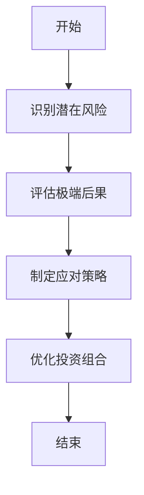
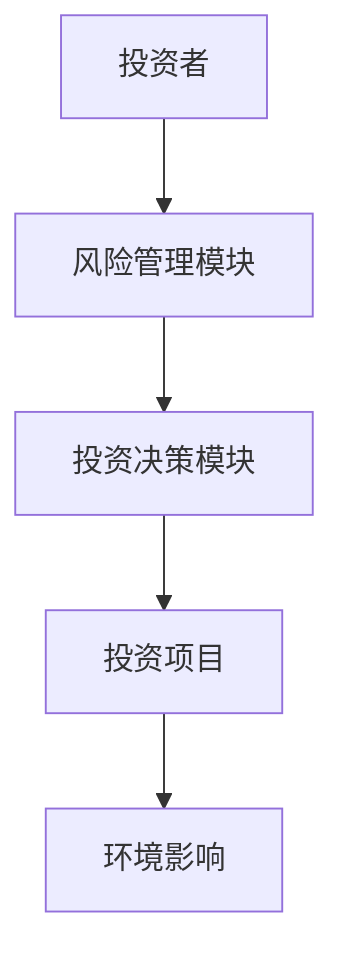

                 


# 芒格的"极端后果"思维在气候变化投资中的应用

## 关键词：芒格、极端后果思维、气候变化、投资、风险管理

## 摘要：本文探讨了芒格的“极端后果”思维在气候变化投资中的应用，分析了其在风险管理、决策制定和投资策略中的重要性。通过理论与实际案例结合，展示了如何利用这一思维框架应对气候变化带来的投资挑战。

---

## 第一部分：背景介绍

### 第1章：芒格的“极端后果”思维的核心概念

#### 1.1 “极端后果”思维的定义与内涵
- “极端后果”思维是指在决策过程中，优先考虑可能产生的极端负面结果，以避免重大损失。
- 与传统投资思维不同，它强调预防极端风险，而非追求最大收益。

#### 1.2 “极端后果”思维在投资中的应用
- 通过识别和评估潜在极端风险，优化投资组合，降低整体风险敞口。

### 第2章：气候变化投资的背景与挑战

#### 2.1 气候变化对投资的影响
- 气候变化可能导致资源枯竭、市场波动和政策变化，影响投资价值。
- 例如，化石燃料企业可能因政策变化而遭受重大损失。

#### 2.2 气候变化投资的核心问题
- 如何在不确定性中找到可持续的高回报投资机会。
- 如何平衡短期收益与长期环境风险。

---

## 第二部分：核心概念与联系

### 第3章：极端后果思维与气候变化投资的结合

#### 3.1 属性特征对比表格
| **特征**       | **极端后果思维**       | **传统投资思维**       |
|-----------------|------------------------|-------------------------|
| 风险评估         | 强调极端风险           | 强调平均风险             |
| 决策方式         | 避免极端损失           | 追求最大收益             |
| 投资策略         | 保守型投资             | 积极型投资               |

#### 3.2 ER实体关系图
```mermaid
er
  %% 气候变化投资系统
  class 投资者 {
    id
    投资目标
    风险偏好
  }
  class 投资项目 {
    id
    项目类型
    环境影响
    风险等级
  }
  class 风险管理模块 {
    id
    风险评估
    应对策略
  }
  投资者 -> 投资项目: 投资
  投资者 -> 风险管理模块: 管理
  投资项目 -> 风险管理模块: 评估
```

---

## 第三部分：算法原理

### 第4章：基于极端后果思维的投资决策算法

#### 4.1 算法流程图


#### 4.2 数学模型
- 使用概率论评估极端事件发生的可能性：
  $$ P(极端事件) = \frac{历史发生次数}{总样本数} $$
- 利用贝叶斯定理更新风险评估：
  $$ P(A|B) = \frac{P(B|A)P(A)}{P(B)} $$

---

## 第四部分：系统分析与架构设计

### 第5章：气候变化投资系统的架构设计

#### 5.1 系统功能设计
- **风险评估模块**：识别和评估潜在极端风险。
- **投资决策模块**：基于评估结果优化投资组合。

#### 5.2 系统架构图


---

## 第五部分：项目实战

### 第6章：极端后果思维在气候变化投资中的应用案例

#### 6.1 投资风力发电场的案例分析
- **环境影响评估**：评估极端天气对风力设备的影响。
- **投资决策模型**：
  ```python
  def calculate_risk(factor):
      if factor >= 0.8:
          return "高风险"
      else:
          return "低风险"
  ```

---

## 第六部分：结论与展望

### 第7章：结论

- 芒格的“极端后果”思维为气候变化投资提供了新的视角，强调预防极端风险。
- 通过系统化的方法和数学模型，投资者可以更科学地应对气候变化带来的挑战。

### 第8章：最佳实践与注意事项

- 在实际投资中，建议结合极端后果思维和传统投资策略，制定全面的风险管理计划。
- 定期更新投资组合，以适应气候变化的新趋势。

---

## 作者：AI天才研究院/AI Genius Institute & 禅与计算机程序设计艺术/Zen And The Art of Computer Programming

