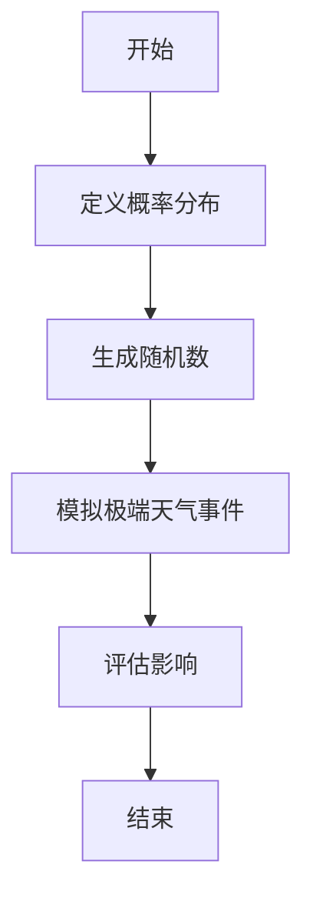
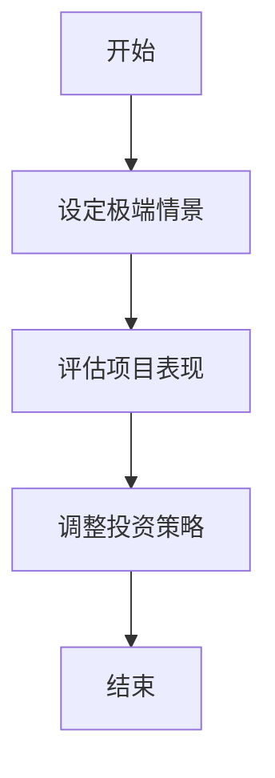
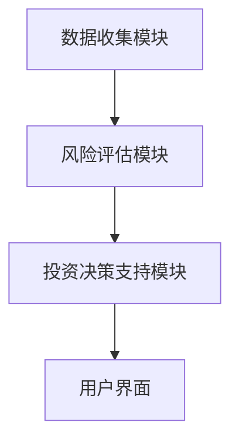

                 

# 《芒格的"极端后果"思维在气候科技投资中的应用》

---

## 关键词：
- 芒格投资理念
- 极端后果思维
- 气候科技
- 投资策略
- 风险评估
- 蒙特卡洛模拟
- 系统架构

---

## 摘要：
本文深入探讨了芒格的“极端后果”思维在气候科技投资中的应用。通过分析极端后果思维的核心理念，结合气候科技投资的背景与现状，本文提出了基于蒙特卡洛模拟和压力测试的极端后果评估方法，并设计了气候科技投资的系统架构。通过实际案例分析，展示了如何将芒格的思维应用于可再生能源和碳捕捉技术等气候科技项目中，为投资者提供科学、稳健的投资策略。

---

# 第1章：芒格的“极端后果”思维概述

## 1.1 什么是“极端后果”思维
- 芒格投资理念的核心：长期视角、安全边际与逆向思维。
- 极端后果思维的定义：在投资决策中，优先考虑最坏情况下的潜在损失，避免重大负面后果。
- 极端后果思维的重要性：在不确定性极高的气候投资中，极端后果思维能够帮助投资者降低潜在损失，确保投资的稳健性。

---

## 1.2 极端后果思维的特点
- 长期视角的重要性：关注气候投资的长期影响。
- 风险评估的深度：识别潜在的极端后果，如极端天气事件对投资的影响。
- 投资决策的谨慎性：在不确定性中保持审慎，避免过度冒险。

---

# 第2章：气候科技投资的背景

## 2.1 气候变化对全球经济的影响
- 气候变化带来的挑战：极端天气事件频发、海平面上升、生态系统破坏。
- 气候科技的发展趋势：可再生能源、碳捕捉技术、智能能源管理系统的快速发展。

## 2.2 气候科技投资的机会与挑战
- 投资机会：可再生能源、绿色交通、低碳技术等领域。
- 挑战：技术不确定性、政策变化、市场需求波动。

---

# 第3章：芒格思维与气候科技投资

## 3.1 极端后果思维在气候投资中的应用
- 风险评估的重要性：识别气候科技项目中的潜在极端后果，如技术失败、政策变化对投资的影响。
- 如何识别潜在的极端后果：通过历史数据分析和情景模拟，评估极端天气事件对项目的潜在影响。

## 3.2 极端后果思维在气候投资中的策略
- 长期视角的应用：关注气候科技的长期发展趋势，避免短期波动的干扰。
- 安全边际的设定：在投资决策中预留足够的安全空间，降低极端后果的可能性。

---

# 第4章：极端后果评估的算法与模型

## 4.1 蒙特卡洛模拟在风险评估中的应用
- 蒙特卡洛模拟的基本原理：通过随机抽样和概率分布，模拟极端天气事件对气候科技项目的影响。
- 应用场景：评估极端天气对可再生能源项目发电效率的影响。
- 优势：能够模拟多种可能的极端情况，帮助投资者做好充分准备。

### 4.1.1 蒙特卡洛模拟的流程图

## 4.2 压力测试方法在极端后果评估中的应用
- 压力测试的基本概念：通过设定极端情景，评估气候科技项目在极端条件下的表现。
- 应用场景：评估碳捕捉技术在极端高温或极端天气情况下的效率。

### 4.2.1 压力测试的流程图

---

# 第5章：气候科技投资系统的架构设计

## 5.1 系统功能设计
- 数据收集模块：收集气候数据、市场数据、项目数据。
- 风险评估模块：基于蒙特卡洛模拟和压力测试，评估项目的极端后果。
- 投资决策支持模块：根据风险评估结果，提供投资建议。

## 5.2 系统架构设计
- 模块关系：数据收集模块 --> 风险评估模块 --> 投资决策支持模块。
- 系统的可扩展性：支持未来的数据源扩展和新算法的集成。

### 5.2.1 气候科技投资系统的架构图

---

# 第6章：实际案例分析

## 6.1 案例一：可再生能源投资
- 项目背景：某太阳能发电项目，面临极端天气和政策变化的风险。
- 极端后果评估：通过蒙特卡洛模拟，评估极端天气对发电效率的影响。
- 投资决策：基于评估结果，调整投资策略，预留安全边际。

## 6.2 案例二：碳捕捉技术投资
- 项目背景：某碳捕捉技术项目，面临技术失败和市场需求波动的风险。
- 极端后果评估：通过压力测试，评估技术失败对项目的影响。
- 投资决策：基于评估结果，制定风险缓解策略。

---

# 第7章：总结与未来展望

## 7.1 全书总结
- 本文通过芒格的极端后果思维，探讨了气候科技投资的风险评估和投资策略。
- 提出了基于蒙特卡洛模拟和压力测试的极端后果评估方法，并设计了气候科技投资的系统架构。
- 通过实际案例分析，展示了如何将芒格的思维应用于气候科技投资中。

## 7.2 未来展望
- 气候科技投资的未来趋势：技术进步、政策支持和市场需求的驱动。
- 极端后果思维的应用前景：在复杂多变的气候投资中，极端后果思维将继续发挥重要作用。

---

## 作者：AI天才研究院/AI Genius Institute & 禅与计算机程序设计艺术 /Zen And The Art of Computer Programming

--- 

## 附录：参考文献
- 芒格投资理念的相关书籍和论文。
- 气候科技领域的最新研究成果。
- 风险评估和极端后果分析的经典文献。

