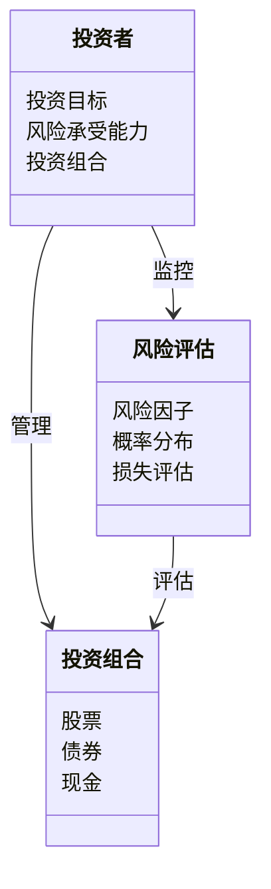

                 


# 芒格的"极端后果"思维：在投资中考虑最坏情况

> 关键词：芒格投资理念，极端后果思维，风险管理，防御性投资，投资决策

> 摘要：本文深入探讨了芒格的“极端后果”思维在投资决策中的应用。通过分析极端后果思维的核心概念、数学模型、系统架构以及实际案例，本文展示了如何在投资中考虑最坏情况，从而制定更稳健的投资策略。

---

## 第一部分：芒格的"极端后果"思维概述

### 第1章：芒格的"极端后果"思维背景与核心概念

#### 1.1 芒格投资理念的起源与特点

芒格的“第二性思维”是其投资理念的核心，强调从逆向思维出发，寻找投资中的“击球区”。这种思维模式与传统的“极端后果”思维密切相关，后者要求投资者在决策时考虑最坏的情况，以确保投资组合的稳健性。

**核心概念：**
- **极端后果思维**：在投资中，始终考虑最坏情况，并制定相应的防御策略。
- **第二性思维**：从逆向思维出发，寻找市场的非共识观点，发现投资机会。

#### 1.2 "极端后果"思维的背景与重要性

当代投资环境充满不确定性，传统投资策略往往忽视极端情况，导致在市场崩盘时损失惨重。芒格的极端后果思维强调在决策时考虑最坏情况，这在2008年金融危机后显得尤为重要。

**背景分析：**
- 金融危机后，投资者意识到传统模型在极端情况下的失效。
- 极端后果思维为投资者提供了更稳健的风险管理方法。

#### 1.3 "极端后果"思维的核心要素

极端后果思维的核心要素包括：
1. **风险识别**：识别可能引发极端损失的因素。
2. **损失评估**：评估极端情况下的潜在损失。
3. **防御策略**：制定应对极端情况的策略。

### 第2章：极端后果思维的核心原理与数学模型

#### 2.1 极端后果思维的数学基础

概率论在极端后果分析中起着关键作用。通过概率模型，投资者可以量化极端情况的可能性，并评估其影响。

**数学模型：**
- **风险-收益权衡模型**：$$ R = E[r] - \lambda E[\text{损失}] $$
  - 其中，\( R \) 是风险调整后的收益，\( E[r] \) 是期望收益，\( \lambda \) 是风险厌恶系数，\( E[\text{损失}] \) 是期望损失。

- **极端损失概率计算**：$$ P(\text{极端损失}) = \frac{\text{历史极端事件频率}}{\text{总样本量}} $$

#### 2.2 极端后果思维的决策树分析

决策树是一种有效的工具，用于分析极端后果思维下的投资决策。通过构建决策树，投资者可以系统地评估不同决策路径下的潜在风险。

**决策树分析流程：**
1. **定义问题**：确定投资目标和可能的决策点。
2. **构建决策树**：绘制所有可能的决策路径。
3. **评估概率与结果**：为每条路径分配概率和结果。
4. **计算期望值**：$$ EV = \sum (概率 \times 结果) $$
5. **选择最优路径**：选择期望值最高的路径。

---

## 第二部分：系统分析与架构设计

### 第3章：极端后果思维的系统架构

#### 3.1 问题场景介绍

在投资决策中，极端后果思维要求投资者构建一个稳健的系统架构，以应对各种极端情况。系统架构包括以下几个方面：

- **投资目标**：明确投资目标和风险承受能力。
- **风险识别**：识别可能引发极端损失的因素。
- **损失评估**：评估极端情况下的潜在损失。
- **防御策略**：制定应对极端情况的策略。

#### 3.2 系统功能设计

**领域模型（Mermaid 类图）：**



#### 3.3 系统架构设计

**系统架构图（Mermaid 架构图）：**

```mermaid
archi
    title 极端后果思维的系统架构
    网络服务器
    数据库
    客户端
    中间件
    API Gateway
    微服务：风险管理, 投资组合管理
```

---

## 第三部分：项目实战

### 第4章：极端后果思维的实战应用

#### 4.1 环境安装

为了应用极端后果思维，投资者需要构建一个完整的投资分析系统。以下是所需工具和环境：

- **数据分析工具**：Python、R
- **可视化工具**：Matplotlib、Tableau
- **数据库**：MySQL、MongoDB
- **编程库**：Pandas、NumPy、Scipy

#### 4.2 核心实现

以下是用Python实现的风险评估模型：

```python
import numpy as np
import pandas as pd
import matplotlib.pyplot as plt

# 示例数据：历史收益率
returns = np.array([0.05, 0.03, -0.02, 0.04, 0.06, -0.01, 0.03, 0.02, -0.04, 0.05])

# 计算极端损失（假设极端情况为-5%）
extreme_loss = -0.05

# 识别触发极端损失的条件
def identify_extreme_condition(r):
    if r < extreme_loss:
        return True
    return False

# 应用条件检查
extreme_triggered = [identify_extreme_condition(r) for r in returns]
```

#### 4.3 案例分析

假设我们有一个投资组合，包含股票和债券。我们需要评估在极端市场情况下，投资组合的损失情况。

**步骤：**
1. **数据收集**：收集过去10年的市场数据。
2. **风险识别**：识别可能引发极端损失的市场因子。
3. **损失评估**：计算极端情况下的潜在损失。
4. **防御策略**：调整投资组合以降低风险。

---

## 第四部分：总结与最佳实践

### 第5章：总结与最佳实践

#### 5.1 总结

芒格的极端后果思维是一种强大的投资工具，帮助投资者在复杂的投资环境中制定稳健的决策。通过考虑最坏情况，投资者可以更好地管理风险，保护投资组合免受极端损失的影响。

#### 5.2 注意事项

- **保持灵活性**：市场环境不断变化，投资者需要及时调整策略。
- **避免过度保守**：极端后果思维可能导致过度保守，影响收益。

#### 5.3 最佳实践

- **定期回顾投资组合**：确保投资组合符合极端后果思维的要求。
- **持续学习**：关注市场动态，学习新的投资策略。

#### 5.4 拓展阅读

- 《Poor Charlie's Almanack》：芒格的经典著作，深入探讨了他的投资理念。
- 《The Intelligent Investor》：巴菲特的投资指南，与芒格的理念密切相关。

---

## 作者：AI天才研究院/AI Genius Institute & 禅与计算机程序设计艺术/Zen And The Art of Computer Programming

