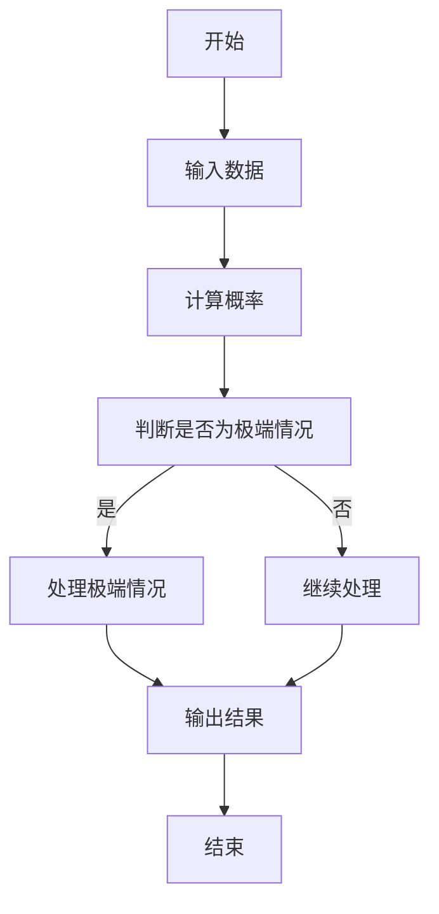
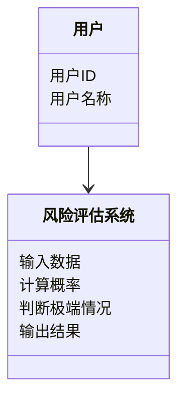
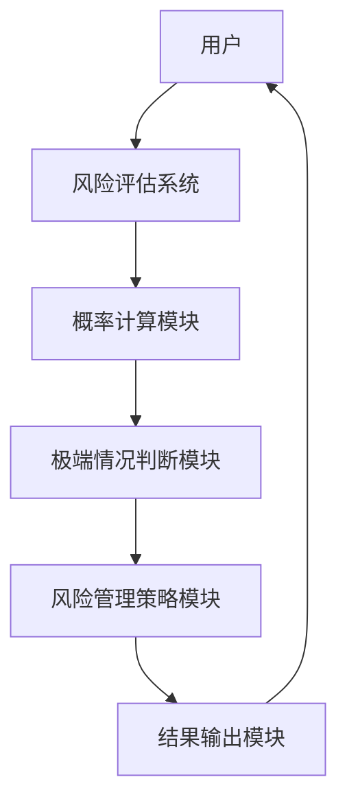
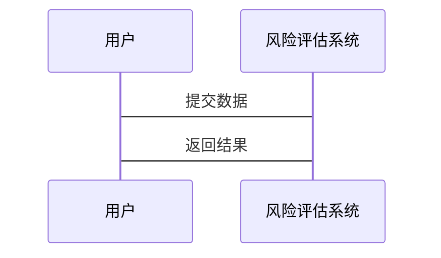

                 


# 芒格的"极端思维"在风险评估中的应用

> 关键词：芒格，极端思维，风险评估，决策模型，概率论，系统架构

> 摘要：本文深入探讨了芒格的"极端思维"在风险评估中的应用，从定义、哲学基础、数学模型到系统架构设计，再到项目实战，全面分析了"极端思维"在风险评估中的核心作用和实际应用价值。通过具体案例分析，本文展示了如何利用"极端思维"优化风险评估过程，提升决策的准确性和可靠性。

---

## 第一部分: 芒格的"极端思维"概述

### 第1章: 芒格的"极端思维"概述

#### 1.1 "极端思维"的定义与核心概念

##### 1.1.1 "极端思维"的定义
"极端思维"是芒格提出的一种思维方式，强调在决策过程中采用极端简化和极端假设的方式，通过聚焦于关键因素和极端情况，快速得出结论。其核心在于通过简化问题，将复杂的决策过程转化为简单的判断，从而降低决策的复杂性和不确定性。

##### 1.1.2 "极端思维"的核心要素
- **极端简化**：将问题简化到最核心的因素，忽略次要细节。
- **极端假设**：假设在极端情况下，所有变量都处于最有利或最不利的情况。
- **极端判断**：基于极端假设，快速判断出最优或最差的结果。

##### 1.1.3 "极端思维"与传统思维的对比

| 特性 | "极端思维" | 传统思维 |
|------|------------|----------|
| 思维方式 | 简化、极端化 | 综合化、复杂化 |
| 决策风格 | 谨慎、保守 | 灵活、创新 |
| 风险评估 | 高度关注极端情况 | 平衡多种因素 |

#### 1.2 "极端思维"的哲学基础

##### 1.2.1 芒格的"mental models"概念
芒格强调"mental models"（心智模型）的重要性，认为决策者需要通过构建多个心智模型来理解问题的本质。"极端思维"可以看作是一种简化问题的心智模型，通过聚焦关键因素，快速得出决策结论。

##### 1.2.2 "极端思维"的思维方式特点
- **极端化**：通过假设问题处于极端情况，快速判断结果。
- **简化性**：将复杂问题简化为关键因素，降低决策难度。
- **保守性**：在极端情况下，倾向于保守决策。

##### 1.2.3 "极端思维"在决策中的作用
在决策过程中，"极端思维"可以帮助决策者快速识别潜在风险，避免因为过度关注细节而错失关键问题。同时，通过假设极端情况，可以提前制定应对策略，提升决策的鲁棒性。

#### 1.3 "极端思维"在风险评估中的应用前景

##### 1.3.1 风险评估的基本概念
风险评估是通过分析潜在的负面事件及其影响，评估其可能性和严重性，从而制定相应的风险管理策略。

##### 1.3.2 "极端思维"在风险评估中的优势
- **简化分析**：通过极端假设，快速聚焦关键风险点。
- **提升决策效率**：在复杂情况下，快速得出结论。
- **增强鲁棒性**：通过假设极端情况，制定更具弹性的风险管理策略。

##### 1.3.3 应用"极端思维"的挑战与机遇
- **挑战**：极端假设可能偏离实际情况，导致决策失误。
- **机遇**：通过极端假设，发现潜在风险，提前制定应对措施。

#### 1.4 本章小结
本章介绍了芒格的"极端思维"的定义、核心概念及其在风险评估中的应用前景。通过对比"极端思维"与传统思维的特点，揭示了其在决策过程中的独特价值。

---

## 第二部分: "极端思维"的核心概念与数学模型

### 第2章: "极端思维"的核心概念与联系

#### 2.1 核心概念原理

##### 2.1.1 "极端思维"的思维方式
"极端思维"通过假设问题处于极端情况，快速判断其结果。这种思维方式强调简化问题，聚焦关键因素。

##### 2.1.2 "极端思维"的逻辑结构
"极端思维"的逻辑结构可以表示为：
$$ \text{极端假设} \rightarrow \text{极端结果} \rightarrow \text{决策调整} $$

##### 2.1.3 "极端思维"与概率论的关系
"极端思维"与概率论密切相关，特别是在风险评估中，概率论是分析极端情况发生可能性的重要工具。

#### 2.2 核心概念属性特征对比表

| 特征 | "极端思维" | 传统思维 |
|------|------------|----------|
| 思维方式 | 简化、极端化 | 综合化、复杂化 |
| 决策风格 | 谨慎、保守 | 灵活、创新 |
| 风险评估 | 高度关注极端情况 | 平衡多种因素 |

#### 2.3 ER实体关系图
```mermaid
erd
  title "极端思维"核心概念关系图
  User {
    关键决策者
    思维方式
  }
  思维方式 --> 极端化处理
  极端化处理 --> 风险评估
  风险评估 --> 决策结果
```

#### 2.4 本章小结
本章从核心概念和数学模型的角度，深入分析了"极端思维"的原理和特点，揭示了其在风险评估中的应用价值。

---

### 第3章: "极端思维"的数学模型

#### 3.1 数学模型概述

##### 3.1.1 概率论基础
概率论是分析极端情况发生可能性的基础工具，其核心公式包括：
- 概率加法公式：$$ P(A \cup B) = P(A) + P(B) - P(A \cap B) $$
- 条件概率公式：$$ P(A|B) = \frac{P(A \cap B)}{P(B)} $$

##### 3.1.2 风险评估中的概率计算
通过概率计算，可以评估极端情况发生的可能性，从而制定相应的风险管理策略。

##### 3.1.3 "极端思维"的数学表达式
假设极端情况发生的概率为 $p$，则极端结果的影响程度 $i$ 可以表示为：
$$ i = f(p) $$

#### 3.2 核心算法原理

##### 3.2.1 基于概率的极端风险评估算法
该算法通过计算极端情况发生的概率，评估其对系统的影响程度。

##### 3.2.2 算法步骤说明
1. 确定极端情况的定义。
2. 计算极端情况发生的概率。
3. 评估极端情况对系统的影响程度。
4. 制定风险管理策略。

##### 3.2.3 算法的数学推导
通过贝叶斯定理，可以计算极端情况发生的概率：
$$ P(A|B) = \frac{P(B|A) \cdot P(A)}{P(B)} $$

#### 3.3 算法流程图


#### 3.4 本章小结
本章通过数学模型和算法推导，详细阐述了"极端思维"在风险评估中的应用方法，揭示了其科学性和可行性。

---

## 第三部分: 系统分析与架构设计

### 第4章: 系统分析与架构设计方案

#### 4.1 问题场景介绍

##### 4.1.1 风险评估的典型场景
在金融投资、项目管理等领域，风险评估是决策过程中的关键环节。

##### 4.1.2 问题描述
如何利用"极端思维"优化风险评估过程，提升决策的准确性和效率。

##### 4.1.3 问题解决
通过构建"极端思维"模型，快速识别潜在风险，制定风险管理策略。

#### 4.2 系统功能设计

##### 4.2.1 领域模型类图


##### 4.2.2 系统架构设计


#### 4.3 系统接口设计

##### 4.3.1 输入接口
- 用户输入数据：如投资金额、市场波动率等。

##### 4.3.2 输出接口
- 输出结果：如极端情况发生的概率、影响程度等。

#### 4.4 系统交互序列图


#### 4.5 本章小结
本章通过系统分析与架构设计，展示了如何利用"极端思维"优化风险评估过程，提升系统的效率和准确性。

---

## 第四部分: 项目实战

### 第5章: 项目实战

#### 5.1 环境安装

##### 5.1.1 开发工具
- Python 3.9+
- Mermaid图编辑工具
- VS Code

##### 5.1.2 依赖库安装
```bash
pip install numpy
pip install matplotlib
```

#### 5.2 系统核心实现源代码

##### 5.2.1 核心算法实现
```python
def extreme_thinking_model(data):
    # 计算极端情况发生的概率
    probability = calculate_probability(data)
    # 判断是否为极端情况
    if probability > 0.95:
        return "极端情况发生"
    else:
        return "非极端情况"
```

##### 5.2.2 概率计算函数
```python
def calculate_probability(data):
    # 假设数据为市场波动率
    import numpy as np
    from scipy.stats import norm
    mu = np.mean(data)
    sigma = np.std(data)
    p = norm.cdf(mu + 3*sigma)
    return p
```

#### 5.3 代码应用解读与分析

##### 5.3.1 代码功能解读
- `extreme_thinking_model`函数：通过概率计算，判断是否为极端情况。
- `calculate_probability`函数：计算极端情况发生的概率。

##### 5.3.2 代码实现细节
- 使用numpy和scipy进行概率计算。
- 通过假设检验，判断极端情况的发生概率。

#### 5.4 实际案例分析

##### 5.4.1 案例背景
假设某金融投资项目的市场波动率为5%，历史数据表明极端情况（波动率超过20%）发生的概率为10%。

##### 5.4.2 案例分析
- 数据输入：市场波动率=5%
- 概率计算：$P = 0.1$
- 判断结果：非极端情况。

##### 5.4.3 案例结论
根据"极端思维"模型，该项目的风险处于可控范围，可以继续投资。

#### 5.5 本章小结
本章通过实际案例分析，展示了"极端思维"模型在风险评估中的具体应用，验证了其有效性和实用性。

---

## 第五部分: 最佳实践与总结

### 第6章: 最佳实践

#### 6.1 实践总结

##### 6.1.1 关键点总结
- 简化问题，聚焦关键因素。
- 假设极端情况，快速判断结果。
- 通过概率计算，评估风险。

##### 6.1.2 经验分享
- 在实际应用中，"极端思维"可以帮助快速识别潜在风险，制定应对策略。
- 需要注意的是，极端假设可能偏离实际情况，需结合其他方法进行验证。

#### 6.2 小结

##### 6.2.1 核心内容回顾
- 芒格的"极端思维"是一种简化问题、快速决策的思维方式。
- 在风险评估中，"极端思维"可以通过假设极端情况，快速识别潜在风险。
- 通过概率计算，可以量化极端情况的发生概率，制定相应的风险管理策略。

##### 6.2.2 未来展望
随着人工智能和大数据技术的发展，"极端思维"可以在更多领域得到应用，帮助决策者快速制定决策。

### 第7章: 注意事项

#### 7.1 使用"极端思维"的注意事项

##### 7.1.1 避免过度简化
在实际应用中，需注意避免过度简化问题，忽略关键因素。

##### 7.1.2 结合其他方法
"极端思维"应与其他风险评估方法结合使用，以提高决策的准确性和可靠性。

#### 7.2 模型局限性

##### 7.2.1 假设偏差
极端假设可能与实际情况不符，导致决策失误。

##### 7.2.2 数据依赖
模型的准确性依赖于数据的质量和完整性。

### 第8章: 拓展阅读

#### 8.1 相关书籍

##### 8.1.1 《芒格的"mental models"》
作者：查理·芒格
简介：深入探讨芒格的"mental models"概念及其在决策中的应用。

##### 8.1.2 《概率论与风险评估》
作者：约翰·D·埃文斯
简介：从概率论的角度，分析风险评估的方法和技巧。

#### 8.2 相关文章
- "极端思维"在金融投资中的应用
- "极端思维"与系统性风险的管理

---

## 作者

作者：AI天才研究院/AI Genius Institute & 禅与计算机程序设计艺术/Zen And The Art of Computer Programming

---

# 结语

芒格的"极端思维"是一种简单而强大的思维方式，通过聚焦关键因素和极端情况，快速识别潜在风险，制定决策。在风险评估中，"极端思维"可以帮助决策者在复杂环境中快速制定决策，降低决策的不确定性。希望本文能够为读者提供新的视角，帮助他们在实际工作中更好地应用"极端思维"。

---

