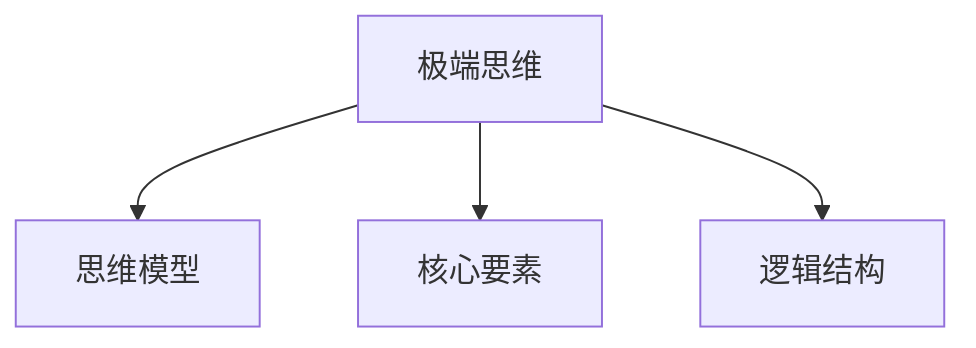

                 


# 芒格的"极端思维"：考虑最坏情况的重要性

## 关键词：极端思维,芒格,风险管理,决策支持系统,概率思维,批判性思维,系统架构设计

## 摘要：芒格的"极端思维"是一种在决策过程中考虑最坏情况的思维方式，强调在极端情况下确保决策的稳健性。本文将从背景、核心概念、算法原理、系统架构设计、项目实战等多个方面深入分析"极端思维"，并结合实际案例进行详细解读。

---

## 第一部分: 芒格的"极端思维"概述

### 第1章: 芒格"极端思维"的背景与定义

#### 1.1 "极端思维"的起源与背景

- **1.1.1 芒格的"极端思维"概念提出**
  芒格在其投资哲学中强调"极端思维"，认为在决策时必须考虑最坏的情况，以确保在极端情况下决策的稳健性。这种思维方式不仅适用于投资，也适用于日常生活中的决策。

- **1.1.2 "极端思维"的哲学基础**
  "极端思维"源于芒格对人类认知局限性的深刻理解。他认为，人类在决策时往往过于乐观，忽视了潜在的极端风险。通过考虑最坏情况，可以避免重大损失，确保决策的稳健性。

- **1.1.3 "极端思维"在投资与生活中的重要性**
  在投资中，"极端思维"可以帮助投资者避免因市场崩盘或其他极端事件而遭受重大损失。在生活中，"极端思维"可以帮助个人在面对突发事件时做出更合理的决策。

#### 1.2 "极端思维"的核心定义

- **1.2.1 什么是"极端思维"**
  "极端思维"是一种思维方式，强调在决策时考虑最坏情况，确保在极端情况下决策的稳健性。

- **1.2.2 "极端思维"的核心特征**
  - 强调极端情况下的稳健性
  - 注重风险控制
  - 以概率思维为基础

- **1.2.3 "极端思维"与其他思维方法的区别**
  - 与批判性思维的区别："极端思维"注重极端情况下的稳健性，而批判性思维注重逻辑分析和论证的合理性。
  - 与风险评估的区别："极端思维"更关注极端情况下的决策稳健性，而风险评估更注重风险的概率和影响程度。

#### 1.3 "极端思维"的应用场景

- **1.3.1 投资决策中的极端思维**
  在投资决策中，考虑市场崩盘、经济危机等极端情况，确保投资组合的稳健性。

- **1.3.2 企业风险管理中的极端思维**
  在企业风险管理中，考虑极端市场波动、政策变化等极端情况，确保企业的稳健运营。

- **1.3.3 个人决策中的极端思维**
  在个人决策中，考虑极端情况下的应对措施，确保个人和家庭的财务安全。

### 第2章: "极端思维"的核心概念与联系

#### 2.1 "极端思维"的核心原理

- **2.1.1 "极端思维"的思维模型**
  "极端思维"的思维模型包括以下几个步骤：
  1. 明确决策目标
  2. 分析可能的风险因素
  3. 考虑极端情况下的影响
  4. 制定应对策略

- **2.1.2 "极端思维"的核心要素**
  - 决策目标
  - 风险因素
  - 极端情况
  - 应对策略

- **2.1.3 "极端思维"的逻辑结构**
  通过分析极端情况下的影响，制定应对策略，确保在极端情况下决策的稳健性。

#### 2.2 "极端思维"与相关概念的对比

- **2.2.1 "极端思维"与批判性思维的对比**
  - "极端思维"注重极端情况下的稳健性，而批判性思维注重逻辑分析和论证的合理性。

- **2.2.2 "极端思维"与风险评估的对比**
  - "极端思维"更关注极端情况下的决策稳健性，而风险评估更注重风险的概率和影响程度。

- **2.2.3 "极端思维"与概率思维的对比**
  - "极端思维"基于概率思维，注重极端情况下的稳健性，而概率思维更注重概率计算和风险量化。

#### 2.3 "极端思维"的ER实体关系图



### 第3章: "极端思维"的算法原理

#### 3.1 "极端思维"的决策树模型

- **3.1.1 决策树的基本概念**
  决策树是一种用于支持决策的树状图，通过分析可能的决策路径，找到最优决策方案。

- **3.1.2 构建决策树的步骤**
  1. 明确决策目标
  2. 分析可能的决策路径
  3. 评估每种路径的结果
  4. 选择最优路径

- **3.1.3 决策树的优缺点**
  - 优点：直观易懂，便于分析复杂问题。
  - 缺点：依赖于数据的准确性，可能忽略某些极端情况。

#### 3.2 "极端思维"的蒙特卡洛模拟

- **3.2.1 蒙特卡洛模拟的基本原理**
  蒙特卡洛模拟是一种通过随机采样来估计概率分布的方法，常用于风险分析和不确定性建模。

- **3.2.2 蒙特卡洛模拟的实现步骤**
  1. 确定变量的分布
  2. 生成随机样本
  3. 计算结果
  4. 分析结果分布

- **3.2.3 蒙特卡洛模拟的应用场景**
  - 投资组合风险评估
  - 工程项目风险分析
  - 供应链优化

#### 3.3 "极端思维"的数学模型与公式

- **3.3.1 概率计算公式**
  $$ P(A) = \frac{\text{事件A的可能情况数}}{\text{总可能情况数}} $$

- **3.3.2 期望值公式**
  $$ E[X] = \sum_{i=1}^{n} P(x_i) \cdot x_i $$

- **3.3.3 方差公式**
  $$ Var(X) = E[X^2] - (E[X])^2 $$

---

## 第二部分: 系统分析与架构设计

### 第4章: 考虑极端情况的决策支持系统

#### 4.1 问题场景介绍

- 一个金融投资公司需要构建一个决策支持系统，用于评估投资组合在极端情况下的风险。

#### 4.2 系统功能设计

- **领域模型设计**
  ```mermaid
  classDiagram
      class 投资组合 {
          资产配置
          风险评估
          绩效分析
      }
      class 风险管理模块 {
          市场风险
          信用风险
          操作风险
      }
      class 决策支持模块 {
          投资建议
          风险预警
          情景分析
      }
      投资组合 --> 风险管理模块
      投资组合 --> 决策支持模块
  ```

#### 4.3 系统架构设计

- **系统架构图**
  ```mermaid
  graph TD
      A[决策支持系统] --> B[用户界面]
      A --> C[业务逻辑]
      A --> D[数据存储]
  ```

#### 4.4 系统接口设计

- **API接口**
  - 输入：投资组合数据
  - 输出：极端情况下的风险评估报告

#### 4.5 系统交互设计

- **交互流程图**
  ```mermaid
  sequenceDiagram
      participant 用户
      participant 系统
      用户 -> 系统: 提交投资组合数据
      系统 -> 用户: 返回风险评估报告
  ```

---

## 第三部分: 项目实战

### 第5章: 金融投资中的极端情况应对

#### 5.1 环境安装

- 安装Python和必要的库（如numpy、pandas、scipy）

#### 5.2 核心代码实现

```python
import numpy as np
import pandas as pd
from scipy.stats import norm

# 生成随机数据
np.random.seed(42)
returns = norm.rvs(0, 1, size=1000)

# 计算极端情况下的风险值
VaR = np.percentile(returns, 5)
print("5% VaR:", VaR)
```

#### 5.3 案例分析

- 案例：假设一个投资组合在极端情况下的VaR为-20%，意味着在95%的置信水平下，投资组合的最大损失为20%。

#### 5.4 项目小结

- 通过蒙特卡洛模拟和VaR模型，可以有效评估投资组合在极端情况下的风险。

---

## 第四部分: 最佳实践与总结

### 第6章: 最佳实践

#### 6.1 小结

- "极端思维"是一种重要的思维方式，通过考虑最坏情况，确保决策的稳健性。

#### 6.2 注意事项

- 在实际应用中，需要结合具体场景，灵活运用"极端思维"。

#### 6.3 拓展阅读

- 《芒格传》：深入理解芒格的投资哲学。
- 《风险管理与决策》：系统学习风险管理的方法。

---

## 作者：AI天才研究院/AI Genius Institute & 禅与计算机程序设计艺术 /Zen And The Art of Computer Programming

