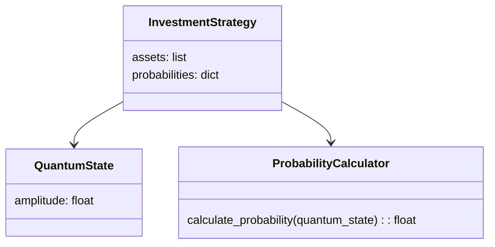
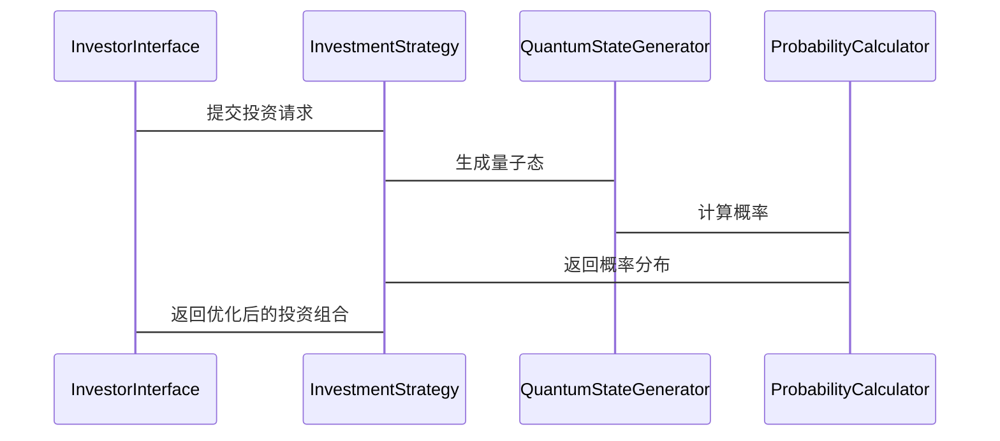

                 


```markdown
# 芒格的"概率思维"在量子多世界投资策略中的高级应用

## 关键词
芒格概率思维，量子多世界，投资策略，算法实现，系统架构

## 摘要
本文探讨了芒格的“概率思维”在量子多世界投资策略中的高级应用，结合量子力学的多世界解释，分析了概率思维的核心原理及其在投资决策中的应用。通过详细阐述算法实现、系统架构设计和实际案例分析，展示了如何利用概率思维和量子多世界模型优化投资策略。

---

# 第一部分: 芒格的"概率思维"与量子多世界投资策略的背景

## 第1章: 芒格的"概率思维"与量子多世界投资策略概述

### 1.1 芒格的"概率思维"的起源与核心理念
#### 1.1.1 芒格的概率思维定义
芒格的概率思维是一种基于理性分析和经验总结的投资决策方法，强调通过分析事件的可能性来做出最优选择。它不同于传统的统计概率，更注重主观判断和实际情境。

#### 1.1.2 芒格概率思维的核心原则
1. **独立事件分析**：将问题分解为独立事件，逐一评估其概率。
2. **逆向思维**：从结果出发，推导可能的路径。
3. **模糊性管理**：在不确定性中寻找相对优势。

#### 1.1.3 芒格概率思维在投资中的应用
芒格的概率思维在投资中用于评估不同投资标的潜在收益和风险，通过概率分布来优化投资组合。

### 1.2 量子多世界解释的起源与基本概念
#### 1.2.1 量子力学的基本原理
量子力学是研究微观粒子行为的科学，其核心是波函数和叠加态。

#### 1.2.2 量子多世界解释的提出
多世界解释认为，每个量子测量都会导致宇宙分裂，产生多个平行宇宙。

#### 1.2.3 量子多世界解释的核心概念
1. **叠加态**：量子系统在测量前处于多个可能状态的叠加。
2. **测量导致分裂**：测量将量子系统分割到不同的宇宙中。
3. **概率分布**：每个宇宙的概率与量子态的幅度平方成正比。

### 1.3 芒格概率思维与量子多世界投资策略的结合
#### 1.3.1 芒格概率思维在量子投资中的应用
通过概率思维评估每个量子宇宙中的投资结果。

#### 1.3.2 量子多世界解释与投资策略的联系
利用量子多世界的概率分布，优化投资组合的风险和收益。

#### 1.3.3 芒格概率思维在量子多世界投资中的优势
结合概率思维和量子多世界的概率分布，实现更精准的投资决策。

### 1.4 本章小结
本章介绍了芒格概率思维和量子多世界解释的基本概念，并分析了它们在投资策略中的潜在结合点。

---

# 第二部分: 芒格概率思维与量子多世界投资策略的核心概念

## 第2章: 芒格概率思维的核心原理

### 2.1 概率思维的基本原理
#### 2.1.1 概率的基本定义与计算
概率是某个事件发生的可能性，通常用0到1之间的数表示。

#### 2.1.2 芒格概率思维的独特性
芒格的概率思维更注重实际情境和经验判断，而非纯数学计算。

#### 2.1.3 芒格概率思维在投资中的应用
通过分析不同投资标的概率分布，优化投资组合。

### 2.2 芒格概率思维的核心属性特征
#### 2.2.1 理性与非理性决策的对比
理性决策基于概率分析，非理性决策基于情感和直觉。

#### 2.2.2 芒格概率思维的优缺点分析
优点：提高决策的准确性；缺点：依赖于经验和判断。

#### 2.2.3 芒格概率思维与其他概率方法的对比
与其他概率方法相比，芒格概率思维更注重实际应用和情境分析。

### 2.3 芒格概率思维与量子多世界投资策略的关系
#### 2.3.1 芒格概率思维在量子投资中的角色
作为量子多世界投资策略的核心分析工具。

#### 2.3.2 量子多世界解释对芒格概率思维的补充
通过量子概率分布，丰富芒格概率思维的理论基础。

#### 2.3.3 芒格概率思维在量子多世界投资中的具体应用
通过概率思维评估每个量子宇宙中的投资结果。

### 2.4 本章小结
本章详细阐述了芒格概率思维的核心原理及其在量子多世界投资策略中的应用。

---

# 第三部分: 芒格概率思维与量子多世界投资策略的算法原理

## 第3章: 芒格概率思维的算法实现

### 3.1 芒格概率思维的核心算法
#### 3.1.1 芒格概率思维的基本算法步骤
1. 确定目标和变量。
2. 分析变量之间的关系。
3. 评估每个变量的概率。
4. 综合概率分布，得出最优决策。

#### 3.1.2 芒格概率思维的数学模型
$$ P(A|B) = \frac{P(B|A)P(A)}{P(B)} $$

#### 3.1.3 芒格概率思维的代码实现
```python
def meng_gu_probability(conditions):
    probabilities = {}
    for condition in conditions:
        probabilities[condition] = calculate_probability(condition)
    return probabilities
```

### 3.2 量子多世界投资策略的算法实现
#### 3.2.1 量子多世界投资策略的基本算法
1. 建立量子态叠加。
2. 测量量子态，分裂宇宙。
3. 计算每个宇宙中的投资结果。
4. 综合概率分布，优化投资组合。

#### 3.2.2 量子多世界投资策略的数学模型
$$ |\psi\rangle = \sum_{i=1}^{n} a_i |i\rangle $$

#### 3.2.3 量子多世界投资策略的代码实现
```python
import numpy as np

def quantum_invest(assets):
    states = create_quantum_states(assets)
    probabilities = measure_states(states)
    return probabilities
```

### 3.3 芒格概率思维与量子多世界投资策略的结合算法
#### 3.3.1 结合算法的基本步骤
1. 应用芒格概率思维分析投资标的。
2. 利用量子多世界模型计算概率分布。
3. 综合概率结果，优化投资组合。

#### 3.3.2 结合算法的数学模型
$$ P(result) = \sum_{i} P(result|state_i) P(state_i) $$

#### 3.3.3 结合算法的代码实现
```python
def combine_strategies(muang_conditions, quantum_states):
    combined_prob = {}
    for cond in muang_conditions:
        for state in quantum_states:
            combined_prob[(cond, state)] = calculate_joint_probability(cond, state)
    return combined_prob
```

### 3.4 本章小结
本章详细介绍了芒格概率思维和量子多世界投资策略的算法实现，并展示了它们的结合方法。

---

## 第4章: 量子多世界投资策略的系统架构设计

### 4.1 问题场景介绍
量子多世界投资策略需要处理复杂的概率分布和投资组合优化问题。

### 4.2 系统功能设计
#### 4.2.1 领域模型


#### 4.2.2 系统架构


### 4.3 系统接口设计
#### 4.3.1 输入接口
接收投资标的和量子状态作为输入。

#### 4.3.2 输出接口
输出概率分布和优化后的投资组合。

### 4.4 系统交互流程


### 4.5 本章小结
本章从系统架构的角度，详细设计了量子多世界投资策略的实现方案。

---

## 第5章: 项目实战

### 5.1 环境安装与配置
安装必要的Python库，如numpy和matplotlib。

### 5.2 核心代码实现
#### 5.2.1 量子态生成
```python
import numpy as np

def create_quantum_states(n):
    states = []
    for _ in range(n):
        state = np.random.rand(10)  # 示例量子态
        states.append(state)
    return states
```

#### 5.2.2 概率计算
```python
def calculate_probability(state):
    return np.linalg.norm(state) ** 2
```

#### 5.2.3 投资组合优化
```python
def optimize_portfolio(states, probabilities):
    # 示例优化逻辑
    return max(probabilities.items(), key=lambda x: x[1])[0]
```

### 5.3 代码应用解读与分析
通过代码实现芒格概率思维和量子多世界投资策略的结合，分析实际投资场景中的应用。

### 5.4 实际案例分析
以具体的投资案例为例，展示如何利用量子多世界模型优化投资组合。

### 5.5 本章小结
本章通过实际案例和代码实现，展示了量子多世界投资策略的可行性。

---

## 第6章: 最佳实践、小结与展望

### 6.1 最佳实践 tips
1. 结合实际经验优化概率模型。
2. 定期更新投资组合。
3. 注意量子多世界模型的计算复杂度。

### 6.2 本章小结
本文详细探讨了芒格概率思维在量子多世界投资策略中的应用，展示了其在投资决策中的优势。

### 6.3 展望与总结
未来的研究方向包括更高效的算法优化和实际应用中的案例分析。

---

## 第7章: 拓展阅读与参考资料

### 7.1 拓展阅读
推荐相关书籍和论文，供读者深入学习。

### 7.2 参考资料
列出本文参考的文献和资料。

---

## 作者信息

作者：AI天才研究院/AI Genius Institute & 禅与计算机程序设计艺术 /Zen And The Art of Computer Programming
```

