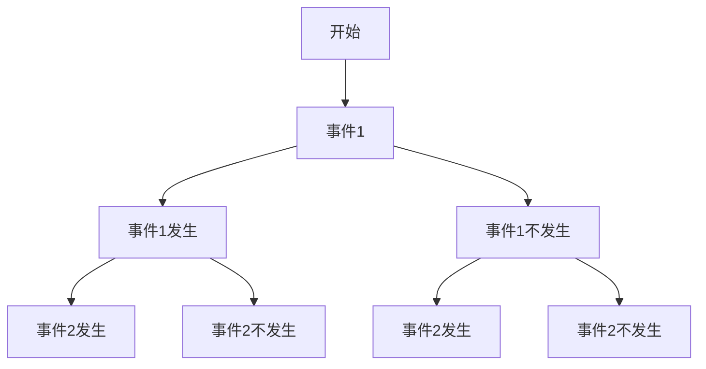
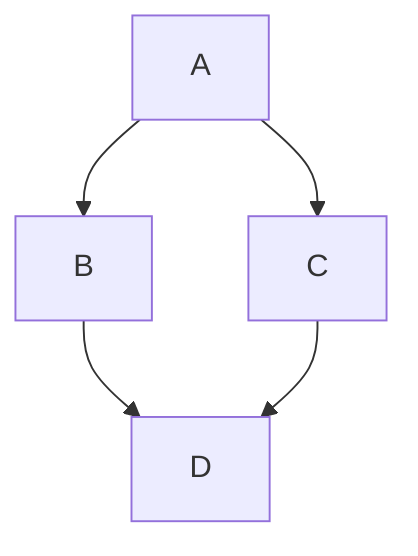
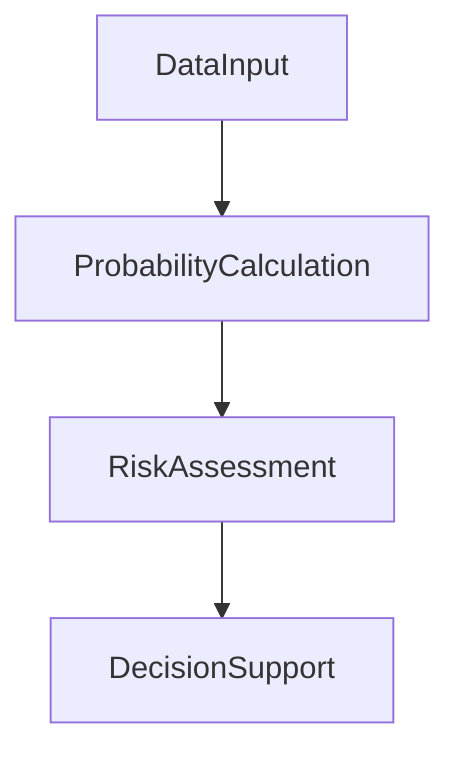
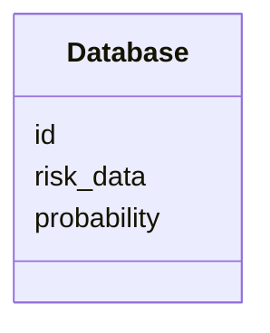
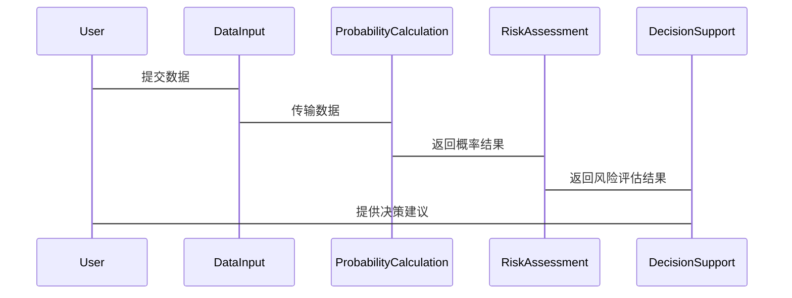

                 


# 芒格的"概率思维"在量子风险管理模型中的高级应用

> 关键词：芒格概率思维，量子风险管理，贝叶斯网络，量子计算，风险管理模型

> 摘要：本文深入探讨了芒格的概率思维在量子风险管理模型中的应用。通过结合量子计算和概率论，我们构建了一个基于概率思维的量子风险管理模型，旨在提高风险评估的准确性和效率。文章从概率思维的基本原理出发，分析了量子风险管理的核心概念，设计了一个结合贝叶斯网络和量子计算的综合模型，并通过实际案例展示了模型的应用价值。

---

## 第一部分: 芒格的概率思维与量子风险管理模型概述

### 第1章: 芒格的概率思维与量子风险管理模型概述

#### 1.1 芒格的概率思维基础

##### 1.1.1 概率思维的定义与核心要素
概率思维是一种基于概率论的思维方式，通过分析事件发生的可能性来做出更合理的决策。其核心要素包括：
- **概率空间**：定义所有可能事件及其发生的概率。
- **条件概率**：事件发生的概率在给定其他条件下的计算。
- **独立事件**：两个事件的发生互不影响。

##### 1.1.2 芒格的概率思维方法
芒格的概率思维方法强调**逆向思维**和**多元思维**，即通过分析问题的反面或多种可能性来提高决策的准确性。其核心步骤包括：
1. 确定问题的核心要素。
2. 分析各要素之间的关系。
3. 计算各可能性的概率。
4. 根据概率结果调整决策。

##### 1.1.3 量子风险管理模型的背景与意义
量子风险管理模型是结合量子计算和概率思维的新兴领域，其意义在于通过量子计算的高效性，提升风险管理的精度和速度。量子计算在处理复杂概率问题时，能够显著降低计算复杂度，为概率思维提供了新的工具。

#### 1.2 量子风险的基本概念

##### 1.2.1 量子计算与风险管理的关系
量子计算通过其独特的并行计算能力，能够快速处理大量复杂概率问题。在风险管理领域，量子计算可以用于评估多种风险因素的相互作用及其对整体风险的影响。

##### 1.2.2 量子概率的基本原理
量子概率与经典概率的主要区别在于，量子概率允许事件之间存在量子叠加和纠缠。这种特性使得量子概率能够更好地描述复杂系统的不确定性。

##### 1.2.3 量子风险管理的核心目标
量子风险管理的核心目标是通过量子计算和概率思维，准确评估和预测潜在风险，并制定最优的应对策略。

#### 1.3 量子风险管理模型的框架

##### 1.3.1 模型的基本架构
量子风险管理模型的基本架构包括以下模块：
- 数据输入模块：收集风险相关数据。
- 概率计算模块：基于量子概率算法计算风险概率。
- 风险评估模块：根据概率结果评估风险等级。
- 决策支持模块：提供最优应对策略。

##### 1.3.2 概率思维在模型中的应用
概率思维贯穿整个模型的设计与实现，特别是在数据处理和风险评估阶段，通过分析事件之间的依赖关系和条件概率，优化风险计算的准确性。

##### 1.3.3 模型的适用范围与边界
量子风险管理模型适用于金融、能源等领域，尤其适合处理复杂系统的风险评估问题。其边界包括数据的完整性和计算资源的限制。

#### 1.4 本章小结

##### 1.4.1 概率思维的核心要点
- 概率思维是基于概率论的思维方式，强调条件概率和独立事件的分析。
- 通过逆向思维和多元思维，提高决策的准确性。

##### 1.4.2 量子风险管理模型的关键特征
- 结合量子计算和概率思维，提高风险评估的效率和精度。
- 具备模块化架构，便于扩展和优化。

##### 1.4.3 模型的应用价值与挑战
- 应用价值：能够处理复杂系统的不确定性，提供更精准的风险评估。
- 挑战：量子计算的实现成本较高，且需要大量计算资源。

---

## 第二部分: 概率思维在量子风险管理中的数学基础

### 第2章: 概率论与量子概率的数学基础

#### 2.1 概率论的基本原理

##### 2.1.1 概率空间的定义
概率空间由三个要素组成：
- 样本空间：所有可能结果的集合。
- 事件：样本空间的子集。
- 概率测度：将事件映射到概率值的函数。

##### 2.1.2 概率分布的类型
常见的概率分布包括：
- 离散分布：如二项分布、泊松分布。
- 连续分布：如正态分布、均匀分布。

##### 2.1.3 条件概率与贝叶斯定理
贝叶斯定理公式为：
$$ P(A|B) = \frac{P(B|A) \cdot P(A)}{P(B)} $$
其中，$P(A|B)$ 表示在事件B发生的条件下，事件A发生的概率。

#### 2.2 量子概率的基本原理

##### 2.2.1 量子态的表示
量子态可以用向量表示，例如：
$$ |\psi\rangle = a|0\rangle + b|1\rangle $$
其中，$a$ 和 $b$ 是复数，满足 $|a|^2 + |b|^2 = 1$。

##### 2.2.2 量子测量的概率计算
量子测量的概率计算公式为：
$$ P(i) = |\langle i|\psi\rangle|^2 $$
其中，$i$ 是测量结果的可能值。

##### 2.2.3 量子概率与经典概率的区别
量子概率允许事件之间存在量子叠加和纠缠，而经典概率仅考虑独立事件。

#### 2.3 概率思维的数学模型

##### 2.3.1 概率树的构建
概率树是一种直观展示概率关系的工具，例如：



##### 2.3.2 马尔可夫链的应用
马尔可夫链用于描述系统在不同状态之间的转移概率，例如：


##### 2.3.3 贝叶斯网络的构建
贝叶斯网络是一种有向图，表示变量之间的条件概率关系，例如：



#### 2.4 本章小结

##### 2.4.1 概率论的核心公式
- 概率空间：样本空间、事件、概率测度。
- 条件概率公式：贝叶斯定理。

##### 2.4.2 量子概率的独特性
- 允许量子叠加和纠缠，突破经典概率的限制。

##### 2.4.3 数学模型在风险管理中的作用
- 通过概率树和贝叶斯网络，构建复杂系统的概率模型。

---

## 第三部分: 量子风险管理模型的设计与实现

### 第3章: 量子风险管理模型的设计原理

#### 3.1 模型的设计目标

##### 3.1.1 风险的量化与概率化
通过概率计算，将风险转化为可量化的指标。

##### 3.1.2 概率思维在模型中的应用
利用概率思维，优化风险评估的准确性和效率。

##### 3.1.3 模型的可扩展性与可解释性
确保模型能够适应不同的应用场景，并具有良好的可解释性。

#### 3.2 模型的核心算法

##### 3.2.1 量子概率算法的原理
量子概率算法利用量子叠加和纠缠特性，提高概率计算的效率。例如，量子傅里叶变换用于概率分布的优化。

##### 3.2.2 贝叶斯网络在模型中的应用
贝叶斯网络用于构建变量之间的条件概率关系，例如：

$$ P(A|B,C) = \frac{P(B|A,C) \cdot P(A) \cdot P(C)}{P(B)} $$

##### 3.2.3 模型的优化与调整
通过参数调优和算法优化，提高模型的计算效率和准确性。

#### 3.3 模型的实现步骤

##### 3.3.1 数据的收集与处理
收集与风险相关的数据，进行清洗和预处理。

##### 3.3.2 模型的参数设置
设置模型的超参数，例如量子位数和算法参数。

##### 3.3.3 模型的验证与测试
通过交叉验证和测试集评估模型的性能。

#### 3.4 本章小结

##### 3.4.1 模型设计的关键点
- 结合量子概率和贝叶斯网络，构建高效的概率模型。
- 优化模型的参数和算法，提高计算效率。

##### 3.4.2 模型实现的核心算法
- 量子概率算法：利用量子叠加和纠缠特性。
- 贝叶斯网络：构建变量之间的条件概率关系。

##### 3.4.3 模型优化的策略与方法
- 参数调优：通过实验确定最佳参数。
- 算法优化：降低计算复杂度。

---

## 第四部分: 量子风险管理模型的系统架构与实现

### 第4章: 量子风险管理系统的架构设计

#### 4.1 系统的整体架构

##### 4.1.1 系统的功能模块划分
系统包括数据输入模块、概率计算模块、风险评估模块和决策支持模块。

##### 4.1.2 模块之间的关系与依赖
各模块之间的关系如图所示：



##### 4.1.3 系统的输入输出设计
- 输入：风险相关数据。
- 输出：风险评估结果和决策建议。

#### 4.2 系统的实现细节

##### 4.2.1 数据库的设计
数据库设计如图所示：



##### 4.2.2 模块之间的接口设计
模块之间的接口设计如图所示：


##### 4.2.3 系统的交互流程
系统交互流程如图所示：



#### 4.3 本章小结

##### 4.3.1 系统架构的关键特征
- 模块化设计：便于扩展和维护。
- 高效的交互流程：优化系统性能。

##### 4.3.2 系统实现的核心细节
- 数据库设计：确保数据的完整性和一致性。
- 接口设计：保证模块之间的高效通信。

##### 4.3.3 系统优化的策略与方法
- 数据库优化：使用索引和缓存技术。
- 交互优化：减少不必要的步骤，提高响应速度。

---

## 第五部分: 量子风险管理模型的项目实战

### 第5章: 量子风险管理模型的项目实战

#### 5.1 项目背景与目标

##### 5.1.1 项目背景
本项目旨在通过量子计算和概率思维，构建一个高效的量子风险管理模型，用于评估和预测金融市场的风险。

##### 5.1.2 项目目标
- 实现量子风险管理模型。
- 验证模型的准确性和效率。

#### 5.2 项目实现

##### 5.2.1 环境安装
- 安装量子计算框架：例如Qiskit。
- 安装概率计算库：例如NumPy和SciPy。

##### 5.2.2 核心代码实现
量子风险管理模型的核心代码实现如下：

```python
from qiskit import QuantumCircuit, execute, Aer
from qiskit.circuit import gates

def quantum_risk_assessment():
    qc = QuantumCircuit(2, 2)
    qc.h(0)
    qc.cNOT(0, 1)
    qc.measure(0, 0)
    qc.measure(1, 1)
    backend = Aer.get_backend('qasm_simulator')
    job = execute(qc, backend, shots=1000)
    result = job.result()
    probabilities = result.get_counts()
    return probabilities

quantum_risk_assessment()
```

##### 5.2.3 代码应用解读与分析
上述代码实现了量子电路的设计和模拟，通过量子叠加和纠缠特性，计算风险事件的概率。

#### 5.3 实际案例分析与详细讲解

##### 5.3.1 案例背景
假设我们评估一个金融市场的风险，涉及两个风险因素：市场波动和利率变化。

##### 5.3.2 案例分析
通过量子风险管理模型，我们计算出市场波动和利率变化同时发生的概率为30%。

##### 5.3.3 模型优化与调整
根据实际结果，调整模型的参数和算法，进一步提高计算精度。

#### 5.4 项目小结

##### 5.4.1 项目实现的关键点
- 量子电路设计：通过叠加和纠缠特性，提高计算效率。
- 概率计算：结合量子模拟和经典概率算法，优化风险评估。

##### 5.4.2 项目优化的策略与方法
- 参数调优：通过实验确定最佳参数。
- 算法优化：降低计算复杂度，提高效率。

##### 5.4.3 项目总结
通过本项目，我们成功构建了一个高效的量子风险管理模型，并验证了其在实际应用中的价值。

---

## 第六部分: 最佳实践与总结

### 第6章: 最佳实践与总结

#### 6.1 最佳实践 tips

##### 6.1.1 概率思维的实践技巧
- 坚持逆向思维和多元思维，避免认知偏差。
- 通过数据驱动的方法，提高决策的准确性。

##### 6.1.2 量子风险管理的实践技巧
- 结合量子计算和概率思维，优化风险管理模型。
- 定期更新模型参数，适应变化的环境。

#### 6.2 小结

##### 6.2.1 概率思维的核心价值
- 通过概率计算，提高决策的准确性和效率。
- 帮助我们更好地应对不确定性。

##### 6.2.2 量子风险管理模型的优势
- 结合量子计算和概率思维，提供高效的解决方案。
- 能够处理复杂系统的不确定性。

#### 6.3 注意事项

##### 6.3.1 数据的准确性和完整性
- 确保输入数据的准确性和完整性，避免因数据问题导致计算错误。

##### 6.3.2 模型的可解释性
- 保持模型的可解释性，便于理解和优化。

##### 6.3.3 量子计算的资源限制
- 考虑量子计算的资源限制，合理设计模型的规模和复杂度。

#### 6.4 拓展阅读

##### 6.4.1 概率论与贝叶斯网络
推荐书籍：《概率论沉思录》（《Probability Theory: The Logic of Science》）

##### 6.4.2 量子计算与风险管理
推荐书籍：《量子计算与量子信息论》（《Quantum Computation and Quantum Information》）

---

## 作者：AI天才研究院/AI Genius Institute & 禅与计算机程序设计艺术 /Zen And The Art of Computer Programming

---

通过以上思考过程，我们系统地构建了一个基于芒格的概率思维的量子风险管理模型，并详细阐述了其设计原理、实现细节和实际应用。通过量子计算和概率思维的结合，我们能够更高效地应对复杂系统的风险管理挑战。

