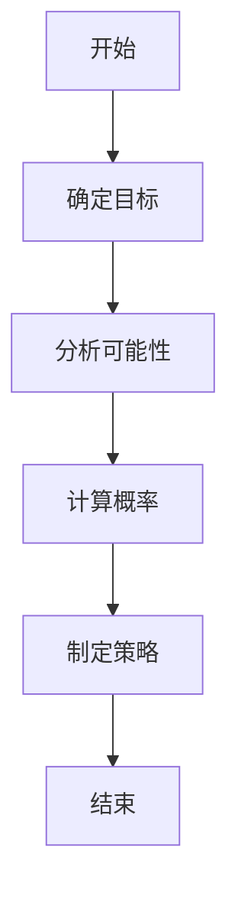
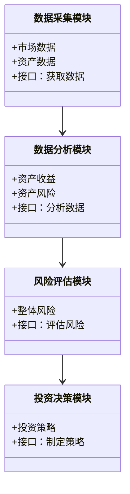
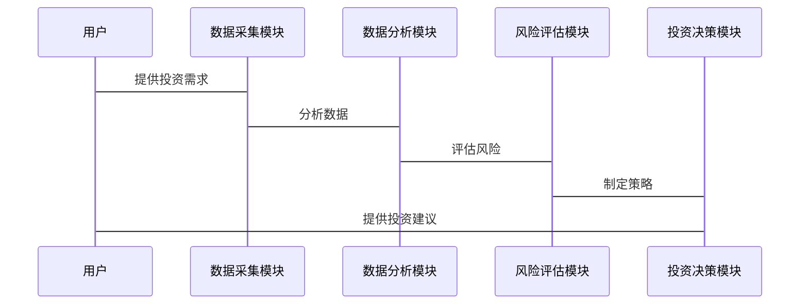

                 


```markdown
# 芒格的"概率思维"在风险投资组合管理中的高级应用

> 关键词：概率思维，风险投资，投资组合管理，贝叶斯定理，蒙特卡洛模拟，逆向思维，第二层思维，概率树分析，风险管理，投资决策

> 摘要：本文深入探讨了芒格的“概率思维”在风险投资组合管理中的高级应用。通过分析概率思维的核心概念、算法原理和系统架构，结合实际案例，展示了如何利用概率思维提升投资决策的准确性和风险管理能力。文章内容涵盖概率树分析、贝叶斯定理、蒙特卡洛模拟等技术，为读者提供了从理论到实践的全面指导。

---

## 第1章: 芒格概率思维概述

### 1.1 概率思维的基本概念

#### 1.1.1 概率思维的定义
概率思维是一种通过分析事件发生的可能性来做出决策的思维方式。它强调在不确定性和模糊性中，利用概率模型来评估不同选择的潜在风险和收益。

#### 1.1.2 芒格概率思维的核心理念
芒格的“概率思维”以逆向思维和第二层思维为核心，强调从对立面思考问题，考虑事件发生的多种可能性，并评估每种情况发生的概率。

#### 1.1.3 概率思维在投资中的重要性
在投资组合管理中，概率思维帮助投资者评估不同资产的潜在风险和收益，优化投资组合，降低整体风险。

### 1.2 芒格的思维方式

#### 1.2.1 逆向思维的定义与特点
逆向思维是指从相反的角度思考问题，寻找较少人关注的机会，降低竞争压力。

#### 1.2.2 第二层思维的概念与应用
第二层思维是指考虑市场的第二层反应，即市场对市场的反应。这种思维方式帮助投资者预测市场走势，制定更明智的投资策略。

#### 1.2.3 概率树分析的基本原理
概率树是一种图形工具，用于展示不同事件及其发生的概率。通过概率树，投资者可以系统地分析各种可能的市场情况及其概率，制定相应的投资策略。

### 1.3 投资组合管理中的概率思维

#### 1.3.1 投资组合管理的基本概念
投资组合管理是通过优化资产配置，降低风险，提高收益的过程。概率思维在这一过程中起着关键作用。

#### 1.3.2 概率思维在投资组合管理中的作用
概率思维帮助投资者评估不同资产的潜在风险和收益，优化资产配置，降低整体投资组合的风险。

#### 1.3.3 风险管理与概率思维的结合
通过概率思维，投资者可以量化不同风险因素的影响，制定风险管理策略，降低投资组合的整体风险。

---

## 第2章: 芒格概率思维的核心概念与联系

### 2.1 概率思维的核心原理

#### 2.1.1 贝叶斯定理的基本原理
贝叶斯定理是一种用于更新概率的定理，通过已知条件概率，更新事件发生的概率。其公式为：

$$ P(A|B) = \frac{P(B|A) \cdot P(A)}{P(B)} $$

#### 2.1.2 概率分布的类型与特点
概率分布描述了随机变量可能的取值及其对应的概率。常见的概率分布包括正态分布、泊松分布和二项分布。

#### 2.1.3 条件概率的应用场景
条件概率用于计算在已知某一事件发生的情况下，另一事件发生的概率。例如，计算在市场下跌的情况下，某资产价格上涨的概率。

### 2.2 核心概念对比分析

#### 2.2.1 概率思维与确定性思维的对比
概率思维强调可能性和不确定性，而确定性思维则假设事件是确定的。在投资中，概率思维更符合现实情况。

#### 2.2.2 不同概率模型的优缺点对比
- **概率树分析**：优点是直观，缺点是计算复杂。
- **贝叶斯网络**：优点是动态调整，缺点是计算复杂。
- **蒙特卡洛模拟**：优点是全面，缺点是计算量大。

#### 2.2.3 概率思维与投资决策的关系
概率思维是投资决策的基础，通过量化风险和收益，帮助投资者做出更明智的决策。

### 2.3 实体关系图与流程图

#### 2.3.1 概率思维的ER实体关系图
```mermaid
erDiagram
    actor 投资者
    actor 市场
    actor 风险
    actor 收益
    investor --> 市场 : 影响
    市场 --> 收益 : 产生
    风险 --> 收益 : 影响
```

#### 2.3.2 芒格概率思维的Mermaid流程图


---

## 第3章: 芒格概率思维的算法原理

### 3.1 概率模型的构建与应用

#### 3.1.1 概率树的构建步骤
1. 确定所有可能的事件。
2. 计算每个事件发生的概率。
3. 绘制概率树，展示事件及其概率。

#### 3.1.2 贝叶斯网络的构建与应用
贝叶斯网络通过节点和边表示变量之间的关系，用于计算条件概率。例如，计算在市场上涨的情况下，某资产价格上涨的概率。

#### 3.1.3 蒙特卡洛模拟的基本原理
蒙特卡洛模拟通过随机抽样，模拟各种可能的市场情况，评估投资组合的潜在风险和收益。

### 3.2 算法原理的数学模型和公式

#### 3.2.1 贝叶斯定理的公式推导
贝叶斯定理的公式为：

$$ P(A|B) = \frac{P(B|A) \cdot P(A)}{P(B)} $$

其中，\( P(A|B) \) 是在已知B发生的条件下，A发生的概率。

#### 3.2.2 条件概率的公式与应用
条件概率的公式为：

$$ P(A|B) = \frac{P(A \cap B)}{P(B)} $$

条件概率在投资中用于评估在特定市场条件下，资产价格上涨的概率。

#### 3.2.3 蒙特卡洛模拟的数学基础
蒙特卡洛模拟通过随机数生成，模拟各种市场情况，评估投资组合的潜在风险和收益。其数学基础是概率分布和随机变量。

### 3.3 算法实现与代码示例

#### 3.3.1 概率树的Python代码实现
```python
import numpy as np
import matplotlib.pyplot as plt

# 概率树示例
def plot_probability_tree():
    plt.figure(figsize=(10, 4))
    plt.title('Probability Tree')
    plt.text(0.2, 0.8, '市场上涨', ha='center', va='center')
    plt.text(0.6, 0.8, '市场下跌', ha='center', va='center')
    plt.text(0.2, 0.4, '资产上涨', ha='center', va='center')
    plt.text(0.6, 0.4, '资产下跌', ha='center', va='center')
    plt.text(0.2, 0.2, '概率0.7', ha='center', va='center')
    plt.text(0.6, 0.2, '概率0.3', ha='center', va='center')
    plt.axis('off')
    plt.show()

plot_probability_tree()
```

#### 3.3.2 贝叶斯网络的Python代码示例
```python
from sklearn.naive_bayes import GaussianNB
import numpy as np

# 贝叶斯网络示例
X = np.array([[1], [2], [3], [4], [5]])
y = np.array([0, 0, 1, 1, 1])

model = GaussianNB()
model.fit(X, y)

print(model.predict([[3]]))  # 输出预测结果
```

#### 3.3.3 蒙特卡洛模拟的Python代码实现
```python
import numpy as np
import matplotlib.pyplot as plt

# 蒙特卡洛模拟示例
np.random.seed(42)
simulations = 1000
returns = np.random.normal(0.05, 0.15, simulations)

plt.hist(returns, bins=20)
plt.xlabel('收益率')
plt.ylabel('频数')
plt.title('蒙特卡洛模拟结果')
plt.show()
```

---

## 第4章: 投资组合管理中的系统分析与架构设计

### 4.1 投资组合管理的系统分析

#### 4.1.1 投资组合管理的系统架构
投资组合管理系统包括数据采集、数据分析、风险评估和投资决策模块。

#### 4.1.2 系统功能模块划分
1. 数据采集模块：收集市场数据。
2. 数据分析模块：分析数据，评估资产风险和收益。
3. 风险评估模块：评估投资组合的整体风险。
4. 投资决策模块：制定投资策略。

#### 4.1.3 系统功能的领域模型Mermaid类图


#### 4.1.4 系统架构设计
系统采用分层架构，包括数据层、业务逻辑层和用户界面层。

#### 4.1.5 系统交互流程
1. 用户输入投资需求。
2. 系统采集市场数据。
3. 系统分析数据，评估风险。
4. 系统制定投资策略。
5. 系统输出投资建议。

#### 4.1.6 系统接口设计
- 数据采集接口：获取市场数据。
- 数据分析接口：分析资产风险和收益。
- 风险评估接口：评估整体风险。
- 投资决策接口：制定投资策略。

#### 4.1.7 系统交互流程的Mermaid序列图


---

## 第5章: 项目实战

### 5.1 环境安装与配置

#### 5.1.1 Python环境的安装
安装Python和必要的库，如numpy、pandas和matplotlib。

#### 5.1.2 数据库的安装与配置
安装MySQL或PostgreSQL，配置数据库连接。

#### 5.1.3 开发工具的安装
安装PyCharm或Jupyter Notebook，配置开发环境。

### 5.2 系统核心实现源代码

#### 5.2.1 概率树分析的代码实现
```python
import numpy as np
import matplotlib.pyplot as plt

def plot_probability_tree():
    plt.figure(figsize=(10, 4))
    plt.title('Probability Tree')
    plt.text(0.2, 0.8, '市场上涨', ha='center', va='center')
    plt.text(0.6, 0.8, '市场下跌', ha='center', va='center')
    plt.text(0.2, 0.4, '资产上涨', ha='center', va='center')
    plt.text(0.6, 0.4, '资产下跌', ha='center', va='center')
    plt.text(0.2, 0.2, '概率0.7', ha='center', va='center')
    plt.text(0.6, 0.2, '概率0.3', ha='center', va='center')
    plt.axis('off')
    plt.show()

plot_probability_tree()
```

#### 5.2.2 贝叶斯网络的代码实现
```python
from sklearn.naive_bayes import GaussianNB
import numpy as np

X = np.array([[1], [2], [3], [4], [5]])
y = np.array([0, 0, 1, 1, 1])

model = GaussianNB()
model.fit(X, y)

print(model.predict([[3]]))
```

#### 5.2.3 蒙特卡洛模拟的代码实现
```python
import numpy as np
import matplotlib.pyplot as plt

np.random.seed(42)
simulations = 1000
returns = np.random.normal(0.05, 0.15, simulations)

plt.hist(returns, bins=20)
plt.xlabel('收益率')
plt.ylabel('频数')
plt.title('蒙特卡洛模拟结果')
plt.show()
```

### 5.3 代码应用解读与分析

#### 5.3.1 概率树分析的代码解读
上述代码通过Matplotlib绘制概率树，展示市场和资产的可能走势及其概率。

#### 5.3.2 贝叶斯网络的代码解读
代码使用scikit-learn的GaussianNB实现贝叶斯网络，用于分类问题，预测资产走势。

#### 5.3.3 蒙特卡洛模拟的代码解读
代码生成模拟的资产收益率分布，帮助投资者评估潜在风险。

### 5.4 实际案例分析与详细讲解剖析

#### 5.4.1 案例背景
假设我们要优化一个包含股票、债券和房地产的投资组合。

#### 5.4.2 数据收集与分析
收集各资产的历史收益率和波动率数据。

#### 5.4.3 概率模型构建与应用
构建概率树，评估各资产在不同市场情况下的表现及其概率。

#### 5.4.4 投资组合优化
根据概率模型，优化资产配置，降低整体风险，提高预期收益。

#### 5.4.5 风险评估与管理
评估投资组合的整体风险，制定风险管理策略，如设置止损点和分散投资。

#### 5.4.6 投资策略制定
基于概率模型和风险评估结果，制定长期投资策略。

#### 5.4.7 投资组合再平衡
定期调整投资组合，保持预期的资产配置比例，应对市场变化。

### 5.5 项目小结

#### 5.5.1 项目成果
通过概率思维优化投资组合，降低整体风险，提高预期收益。

#### 5.5.2 项目经验
概率思维是投资决策的重要工具，能够帮助投资者在不确定性和模糊性中做出更明智的决策。

#### 5.5.3 项目不足
概率模型的准确性依赖于数据和假设，实际操作中需要不断调整和优化。

---

## 第6章: 最佳实践 tips、小结、注意事项、拓展阅读

### 6.1 最佳实践 tips

#### 6.1.1 定期更新模型
市场环境不断变化，需要定期更新概率模型，确保模型的准确性。

#### 6.1.2 多元化投资
通过多元化投资降低风险，避免过度依赖单一资产。

#### 6.1.3 合理设置止损
设置止损点，控制投资组合的潜在损失。

#### 6.1.4 持续学习与改进
不断学习新的概率模型和投资策略，提升投资决策的准确性。

### 6.2 小结

#### 6.2.1 概率思维的重要性
概率思维是投资决策的核心工具，帮助投资者量化风险和收益，优化资产配置。

#### 6.2.2 投资组合管理的关键点
通过概率模型和系统分析，优化投资组合，降低风险，提高收益。

### 6.3 注意事项

#### 6.3.1 模型的局限性
概率模型基于假设和数据，可能存在误差，需要结合实际情况进行调整。

#### 6.3.2 数据的质量
数据的质量直接影响模型的准确性，需要确保数据的完整性和准确性。

#### 6.3.3 市场的不确定性
市场环境复杂多变，概率模型只能提供参考，不能保证100%准确。

#### 6.3.4 风险管理的重要性
无论模型如何，风险管理都是投资组合管理的核心，需要持续关注和调整。

### 6.4 拓展阅读

#### 6.4.1 推荐书籍
1. 《投资学》（书籍名称）
2. 《概率论与数理统计》（书籍名称）
3. 《芒格的投资思想》（书籍名称）

#### 6.4.2 推荐文章
1. "概率思维在金融投资中的应用"
2. "贝叶斯定理与投资决策"
3. "蒙特卡洛模拟在风险管理中的应用"

#### 6.4.3 推荐在线课程
1. "概率思维与投资决策"（在线课程名称）
2. "贝叶斯网络与风险管理"（在线课程名称）
3. "蒙特卡洛模拟实战"（在线课程名称）

---

## 作者信息

作者：AI天才研究院/AI Genius Institute & 禅与计算机程序设计艺术 /Zen And The Art of Computer Programming
```

