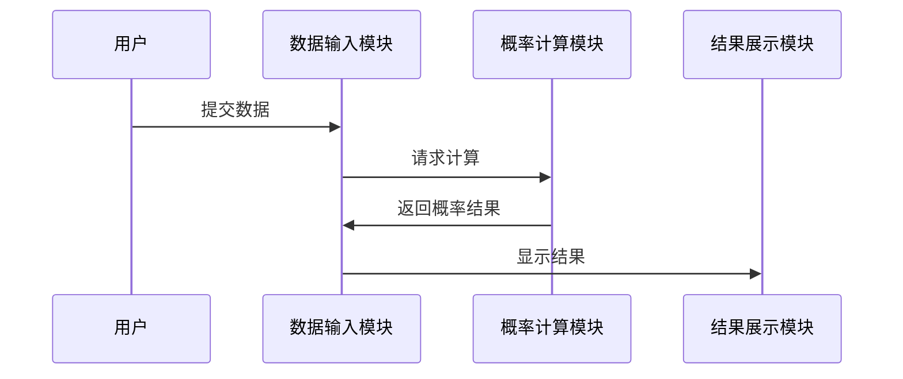

                 


# 芒格的概率思维：在不确定性中做出决策

## 关键词：概率思维、芒格、决策模型、贝叶斯定理、蒙特卡洛模拟、风险管理

## 摘要：  
芒格的概率思维是一种通过分析不确定性来做出明智决策的方法。本文将从概率思维的背景、数学基础、实际应用到系统设计进行全面解析，帮助读者理解如何在复杂决策中运用概率思维。通过贝叶斯定理和蒙特卡洛模拟等工具，我们将探讨如何量化不确定性，并基于概率分析做出更优决策。

---

## 第一部分: 芒格的概率思维基础

### 第1章: 概率思维的背景与重要性

#### 1.1 概率思维的核心概念

##### 1.1.1 什么是概率思维  
概率思维是一种通过分析事件发生的可能性来指导决策的思维方式。它帮助我们在不确定性中量化风险和机会，从而做出更理性的选择。

##### 1.1.2 概率思维的应用场景  
概率思维广泛应用于投资、风险管理、医疗诊断、人工智能等领域。例如，在投资决策中，概率思维可以帮助我们评估某个投资的潜在收益和风险。

##### 1.1.3 概率思维与决策的关系  
概率思维是决策科学的核心工具之一。通过概率分析，我们可以更准确地评估不同选择的可能结果，并选择最优策略。

#### 1.2 芒格的概率思维特点

##### 1.2.1 芒格思维模型的概述  
芒格思维模型强调通过多元思维（包括概率论、心理学、经济学等）来分析问题。概率思维在其中扮演了重要角色，帮助芒格做出卓越的投资决策。

##### 1.2.2 概率思维在芒格决策中的作用  
芒格通过概率思维评估投资的可能结果，尤其是在面对模糊性和不确定性时，他能够通过概率分析降低决策风险。

##### 1.2.3 芒格概率思维的独特性  
芒格的概率思维结合了对人性的深刻理解，他不仅分析数据，还考虑人类行为的非理性因素，从而做出更全面的决策。

---

### 第2章: 概率论基础

#### 2.1 概率的基本原理

##### 2.1.1 概率的定义与性质  
概率是对某一事件发生的可能性的度量，范围在0（不可能发生）到1（必然发生）之间。概率具有可加性、条件性和独立性等性质。

##### 2.1.2 概率的加法法则  
如果两个事件互斥，则它们的概率可以相加。例如，P(A ∨ B) = P(A) + P(B)，前提是A和B互斥。

##### 2.1.3 条件概率与独立事件  
条件概率P(A|B)表示在B发生的情况下，A发生的概率。如果两个事件独立，则P(A|B) = P(A)。

#### 2.2 概率分布与随机变量

##### 2.2.1 离散型随机变量  
离散型随机变量取值为可数个，例如掷骰子的结果。其概率分布可以用概率质量函数表示。

##### 2.2.2 连续型随机变量  
连续型随机变量取值为不可数个，例如身高、体重。其概率分布可以用概率密度函数表示。

##### 2.2.3 常见的概率分布  
- 正态分布：描述对称数据，如身高、考试成绩。
- 二项分布：描述成功或失败的次数，如抛硬币出现正面的次数。

---

### 第3章: 芒格概率思维的数学模型

#### 3.1 贝叶斯定理

##### 3.1.1 贝叶斯定理的公式  
贝叶斯定理用于更新基于新证据的概率。公式为：
$$
P(A|B) = \frac{P(B|A) \cdot P(A)}{P(B)}
$$  
其中，P(A)是先验概率，P(B|A)是似然度，P(B)是边际概率。

##### 3.1.2 贝叶斯定理的应用场景  
贝叶斯定理常用于医疗诊断、垃圾邮件分类、信用评分等领域。例如，在医疗诊断中，可以根据症状和检测结果更新疾病概率。

##### 3.1.3 贝叶斯定理的案例分析  
假设我们想知道某人有癌症的概率，已知检测方法的准确率和误诊率。通过贝叶斯定理，我们可以结合检测结果和先验概率，计算出后验概率。

#### 3.2 蒙特卡洛模拟

##### 3.2.1 蒙特卡洛模拟的原理  
蒙特卡洛模拟是一种通过随机采样来估计概率分布的方法。它适用于复杂系统中难以直接计算概率的情况。

##### 3.2.2 蒙特卡洛模拟的步骤  
1. 确定输入变量及其分布。
2. 生成随机样本。
3. 计算输出变量。
4. 统计分析结果。

##### 3.2.3 蒙特卡洛模拟的案例分析  
例如，在投资决策中，我们可以用蒙特卡洛模拟评估不同市场条件下的投资回报率。

---

### 第4章: 概率思维在决策中的应用

#### 4.1 概率思维在投资决策中的应用

##### 4.1.1 投资中的概率分析  
通过概率分析，我们可以评估不同投资的预期收益和风险。例如，计算某投资的期望值和标准差。

##### 4.1.2 如何用概率思维评估投资风险  
通过分析历史数据和市场趋势，我们可以估算不同情景下的概率，并做出更明智的投资决策。

##### 4.1.3 芒格投资决策中的概率思维实例  
芒格在投资伯克希尔时，通过分析公司的基本面和市场环境，计算出成功的概率，并做出投资决策。

#### 4.2 概率思维在风险管理中的应用

##### 4.2.1 风险评估中的概率分析  
通过概率分析，我们可以估算不同风险事件的发生概率，并制定相应的风险管理策略。

##### 4.2.2 如何用概率思维制定风险管理策略  
结合概率分析和风险容忍度，我们可以制定最优的风险管理计划。

##### 4.2.3 案例分析：风险管理中的概率思维应用  
例如，在金融衍生品交易中，通过概率分析评估不同市场波动情况下的风险。

---

### 第5章: 概率思维的系统分析与架构设计

#### 5.1 系统功能设计

##### 5.1.1 概率思维决策系统的功能模块  
- 数据输入模块：接收相关数据。
- 概率计算模块：计算事件发生的概率。
- 结果展示模块：输出概率结果和决策建议。

##### 5.1.2 每个功能模块的实现逻辑  
1. 数据输入模块：用户输入事件的相关数据。
2. 概率计算模块：基于输入数据，计算事件发生的概率。
3. 结果展示模块：将计算结果以可视化方式展示。

##### 5.1.3 模块之间的关系与交互  
数据输入模块将数据传递给概率计算模块，计算结果传递给结果展示模块。

#### 5.2 系统架构设计

##### 5.2.1 系统架构图（Mermaid）  


##### 5.2.2 系统接口设计  
- 数据输入接口：接收用户输入的数据。
- 概率计算接口：调用概率计算模块进行计算。
- 结果展示接口：显示计算结果。

##### 5.2.3 系统交互流程图（Mermaid）  


---

## 第二部分: 项目实战与总结

### 第6章: 项目实战

#### 6.1 环境安装

##### 6.1.1 安装Python  
需要安装Python 3.8或更高版本。

##### 6.1.2 安装依赖库  
安装`numpy`和`matplotlib`用于概率计算和可视化：
```bash
pip install numpy matplotlib
```

#### 6.2 核心实现

##### 6.2.1 贝叶斯定理的Python实现  
```python
def bayesian_probability(A, B, P_A, P_B_given_A, P_B_given_not_A):
    P_A_not = 1 - P_A
    P_B_given_not_A = 1 - P_B_given_A
    P_B = P_B_given_A * P_A + P_B_given_not_A * P_A_not
    return (P_B_given_A * P_A) / P_B

# 示例
P_A = 0.3  # P(A)
P_B_given_A = 0.8  # P(B|A)
P_B_given_not_A = 0.2  # P(B|~A)

result = bayesian_probability(A, B, P_A, P_B_given_A, P_B_given_not_A)
print(f"后验概率 P(A|B) = {result}")
```

##### 6.2.2 蒙特卡洛模拟的Python实现  
```python
import numpy as np
import matplotlib.pyplot as plt

def monte_carlo_simulation(trials, success_prob):
    outcomes = np.random.binomial(1, success_prob, trials)
    success_rate = np.mean(outcomes)
    plt.hist(outcomes, bins=[0, 1], rwidth=0.5)
    plt.show()
    return success_rate

# 示例
trials = 1000
success_prob = 0.3

result = monte_carlo_simulation(trials, success_prob)
print(f"成功概率估计值：{result}")
```

#### 6.3 实际案例分析

##### 6.3.1 投资决策中的概率应用  
假设我们有三个投资选项，每个选项的成功概率分别为0.2、0.5和0.8。通过概率分析，我们可以选择概率最高的选项进行投资。

##### 6.3.2 风险管理中的概率应用  
通过蒙特卡洛模拟，我们可以评估不同市场条件下投资组合的风险和收益。

---

### 第7章: 总结与最佳实践

#### 7.1 总结

##### 7.1.1 芒格概率思维的核心价值  
芒格概率思维通过量化不确定性，帮助我们在复杂决策中做出更理性的选择。

##### 7.1.2 概率思维的实际应用领域  
概率思维在投资、医疗、人工智能等领域都有广泛应用。

##### 7.1.3 概率思维的未来发展趋势  
随着人工智能和大数据技术的发展，概率思维将在更多领域发挥重要作用。

#### 7.2 最佳实践 tips

##### 7.2.1 培养概率思维的方法  
1. 学习概率论基础知识。
2. 实践应用贝叶斯定理和蒙特卡洛模拟。
3. 结合实际案例进行分析。

##### 7.2.2 注意事项  
- 避免过度依赖概率模型，忽略主观判断。
- 确保数据质量和模型的合理性。

##### 7.2.3 拓展阅读  
推荐书籍：《概率论与数理统计》、《贝叶斯分析入门》。

---

## 作者：AI天才研究院 & 禅与计算机程序设计艺术
```

