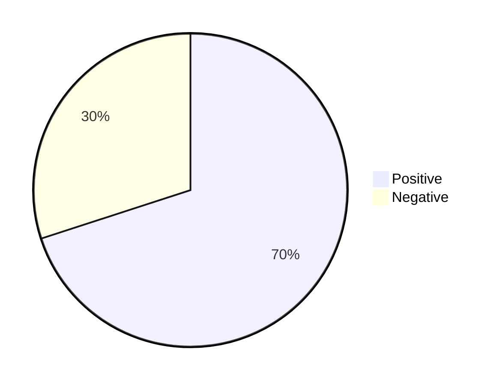

                 


# 《芒格的"概率思维"：在不确定性中做出最优决策》

## 关键词：概率思维、芒格、决策优化、不确定性、多元思维模型

## 摘要：本文深入探讨了芒格的概率思维，分析了其在不确定环境中的决策优化策略。通过背景介绍、核心概念、数学模型和实际案例，揭示了如何构建个人概率思维框架，结合算法和系统架构，最终在项目实战中实现最优决策。文章旨在帮助读者在复杂决策中应用概率思维，提升决策质量。

---

## 第一部分：概率思维的背景与核心概念

### 第1章：概率思维的定义与背景

#### 1.1 概率思维的定义与特点

- **1.1.1 概率思维的定义**
概率思维是一种基于概率论的决策方法，通过量化可能性来优化决策。它不同于确定性决策，强调在不确定性中寻找最优解。

- **1.1.2 概率思维的核心特点**
  - **量化不确定性**：将决策结果的概率化，评估每种可能的结果及其概率。
  - **基于证据的推理**：依赖数据和逻辑，而非直觉或经验。
  - **动态调整**：根据新信息不断更新概率评估。

- **1.1.3 概率思维与其他决策方法的区别**
  - **确定性决策**：假设所有信息已知，结果确定。
  - **模糊决策**：基于模糊信息，结果不明确。
  - **概率决策**：明确概率，优化期望值。

#### 1.2 概率思维的背景与重要性

- **1.2.1 当代决策环境的不确定性**
现代决策问题复杂多变，涉及多个变量，传统方法难以应对。

- **1.2.2 概率思维在决策中的作用**
通过量化可能性，概率思维帮助在不确定性中做出更理性的决策。

- **1.2.3 芒格概率思维的独特性**
芒格的多元思维模型将多个学科的原理结合，提供了独特的视角。

---

## 第二部分：芒格的概率思维原则

### 第2章：芒格的概率思维核心原则

#### 2.1 多元思维模型

- **2.1.1 多元思维模型的定义**
多元思维模型是芒格的核心理念，指通过多个学科的视角分析问题。

- **2.1.2 多元思维模型的构成要素**
  - **基本原理**：物理学、心理学、经济学等学科的基本原理。
  - **反事实分析**：假设不同情况，评估结果。

- **2.1.3 多元思维模型在决策中的应用**
  - **问题分析**：从多角度理解问题。
  - **解决方案**：结合不同视角提出优化方案。

#### 2.2 逆向思维

- **2.2.1 逆向思维的定义**
逆向思维是通过反向思考问题，找到更优解。

- **2.2.2 逆向思维的优势**
  - **简化问题**：从结果反推原因，减少复杂性。
  - **发现新机会**：通过逆向思考找到未被发现的机会。

#### 2.3 避免认知偏差

- **2.3.1 认知偏差的定义**
认知偏差是影响决策的非理性因素，如确认偏见、锚定效应等。

- **2.3.2 避免认知偏差的方法**
  - **自我反思**：定期检查决策中的偏见。
  - **数据驱动**：依赖数据而非直觉。

---

## 第三部分：构建个人概率思维框架

### 第3章：构建个人概率思维框架

#### 3.1 知识储备

- **3.1.1 知识结构**
构建跨学科的知识体系，涵盖数学、心理学、经济学等领域。

- **3.1.2 持续学习**
通过阅读、研究和实践不断更新知识。

#### 3.2 思维习惯培养

- **3.2.1 问题分解**
将复杂问题分解为简单部分，逐一分析。

- **3.2.2 数据分析**
依赖数据和统计方法进行决策，避免主观判断。

#### 3.3 应用方法

- **3.3.1 案例分析**
通过实际案例练习概率思维的应用。

- **3.3.2 反思总结**
定期总结经验教训，优化思维框架。

---

## 第四部分：概率思维的实际应用

### 第4章：实际案例分析

#### 4.1 投资决策

- **4.1.1 概率模型在投资中的应用**
评估不同投资选项的概率回报，选择期望值最高的选项。

- **4.1.2 案例分析**
分析股票市场的波动概率，制定投资策略。

#### 4.2 生活决策

- **4.2.1 日常决策中的概率思维**
评估不同选择的成功概率，做出最优决策。

- **4.2.2 案例分析**
评估搬新家的概率收益，综合考虑各种因素。

#### 4.3 管理决策

- **4.3.1 概率思维在管理中的应用**
评估项目成功的概率，优化资源配置。

- **4.3.2 案例分析**
评估新产品的市场接受度，制定营销策略。

---

## 第五部分：概率思维的数学基础

### 第5章：概率论与贝叶斯定理

#### 5.1 概率论基础

- **5.1.1 基本概念**
  - 样本空间：所有可能结果的集合。
  - 事件：样本空间中的子集。
  - 概率：事件发生的可能性。

- **5.1.2 概率公式**
  - 加法公式：P(A ∪ B) = P(A) + P(B) - P(A ∩ B)
  - 条件概率：P(A|B) = P(A ∩ B) / P(B)

#### 5.2 贝叶斯定理

- **5.2.1 贝叶斯定理的公式**
$$ P(A|B) = \frac{P(B|A) \cdot P(A)}{P(B)} $$

- **5.2.2 应用实例**
  - 示例1：评估疾病检测的准确性。
  - 示例2：评估投资回报的概率。

#### 5.3 Python概率计算示例

```python
import numpy as np
import matplotlib.pyplot as plt

# 生成随机数
np.random.seed(0)
data = np.random.normal(0, 1, 1000)

# 绘制直方图
plt.hist(data, bins=20, density=True, alpha=0.6, color='b')
plt.show()
```

---

## 第六部分：概率思维的系统分析与架构设计

### 第6章：系统分析与架构设计

#### 6.1 问题场景介绍

- **项目介绍**：评估新产品的市场成功概率。
- **系统功能设计**
  - 数据收集：收集市场数据。
  - 概率计算：评估成功概率。
  - 决策支持：基于概率提供决策建议。

#### 6.2 系统架构设计



---

## 第七部分：项目实战

### 第7章：项目实战

#### 7.1 环境安装

- **安装Python**：下载并安装Python 3.x。
- **安装依赖库**：安装numpy、pandas、scipy。

#### 7.2 核心实现

```python
import numpy as np

# 计算概率
def calculate_probability(successes, trials):
    return successes / trials

# 示例使用
prob = calculate_probability(70, 100)
print(f"概率为：{prob}")
```

#### 7.3 案例分析

- **环境介绍**：评估新产品市场成功的概率。
- **数据收集**：收集过去类似产品的成功数据。
- **概率计算**：使用贝叶斯定理更新先验概率。
- **结果分析**：根据概率结果制定市场策略。

---

## 第八部分：总结与最佳实践

### 第8章：总结与最佳实践

#### 8.1 总结

- **概率思维的重要性**：在不确定环境中优化决策。
- **芒格的原则**：多元思维模型和逆向思维的优势。
- **系统架构的应用**：结合数学模型提升决策质量。

#### 8.2 最佳实践

- **持续学习**：保持对新知识的吸收。
- **数据驱动**：依赖数据而非直觉。
- **反思总结**：定期评估决策结果，优化思维框架。

#### 8.3 小结

通过本文的分析，读者可以掌握芒格的概率思维，并将其应用到实际决策中，提升决策质量。

---

## 作者：AI天才研究院 & 禅与计算机程序设计艺术

---

这篇文章详细探讨了芒格的概率思维，从理论到实践，帮助读者在不确定环境中做出最优决策。通过系统的分析和实际案例，提供了丰富的知识和实用的技巧，帮助读者构建自己的概率思维框架。

