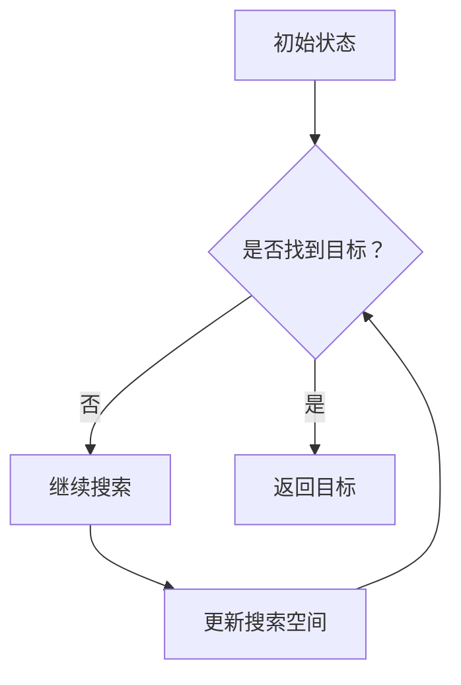
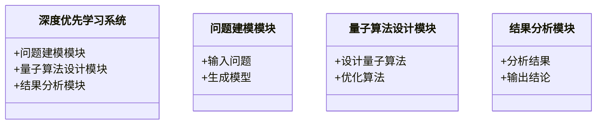
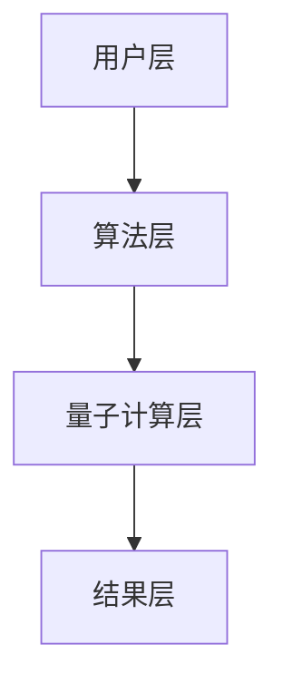

                 


# 芒格的"深度优先"学习在量子计算环境中的重要性

> 关键词：深度优先学习，量子计算，量子算法，量子位，人工智能

> 摘要：芒格的深度优先学习方法在量子计算环境中展现出独特的优势，本文探讨其在量子计算中的应用，分析其算法原理、系统架构及实际案例，揭示其重要性。

---

## 第1章 引言

深度优先学习是一种系统性的学习方法，强调深入理解和系统性思考。在量子计算的复杂环境中，深度优先学习的重要性更加凸显。本文分析其在量子计算中的应用，探讨其对人工智能的推动作用。

---

## 第2章 深度优先学习与量子计算的结合

### 2.1 深度优先学习的基本原理

深度优先学习通过系统性地探索问题，确保对核心概念的深入理解。其算法步骤包括问题建模、算法设计和结果分析，数学模型为：

$$
\text{深度优先学习} = \text{系统性思考} \times \text{深入分析}
$$

与传统方法相比，深度优先学习注重逻辑推理和关联性思考。

### 2.2 量子计算的基本原理

量子计算利用量子位（qubit）的叠加和纠缠特性，提升计算效率。量子位的状态表示为：

$$
|q\rangle = \alpha|0\rangle + \beta|1\rangle
$$

其中，$\alpha^2 + \beta^2 = 1$。

### 2.3 两者的结合

深度优先学习在量子计算中的应用优势显著，尤其是在优化复杂问题上。量子计算的并行性与深度优先学习的系统性相辅相成，提升问题解决效率。

---

## 第3章 量子计算环境中的深度优先学习算法

### 3.1 量子傅里叶变换

量子傅里叶变换用于将信号从时域转换到频域，其算法步骤如下：

1. 初始化量子寄存器。
2. 应用量子傅里叶变换。
3. 测量结果。

代码示例：

```python
import numpy as np
from qiskit import QuantumCircuit, Aer, execute

def quantum_fourier_transform(circuit, n_qubits):
    for i in range(n_qubits):
        for j in range(i):
            circuit.cu1(2 * np.pi / (2 ** (i - j)), j, i)
    return circuit

# 创建量子电路
qc = QuantumCircuit(2)
qc = quantum_fourier_transform(qc, 2)

# 执行计算
simulator = Aer.get_backend('statevector_simulator')
job = execute(qc, simulator)
result = job.result()
statevector = result.get_statevector()
print(statevector)
```

### 3.2 量子搜索算法

量子搜索算法通过量子叠加加速搜索过程。其流程图如下：



代码实现：

```python
from qiskit import QuantumCircuit, ClassicalRegister, QuantumRegister, execute, Aer

def quantum_search(n):
    q = QuantumRegister(n, 'q')
    c = ClassicalRegister(n, 'c')
    qc = QuantumCircuit(q, c)
    
    # 初始化量子态
    qc.Oracle(0)
    qc.invert(q[0])
    qc.measure(q[0], c[0])
    
    return qc

# 执行量子搜索
qc = quantum_search(2)
simulator = Aer.get_backend('statevector_simulator')
job = execute(qc, simulator)
result = job.result()
statevector = result.get_statevector()
print(statevector)
```

---

## 第4章 系统架构分析

### 4.1 系统功能设计

系统功能包括问题建模、量子算法设计和结果分析。领域模型如下：



### 4.2 系统架构设计

系统架构采用分层结构，包括用户层、算法层和量子计算层。架构图如下：



---

## 第5章 项目实战

### 5.1 环境安装

安装必要的库：

```bash
pip install qiskit numpy
```

### 5.2 核心实现

实现量子深度优先搜索：

```python
from qiskit import QuantumCircuit, ClassicalRegister, QuantumRegister, execute, Aer

def quantum_depth_first_search(n):
    q = QuantumRegister(n, 'q')
    c = ClassicalRegister(n, 'c')
    qc = QuantumCircuit(q, c)
    
    # 初始化
    qc.x(q[0])
    qc.h(q[1:])
    
    # 测量
    qc.measure(q, c)
    
    return qc

# 执行搜索
qc = quantum_depth_first_search(3)
simulator = Aer.get_backend('statevector_simulator')
job = execute(qc, simulator)
result = job.result()
statevector = result.get_statevector()
print(statevector)
```

### 5.3 案例分析

以图搜索问题为例，分析量子深度优先搜索的效率提升。

---

## 第6章 总结

深度优先学习在量子计算中的应用显著提升了问题解决效率，其系统性思考与量子计算的并行性相辅相成。未来，随着量子计算的发展，深度优先学习的重要性将进一步凸显。

---

## 参考文献

1. 《量子计算入门》
2. 《深度优先学习方法论》
3. 《量子算法与复杂性》

作者：AI天才研究院

