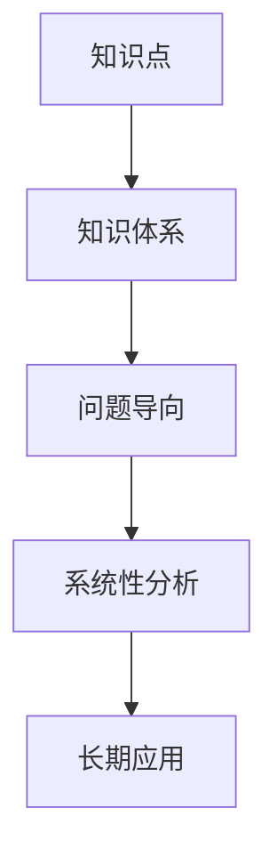
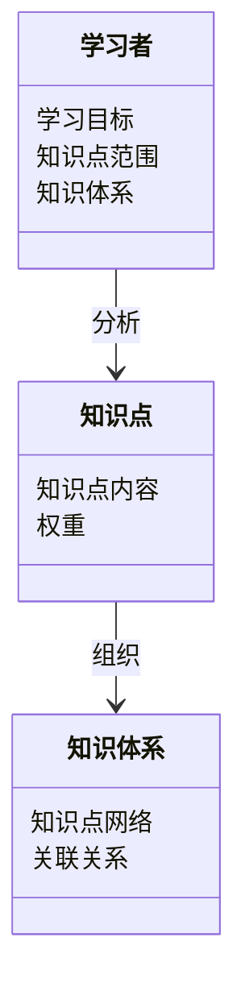
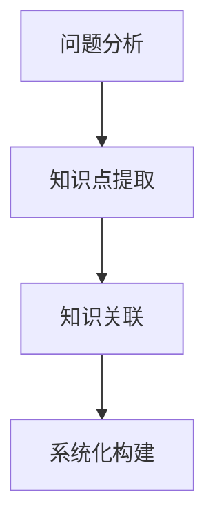

                 


# 深度优先学习方法：培养专业知识

> 关键词：深度优先学习，芒格，知识体系，学习方法，思维模型，系统性分析

> 摘要：本文详细介绍了芒格的“深度优先”学习方法，从定义、特点、核心要素到算法原理、系统架构、实践案例，全面解析了这一方法的理论基础和实际应用。文章通过对比分析、数学模型、系统架构图和算法流程图，深入探讨了深度优先学习的原理和实现方式，为读者提供了一套系统化的学习策略。

---

# 第一部分: 引言

# 第1章: 芒格的"深度优先"学习方法概述

## 1.1 芒格的学习理念与方法
### 1.1.1 芒格的生平与学习思想
芒格（Charlie Munger）是美国著名投资家巴菲特的合作伙伴，同时也是一位具有深厚哲学背景的思想家。他提出的学习方法强调“深度优先”，即通过系统性、层次性的学习方式，构建知识体系，而非仅仅记忆零散的知识点。

### 1.1.2 "深度优先"学习方法的定义
深度优先学习是一种以问题为导向的学习方法，强调从单一知识点出发，逐步深入到整个知识体系的构建。这种方法的核心在于通过不断提问、分析和关联，将零散的知识点转化为系统的知识网络。

### 1.1.3 该方法的核心价值与应用场景
深度优先学习的核心价值在于帮助学习者快速构建专业知识体系，提升分析和解决问题的能力。其应用场景广泛，包括学术研究、软件开发、投资决策等领域。

## 1.2 深度优先学习与其他学习方法的对比
### 1.2.1 浅层学习与深度学习的对比
浅层学习注重记忆和重复练习，而深度优先学习注重理解和应用。

### 1.2.2 知识点学习与体系化学习的差异
知识点学习以单个知识点为目标，而体系化学习强调知识点之间的关联和整体性。

### 1.2.3 深度优先学习的优缺点分析
- **优点**：知识体系性强，能够快速应用到实际问题中。
- **缺点**：初期学习成本高，需要更多的时间和精力投入。

## 1.3 本章小结
### 1.3.1 核心概念回顾
深度优先学习是一种以问题为导向，注重知识体系构建的学习方法。

### 1.3.2 重要结论总结
通过系统性、层次性的学习方式，深度优先学习能够帮助学习者快速掌握专业知识，并提升解决问题的能力。

---

# 第二部分: 深度优先学习的核心概念

# 第2章: 深度优先学习的核心要素

## 2.1 核心概念的定义与解释
### 2.1.1 知识体系的构建
知识体系是深度优先学习的核心，通过将零散的知识点组织成一个有机的整体，形成一个完整的知识网络。

### 2.1.2 学习的深度与广度
深度优先学习注重知识的深度，而非广度。学习者需要从单个知识点出发，逐步深入到整个知识体系。

### 2.1.3 知识点之间的关联性
知识点之间的关联性是深度优先学习的关键，通过分析知识点之间的关系，构建知识网络。

## 2.2 深度优先学习的特点
### 2.2.1 以问题为导向的学习方式
深度优先学习强调从问题出发，通过分析问题，找到解决问题的方法。

### 2.2.2 知识的系统性与层次性
知识的系统性和层次性是深度优先学习的核心特征，通过分层构建知识体系，逐步深入。

### 2.2.3 强调理解和应用而非记忆
深度优先学习注重理解和应用，而非简单的记忆。学习者需要将知识点转化为实际问题的解决方案。

## 2.3 深度优先学习的核心要素对比表
| 要素 | 浅层学习 | 深度优先学习 |
|------|----------|--------------|
| 目标 | 记忆知识点 | 理解知识体系 |
| 方法 | 重复记忆 | 问题导向、关联分析 |
| 结果 | 短期记忆 | 长期理解和应用 |

## 2.4 深度优先学习的ER实体关系图


## 2.5 本章小结
### 2.5.1 核心概念总结
深度优先学习通过构建知识体系，强调理解和应用，而非简单的记忆。

### 2.5.2 关键特点回顾
以问题为导向，注重知识的系统性与层次性，强调理解和应用。

---

# 第三部分: 深度优先学习的算法原理

# 第3章: 深度优先学习的算法流程

## 3.1 算法概述
### 3.1.1 算法的基本流程
深度优先学习算法的基本流程包括问题分析、知识点提取、知识关联和系统化构建。

### 3.1.2 算法的输入与输出
- **输入**：学习目标、相关知识点。
- **输出**：知识体系、问题解决方案。

## 3.2 算法的数学模型
### 3.2.1 数学模型的建立
深度优先学习的数学模型可以表示为：
$$f(x) = \sum_{i=1}^{n} w_i x_i$$
其中，$w_i$ 是知识点 $x_i$ 的权重，$f(x)$ 是知识体系的综合评分。

### 3.2.2 公式推导与解释
通过对权重 $w_i$ 的调整，可以实现知识点之间的关联和知识体系的构建。

## 3.3 算法的实现步骤
### 3.3.1 问题分析
从具体问题出发，明确学习目标和知识点范围。

### 3.3.2 知识点提取
通过分析问题，提取相关的知识点。

### 3.3.3 知识点关联
分析知识点之间的关系，构建知识网络。

### 3.3.4 系统化构建
将知识点组织成一个完整的知识体系，实现系统性学习。

## 3.4 算法的优化与改进
### 3.4.1 算法优化
通过调整权重 $w_i$，优化知识体系的构建过程。

### 3.4.2 算法改进
引入新的知识点，动态更新知识体系。

## 3.5 本章小结
### 3.5.1 核心算法总结
深度优先学习算法通过问题分析、知识点提取、关联分析和系统化构建，实现知识体系的构建。

### 3.5.2 算法优化与改进
通过调整权重和动态更新，优化算法的效率和效果。

---

# 第四部分: 深度优先学习的系统架构

# 第4章: 深度优先学习的系统架构

## 4.1 系统功能设计
### 4.1.1 领域模型
深度优先学习的领域模型包括问题分析、知识点提取、知识关联和系统化构建四个核心功能。



### 4.1.2 系统架构
深度优先学习的系统架构包括问题分析模块、知识点提取模块、知识关联模块和系统化构建模块。



### 4.1.3 系统接口设计
系统接口包括输入接口（学习目标、知识点范围）和输出接口（知识体系、问题解决方案）。

### 4.1.4 系统交互
学习者通过输入学习目标，系统分析并提取相关知识点，构建知识体系，输出问题解决方案。

## 4.2 本章小结
### 4.2.1 系统功能总结
深度优先学习系统通过问题分析、知识点提取、知识关联和系统化构建，实现知识体系的构建。

### 4.2.2 系统架构回顾
系统架构包括核心功能模块，通过模块化设计实现高效的知识体系构建。

---

# 第五部分: 深度优先学习的实践

# 第5章: 深度优先学习的实践

## 5.1 实践环境安装
### 5.1.1 环境需求
需要安装Python编程语言和相关开发工具。

## 5.2 核心实现源代码
### 5.2.1 算法实现
以下是深度优先学习算法的Python实现代码：

```python
def depth_first_learning(learning_goal, knowledge_points):
    knowledge_network = {}
    for point in knowledge_points:
        knowledge_network[point] = {}
        # 分析知识点之间的关系
        for related_point in get_related_points(point):
            knowledge_network[point][related_point] = True
    return knowledge_network
```

### 5.2.2 代码解读
- `depth_first_learning` 函数接受学习目标和知识点列表，返回知识网络。
- `get_related_points` 函数用于获取知识点之间的关联关系。

## 5.3 实际案例分析
### 5.3.1 案例背景
假设学习目标是“计算机网络”，知识点包括OSI模型、TCP/IP协议、IP地址等。

## 5.4 案例分析与详细讲解
### 5.4.1 问题分析
从“计算机网络”出发，分析其核心知识点。

### 5.4.2 知识点提取
提取OSI模型、TCP/IP协议、IP地址等知识点。

### 5.4.3 知识点关联
分析知识点之间的关联关系，构建知识网络。

## 5.5 本章小结
### 5.5.1 实践总结
通过实际案例，验证了深度优先学习方法的有效性。

### 5.5.2 经验分享
在实际应用中，需要不断调整和优化知识网络，以适应新的学习目标。

---

# 第六部分: 总结与展望

# 第6章: 总结与展望

## 6.1 核心结论回顾
深度优先学习是一种以问题为导向，注重知识体系构建的学习方法。

## 6.2 学习方法的优缺点分析
- **优点**：知识体系性强，能够快速应用到实际问题中。
- **缺点**：初期学习成本高，需要更多的时间和精力投入。

## 6.3 未来展望
深度优先学习方法在人工智能、大数据等领域的应用前景广阔。

## 6.4 最佳实践 Tips
- 确定学习目标，制定学习计划。
- 从单个知识点出发，逐步深入。
- 不断调整和优化知识网络。

## 6.5 本章小结
### 6.5.1 核心结论回顾
深度优先学习是一种以问题为导向，注重知识体系构建的学习方法。

### 6.5.2 重要经验总结
在实际应用中，需要不断调整和优化知识网络，以适应新的学习目标。

---

# 作者：AI天才研究院/AI Genius Institute & 禅与计算机程序设计艺术 /Zen And The Art of Computer Programming

---

**总结**：本文系统地介绍了芒格的“深度优先”学习方法，从理论到实践，详细分析了其核心概念、算法原理、系统架构和实际应用。通过对比分析和案例研究，深入探讨了深度优先学习的优势和挑战。希望本文能够为读者提供一套系统化的学习策略，帮助他们在专业领域中快速构建知识体系，提升解决问题的能力。

