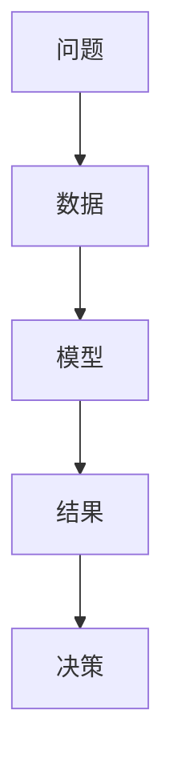
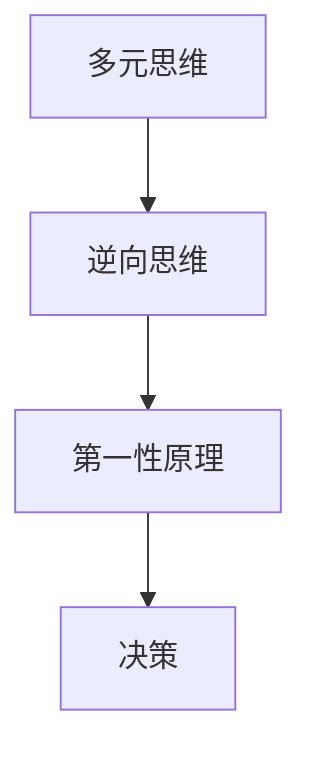

                 


# 芒格的"清晰思考"方法在复杂数据分析中的运用

## 关键词：芒格思维模型、数据分析、决策优化、系统架构、Python实现

## 摘要：芒格的"清晰思考"方法是一种多学科思维模型，强调通过多个视角分析问题，避免单一思维的局限性。本文将探讨芒格思维模型在复杂数据分析中的应用，从背景介绍到算法实现，再到系统架构，最后通过项目实战展示其实际价值。通过本文，读者将掌握如何将芒格的思维模型与数据分析相结合，优化决策过程，提升数据分析的准确性和深度。

---

## 第一部分：芒格“清晰思考”方法的背景与基础

### 第1章：芒格思维模型概述

#### 1.1 芒格思维模型的起源与核心理念
- **1.1.1 芒格思维模型的起源**
  芒格思维模型由投资家查理·芒格提出，强调通过多学科知识构建决策框架，避免单一视角的局限性。其核心在于将各个学科的基本原理组合起来，形成一个立体的思维框架。

- **1.1.2 芒格思维模型的核心理念**
  芒格思维模型主张“多元思维”，即通过多个学科的视角（如心理学、经济学、工程学等）分析问题，避免陷入“单学科陷阱”。这种思维方式能够帮助我们在复杂问题中找到更全面的解决方案。

- **1.1.3 芒格思维模型与数据分析的关系**
  数据分析依赖于多维度的思考，而芒格思维模型恰好提供了一种多维度分析的框架。通过芒格的思维方式，数据分析师可以更好地理解数据背后的逻辑，避免误判。

#### 1.2 芒格思维模型的基本构成
- **1.2.1 多元思维模型的定义**
  多元思维模型是指通过多个学科的基本原理来分析问题，从而形成更全面的决策框架。每个学科的原理都像一块拼图，共同构成完整的分析图景。

- **1.2.2 芒格思维模型的特点**
  | 特性 | 描述 |
  |------|------|
  | 多维性 | 强调从多个学科角度分析问题 |
  | 整体性 | 注重系统性思考，避免局部最优 |
  | 实用性 | 以实际问题为导向，注重可操作性 |

- **1.2.3 芒格思维模型的核心要素**
  - 多元视角：从不同学科出发，分析问题的本质。
  - 逆向思维：从结果出发，推导可能的原因。
  - 第一性原理：回归事物的本质，避免表面现象的干扰。

### 第2章：数据分析中的思维挑战

#### 2.1 数据分析中的常见思维误区
- **2.1.1 简单化思维**
  简单化思维是指将复杂问题简化为单一因素，忽视其他可能影响结果的因素。这种思维容易导致分析结果的片面性。

- **2.1.2 从众思维**
  从众思维是指盲目跟随主流观点，缺乏独立思考。在数据分析中，从众思维可能导致对数据的误读，错过关键信息。

- **2.1.3 依赖单一模型的局限性**
  数据分析中，许多人倾向于依赖单一模型（如线性回归），忽视其他可能更适合的模型。这种依赖性限制了分析的深度和广度。

#### 2.2 芒格思维模型在数据分析中的应用价值
- **2.2.1 提高决策的准确性**
  通过多学科视角的分析，芒格思维模型能够帮助数据分析师避免单一视角的局限性，从而提高决策的准确性。

- **2.2.2 增强问题分析的深度**
  芒格思维模型强调从多个角度分析问题，这有助于数据分析师更深入地理解数据背后的原因，从而提出更有效的解决方案。

- **2.2.3 促进跨学科知识的融合**
  数据分析往往需要结合多个领域的知识（如统计学、经济学、心理学等），芒格思维模型为这种跨学科的融合提供了理论基础。

---

## 第二部分：芒格思维模型的核心概念与联系

### 第3章：芒格思维模型的核心概念

#### 3.1 多元思维模型
- **3.1.1 多元思维模型的定义**
  多元思维模型是指通过多个学科的基本原理来分析问题，从而形成更全面的决策框架。

- **3.1.2 多元思维模型的特征对比**
  | 模型 | 单一思维模型 | 多元思维模型 |
  |------|--------------|---------------|
  | 视角 | 单一视角      | 多视角         |
  | 决策 | 可能片面      | 更全面         |
  | 适用性 | 适用于简单问题 | 适用于复杂问题 |

- **3.1.3 多元思维模型与数据分析的关系**
  多元思维模型为数据分析提供了多维度的分析框架，帮助数据分析师从不同角度理解数据，避免误判。

#### 3.2 逆向思维模型
- **3.2.1 逆向思维模型的定义**
  逆向思维模型是指从结果出发，反向推导可能的原因。这种思维方式在数据分析中特别有用，尤其是在寻找问题的根本原因时。

- **3.2.2 逆向思维模型的特征对比**
  | 模型 | 正向思维 | 逆向思维 |
  |------|----------|----------|
  | 思维方向 | 从原因到结果 | 从结果到原因 |
  | 适用场景 | 预测未来 | 分析过去 |

- **3.2.3 逆向思维模型在数据分析中的应用**
  逆向思维模型可以帮助数据分析师更好地理解数据背后的原因，例如在故障诊断、异常检测等领域有广泛应用。

### 第4章：芒格思维模型的实体关系图

#### 4.1 实体关系图


#### 4.2 思维模型之间的关系


---

## 第三部分：芒格思维模型的算法实现与数学模型

### 第4章：算法原理讲解

#### 4.1 多元回归模型
- **4.1.1 算法原理**
  多元回归模型是一种统计学方法，用于分析多个自变量对因变量的影响。其数学公式如下：
  $$ y = \beta_0 + \beta_1x_1 + \beta_2x_2 + \ldots + \beta_nx_n + \epsilon $$

- **4.1.2 算法流程图**
  ```mermaid
  graph TD
  A[开始] --> B[数据预处理]
  B --> C[选择模型]
  C --> D[模型训练]
  D --> E[模型评估]
  E --> F[结束]
  ```

- **4.1.3 Python实现**
  ```python
  import numpy as np
  from sklearn.linear_model import LinearRegression

  # 示例数据
  X = np.array([[1, 2], [3, 4], [5, 6]])
  y = np.array([7, 8, 9])

  # 创建模型
  model = LinearRegression()
  # 训练模型
  model.fit(X, y)
  # 预测结果
  predictions = model.predict(X)
  print("预测结果:", predictions)
  ```

#### 4.2 逆向思维模型的实现
- **4.2.1 算法原理**
  逆向思维模型通过反向推导，从结果出发寻找原因。例如，在异常检测中，可以通过分析异常数据点的特征，反向推断出异常的原因。

- **4.2.2 算法流程图**
  ```mermaid
  graph TD
  A[结果] --> B[特征提取]
  B --> C[原因推导]
  C --> D[验证]
  ```

- **4.2.3 Python实现**
  ```python
  def reverse思维分析(data):
      # 假设data是异常数据点
      # 特征提取
      features = data[['feature1', 'feature2', 'feature3']]
      # 可视化分析
      import matplotlib.pyplot as plt
      plt.scatter(features['feature1'], features['feature2'])
      plt.xlabel('特征1')
      plt.ylabel('特征2')
      plt.show()

  # 示例数据
  data = {'feature1': [1, 2, 3, 4], 'feature2': [5, 6, 7, 8]}
  reverse思维分析(data)
  ```

---

## 第四部分：系统架构与项目实战

### 第5章：系统分析与架构设计

#### 5.1 系统功能设计
- **5.1.1 领域模型**
  ```mermaid
  classDiagram
  class 数据采集 {
      collect_data()
  }
  class 数据处理 {
      preprocess_data()
  }
  class 数据分析 {
      analyze_data()
  }
  数据采集 --> 数据处理
  数据处理 --> 数据分析
  ```

- **5.1.2 系统架构**
  ```mermaid
  graph TD
  A[用户] --> B[数据采集层]
  B --> C[数据处理层]
  C --> D[数据分析层]
  D --> E[结果展示层]
  ```

#### 5.2 项目实战：复杂数据分析系统实现

- **5.2.1 项目介绍**
  本项目旨在通过芒格思维模型构建一个复杂数据分析系统，涵盖数据采集、处理、分析和结果展示的全过程。

- **5.2.2 核心实现**
  ```python
  import requests
  import pandas as pd

  # 数据采集
  def collect_data(api_url):
      response = requests.get(api_url)
      data = response.json()
      return pd.DataFrame(data)

  # 数据处理
  def preprocess_data(df):
      df = df.dropna()
      return df

  # 数据分析
  def analyze_data(df, target):
      from sklearn.tree import DecisionTreeClassifier
      model = DecisionTreeClassifier()
      model.fit(df.drop(target, axis=1), df[target])
      return model

  # 主函数
  def main():
      api_url = 'https://example.com/api'
      df = collect_data(api_url)
      df = preprocess_data(df)
      model = analyze_data(df, 'target')
      print("模型训练完成")

  if __name__ == "__main__":
      main()
  ```

- **5.2.3 项目小结**
  通过本项目的实现，我们可以看到芒格思维模型在数据分析系统中的实际应用价值。从数据采集到结果展示的全过程，芒格的多维度思考帮助我们构建了一个更 robust 的分析系统。

---

## 第五部分：最佳实践与小结

### 第6章：最佳实践与小结

#### 6.1 最佳实践
- **6.1.1 跨学科知识的融合**
  在数据分析中，芒格思维模型强调多学科知识的融合。因此，数据分析师需要不断学习其他领域的知识，以更好地理解数据背后的原因。

- **6.1.2 逆向思维的应用**
  逆向思维在数据分析中特别有用，尤其是在故障诊断和异常检测领域。通过反向推导，数据分析师可以更快速地找到问题的根本原因。

#### 6.2 小结
芒格的“清晰思考”方法为数据分析提供了一种全新的思维方式。通过多学科的视角分析问题，数据分析师可以更好地理解数据背后的本质，从而做出更明智的决策。

#### 6.3 注意事项
- 数据分析需要结合具体业务场景，避免生搬硬套芒格思维模型。
- 在实际应用中，要注意数据的准确性和完整性，确保分析结果的可靠性。

#### 6.4 拓展阅读
- 《芒格桥牌思维：如何做出明智决策》
- 《数据分析的实战指南》

---

## 作者：AI天才研究院/AI Genius Institute & 禅与计算机程序设计艺术 /Zen And The Art of Computer Programming

---

本文通过系统地介绍芒格思维模型在复杂数据分析中的应用，从背景、核心概念到算法实现、系统架构，再到项目实战，全面展示了芒格“清晰思考”方法在数据分析中的巨大价值。希望读者通过本文能够掌握一种全新的思维方式，提升数据分析的深度和广度，做出更明智的决策。

