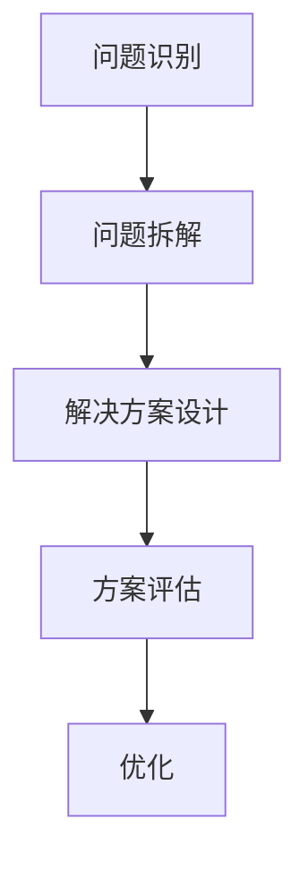
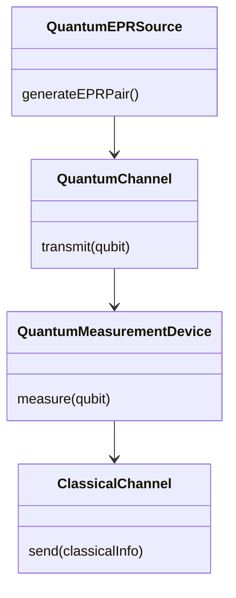
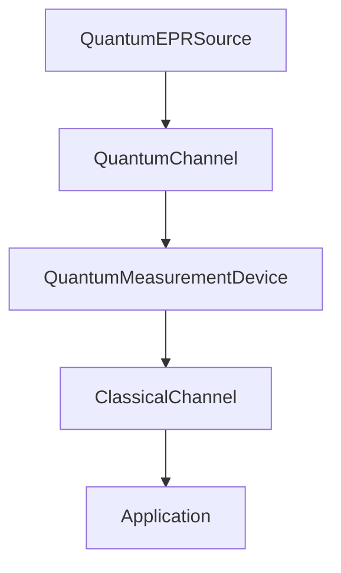

                 


# 芒格的"清晰思考"方法在量子纠缠通信策略中的运用

**关键词**：芒格思维模型、量子纠缠、量子通信、清晰思考、决策框架

**摘要**：本文探讨了芒格的“清晰思考”方法在量子纠缠通信策略中的应用。通过分析芒格的多学科思维模型、格栅式决策框架和“inversion”原则，结合量子纠缠通信的基本原理和实际应用，提出了一种将芒格的思维方式应用于量子通信策略制定的系统性方法。文章详细阐述了量子纠缠的数学模型、通信技术、系统架构设计以及实际案例分析，展示了如何通过清晰的思考和系统性方法解决量子通信中的复杂问题。

---

## 第一部分: 芒格的"清晰思考"方法概述

### 第1章: 芒格的思维模型与决策框架

#### 1.1 多学科思维模型
芒格的多学科思维模型是一种通过跨学科知识来解决问题的方法。它强调将不同领域的知识融会贯通，形成一个立体的思考框架。例如，在投资决策中，芒格会综合考虑物理学、心理学、经济学等多个学科的原理。

**核心公式**：芒格的思维模型可以用以下公式表示：
$$
\text{解决方案} = \sum_{i=1}^{n} (\text{学科}_i \times \text{权重}_i)
$$
其中，$n$ 是学科的数量，$\text{权重}_i$ 是每个学科的重要性。

#### 1.2 格栅式决策框架
格栅式决策框架是芒格提出的一种决策方法，通过构建多个决策准则来评估问题。例如，在量子通信策略中，可以通过以下几个准则来评估解决方案的可行性：
1. 技术可行性
2. 经济可行性
3. 操作可行性

**表格对比**：
| 准则       | 技术可行性 | 经济可行性 | 操作可行性 |
|------------|------------|------------|------------|
| 描述       | 是否可行的技术方案 | 是否具有经济性 | 是否易于操作 |

#### 1.3 "inversion"原则
“inversion”原则是指通过反向思考问题，找到解决问题的关键点。例如，在设计量子通信系统时，可以通过反向思考通信链路的潜在漏洞，从而制定更有效的安全策略。

---

### 第2章: 芒格的“清晰思考”方法在问题解决中的应用

#### 2.1 清晰思考的核心要素
清晰思考的核心要素包括：
1. **问题背景分析**：明确问题的来源和背景。
2. **问题拆解与重构**：将复杂问题分解为简单问题。
3. **解决方案的评估与优化**：对比不同解决方案的优缺点，选择最优方案。

**流程图**：


#### 2.2 实践案例：芒格方法在量子通信中的应用
在设计量子通信系统时，可以通过芒格的清晰思考方法来优化通信协议。例如：
1. **问题识别**：发现通信链路存在安全隐患。
2. **问题拆解**：拆解为“安全性”、“效率”、“可靠性”三个子问题。
3. **解决方案设计**：分别设计加密协议、优化通信算法、增强系统可靠性。
4. **方案评估**：对比不同方案的安全性和效率。
5. **优化**：选择最优方案并实施。

---

## 第二部分: 量子纠缠通信策略的基本原理

### 第3章: 量子纠缠的基本概念与数学模型

#### 3.1 量子纠缠的定义与特征
量子纠缠是量子力学中的一个基本现象，指的是两个或多个粒子之间的关联性。当一个粒子的状态被测量时，另一个粒子的状态也会立即确定，即使它们相隔很远。

**数学表示**：
$$
|\psi\rangle = \frac{1}{\sqrt{2}}(|0\rangle|1\rangle + |1\rangle|0\rangle)
$$
其中，$|0\rangle$ 和 $|1\rangle$ 分别表示量子比特的基态。

#### 3.2 量子纠缠的实验案例
经典的量子纠缠实验包括爱因斯坦-波多尔斯基-罗森悖论和贝尔不等式实验。这些实验验证了量子纠缠的存在性和非局域性。

---

### 第4章: 量子纠缠通信的基本原理

#### 4.1 量子通信的原理
量子通信利用量子纠缠的特性实现信息的安全传输。例如，量子密钥分发（QKD）是一种基于量子纠缠的通信技术，其安全性基于量子力学的基本原理。

#### 4.2 量子纠缠通信的优缺点
| 特性       | 优点 | 缺点 |
|------------|------|------|
| 安全性       | 极高 | 实现复杂 |
| 传输距离     | 较短 | 成本较高 |

---

## 第三部分: 芒格的"清晰思考"方法在量子纠缠通信策略中的应用

### 第5章: 芒格思维模型在量子通信策略中的应用

#### 5.1 量子通信策略的制定步骤
1. **问题识别**：发现通信系统中的潜在问题。
2. **问题拆解**：将问题拆解为技术、经济、操作等多个方面。
3. **解决方案设计**：基于多学科思维模型设计解决方案。
4. **方案评估**：通过格栅式决策框架评估方案的可行性。
5. **优化**：选择最优方案并实施。

#### 5.2 实际案例分析
假设我们需要设计一个量子纠缠通信系统，以下是具体的实施步骤：
1. **问题识别**：发现通信链路存在安全隐患。
2. **问题拆解**：拆解为安全性、效率、可靠性三个子问题。
3. **解决方案设计**：设计加密协议、优化通信算法、增强系统可靠性。
4. **方案评估**：对比不同方案的安全性和效率。
5. **优化**：选择最优方案并实施。

**流程图**：


---

## 第四部分: 系统分析与架构设计

### 第6章: 量子纠缠通信系统的架构设计

#### 6.1 系统功能设计
量子纠缠通信系统的功能模块包括：
1. 量子纠缠源
2. 量子通信信道
3. 量子测量设备
4. 经典通信信道

**类图**：


#### 6.2 系统架构设计
量子纠缠通信系统的架构可以分为以下几个层次：
1. **物理层**：量子纠缠源和测量设备。
2. **链路层**：量子通信信道。
3. **网络层**：经典通信信道。
4. **应用层**：用户应用和管理模块。

**架构图**：


---

## 第五部分: 项目实战

### 第7章: 量子纠缠通信系统的实现

#### 7.1 环境安装
安装必要的软件和库，例如Qutip和numpy。

#### 7.2 核心实现
以下是量子纠缠通信系统的核心实现代码：

```python
import numpy as np
from qutip import Qubit, tensor, basis, measure

# 定义量子纠缠源
def generate_epr_pair():
    epr = (basis(2, 0) * basis(2, 1) + basis(2, 1) * basis(2, 0)) / np.sqrt(2)
    return epr

# 定义量子通信信道
def quantum_channel(qubit):
    return qubit

# 定义量子测量设备
def quantum_measurement(qubit):
    result, _ = measure(qubit)
    return result

# 主程序
def main():
    epr_pair = generate_epr_pair()
    qubit_A = epr_pair[0]
    qubit_B = epr_pair[1]

    # 传输量子比特
    qubit_A_transmitted = quantum_channel(qubit_A)
    qubit_B_transmitted = quantum_channel(qubit_B)

    # 测量量子比特
    result_A = quantum_measurement(qubit_A_transmitted)
    result_B = quantum_measurement(qubit_B_transmitted)

    print("测量结果：", result_A, "和", result_B)

if __name__ == "__main__":
    main()
```

#### 7.3 实验结果与分析
运行上述代码后，测量结果会显示两个量子比特的结果。由于量子纠缠的特性，测量结果会显示出高度的相关性。

---

## 第六部分: 总结与展望

### 第8章: 总结与展望

#### 8.1 最佳实践 tips
1. 在设计量子通信系统时，始终关注系统的安全性、效率和可靠性。
2. 使用芒格的清晰思考方法可以有效优化量子通信策略的制定过程。

#### 8.2 未来展望
随着量子计算和量子通信技术的发展，芒格的清晰思考方法将在更多领域得到应用，特别是在复杂系统的优化和决策中。

---

**作者：AI天才研究院 & 禅与计算机程序设计艺术**

