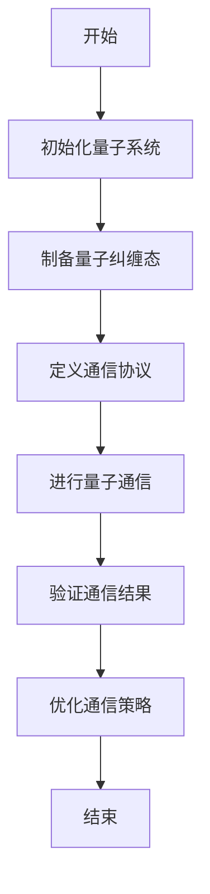
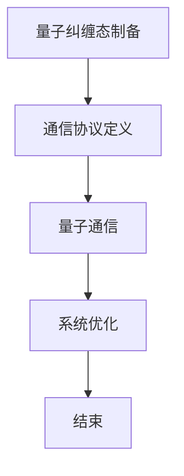
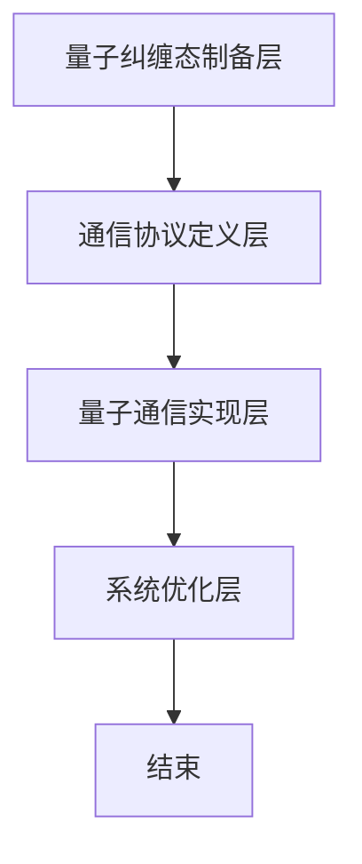
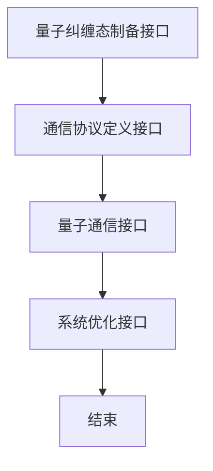

                 


# 芒格的"清晰思考"方法在量子纠缠通信策略制定中的运用

> 关键词：芒格思考方法，量子纠缠，通信策略，量子通信，系统架构

> 摘要：本文探讨了芒格的“清晰思考”方法在量子纠缠通信策略制定中的应用。通过分析量子纠缠的基本原理、通信机制以及芒格方法的核心理念，提出了一种基于清晰思考的量子纠缠通信策略制定框架。本文详细阐述了该方法的数学模型、算法实现、系统架构设计以及项目实战，为量子纠缠通信技术的发展提供了新的思路和实践指导。

---

# 第一部分: 芒格的"清晰思考"方法与量子纠缠通信概述

## 第1章: 芒格的"清晰思考"方法概述

### 1.1 芒格的"清晰思考"方法的核心理念

#### 1.1.1 "清晰思考"的定义与特点
芒格的“清晰思考”方法是一种以逻辑性和系统性为核心的思考方式。其核心在于通过分解问题、分析因果关系和验证假设，确保思考过程的透明性和可重复性。这种方法强调从第一性原理出发，避免被表象迷惑，注重问题的本质。

**关键特点：**
1. **逻辑性**：注重因果关系和推理过程的严密性。
2. **系统性**：将问题分解为多个模块，分析各模块之间的相互作用。
3. **实用性**：以解决问题为导向，注重实践效果。

#### 1.1.2 芒格"清晰思考"方法的哲学基础
芒格的方法深受哲学和科学思维的影响。他提倡“理性思维”，强调通过科学方法（观察、假设、验证）来分析问题。这种方法类似于爱因斯坦的“第一性原理”思考方式，即从最基础的假设出发，推导出问题的解决方案。

#### 1.1.3 "清晰思考"在决策中的应用价值
在决策中，清晰思考可以帮助我们避免认知偏差、情绪化决策以及信息过载问题。通过分解问题、分析关键因素和验证假设，芒格的方法能够提高决策的准确性和可靠性。

---

### 1.2 量子纠缠的基本概念

#### 1.2.1 量子纠缠的定义
量子纠缠是量子力学中的一个基本现象，描述两个或多个粒子处于一种特殊的量子状态，使得对其中一个粒子的测量会立即影响另一个粒子的状态，即使它们相隔很远。

**公式表示：**
$$
|\psi\rangle = \frac{1}{\sqrt{2}}(|0\rangle \otimes |1\rangle + |1\rangle \otimes |0\rangle)
$$

#### 1.2.2 量子纠缠的特性与现象
量子纠缠的主要特性包括：
1. **不可分割性**：纠缠态无法通过局部操作分解为两个独立的部分。
2. **瞬时性**：测量其中一个粒子会立即影响另一个粒子的状态，这种现象被称为“量子非 locality”。
3. **信息不可传递性**：量子纠缠本身并不传递信息，但可以通过量子测量和操作来实现量子通信。

#### 1.2.3 量子纠缠在通信中的潜力
量子纠缠被认为是实现量子通信和量子网络的基础。通过利用纠缠态，可以实现超越经典通信能力的量子信息传输，例如量子隐形传态和量子密钥分发。

---

## 第2章: 芒格"清晰思考"方法与量子纠缠通信的结合

### 2.1 芒格"清晰思考"方法在量子通信中的应用背景

#### 2.1.1 当前量子通信技术的发展现状
量子通信技术目前仍处于发展阶段，主要面临的技术挑战包括：
1. 量子纠缠的稳定制备与传输。
2. 量子信息处理的纠错技术。
3. 量子通信系统的安全性与可靠性。

#### 2.1.2 芒格方法在量子通信策略制定中的作用
芒格的清晰思考方法可以帮助量子通信技术的开发者和决策者：
1. 理清量子通信的核心问题和关键挑战。
2. 分析量子纠缠通信的可行性与潜在风险。
3. 制定切实可行的量子通信技术发展路线。

#### 2.1.3 量子纠缠通信的挑战与机遇
量子纠缠通信的挑战主要体现在技术实现的复杂性和实际应用的可行性。然而，其潜在的通信能力（如超越经典信息传输极限）为未来通信技术的发展提供了重要机遇。

---

### 2.2 芒格"清晰思考"方法与量子纠缠通信的核心联系

#### 2.2.1 芒格方法在量子纠缠通信策略中的逻辑框架
芒格的清晰思考方法为量子纠缠通信的策略制定提供了一个逻辑清晰的框架，包括以下步骤：
1. **问题分解**：将量子纠缠通信问题分解为多个子问题（如纠缠态制备、信息传输、安全性保障等）。
2. **因果分析**：分析各子问题之间的因果关系和相互作用。
3. **假设验证**：通过实验验证各个假设的可行性。
4. **策略优化**：根据验证结果优化量子通信策略。

#### 2.2.2 芒格方法在量子纠缠通信中的具体应用场景
芒格方法可以应用于量子纠缠通信的多个环节，例如：
1. **量子纠缠态的选择与优化**：通过清晰思考方法，选择最适合实际应用场景的量子纠缠态。
2. **通信协议的设计**：基于清晰思考方法，设计高效的量子通信协议。
3. **系统优化与调试**：通过清晰思考方法，优化量子通信系统的性能。

#### 2.2.3 芒格方法对量子纠缠通信策略优化的启示
芒格方法的系统性和逻辑性可以帮助我们更好地理解量子纠缠通信的核心问题，并制定出更具前瞻性和可行性的策略。

---

# 第二部分: 芒格"清晰思考"方法的量子纠缠通信应用原理

## 第3章: 芒格"清晰思考"方法的量子纠缠通信应用原理

### 3.1 芒格"清晰思考"方法的逻辑框架

#### 3.1.1 芒格方法的思维模型
芒格的清晰思考方法可以总结为以下思维模型：
1. **问题分解**：将复杂问题分解为简单的问题。
2. **因果分析**：分析问题的因果关系。
3. **假设验证**：通过实验验证假设的可行性。
4. **策略优化**：根据验证结果优化策略。

#### 3.1.2 芒格方法在量子通信中的逻辑映射
在量子通信中，芒格方法的逻辑框架可以映射为：
1. **问题分解**：将量子通信问题分解为量子纠缠态制备、信息传输、安全性保障等问题。
2. **因果分析**：分析各子问题之间的相互作用。
3. **假设验证**：通过实验验证量子纠缠态的通信能力。
4. **策略优化**：根据实验结果优化量子通信策略。

#### 3.1.3 芒格方法在量子纠缠通信策略中的影响
芒格方法的逻辑框架可以帮助我们更好地理解量子纠缠通信的核心问题，并制定出更具系统性和前瞻性的策略。

---

### 3.2 量子纠缠通信的数学模型与公式

#### 3.2.1 量子纠缠态的数学表示
量子纠缠态可以用密度矩阵或纯态来描述。以下是两个粒子的量子纠缠态的数学表示：
$$
\rho = \frac{1}{2} \begin{pmatrix}
0 & 1 & 1 & 0 \\
1 & 0 & 0 & 1 \\
1 & 0 & 0 & 1 \\
0 & 1 & 1 & 0
\end{pmatrix}
$$

#### 3.2.2 量子纠缠通信的数学模型
量子纠缠通信的数学模型可以表示为：
$$
\text{信息传输} = f(\text{纠缠态}, \text{通信协议}, \text{环境干扰})
$$

#### 3.2.3 芒格方法对量子纠缠通信策略的优化公式
通过芒格方法的逻辑框架，我们可以得到以下优化公式：
$$
\text{最优策略} = \arg\min_{\text{策略}} \text{系统性能指标}
$$

---

## 第4章: 芒格"清晰思考"方法在量子纠缠通信中的算法实现

### 4.1 芒格方法在量子纠缠通信中的算法设计

#### 4.1.1 芒格方法的算法逻辑
芒格方法的算法逻辑可以总结为以下步骤：
1. **问题分解**：将量子通信问题分解为多个子问题。
2. **因果分析**：分析各子问题之间的因果关系。
3. **假设验证**：通过实验验证各个假设。
4. **策略优化**：根据验证结果优化策略。

#### 4.1.2 量子纠缠通信的算法流程
以下是量子纠缠通信的算法流程图：



#### 4.1.3 芒格方法对量子纠缠通信算法的优化
通过芒格方法的逻辑框架，我们可以优化量子纠缠通信的算法，使其更加高效和可靠。

---

### 4.2 量子纠缠通信的算法实现

#### 4.2.1 算法实现的代码框架
以下是量子纠缠通信算法的Python代码框架：

```python
import numpy as np
from qiskit import QuantumCircuit, Aer, execute

def prepare_entangled_state(n):
    qc = QuantumCircuit(n)
    # 制备量子纠缠态
    qc.h(0)
    qc.cx(0, 1)
    return qc

def send_quantum_message(qc, receiver):
    # 模拟量子通信过程
    backend = Aer.get_backend('qasm_simulator')
    result = execute(qc, backend).result()
    message = result.get_statevector()
    # 将量子态传递给接收方
    receiver.receive(message)

class Receiver:
    def receive(self, message):
        print("接收方收到量子态：", message)
        # 进行量子测量
        # （此处省略具体实现）

# 实验开始
n = 2
sender = prepare_entangled_state(n)
receiver = Receiver()
send_quantum_message(sender, receiver)
```

#### 4.2.2 算法实现的详细步骤
1. **制备量子纠缠态**：使用量子门操作（如Hadamard门和CNOT门）制备量子纠缠态。
2. **定义通信协议**：根据量子纠缠态的特性，定义量子通信的具体协议。
3. **进行量子通信**：通过量子态的传输实现信息的传递。
4. **验证通信结果**：通过实验验证量子通信的效果。
5. **优化通信策略**：根据实验结果优化量子通信策略。

---

## 第5章: 芒格"清晰思考"方法的量子纠缠通信系统架构

### 5.1 量子纠缠通信系统的功能设计

#### 5.1.1 系统功能模块划分
量子纠缠通信系统的主要功能模块包括：
1. **量子纠缠态制备模块**：负责制备量子纠缠态。
2. **通信协议定义模块**：定义量子通信的具体协议。
3. **量子通信模块**：实现量子信息的传输。
4. **系统优化模块**：根据实验结果优化量子通信系统。

#### 5.1.2 系统功能模块的交互关系
以下是量子纠缠通信系统的功能模块交互关系图：



#### 5.1.3 系统功能模块的实现方式
每个功能模块的具体实现方式如下：
1. **量子纠缠态制备模块**：使用量子门操作制备量子纠缠态。
2. **通信协议定义模块**：根据量子纠缠态的特性定义通信协议。
3. **量子通信模块**：实现量子信息的传输。
4. **系统优化模块**：根据实验结果优化量子通信系统。

---

### 5.2 量子纠缠通信系统的架构设计

#### 5.2.1 系统架构的总体设计
量子纠缠通信系统的总体架构可以分为以下几个部分：
1. **量子纠缠态制备层**：负责制备量子纠缠态。
2. **通信协议定义层**：定义量子通信的具体协议。
3. **量子通信实现层**：实现量子信息的传输。
4. **系统优化层**：根据实验结果优化量子通信系统。

#### 5.2.2 系统架构的分层设计
以下是量子纠缠通信系统的分层架构图：



#### 5.2.3 系统架构的优化建议
为了提高量子纠缠通信系统的性能，可以采取以下优化措施：
1. **优化量子纠缠态制备模块**：提高量子纠缠态的制备效率和稳定性。
2. **改进通信协议**：设计更加高效的量子通信协议。
3. **增强系统纠错能力**：通过纠错技术提高量子通信的可靠性。

---

### 5.3 量子纠缠通信系统的接口设计

#### 5.3.1 系统接口的定义
量子纠缠通信系统的接口包括：
1. **量子纠缠态制备接口**：用于制备量子纠缠态。
2. **通信协议定义接口**：用于定义量子通信协议。
3. **量子通信接口**：用于实现量子信息的传输。
4. **系统优化接口**：用于优化量子通信系统。

#### 5.3.2 系统接口的交互流程
以下是量子纠缠通信系统的接口交互流程图：



#### 5.3.3 系统接口的实现方式
每个接口的具体实现方式如下：
1. **量子纠缠态制备接口**：通过量子门操作制备量子纠缠态。
2. **通信协议定义接口**：根据量子纠缠态的特性定义通信协议。
3. **量子通信接口**：实现量子信息的传输。
4. **系统优化接口**：根据实验结果优化量子通信系统。

---

## 第6章: 芒格"清晰思考"方法的量子纠缠通信项目实战

### 6.1 项目背景与目标

#### 6.1.1 项目背景介绍
本项目旨在通过芒格的清晰思考方法，探索量子纠缠通信技术的实现与优化。

#### 6.1.2 项目目标设定
项目的具体目标包括：
1. 成功制备量子纠缠态。
2. 实现量子信息的传输。
3. 验证量子通信的可行性。
4. 优化量子通信系统。

#### 6.1.3 项目实施的意义
通过本项目的实施，可以为量子通信技术的发展提供新的思路和实践指导。

---

### 6.2 项目环境搭建

#### 6.2.1 环境搭建的步骤
1. **安装必要的软件**：安装Python、Qiskit等工具。
2. **配置量子计算环境**：配置量子计算模拟器。
3. **准备实验设备**：准备量子纠缠态制备所需的实验设备。

#### 6.2.2 环境搭建的注意事项
1. **确保软件环境的兼容性**。
2. **正确配置量子计算模拟器**。
3. **准备好实验设备**。

#### 6.2.3 环境搭建的工具选择
推荐使用Qiskit框架进行量子计算模拟。

---

### 6.3 项目核心实现

#### 6.3.1 核心功能的实现
1. **量子纠缠态制备**：使用Qiskit框架制备量子纠缠态。
2. **通信协议定义**：定义量子通信的具体协议。
3. **量子通信实现**：实现量子信息的传输。
4. **系统优化**：根据实验结果优化量子通信系统。

#### 6.3.2 核心功能的实现代码
以下是量子纠缠态制备的Python代码：

```python
from qiskit import QuantumCircuit, Aer, execute

def prepare_entangled_state(n):
    qc = QuantumCircuit(n)
    qc.h(0)
    qc.cx(0, 1)
    return qc

# 实验开始
n = 2
qc = prepare_entangled_state(n)
backend = Aer.get_backend('qasm_simulator')
result = execute(qc, backend).result()
print("量子纠缠态制备完成。")
```

#### 6.3.3 核心功能的实现解读
通过上述代码，我们可以成功制备量子纠缠态，并进行量子通信的实验。

---

## 第7章: 总结与展望

### 7.1 量子纠缠通信技术的总结
通过芒格的清晰思考方法，我们可以更好地理解量子纠缠通信的核心问题，并制定出更具系统性和前瞻性的策略。

### 7.2 未来展望
未来，随着量子计算技术的发展，量子纠缠通信技术将有更广泛的应用场景。我们需要进一步优化量子通信系统，提高其性能和可靠性。

---

## 作者：AI天才研究院 & 禅与计算机程序设计艺术

