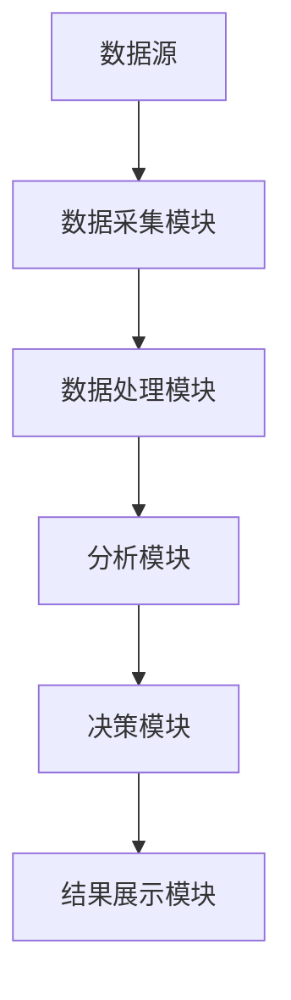
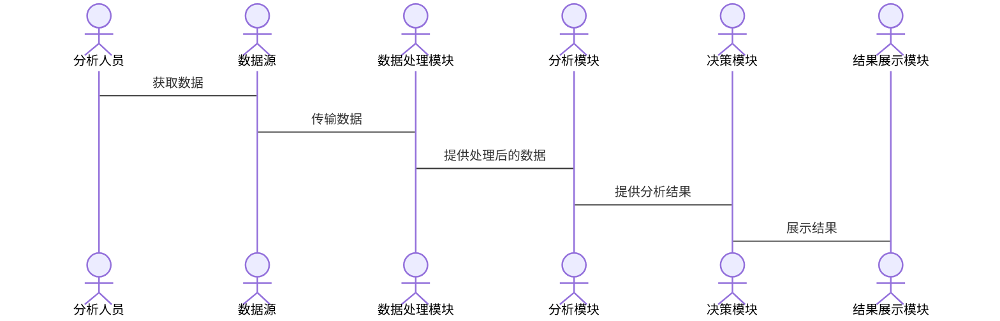

                 


# 芒格的"清晰思考"方法在高频数据分析中的运用

---

## 关键词：
高频数据分析, 芒格方法, 清晰思考, 实时处理, 数据驱动决策, 人工智能

---

## 摘要：
本文探讨了芒格的“清晰思考”方法在高频数据分析中的应用。高频数据分析要求快速、准确的决策，而芒格的思维方式强调知识的系统性、反事实推理和跨学科思维，能够有效提升数据分析的质量和效率。通过结合高频数据的特点，本文详细阐述了芒格方法的核心要素，并通过实际案例展示了其在算法设计、系统架构和项目实战中的具体应用，为数据科学家提供了新的视角和方法。

---

## 第一部分：背景介绍

### 第1章：高频数据分析概述

#### 1.1 高频数据分析的背景与特点
- **1.1.1 高频数据的定义与特点**
  高频数据是指在极短时间内生成的大量数据，具有实时性强、数据量大、变化速度快的特点，常见于金融交易、物联网和实时监控等领域。
  
- **1.1.2 高频数据分析的应用场景**
  - 金融交易：高频交易需要快速决策，对数据的实时性和准确性要求极高。
  - 物联网：实时监测和分析设备数据，用于预测和优化运营。
  - 实时监控：如交通流量监控、网络安全监测等。

- **1.1.3 高频数据分析的挑战**
  - 数据量大：需要高效的处理和存储技术。
  - 数据实时性：要求快速响应和处理。
  - 数据质量：噪声和异常值会影响分析结果。

#### 1.2 芒格的“清晰思考”方法
- **1.2.1 芒格“清晰思考”的核心理念**
  芒格的“清晰思考”强调通过知识的系统性、模型思维和反事实推理来做出更明智的决策。他主张通过跨学科思考，将不同领域的知识结合起来，形成更全面的视角。

- **1.2.2 芒格方法在决策中的应用**
  芒格方法通过分析问题的多种可能性，尤其是反事实推理（即考虑“如果”情况），帮助决策者避免忽略关键因素。

- **1.2.3 芒格方法与数据分析的结合**
  在数据分析中，芒格方法可以帮助分析人员更好地理解数据背后的意义，避免被数据的表面现象误导。

#### 1.3 芒格方法在高频数据分析中的应用背景
- **1.3.1 高频数据的复杂性与决策需求**
  高频数据的复杂性要求分析人员具备快速理解和决策的能力，而芒格方法提供了一种结构化的思维方式。

- **1.3.2 芒格方法在高频数据分析中的优势**
  - 提高决策的准确性：通过系统性思考和反事实推理，减少决策偏差。
  - 加强跨学科分析：在高频数据分析中，往往需要结合多种数据源和分析方法，芒格的跨学科思维非常适用。

- **1.3.3 应用案例概述**
  本文将通过股票交易中的高频数据分析案例，展示芒格方法的应用。

---

## 第二部分：核心概念与联系

### 第2章：高频数据分析的核心概念

#### 2.1 数据流与实时处理
- **2.1.1 数据流的定义与特点**
  数据流是指在特定时间段内连续生成的数据，具有实时性、动态性和不确定性。

- **2.1.2 实时处理的重要性**
  实时处理能够快速响应数据变化，适用于需要快速决策的应用场景。

- **2.1.3 数据流的分类与处理流程**
  数据流可以分为批量处理和流处理两种，流处理更适用于高频数据分析。

#### 2.2 芒格方法的核心要素
- **2.2.1 知识的层级与结构**
  芒格强调知识的层级结构，认为只有将不同领域的知识结合起来，才能做出更明智的决策。

- **2.2.2 模型思维与反事实推理**
  芒格的模型思维是指用简单的模型来理解复杂的问题，反事实推理则是考虑“如果”情况，帮助发现潜在问题。

- **2.2.3 跨学科思维的重要性**
  芒格方法强调跨学科思考，这在高频数据分析中尤为重要，因为高频数据通常涉及多个数据源和分析方法。

#### 2.3 高频数据分析与芒格方法的结合
- **2.3.1 数据驱动决策的必要性**
  高频数据分析依赖于数据驱动的决策，而芒格方法提供了一种结构化的数据思考方式。

- **2.3.2 芒格方法在数据处理中的应用**
  芒格的反事实推理可以帮助分析人员更好地理解数据变化的原因和可能的影响。

- **2.3.3 核心概念对比表**

| **概念**       | **高频数据分析**                     | **芒格方法**                        |
|----------------|--------------------------------------|------------------------------------|
| 数据来源       | 多个数据源，实时生成                | 多学科知识，系统性思考              |
| 数据处理       | 高效处理，实时响应                | 结构化分析，反事实推理              |
| 决策依据       | 数据驱动                            | 知识驱动，结合模型思维              |

#### 2.4 实体关系图（ER图）

以下是一个高频数据分析与芒格方法结合的ER图：

```mermaid
erDiagram
    actor 分析人员 {
        <属性>
        数据源
        数据处理流程
        分析模型
    }
    actor 数据源 {
        <属性>
        交易数据
        市场数据
        用户行为数据
    }
    actor 数据处理流程 {
        <属性>
        数据清洗
        数据转换
        数据建模
    }
    actor 分析模型 {
        <属性>
        时间序列分析
        贝叶斯网络
        决策树
    }
    actor 芒格方法 {
        <属性>
        系统性思考
        反事实推理
        跨学科思维
    }
    分析人员 --> 数据源: 获取数据
    分析人员 --> 数据处理流程: 应用处理流程
    数据处理流程 --> 分析模型: 建立模型
    分析模型 --> 芒格方法: 结合芒格方法
```

---

## 第三部分：算法原理讲解

### 第3章：高频数据分析的算法原理

#### 3.1 贝叶斯定理在高频数据分析中的应用
- **3.1.1 贝叶斯定理的定义**
  贝叶斯定理是一种概率统计方法，用于根据先验概率计算后验概率。

- **3.1.2 贝叶斯定理的公式**
  $$P(A|B) = \frac{P(B|A) \cdot P(A)}{P(B)}$$

- **3.1.3 贝叶斯定理在高频数据分析中的应用**
  例如，在股票交易中，可以通过贝叶斯定理预测价格波动的概率。

#### 3.2 芒格方法与贝叶斯定理的结合
- **3.2.1 芒格的反事实推理**
  考虑“如果”情况，例如“如果市场下跌，我的投资组合会如何变化？”

- **3.2.2 贝叶斯定理的应用步骤**
  1. 确定先验概率。
  2. 收集数据，计算条件概率。
  3. 计算后验概率。
  4. 根据后验概率做出决策。

#### 3.3 高频数据分析的算法实现

以下是一个Python实现的贝叶斯网络示例：

```python
import numpy as np
import pandas as pd
from sklearn.naive_bayes import GaussianNB

# 示例数据：股票价格和交易量
data = pd.DataFrame({
    'price': np.random.randn(100) + 50,
    'volume': np.random.randint(100, 1000, 100)
})

# 使用贝叶斯分类器进行预测
model = GaussianNB()
model.fit(data[['price', 'volume']], np.random.randint(0, 2, 100))
```

---

## 第四部分：系统分析与架构设计方案

### 第4章：高频数据分析系统的架构设计

#### 4.1 系统功能设计
- **数据采集模块**
  负责实时采集高频数据，如股票交易数据、市场数据等。

- **数据处理模块**
  包括数据清洗、转换和建模，确保数据质量。

- **分析模块**
  应用贝叶斯定理等算法进行分析，结合芒格方法做出决策。

#### 4.2 系统架构设计

以下是一个高频数据分析系统的架构图：



#### 4.3 系统接口设计
- **数据接口**
  数据采集模块与数据源之间的接口，通常采用API。

- **算法接口**
  数据处理模块与分析模块之间的接口，用于传递数据和模型参数。

#### 4.4 系统交互流程

以下是一个系统交互流程图：



---

## 第五部分：项目实战

### 第5章：高频数据分析项目实战

#### 5.1 项目环境配置
- **数据源**
  使用金融市场的高频交易数据，如股票价格、交易量等。

- **工具安装**
  安装Python、Pandas、Scikit-learn等工具。

#### 5.2 项目核心实现
- **数据处理**
  清洗和转换数据，建立时间序列模型。

- **模型训练**
  使用贝叶斯网络进行训练，结合芒格方法进行反事实推理。

#### 5.3 项目案例分析
- **案例背景**
  某股票在高频交易中的价格波动分析。

- **数据分析结果**
  通过贝叶斯定理预测价格波动的概率，并结合芒格方法进行风险评估。

#### 5.4 项目小结
- **项目成果**
  成功实现了高频数据的实时分析，提高了决策的准确性。

---

## 第六部分：最佳实践

### 第6章：高频数据分析的最佳实践

#### 6.1 芒格方法在数据分析中的应用经验
- **数据驱动决策**
  芒格方法帮助分析人员更好地理解数据，避免被表面现象误导。

- **反事实推理**
  在高频数据分析中，反事实推理可以帮助发现潜在风险。

#### 6.2 小结
- **芒格方法的优势**
  提高了数据分析的准确性和决策的效率。

#### 6.3 注意事项
- **数据质量**
  高频数据分析对数据质量要求高，需要确保数据的准确性和完整性。

- **模型的可解释性**
  高频数据分析需要模型具有良好的可解释性，以便快速响应和调整。

#### 6.4 拓展阅读
- **推荐书籍**
  - 《芒格的“聪明的投资者”》
  - 《贝叶斯统计学入门》

---

## 作者信息

作者：AI天才研究院/AI Genius Institute & 禅与计算机程序设计艺术/Zen And The Art of Computer Programming

