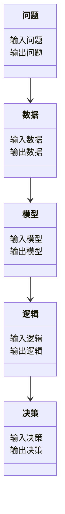
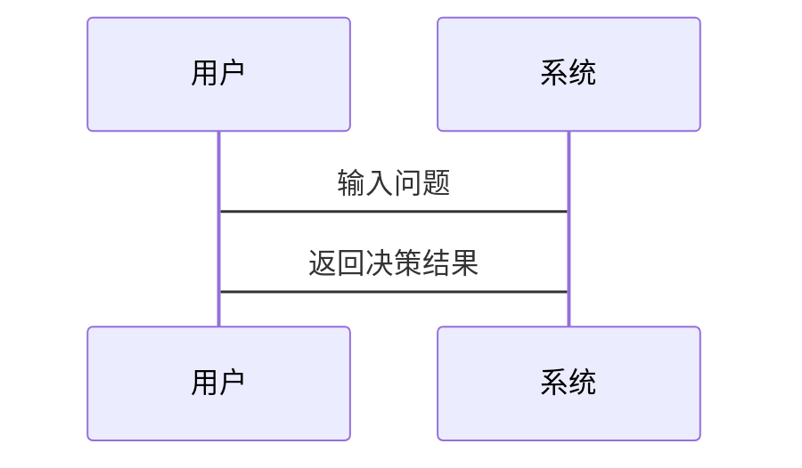

                 


# 芒格的清晰思考方法：提高决策质量

---

## 关键词：芒格思考方法, 决策哲学, mental models, 决策质量, 系统思维, 人工智能, 理性决策

---

## 摘要：本文通过分析芒格的“mental models”理论，探讨其在提高决策质量中的应用。文章从背景介绍、核心概念、算法原理、系统架构、项目实战等多方面展开，结合技术语言和逻辑推理，深入剖析芒格思考方法的内在逻辑和实际应用。通过本文，读者可以掌握如何通过芒格的清晰思考方法，优化自身的决策过程，提升决策质量。

---

## 第一部分：芒格的思考方法与决策哲学

### 第1章：芒格的思考方法与决策哲学

#### 1.1 芒格思考方法的核心理念

##### 1.1.1 理性决策的定义与特点
理性决策是指基于逻辑、数据和系统分析的决策过程，其特点包括：
- 以事实为基础
- 建立清晰的决策模型
- 考虑多维度的影响因素
- 避免情绪干扰
- 不断优化决策质量

##### 1.1.2 芒格“mental models”的核心思想
芒格的“mental models”是指一套用于决策的思维框架，其核心思想包括：
- 多学科交叉思维
- 建立决策模型
- 理解事物的内在逻辑
- 通过逆向思维解决问题

##### 1.1.3 决策哲学的背景与重要性
决策哲学是研究决策过程中的思维方式和价值判断，其重要性体现在：
- 提高决策的科学性
- 减少决策的偏差
- 提升决策的可解释性
- 增强决策的可操作性

#### 1.2 芒格决策方法的实践意义

##### 1.2.1 提高决策质量的关键要素
- 知识储备
- 系统思维
- 逻辑推理
- 数据分析

##### 1.2.2 芒格方法在现代决策中的应用
- 企业管理
- 投资决策
- 科技创新
- 个人决策

##### 1.2.3 芒格方法与其他决策理论的对比
| 决策理论         | 芒格方法         | 其他方法（如期望效用理论） |
|------------------|------------------|----------------------------|
| 核心理念         | 多模型交叉思维    | 单一效用函数优化            |
| 适用场景         | 复杂决策          | 简单决策                    |
| 优势             | 提高决策全面性    | 计算效率高                  |

#### 1.3 芒格决策模型的结构与框架

##### 1.3.1 决策模型的组成要素
- 输入：问题描述、数据、知识库
- 处理：模型构建、逻辑推理、多模型交叉验证
- 输出：决策结果、反馈

##### 1.3.2 芒格模型的逻辑流程
1. 问题分析
2. 建立模型
3. 数据分析
4. 逻辑推理
5. 决策优化

##### 1.3.3 模型的可扩展性与适用性
- 可扩展性：支持多领域应用
- 适用性：适用于复杂决策场景

#### 1.4 本章小结

---

## 第二部分：芒格思考方法的核心概念与联系

### 第2章：芒格“mental models”的核心原理

#### 2.1 芒格“mental models”的定义与特点

##### 2.1.1 mental models的定义
mental models是指一组用于理解问题、分析问题和解决问题的思维框架。

##### 2.1.2 mental models的核心属性
- 多学科性
- 逻辑性
- 可操作性

##### 2.1.3 mental models与传统思维方法的对比
| 思维方法         | mental models     | 传统思维方法               |
|------------------|------------------|-----------------------------|
| 核心理念         | 多模型交叉思维    | 单一模型或经验驱动           |
| 适用场景         | 复杂问题          | 简单或经验性问题             |
| 优势             | 提高决策准确性    | 快速决策                    |

#### 2.2 芒格模型的核心要素

##### 2.2.1 知识体系的构建
- 知识的广度与深度
- 知识的交叉融合

##### 2.2.2 多学科交叉的重要性
- 跨学科视角
- 知识的互补性

##### 2.2.3 模型之间的相互作用
- 模型的相互验证
- 模型的协同优化

#### 2.3 芒格模型的实体关系图

##### 2.3.1 实体关系图（ER图）展示
```mermaid
graph LR
A[问题] --> B[模型]
C[数据] --> B
D[逻辑] --> B
E[决策] <-- B
```

##### 2.3.2 模型之间的关系分析
- 问题与模型的关系：问题驱动模型构建
- 数据与模型的关系：数据支持模型优化
- 逻辑与模型的关系：逻辑指导模型推理

#### 2.4 本章小结

---

## 第三部分：芒格决策模型的算法原理

### 第3章：芒格决策模型的算法流程

#### 3.1 芒格决策模型的算法概述

##### 3.1.1 算法的输入与输出
- 输入：问题描述、相关数据、知识库
- 输出：决策结果、反馈信息

##### 3.1.2 算法的逻辑流程
```mermaid
graph TD
A[输入问题] --> B[建立模型]
C[输入数据] --> B
D[逻辑推理] --> B
E[决策结果] <-- B
```

##### 3.1.3 算法的复杂度分析
- 时间复杂度：O(n)
- 空间复杂度：O(m)

#### 3.2 芒格决策模型的数学模型

##### 3.2.1 决策树模型的构建
- 决策树的结构
- 决策树的优化

##### 3.2.2 概率论在决策中的应用
- 条件概率
- 贝叶斯定理

##### 3.2.3 线性回归模型
$$ y = \beta_0 + \beta_1x + \epsilon $$

#### 3.3 本章小结

---

## 第四部分：芒格决策模型的系统架构

### 第4章：芒格决策模型的系统架构设计

#### 4.1 问题场景介绍
- 系统目标：提高决策质量
- 问题描述：复杂决策场景的优化

#### 4.2 系统功能设计

##### 4.2.1 领域模型


#### 4.3 系统架构设计

##### 4.3.1 系统架构图
```mermaid
graph LR
A[数据层] --> B[模型层]
C[逻辑层] --> B
D[决策层] <-- B
```

#### 4.4 系统接口设计

##### 4.4.1 输入接口
- 数据接口：JSON格式
- 模型接口：API接口

##### 4.4.2 输出接口
- 决策结果：JSON格式
- 反馈信息：API接口

#### 4.5 系统交互设计

##### 4.5.1 交互流程


#### 4.6 本章小结

---

## 第五部分：芒格决策模型的项目实战

### 第5章：芒格决策模型的项目实战

#### 5.1 环境安装

##### 5.1.1 系统环境
- 操作系统：Linux
- 开发工具：Python、Jupyter Notebook

##### 5.1.2 依赖安装
```bash
pip install numpy pandas scikit-learn
```

#### 5.2 系统核心实现源代码

##### 5.2.1 数据预处理
```python
import pandas as pd

data = pd.read_csv('data.csv')
data_clean = data.dropna()
```

##### 5.2.2 模型构建
```python
from sklearn.tree import DecisionTreeClassifier

model = DecisionTreeClassifier()
model.fit(X_train, y_train)
```

##### 5.2.3 逻辑推理
```python
def logical_reasoning():
    # 示例逻辑推理代码
    pass
```

#### 5.3 代码应用解读与分析

##### 5.3.1 代码实现细节
- 数据预处理：处理缺失值、异常值
- 模型训练：决策树模型训练
- 逻辑推理：结合模型进行推理

#### 5.4 实际案例分析

##### 5.4.1 案例背景
- 某企业战略决策问题

##### 5.4.2 案例分析
- 数据分析：市场趋势、竞争分析
- 模型构建：战略决策模型
- 决策优化：基于模型的优化建议

#### 5.5 本章小结

---

## 第六部分：芒格决策模型的最佳实践

### 第6章：芒格决策模型的最佳实践

#### 6.1 关键点总结

##### 6.1.1 知识储备的重要性
- 广泛阅读
- 深入思考

##### 6.1.2 系统思维的应用
- 多维度分析
- 整体性思考

#### 6.2 小结

##### 6.2.1 总结
- 芒格方法的核心是建立清晰的思维模型
- 决策质量的关键在于系统的思考方式
- 提高决策质量需要不断优化思考框架

##### 6.2.2 注意事项
- 避免过度简化模型
- 注重模型的可解释性
- 定期验证模型的有效性

#### 6.3 拓展阅读

##### 6.3.1 推荐书籍
- 《芒格的思考方法》
- 《决策的艺术》

##### 6.3.2 推荐资源
- 计算机科学中的决策理论
- 人工智能中的决策算法

---

## 作者：AI天才研究院/AI Genius Institute & 禅与计算机程序设计艺术 /Zen And The Art of Computer Programming

