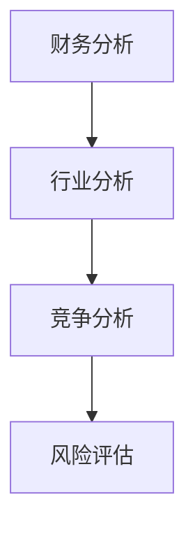
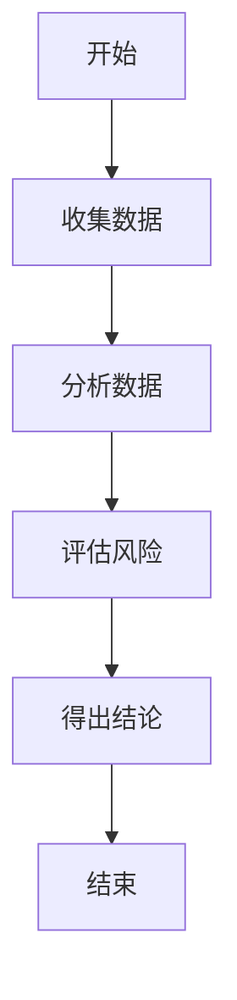
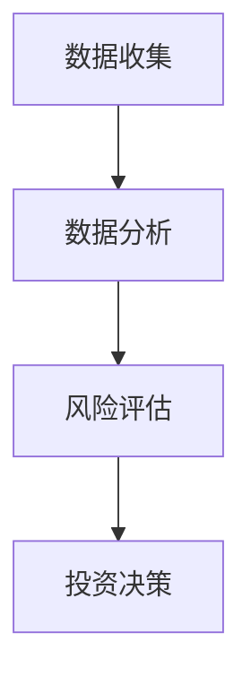
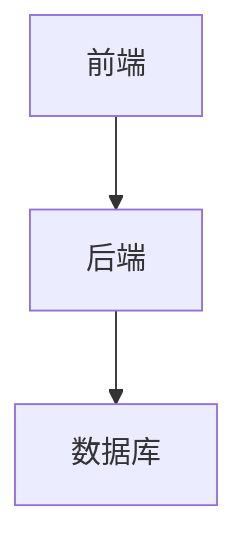

                 


# 芒格的"清晰思考"方法：提高投资分析的准确性

> 关键词：芒格、思维模型、清晰思考、投资分析、决策框架、系统分析、数学模型

> 摘要：本文将探讨芒格的“清晰思考”方法，介绍其背后的思维模型，分析如何将这些模型转化为可执行的算法，构建系统化的投资分析框架，并通过实际案例说明其在提高投资分析准确性中的应用价值。

---

# 第一部分: 芒格的"清晰思考"方法概述

## 第1章: 芒格思维模型的核心概念

### 1.1 芒格的生平与思想体系

#### 1.1.1 芒格的早年经历与职业背景
- 芒格的职业生涯：从律师到投资者
- 芒格的主要思想：价值投资与长期主义

#### 1.1.2 芒格的主要思想与投资哲学
- 投资的本质：寻找具有持续竞争优势的企业
- 投资的三大要素：价格、价值、安全边际
- 芒格的“格栅”思维：构建跨学科的知识框架

#### 1.1.3 芒格思维模型的特点
- 系统性：将多个学科的知识整合到一个框架中
- 实用性：注重实际应用，避免过度复杂化
- 可验证性：通过历史案例验证模型的有效性

### 1.2 "清晰思考"方法的定义与特点

#### 1.2.1 "清晰思考"的定义
- 清晰思考是一种通过系统化的方法，结合多学科的知识和逻辑推理，做出更准确决策的过程。

#### 1.2.2 "清晰思考"的核心特点
- 系统性：将问题分解为多个模块，逐一分析
- 逻辑性：通过严密的推理得出结论
- 实用性：注重实际应用效果

#### 1.2.3 "清晰思考"与传统投资分析的区别
- 传统投资分析：依赖市场趋势和短期波动
- 清晰思考：注重企业基本面和长期价值

### 1.3 芒格思维模型在投资分析中的应用前景

#### 1.3.1 投资分析领域的新范式
- 从单一的财务分析转向多维度的系统分析
- 从经验驱动转向数据驱动

#### 1.3.2 芒格思维模型的优势
- 提供更全面的视角
- 帮助避免常见错误
- 提高决策的准确性

#### 1.3.3 应用中的挑战与机遇
- 挑战：需要跨学科的知识储备
- 机遇：通过技术手段提高分析效率

## 1.4 本章小结
- 本章介绍了芒格的生平及其思维模型的核心概念，强调了“清晰思考”方法在投资分析中的重要性。

---

# 第二部分: 芒格思维模型的核心要素

## 第2章: 芒格思维模型的系统分析

### 2.1 芒格思维模型的系统架构

#### 2.1.1 系统架构的模块划分
- 财务分析模块
- 行业分析模块
- 竞争分析模块
- 风险评估模块

#### 2.1.2 模块之间的关系
- 通过数据流图展示模块之间的交互

#### 2.1.3 系统架构的Mermaid图示


### 2.2 芒格思维模型的核心算法

#### 2.2.1 算法原理的数学模型
- 使用期望收益和风险模型进行评估
- 公式：$$E(r) = \sum p_i r_i$$

#### 2.2.2 算法流程的Mermaid图示


#### 2.2.3 算法实现的Python代码
```python
def calculate_expected_return(prices, weights):
    return sum(weights[i] * prices[i] for i in range(len(weights)))

# 示例数据
prices = [100, 150, 200]
weights = [0.3, 0.4, 0.3]

print(calculate_expected_return(prices, weights))
```

### 2.3 芒格思维模型的数学公式

#### 2.3.1 核心公式推导
- 蒙特卡洛模拟用于风险评估

#### 2.3.2 公式的应用场景
- 通过蒙特卡洛模拟评估投资组合的风险

#### 2.3.3 公式的实际案例
```python
import numpy as np
def monte_carlo_simulation(prices, iterations=1000):
    returns = np.log(prices / prices.shift(1)).dropna()
    simulations = np.random.normal(returns.mean(), returns.std(), size=(iterations, len(prices)))
    return simulations

# 示例数据
prices = [100, 150, 200]
simulations = monte_carlo_simulation(prices)
print(simulations)
```

### 2.4 本章小结
- 本章详细分析了芒格思维模型的系统架构和算法实现，展示了如何将理论转化为实际操作。

---

# 第三部分: 芒格思维模型在投资分析中的应用

## 第3章: 投资分析的系统设计

### 3.1 投资分析系统的设计思路

#### 3.1.1 系统设计的目标
- 提供全面的财务和行业分析
- 量化风险和收益

#### 3.1.2 系统设计的原则
- 简洁性：模块化设计
- 可扩展性：支持多种数据源

#### 3.1.3 系统设计的流程
- 需求分析
- 模块设计
- 测试与优化

### 3.2 投资分析系统的功能设计

#### 3.2.1 系统功能模块划分
- 数据收集模块
- 数据分析模块
- 风险评估模块

#### 3.2.2 每个模块的功能描述
- 数据收集：从多种来源获取数据
- 数据分析：使用统计方法进行分析
- 风险评估：量化投资风险

#### 3.2.3 系统功能的Mermaid图示


### 3.3 投资分析系统的架构设计

#### 3.3.1 系统架构的模块划分
- 前端：用户界面
- 后端：数据处理和分析
- 数据库：存储数据

#### 3.3.2 系统架构的Mermaid图示


### 3.4 本章小结
- 本章详细介绍了投资分析系统的功能和架构设计，展示了如何将芒格的思维模型应用到实际系统中。

---

## 第4章: 项目实战

### 4.1 环境配置与数据收集

#### 4.1.1 环境配置
- 安装Python和必要的库（如Pandas、NumPy）

#### 4.1.2 数据收集
- 从公开数据源获取股票价格

### 4.2 系统核心实现

#### 4.2.1 数据分析与可视化
- 使用Pandas进行数据清洗
- 使用Matplotlib进行数据可视化

#### 4.2.2 风险评估与投资决策
- 使用蒙特卡洛模拟评估风险
- 根据模拟结果制定投资策略

### 4.3 案例分析与结果解读

#### 4.3.1 案例分析
- 某公司的投资分析

#### 4.3.2 结果解读
- 投资组合的预期收益与风险

### 4.4 本章小结
- 本章通过实际案例展示了如何应用芒格的思维模型进行投资分析。

---

## 第5章: 总结与展望

### 5.1 总结
- 本文介绍了芒格的“清晰思考”方法及其在投资分析中的应用
- 展示了如何通过系统化的方法提高投资分析的准确性

### 5.2 展望
- 未来的投资分析将更加依赖于系统化的方法
- 人工智能技术将进一步提升分析的效率和准确性

---

# 作者：AI天才研究院  
邮箱：contact@aitalent.com

