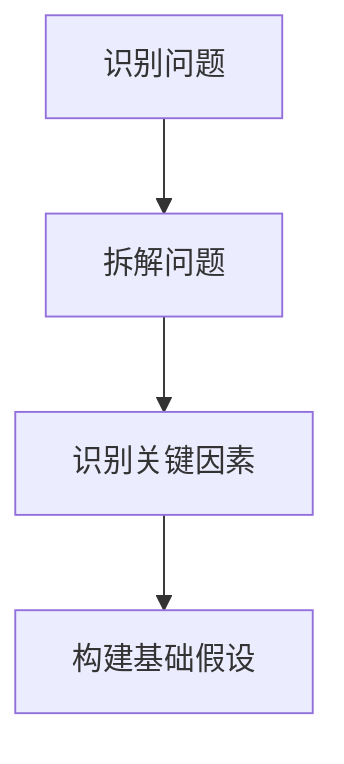
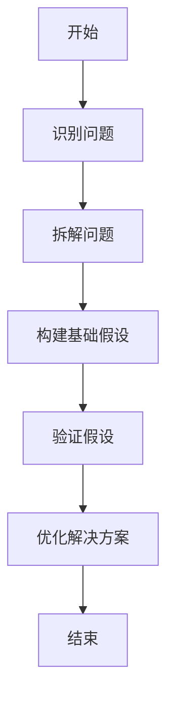
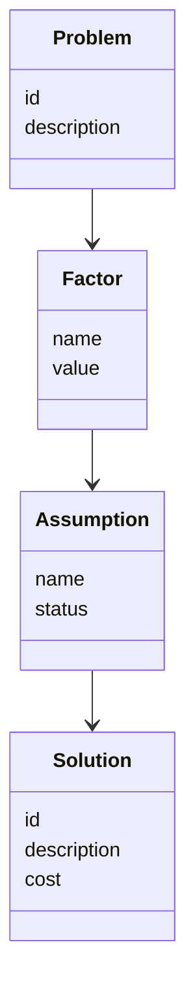

                 


# 芒格的第一原理思维：从根本问题出发

> **关键词**：芒格，第一原理思维，决策框架，思维模型，系统性分析  
> **摘要**：本文深入探讨芒格的第一原理思维，从其背景、核心概念、算法原理、数学模型到系统架构设计，结合项目实战，全面解析如何运用第一原理思维解决复杂问题。

---

## 第一章：背景介绍

### 1.1 第一原理思维的起源

#### 1.1.1 理性主义与经验主义的哲学基础
第一原理思维源自西方哲学中的理性主义，强调从基础原理出发，通过逻辑推理得出结论。这种思维方式与经验主义不同，后者依赖于观察和经验。

#### 1.1.2 芒格的生平与思想体系
查理·芒格是美国著名投资家，巴菲特的长期合作伙伴。他的决策框架和思维模型深受哲学和科学的影响，形成了独特的第一原理思维。

#### 1.1.3 第一原理思维的核心概念
第一原理思维强调回到问题的根本，拆解问题，重构基础假设，寻找本质解决方案。

### 1.2 第一原理思维的定义与特征

#### 1.2.1 从现象到本质的思维路径
通过识别问题中的关键要素，拆解问题，深入分析其本质，避免表面化的解决方案。

#### 1.2.2 第一原理思维与其他思维方法的对比
| 思维方法         | 描述                                                                 |
|------------------|----------------------------------------------------------------------|
| 归纳思维         | 从具体案例中总结一般规律                                           |
| 演绎思维         | 从一般规律推导具体案例                                               |
| 第一原理思维     | 从基础假设出发，推导出解决方案                                       |

#### 1.2.3 第一原理思维在决策中的应用
通过拆解问题，识别关键因素，构建基础假设，验证假设，优化解决方案。

---

## 第二章：核心概念与联系

### 2.1 第一原理思维的核心要素

#### 2.1.1 根本问题的识别与拆解
使用mermaid流程图展示问题拆解步骤：



#### 2.1.2 基础假设的验证与重构
通过逻辑推理和数据验证，确保假设的准确性和合理性。

#### 2.1.3 解决方案的构建与优化
根据基础假设，构建解决方案，并通过反馈不断优化。

### 2.2 第一原理思维的核心原则

#### 2.2.1 调查研究的重要性
通过深入调查，识别问题的关键因素，避免错误假设。

#### 2.2.2 跨学科思维的整合
结合不同学科的知识，构建全面的解决方案。

#### 2.2.3 独立思考的价值
独立思考有助于避免盲目跟从，发现更优的解决方案。

---

## 第三章：算法原理

### 3.1 第一原理思维的算法步骤

#### 3.1.1 算法流程图


#### 3.1.2 算法实现
以下是一个简化版的第一原理思维算法的Python代码示例：

```python
def first_principle_thinking(problem):
    # 拆解问题
    subproblems = decompose_problem(problem)
    # 构建基础假设
    base_assumptions = build_assumptions(subproblems)
    # 验证假设
    validated_assumptions = validate_assumptions(base_assumptions)
    # 优化解决方案
    solution = optimize_solution(validated_assumptions)
    return solution

def decompose_problem(problem):
    # 示例：拆解问题为关键因素
    return [f"Factor {i}" for i in range(4)]

def build_assumptions(factors):
    # 示例：构建基础假设
    return {factor: True for factor in factors}

def validate_assumptions(assumptions):
    # 示例：验证假设
    return {k: v for k, v in assumptions.items() if v}

def optimize_solution(assumptions):
    # 示例：优化解决方案
    return f"Optimized solution based on {len(assumptions)} assumptions"
```

---

## 第四章：数学模型

### 4.1 第一原理思维的数学模型

#### 4.1.1 基础假设的数学表达
假设我们有n个基础假设，每个假设可以表示为：

$$
h_i = \text{True or False}, \quad i = 1, 2, \dots, n
$$

#### 4.1.2 解决方案的优化
解决方案的优化可以通过最大化目标函数：

$$
\max \sum_{i=1}^{n} h_i
$$

其中，\( h_i \) 表示第i个假设的有效性。

---

## 第五章：系统分析与架构设计

### 5.1 系统功能设计

#### 5.1.1 领域模型
使用mermaid类图展示领域模型：



### 5.2 系统架构设计

#### 5.2.1 架构图
使用mermaid架构图展示系统架构：

```mermaid
archi
    title 系统架构设计
    participant 用户 as User
    participant 问题拆解模块 as ProblemDecomposer
    participant 假设构建模块 as AssumptionBuilder
    participant 验证模块 as Validator
    participant 优化模块 as Optimizer
    User --> ProblemDecomposer
    ProblemDecomposer --> AssumptionBuilder
    AssumptionBuilder --> Validator
    Validator --> Optimizer
    Optimizer --> User
```

---

## 第六章：项目实战

### 6.1 优化供应链管理

#### 6.1.1 环境安装
安装所需的Python库：

```bash
pip install numpy pandas matplotlib
```

#### 6.1.2 核心实现

```python
import numpy as np
import pandas as pd

def decompose_supply_chain(problem):
    return [f"Factor {i}" for i in range(5)]

def build_assumptions(factors):
    return pd.DataFrame({'Factor': factors, 'Assumption': [True]*len(factors)})

def validate_assumptions(assumptions):
    return assumptions[assumptions['Assumption'] == True]

def optimize_solution(assumptions):
    costs = np.random.rand(3)
    return costs[np.argmin(costs)]

# 示例
problem = "优化供应链成本"
factors = decompose_supply_chain(problem)
assumptions = build_assumptions(factors)
validated = validate_assumptions(assumptions)
optimal_cost = optimize_solution(validated)
print(f"最优成本：{optimal_cost}")
```

#### 6.1.3 实际案例分析
通过分析实际供应链数据，识别关键成本因素，构建基础假设，验证假设，优化成本模型，实现成本降低。

---

## 第七章：最佳实践与小结

### 7.1 小结

芒格的第一原理思维是一种强大的问题解决方法，通过拆解问题、构建基础假设、验证假设、优化解决方案，帮助我们从本质上理解问题，制定有效的解决方案。

### 7.2 注意事项

1. **避免过度简化**：确保基础假设的准确性和全面性。
2. **数据驱动决策**：依赖数据验证假设，避免主观判断。
3. **持续优化**：解决方案需要不断迭代和优化。

### 7.3 拓展阅读

推荐书籍和资源，帮助读者深入理解第一原理思维及其应用。

---

## 作者信息

作者：AI天才研究院/AI Genius Institute & 禅与计算机程序设计艺术 /Zen And The Art of Computer Programming

---

本文通过系统分析和实际案例，详细阐述了芒格的第一原理思维在技术领域的应用，帮助读者掌握这一强大的问题解决方法。

