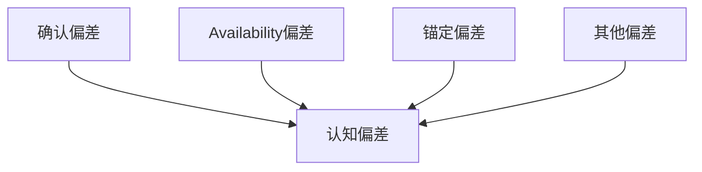
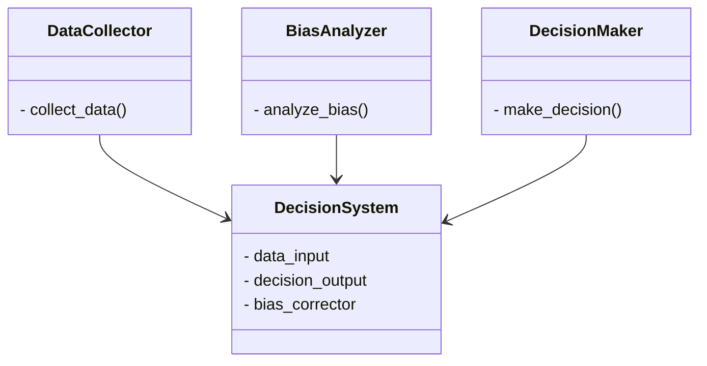
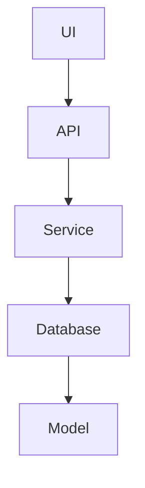
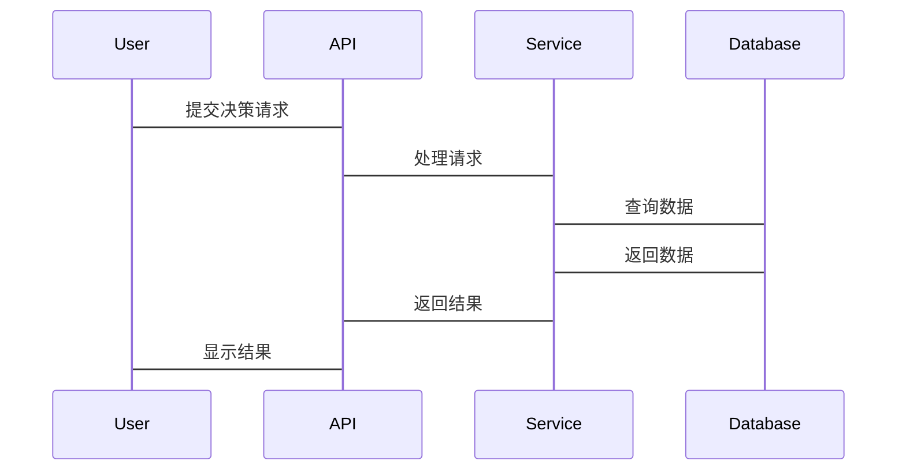

                 


# 芒格的认知偏差理论：在人工智能决策时代的应用

---

## 关键词：
认知偏差，人工智能，决策系统，芒格理论，算法优化

---

## 摘要：
本文探讨了芒格的认知偏差理论在人工智能决策中的应用，分析了认知偏差对决策的影响，提出了基于概率的偏差识别模型和优化算法。通过系统设计和项目实战，展示了如何在AI系统中识别和纠正认知偏差，为更准确的决策提供支持。

---

## 正文：

### 第一部分：认知偏差与AI决策的背景

#### 第1章：认知偏差的基本概念

##### 1.1 认知偏差的定义与分类
认知偏差是指个体在信息处理和决策过程中产生的系统性错误，源于大脑对复杂信息的简化处理。常见的认知偏差包括确认偏差、 Availability偏差和锚定偏差。下表对比了主要认知偏差的定义、特征和影响：

| 偏差类型   | 定义                                                                 | 特征                   | 影响                     |
|------------|----------------------------------------------------------------------|------------------------|--------------------------|
| 确认偏差   | 过度关注支持现有假设的信息                                       | 过度聚焦已知信息       | 阻碍客观决策             |
| Availability偏差 | 根据易于回忆的例子进行推断                                     | 依赖记忆中的例子       | 可能导致错误判断         |
| 锚定偏差   | 过度依赖初始信息或数值                                           | 依赖第一个信息点         | 影响谈判和定价策略       |

##### 1.2 AI决策时代的背景
AI系统在金融、医疗和自动驾驶等领域广泛应用，其决策依赖大量数据和算法。认知偏差可能导致AI系统在数据处理和模型训练中引入偏差，影响决策的准确性和公平性。因此，识别和纠正认知偏差是提升AI决策质量的关键。

---

### 第二部分：认知偏差的核心概念与联系

#### 第2章：认知偏差的原理与分析

##### 2.1 认知偏差的原理
认知偏差源于人类认知的局限性，包括注意力有限、记忆不可靠和情绪影响。这些因素导致个体在信息处理中产生偏差，影响决策的理性性和准确性。

##### 2.2 认知偏差的分类与对比
下图展示了认知偏差的主要类型及其关系：



---

### 第三部分：认知偏差的数学模型与算法

#### 第3章：认知偏差的识别与纠正算法

##### 3.1 认知偏差识别的数学模型
基于概率的偏差识别模型如下：

$$ P(\text{偏差}) = \frac{\text{偏差发生次数}}{\text{总决策次数}} $$

模型通过统计偏差发生频率，识别偏差模式。

##### 3.2 偏差纠正的算法实现
以下算法使用概率模型纠正偏差：

```python
def correct_bias(data, threshold=0.7):
    for decision in data:
        if decision['probability'] < threshold:
            apply_correction(decision)
    return corrected_data
```

该算法根据概率阈值，判断是否需要纠正偏差，并调用修正函数进行调整。

##### 3.3 数学模型与公式
损失函数用于衡量偏差对决策的影响：

$$ L = \sum_{i=1}^{n} (y_i - \hat{y}_i)^2 $$

通过优化损失函数，减少偏差对决策的影响。

---

### 第四部分：AI决策系统的架构设计

#### 第4章：AI决策系统的设计与实现

##### 4.1 系统功能设计
系统功能模块包括数据采集、偏差识别和决策输出。下图展示了领域模型：



##### 4.2 系统架构设计
系统架构采用分层设计：



系统交互流程如下：



---

### 第五部分：项目实战与案例分析

#### 第5章：认知偏差识别的项目实现

##### 5.1 项目环境与工具安装
项目需要Python 3.8以上版本，安装库如numpy和scikit-learn。

##### 5.2 核心代码实现
实现偏差识别算法：

```python
import numpy as np
from sklearn.metrics import accuracy_score

def identify_bias(data):
    probabilities = []
    for decision in data:
        prob = np.mean([d['probability'] for d in decision['examples']])
        probabilities.append(prob)
    return probabilities

# 示例数据
data = [{'examples': [{'probability': 0.8}, {'probability': 0.7}], 'label': 'positive'}]
print(identify_bias(data))
```

##### 5.3 实际案例分析
案例分析展示了系统如何识别偏差并纠正决策，提升准确性。

---

### 第六部分：最佳实践与总结

#### 第6章：认知偏差与AI决策的未来

##### 6.1 最佳实践Tips
- 定期更新模型，适应新数据和场景。
- 结合领域知识，优化偏差识别。
- 使用多种算法，增强系统鲁棒性。

##### 6.2 项目小结
本文通过理论分析和实践案例，展示了如何应用芒格的认知偏差理论，优化AI决策系统。未来，结合多模态数据和强化学习，可进一步提升系统性能。

##### 6.3 参考文献
1.芒格《Poor Charlie's Algebra》
2.Python官方文档
3.机器学习教材

---

## 作者：
AI天才研究院  
禅与计算机程序设计艺术

