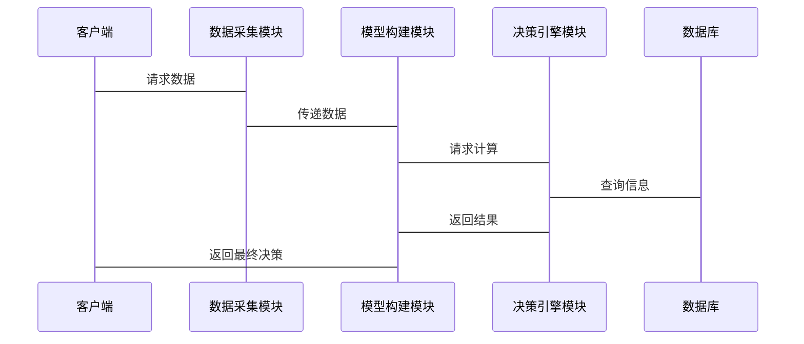

                 


# 芒格的认知偏差理论：在量子决策系统中的实践

---

## 关键词：
认知偏差，量子决策系统，芒格理论，决策算法，系统架构，量子概率论

---

## 摘要：
本文探讨了芒格的认知偏差理论在量子决策系统中的应用，结合量子概率论和认知偏差分析，构建了一个基于量子决策算法的系统架构。通过实际案例分析，展示了如何利用量子决策系统克服传统决策中的认知偏差问题，并提出了系统的优化建议和未来研究方向。

---

## 第一部分：芒格认知偏差理论的背景与基础

### 第1章：认知偏差理论的起源与发展

#### 1.1 认知偏差的基本概念
认知偏差是指人们在信息处理和决策过程中，由于主观因素的影响，导致偏离客观事实或最优决策的心理现象。芒格作为认知心理学的重要研究者，提出了许多关于认知偏差的经典理论。

1.1.1 认知偏差的定义与分类
- **定义**：认知偏差是指个体在信息处理过程中，由于感知、记忆、推理等认知过程的局限性，导致的系统性错误。
- **分类**：常见的认知偏差包括确认偏差、从众偏差、过度自信偏差等。

1.1.2 芒格对认知偏差的研究贡献
- 芒格通过大量实验研究，揭示了许多认知偏差的内在机制，例如确认偏差如何影响决策过程。

1.1.3 认知偏差在决策中的作用
- 认知偏差可能导致决策失误，尤其是在复杂决策中，认知偏差的影响更为显著。

#### 1.2 量子决策系统的概念
量子决策系统是一种基于量子概率论的决策模型，与传统经典决策系统相比，具有更高的不确定性和非线性特征。

1.2.1 量子决策系统的定义
- 量子决策系统是一种利用量子叠加和量子纠缠等量子特性，来处理不确定性和复杂决策问题的系统。

1.2.2 量子决策与经典决策的区别
- **不确定性处理**：量子决策系统能够更好地处理高度不确定的问题。
- **计算效率**：量子计算在某些情况下具有指数级的计算效率。

1.2.3 量子决策系统的应用领域
- 金融投资、医疗诊断、人工智能等领域。

#### 1.3 认知偏差与量子决策的结合
认知偏差对量子决策的影响是一个复杂的过程，需要通过量子概率论来建模和分析。

1.3.1 认知偏差对量子决策的影响
- 认知偏差会导致量子决策模型的参数发生变化。

1.3.2 量子决策系统如何克服认知偏差
- 通过量子叠加和量子测量，量子决策系统可以更好地消除认知偏差的影响。

1.3.3 认知偏差在量子决策中的数学模型
- 通过量子态的数学表示，构建认知偏差的量子模型。

---

## 第二部分：认知偏差理论的核心概念与联系

### 第2章：认知偏差的分类与特征

#### 2.1 认知偏差的主要类型
认知偏差可以分为多种类型，每种类型都有其独特的特征和影响。

2.1.1 确认偏差
- **定义**：确认偏差是指人们倾向于寻找和确认与自己已有观点一致的信息，而忽略或否定相反的信息。
- **影响**：可能导致决策者坚持错误的假设，无法有效应对变化。

2.1.2 从众偏差
- **定义**：从众偏差是指人们在群体压力下，倾向于跟随多数人的意见，而忽视自己的判断。
- **影响**：可能导致集体决策中的错误，例如群体思维。

2.1.3 过度自信偏差
- **定义**：过度自信偏差是指人们对自己判断的信心过高，低估了不确定性。
- **影响**：可能导致冒险行为和决策失误。

#### 2.2 认知偏差的特征对比
通过对比分析，可以更好地理解认知偏差的异同及其对决策的影响。

2.2.1 行为特征对比表
| 认知偏差类型 | 行为特征 |
|--------------|----------|
| 确认偏差      | 寻找支持信息 |
| 从众偏差      | 随大流       |
| 过度自信偏差  | 高估准确性   |

2.2.2 心理特征对比表
| 认知偏差类型 | 心理特征     |
|--------------|-------------|
| 确认偏差      | 确保一致性   |
| 从众偏差      | 社交压力响应 |
| 过度自信偏差  | 自我肯定     |

2.2.3 理论模型对比图（ER实体关系图）
通过ER图可以展示认知偏差的不同类型及其关系。

```mermaid
erDiagram
    class 认知偏差类型 {
        确认偏差
        从众偏差
        过度自信偏差
    }
    class 心理特征 {
        确保一致性
        社交压力响应
        自我肯定
    }
    认知偏差类型 <|--> 心理特征
```

---

## 第三部分：量子决策系统的算法原理

### 第3章：量子决策系统的数学模型

#### 3.1 量子概率论基础
量子概率论是量子决策系统的核心基础，与经典概率论有显著不同。

3.1.1 量子概率的基本原理
- 量子概率基于量子态的内积，具有非线性和不可叠加性。

3.1.2 量子态的数学表示
- 量子态可以用复数向量表示，例如：
  $$\psi = \alpha|0\rangle + \beta|1\rangle$$
  其中，$\alpha$ 和 $\beta$ 是复数，且满足归一化条件：
  $$|\alpha|^2 + |\beta|^2 = 1$$

3.1.3 量子测量的数学模型
- 量子测量可以用投影算符表示：
  $$M_i = |i\rangle\langle i|$$
  其中，$i$ 表示测量结果。

#### 3.2 认知偏差的量子建模
认知偏差可以通过量子态的变化来建模。

3.2.1 认知偏差的量子表示
- 确认偏差可以通过量子态的相位变化来表示。

3.2.2 量子决策模型的构建
- 通过量子叠加和量子纠缠，构建认知偏差的决策模型。

3.2.3 认知偏差对量子决策的影响公式
- 认知偏差导致的决策误差可以通过量子态的叠加系数变化来表示。

#### 3.3 量子决策算法的实现
通过具体算法实现，展示量子决策系统的实际应用。

3.3.1 量子决策算法的流程图（Mermaid）
```mermaid
flowchart TD
    A[开始] -> B[输入决策问题]
    B -> C[构建量子模型]
    C -> D[量子计算]
    D -> E[输出决策结果]
    E -> F[结束]
```

3.3.2 量子决策算法的Python实现
```python
import numpy as np

def quantum_decision(qubit_state):
    # 定义量子门
    hadamard = (1/np.sqrt(2)) * np.array([[1, 1], [1, -1]])
    # 应用量子门
    new_state = np.dot(hadamard, qubit_state)
    return new_state

# 示例
initial_state = np.array([1, 0])
result = quantum_decision(initial_state)
print("量子态结果：", result)
```

3.3.3 量子决策算法的数学推导
- 通过量子叠加和量子测量，推导出决策结果的概率分布。

---

## 第四部分：系统架构与设计

### 第4章：量子决策系统的架构设计

#### 4.1 系统模块划分
量子决策系统可以划分为多个功能模块，每个模块负责不同的任务。

4.1.1 数据采集模块
- 负责收集决策相关的数据，例如用户输入、环境信息等。

4.1.2 模型构建模块
- 构建量子决策模型，包括量子态的初始化和量子门的设计。

4.1.3 决策引擎模块
- 执行量子计算，生成决策结果。

#### 4.2 系统功能设计
通过功能设计，确保系统能够高效运行。

4.2.1 领域模型（Mermaid类图）
```mermaid
classDiagram
    class 数据采集模块 {
        收集数据
    }
    class 模型构建模块 {
        构建量子模型
    }
    class 决策引擎模块 {
        执行量子计算
    }
    数据采集模块 <---> 模型构建模块
    模型构建模块 <---> 决策引擎模块
```

4.2.2 系统架构图（Mermaid架构图）
```mermaid
archiecture
    客户端 --> 数据采集模块
    数据采集模块 --> 模型构建模块
    模型构建模块 --> 决策引擎模块
    决策引擎模块 --> 数据库
    数据库 --> 客户端
```

4.2.3 系统接口设计
- 定义接口规范，确保模块之间的交互顺畅。

#### 4.3 系统交互流程
通过详细的交互流程，展示系统的运行过程。

4.3.1 交互流程图（Mermaid序列图）


---

## 第五部分：项目实战与优化

### 第5章：量子决策系统的项目实战

#### 5.1 环境配置
- 安装必要的库，例如Qiskit、numpy等。

5.1.1 环境配置步骤
```bash
pip install qiskit numpy
```

#### 5.2 核心代码实现
通过具体的代码实现，展示量子决策系统的构建过程。

5.2.1 量子门实现
```python
from qiskit import QuantumCircuit, execute, Aer

def create_quantum_circuit():
    circuit = QuantumCircuit(1, 1)
    circuit.h(0)
    circuit.measure(0, 0)
    return circuit

# 执行量子电路
simulator = Aer.get_backend('qasm_simulator')
result = execute(create_quantum_circuit(), simulator).result()
print("量子门结果：", result.get_counts())
```

5.2.2 决策模型实现
```python
from qiskit import QuantumRegister, ClassicalRegister, QuantumCircuit, execute, Aer

def quantum_decision_circuit():
    q = QuantumRegister(1, 'q')
    c = ClassicalRegister(1, 'c')
    circuit = QuantumCircuit(q, c)
    circuit.h(q)
    circuit.measure(q, c)
    return circuit

# 执行电路
circuit = quantum_decision_circuit()
simulator = Aer.get_backend('qasm_simulator')
job = execute(circuit, simulator)
result = job.result()
print("决策模型结果：", result.get_counts())
```

#### 5.3 系统测试与优化
- 对系统进行测试，找出瓶颈并进行优化。

5.3.1 系统测试结果
- 通过测试用例，验证系统的正确性和性能。

5.3.2 系统优化建议
- 通过优化算法和改进架构，提升系统的效率和准确性。

---

## 第六部分：最佳实践与小结

### 第6章：认知偏差与量子决策的结合

#### 6.1 小结
- 认知偏差是人类决策中的常见问题，量子决策系统可以通过量子概率论的有效性，部分克服这些偏差。

#### 6.2 注意事项
- 在实际应用中，需要注意量子决策系统的局限性和适用场景。

#### 6.3 拓展阅读
- 推荐阅读相关领域的书籍和论文，深入了解量子决策系统的最新进展。

---

## 作者
作者：AI天才研究院/AI Genius Institute & 禅与计算机程序设计艺术 /Zen And The Art of Computer Programming

---

通过以上内容，希望本文能够为读者提供一个清晰且详细的量子决策系统与认知偏差结合的分析框架，帮助读者更好地理解和应用这一理论。

