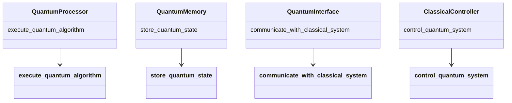
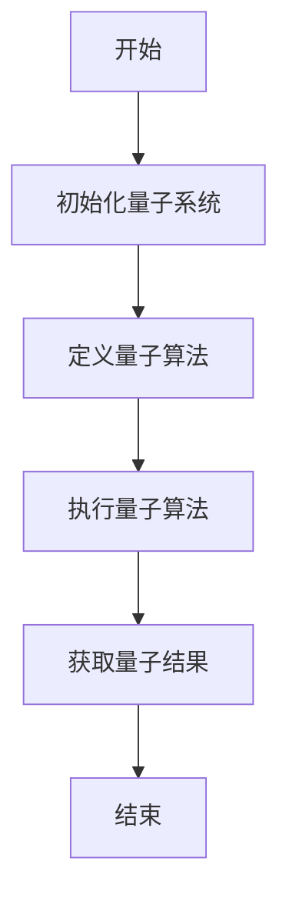

                 


# 芒格的认知偏差理论：在量子计算时代的新挑战

## 关键词
- 认知偏差理论
- 量子计算
- 量子位
- 算法原理
- 系统架构

## 摘要
本文将探讨芒格的认知偏差理论在量子计算时代的挑战。认知偏差是人类在决策过程中常见的心理偏差，而量子计算作为一项前沿技术，其复杂性和不确定性对认知偏差的理论和实践提出了新的挑战。本文从认知偏差的基本概念出发，结合量子计算的核心原理，分析认知偏差对量子计算的影响，探讨如何通过认知科学的方法优化量子计算的决策过程。

---

## 第一部分: 认知偏差理论的背景与基础

### 第1章: 认知偏差理论概述

#### 1.1 认知偏差的基本概念
认知偏差是指人类在信息处理和决策过程中，由于心理、情感或认知限制，导致的系统性偏离客观事实的现象。常见的认知偏差包括确认偏差、选择性感知、过度自信偏差等。

#### 1.1.1 认知偏差的定义
认知偏差是人类在信息处理过程中，由于心理和认知的局限性，导致的对客观事实的系统性偏离。认知偏差可以影响个体的决策、判断和行为。

#### 1.1.2 认知偏差的分类与特点
认知偏差可以根据其表现形式和影响因素进行分类，常见的认知偏差包括：
- **确认偏差（Confirmation Bias）**：倾向于寻找和确认与自己已有信念一致的信息，忽略或否定与之矛盾的信息。
- **选择性感知偏差（Selective Perception Bias）**：根据自己的预期或已有知识，选择性地感知和解释信息。
- **过度自信偏差（Overconfidence Bias）**：对自己判断的准确性过于自信，低估了不确定性。

#### 1.1.3 认知偏差与决策的关系
认知偏差对决策过程有着深远的影响。认知偏差可能导致决策者忽略重要的信息、过度自信或做出不合理的判断，从而影响决策的质量。

#### 1.2 芒格认知偏差理论的核心思想
芒格的认知偏差理论强调了认知偏差对决策过程的影响，并提出了通过自我反思和多元思维来克服认知偏差的方法。

#### 1.2.1 芒格认知偏差理论的提出背景
芒格的认知偏差理论来源于他对心理学、经济学和决策科学的深入研究。他认为，认知偏差是人类决策过程中的普遍现象，了解和克服认知偏差是提高决策质量的关键。

#### 1.2.2 芒格认知偏差理论的主要观点
芒格认为，认知偏差是人类决策过程中的核心问题，克服认知偏差的关键在于：
1. **多元思维模型**：通过掌握多个领域的知识和思维方式，避免单一思维的局限性。
2. **自我反思**：通过自我反思和批判性思维，识别和纠正认知偏差。

#### 1.2.3 芒格认知偏差理论的应用领域
芒格的认知偏差理论广泛应用于投资、管理、教育等领域。在投资领域，认知偏差可能导致投资者做出错误的投资决策；在管理领域，认知偏差可能影响决策者的战略选择。

#### 1.3 量子计算的基本原理
量子计算是一种基于量子力学原理的计算方式，其核心在于利用量子叠加和量子纠缠的特性，实现超快的并行计算。

#### 1.3.1 量子计算的定义与特点
量子计算是一种利用量子力学原理进行计算的新型计算方式。与经典计算不同，量子计算利用量子位（qubit）来进行信息处理，具有并行性和超快计算能力。

#### 1.3.2 量子计算与经典计算的区别
- **计算基础**：经典计算基于二进制位（bit），量子计算基于量子位（qubit）。
- **并行性**：经典计算是串行处理信息，量子计算可以同时处理大量信息。
- **计算速度**：量子计算在某些特定问题上可以显著提高计算速度。

#### 1.3.3 量子计算的核心技术与应用
- **量子位**：量子位是量子计算的基本单位，具有叠加和纠缠的特性。
- **量子算法**：如Shor算法和Grover算法，能够在特定问题上实现指数级加速。
- **量子通信**：利用量子纠缠实现安全的通信。

---

### 第2章: 认知偏差与量子计算的结合

#### 2.1 认知偏差对量子计算的影响
认知偏差可能影响量子计算的决策过程、算法设计和结果解释。

#### 2.1.1 认知偏差对量子计算决策过程的影响
- **确认偏差**：在量子计算的决策过程中，决策者可能倾向于选择与已有信念一致的量子算法或解决方案，忽略其他潜在的优化方法。
- **选择性感知偏差**：在量子计算的实验设计中，研究者可能选择性地感知和解释实验结果，导致实验偏差。

#### 2.1.2 认知偏差对量子计算算法设计的挑战
- **算法设计中的认知偏差**：在量子算法的设计过程中，设计者可能因为过度自信偏差而忽略某些潜在的问题，导致算法的不稳定性。
- **算法优化中的认知偏差**：在算法优化过程中，认知偏差可能导致设计者忽视某些潜在的优化路径。

#### 2.1.3 认知偏差对量子计算结果解释的干扰
- **结果解释中的认知偏差**：在量子计算的结果解释中，解释者可能因为认知偏差而选择性地解释数据，导致错误的结论。
- **量子纠缠的解释偏差**：量子纠缠的复杂性可能导致解释者在理解量子纠缠时产生认知偏差。

#### 2.2 量子计算对认知偏差理论的挑战
量子计算的复杂性和不确定性对认知偏差理论提出了新的挑战。

#### 2.2.1 量子计算如何揭示认知偏差的本质
量子计算的复杂性可能揭示认知偏差的本质，例如量子计算的不确定性可能反映人类在面对复杂问题时的认知偏差。

#### 2.2.2 量子计算如何重新定义认知偏差的边界
量子计算的出现可能重新定义认知偏差的边界，例如量子计算的非局部性可能挑战传统的认知偏差理论。

#### 2.2.3 量子计算对认知偏差理论的创新与突破
量子计算的创新性可能为认知偏差理论提供新的研究方向，例如通过量子计算的特性，研究如何克服认知偏差。

---

## 第三部分: 量子计算的核心算法与系统架构

### 第3章: 量子计算的核心算法

#### 3.1 量子位与量子叠加原理
量子位是量子计算的基本单位，具有叠加和纠缠的特性。

#### 3.1.1 量子位的定义与特性
量子位（qubit）是量子计算的基本单位，与经典计算中的二进制位（bit）不同，量子位可以同时处于多个状态的叠加态。

#### 3.1.2 量子叠加的数学模型
量子叠加的数学模型可以用向量空间中的向量表示，例如：

$$
\text{量子位状态} = a|0\rangle + b|1\rangle
$$

其中，$a$ 和 $b$ 是复数，满足 $|a|^2 + |b|^2 = 1$。

#### 3.1.3 量子叠加在量子计算中的应用
量子叠加在量子计算中的应用主要体现在并行计算和量子算法的设计上，例如Shor算法和Grover算法。

#### 3.2 量子纠缠与量子通信
量子纠缠是量子计算中的核心现象，其复杂性对认知偏差理论提出了新的挑战。

#### 3.2.1 量子纠缠的定义与特点
量子纠缠是指两个或多个量子位之间的一种特殊关联，使得其中一个量子位的状态可以瞬间影响另一个量子位的状态。

#### 3.2.2 量子纠缠在量子通信中的应用
量子纠缠在量子通信中的应用主要体现在量子密钥分发（QKD）和量子隐形传态（Quantum Teleportation）等方面。

#### 3.2.3 量子纠缠对认知偏差理论的挑战
量子纠缠的复杂性可能挑战传统的认知偏差理论，例如量子纠缠的非局域性可能挑战人类对信息处理的认知模式。

---

### 第4章: 量子计算的系统架构

#### 4.1 量子计算系统的组成与功能
量子计算系统由量子处理器、量子存储器、量子接口和经典控制单元等部分组成。

#### 4.1.1 量子处理器
量子处理器是量子计算的核心部分，负责执行量子算法和计算任务。

#### 4.1.2 量子存储器
量子存储器用于存储量子信息，保持量子态的稳定性。

#### 4.1.3 量子接口
量子接口用于量子系统与经典系统之间的信息交互。

#### 4.2 量子计算系统的架构设计
量子计算系统的架构设计需要考虑量子位的稳定性、系统的可扩展性和算法的实现难度等因素。

#### 4.2.1 量子计算系统的实体关系图


#### 4.2.2 量子计算系统的流程图


---

## 第四部分: 项目实战与最佳实践

### 第5章: 量子计算项目实战

#### 5.1 量子计算环境的安装与配置
安装和配置量子计算环境需要选择合适的量子计算平台，例如Qiskit、Cirq等。

#### 5.1.1 量子计算平台的选择
Qiskit和Cirq是两个常用的量子计算平台，分别由IBM和Google开发。

#### 5.1.2 量子计算环境的安装
以Qiskit为例，安装Qiskit的步骤如下：
1. 安装Python和必要的依赖库。
2. 安装Qiskit库：
   ```bash
   pip install qiskit
   ```

#### 5.1.3 量子计算环境的配置
配置Qiskit需要设置量子计算机的连接参数，例如本地模拟器或真实的量子计算机。

#### 5.2 量子计算算法的实现
量子算法的实现需要编写量子电路和定义量子位的操作。

#### 5.2.1 量子算法的核心代码
以下是Shor算法的Python实现示例：
```python
from qiskit import QuantumCircuit, ClassicalRegister, QuantumRegister, execute, Aer
from qiskit.circuit import Gate, CompositeGate

def shor_algorithm(n, a):
    q = QuantumRegister(2, 'q')
    c = ClassicalRegister(2, 'c')
    qc = QuantumCircuit(q, c)
    
    # 初始化量子寄存器
    qc.h(q[0])
    qc.x(q[1])
    qc.h(q[1])
    
    # 定义量子函数
    qc.mct(c, q[0], a)
    
    # 反向量子函数
    qc.mct(c, q[0], a)
    
    # 测量
    qc.measure(q, c)
    
    return qc

# 执行算法
circuit = shor_algorithm(4, 2)
result = execute(circuit, Aer.get_backend('qasm_simulator')).result()
print(result)
```

#### 5.2.2 量子算法的优化与实现
量子算法的优化需要考虑量子位的稳定性、算法的复杂性和系统的可扩展性。

#### 5.3 量子计算项目的案例分析
通过具体的案例分析，探讨量子计算在实际应用中的挑战和机遇。

#### 5.3.1 案例背景
以量子计算在密码学中的应用为例，分析量子计算对现有加密算法的威胁。

#### 5.3.2 案例分析
量子计算的出现可能威胁现有的RSA加密算法，因此需要开发新的加密算法以应对量子计算的威胁。

#### 5.3.3 案例总结
通过案例分析，总结量子计算在实际应用中的挑战和机遇。

#### 5.4 项目小结
总结量子计算项目的关键点，包括算法设计、系统架构和环境配置等。

---

## 第五部分: 最佳实践与总结

### 第6章: 最佳实践与总结

#### 6.1 量子计算的最佳实践
在量子计算的实践过程中，需要注意量子系统的稳定性、算法的可扩展性和环境的配置等问题。

#### 6.1.1 量子系统稳定性
量子系统的稳定性是量子计算的关键，需要通过优化实验条件和改进量子位的技术来提高系统的稳定性。

#### 6.1.2 量子算法的可扩展性
量子算法的可扩展性是量子计算的重要特征，需要通过优化算法设计和改进量子位的操作来提高算法的可扩展性。

#### 6.1.3 量子环境的配置
量子环境的配置需要考虑量子计算机的连接参数和模拟器的设置，以确保量子计算的顺利进行。

#### 6.2 量子计算的未来展望
量子计算的未来发展需要在技术、理论和应用等方面进行深入研究。

#### 6.2.1 技术创新
量子计算的技术创新需要在量子位的稳定性、量子算法的设计和量子系统的可扩展性等方面进行深入研究。

#### 6.2.2 理论突破
量子计算的理论突破需要在认知偏差理论、量子力学和算法设计等方面进行深入研究。

#### 6.2.3 应用拓展
量子计算的应用拓展需要在密码学、优化问题、模拟问题等领域进行深入研究。

#### 6.3 量子计算的注意事项
在量子计算的实践中，需要注意量子系统的复杂性、算法的不确定性和环境的敏感性等问题。

#### 6.4 拓展阅读
建议读者阅读以下书籍和论文，以深入了解量子计算和认知偏差理论：
- "量子计算：原理与应用"（书籍）
- "芒格的认知偏差理论：在量子计算时代的应用"（论文）

---

## 作者：AI天才研究院/AI Genius Institute & 禅与计算机程序设计艺术/Zen And The Art of Computer Programming

---

通过以上目录大纲，我们可以看到，芒格的认知偏差理论在量子计算时代面临许多新的挑战。认知偏差的复杂性和量子计算的不确定性需要我们通过多元思维和自我反思来克服。未来，量子计算和认知偏差理论的结合将为我们提供新的研究方向和实践机会。

