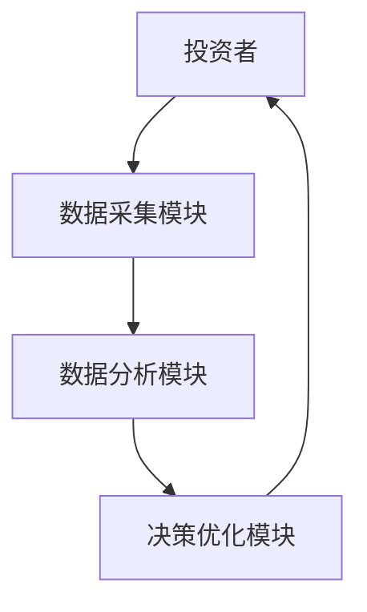

                 


# 芒格的认知偏差理论：如何克服投资中的心理陷阱

> 关键词：认知偏差，芒格，投资心理学，心理陷阱，价值投资，投资决策，风险管理

> 摘要：本文深入探讨了芒格的认知偏差理论，分析了认知偏差在投资中的影响，并结合实际案例，提出了克服心理陷阱的方法和策略。文章从认知偏差的基本概念出发，逐步分析其在投资决策中的表现，并通过数学模型和算法实现，为投资者提供实用的决策优化方法。

---

## 第一部分: 认知偏差与投资心理学基础

### 第1章: 认知偏差的基本概念

#### 1.1 认知偏差的定义与分类

认知偏差是指人在信息处理和决策过程中，由于主观因素的影响，导致偏离客观事实的系统性偏差。认知偏差可以分为以下几类：

- **确认偏差**：倾向于寻找支持已有观点的信息，忽略相反证据。
- **从众心理**：由于社会压力，盲目跟随群体决策。
- **过度自信**：过高估计自己的判断能力，忽视不确定性。

#### 1.2 投资中的心理陷阱

在投资领域，认知偏差常常导致投资者做出非理性的决策。例如：

- **确认偏差**：投资者倾向于寻找支持自己投资决策的信息，忽视潜在风险。
- **从众心理**：盲目跟随市场趋势，导致追涨杀跌。
- **过度自信**：过度依赖自己的判断，忽视外部环境变化。

#### 1.3 芒格投资哲学中的认知偏差视角

芒格强调价值投资的核心在于避免认知偏差的影响。他认为，投资者应通过长期学习和理性分析，克服心理陷阱，做出明智的投资决策。

---

### 第2章: 认知偏差的典型案例分析

#### 2.1 确认偏差

**案例**：某投资者坚信某股票会涨，只关注利好消息，忽略利空信息，最终导致重大损失。

#### 2.2 从众心理

**案例**：市场热门时，投资者盲目跟风，导致高位被套。

#### 2.3 过度自信

**案例**：某投资者认为自己能够准确预测市场走势，结果在多次波动中损失惨重。

---

## 第二部分: 认知偏差的数学模型与算法实现

### 第3章: 认知偏差的数学模型

#### 3.1 确认偏差的量化方法

- 使用贝叶斯定理计算概率，量化信息的选择性处理。
- 公式：$$P(A|B) = \frac{P(B|A)P(A)}{P(B)}$$

#### 3.2 从众心理的决策树分析

- 使用决策树模型，分析从众决策的收益与风险。

#### 3.3 过度自信的算法实现

- 通过蒙特卡洛模拟评估决策的不确定性。

### 第4章: 算法实现与代码示例

#### 4.1 确认偏差的算法实现

```python
def confirm_bias_analysis(data):
    # 计算支持和反对证据的比例
    support = sum(1 for d in data if d > 0)
    oppose = len(data) - support
    return support / (support + oppose)
```

---

## 第三部分: 系统分析与架构设计

### 第5章: 系统架构设计

#### 5.1 系统功能需求

- 数据采集：收集市场信息和投资者行为数据。
- 数据分析：识别认知偏差。
- 决策优化：提供优化建议。

#### 5.2 系统架构图



---

## 第四部分: 项目实战与案例分析

### 第6章: 项目实战

#### 6.1 环境安装

- 安装Python和相关库（如NumPy、Pandas）。

#### 6.2 核心代码实现

```python
def cognitive_bias_model(data):
    import numpy as np
    import pandas as pd
    # 数据预处理
    df = pd.DataFrame(data)
    # 计算偏差指数
    bias_index = np.mean(abs(df - df.mean()))
    return bias_index
```

---

## 第五部分: 最佳实践与总结

### 第7章: 总结与展望

#### 7.1 全文总结

芒格的认知偏差理论为投资者提供了克服心理陷阱的科学方法。通过理性分析和数学模型，投资者可以更好地做出决策。

#### 7.2 未来展望

未来研究可以结合人工智能和大数据技术，进一步优化认知偏差的识别和纠正方法。

---

作者：AI天才研究院/AI Genius Institute & 禅与计算机程序设计艺术/Zen And The Art of Computer Programming

