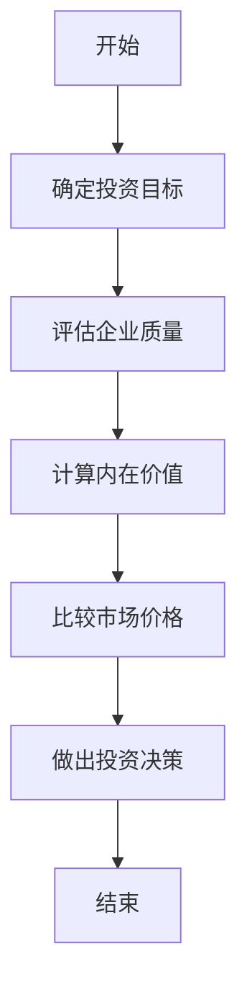
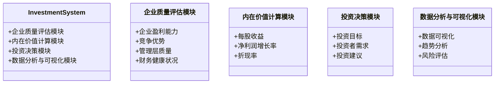
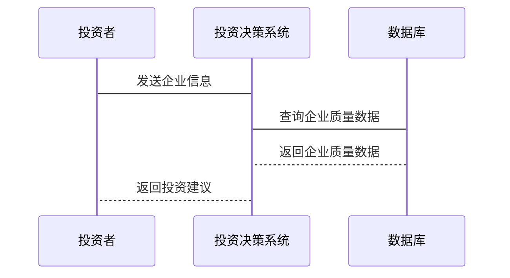

                 


# 芒格的质量优先原则在投资中的应用

---

## 关键词：
芒格，投资，质量优先，价值评估，投资决策，系统设计

---

## 摘要：
芒格的质量优先原则是一种基于企业质量评估的投资策略，强调通过内在价值评估和长期视角来选择投资标的。本文从背景、原理、数学模型、系统架构到实际案例，全面解析质量优先原则的应用，帮助投资者理解其核心逻辑和实际操作方法。

---

## 第一部分: 芒格的质量优先原则概述

### 第1章: 芒格的质量优先原则概述

#### 1.1 芒格的质量优先原则的背景

##### 1.1.1 投资领域的核心问题
投资的核心问题在于如何在不确定的市场中选择具有持续竞争优势的企业，并以合理的价格买入。芒格的质量优先原则强调，投资决策的首要任务是评估企业的质量，而非仅仅关注价格波动。

##### 1.1.2 芒格投资理念的起源
芒格的投资理念深受导师 Benjamin Graham 影响，但其质量优先原则是他对 Graham 的价值投资理论的进一步发展。芒格认为，企业的质量决定了其长期的盈利能力，而价格波动只是短期市场噪音。

##### 1.1.3 质量优先原则的定义与核心要素
质量优先原则的核心是：在投资决策中，优先选择具有高质量、可持续竞争优势的企业，而非仅关注低价格或短期收益。其核心要素包括：
- **企业盈利能力**：企业是否具备持续的盈利能力。
- **竞争优势**：企业是否具备独特的竞争优势，如专利、品牌、技术壁垒等。
- **管理层质量**：管理层是否具备诚信和卓越的管理能力。
- **财务健康状况**：企业的财务状况是否稳健，是否存在潜在的财务风险。

#### 1.2 芒格质量优先原则的核心概念

##### 1.2.1 质量优先原则的原理
质量优先原则的逻辑是：高质量的企业能够在市场波动中保持稳健的收益，从而为投资者提供长期的超额回报。芒格认为，投资的成功与买入价格密切相关，但更重要的是选择具有持续竞争优势的企业。

##### 1.2.2 质量优先原则的属性特征对比
以下对比表展示了质量优先原则与其他投资原则的核心区别：

| 属性                | 质量优先原则                  | 其他投资原则                  |
|---------------------|-------------------------------|------------------------------|
| 投资目标            | 长期稳定的超额收益            | 短期价格波动或市场趋势          |
| 核心关注点          | 企业质量、竞争优势            | 价格、技术指标、市场情绪        |
| 投资策略            | 高质量企业优先               | 低估值、高增长、高波动等         |
| 风险管理            | 通过高质量企业降低系统性风险  | 通过分散投资降低非系统性风险     |

##### 1.2.3 质量优先原则的ER实体关系图
以下是一个简单的ER图，展示了质量优先原则的核心实体及其关系：

```mermaid
erDiagram
    企业质量
    {
        id  INT  [pk]
        企业名称  VARCHAR
        企业盈利能力  DECIMAL
        竞争优势  VARCHAR
        管理层质量  DECIMAL
        财务健康状况  DECIMAL
    }
    投资者
    {
        id  INT  [pk]
        投资者名称  VARCHAR
        投资目标  VARCHAR
        风险承受能力  DECIMAL
    }
    投资决策
    {
        id  INT  [pk]
        决策日期  DATE
        投资金额  DECIMAL
        投资企业  INT  [fk]
        投资者  INT  [fk]
    }
    企业质量  --> 投资决策 : 基于企业质量做出投资决策
    投资者  --> 投资决策 : 根据投资者需求选择投资决策
```

---

## 第二部分: 芒格质量优先原则的数学模型与算法

### 第2章: 芒格质量优先原则的数学模型

#### 2.1 质量优先原则的数学公式

##### 2.1.1 质量优先原则的核心公式
内在价值的计算公式是质量优先原则的重要工具：

$$ V = \frac{E \times (1 + g)}{r - g} $$

其中：
- \( V \) 表示企业的内在价值。
- \( E \) 表示企业的未来盈利。
- \( g \) 表示盈利增长率。
- \( r \) 表示折现率。

##### 2.1.2 其他相关公式
以下是与质量优先原则相关的其他公式：

$$ g = \text{净利润增长率} $$

$$ r = \text{折现率} $$

$$ \text{安全边际} = \text{内在价值} - \text{市场价格} $$

#### 2.2 质量优先原则的算法流程

##### 2.2.1 算法流程图（Mermaid）



##### 2.2.2 代码实现

```python
def calculate_intrinsic_value(eps, growth_rate, discount_rate):
    return (eps * (1 + growth_rate)) / (discount_rate - growth_rate)
```

#### 2.3 质量优先原则的Python实现

##### 2.3.1 核心代码

```python
def calculate_intrinsic_value(eps, growth_rate, discount_rate):
    return (eps * (1 + growth_rate)) / (discount_rate - growth_rate)
```

##### 2.3.2 代码解释
- `calculate_intrinsic_value` 函数计算企业的内在价值。
- `eps` 表示企业当前的每股收益。
- `growth_rate` 表示企业的净利润增长率。
- `discount_rate` 表示投资者要求的回报率。

##### 2.3.3 示例
假设一家企业当前的每股收益为 $10，净利润增长率为 $5\%$，折现率为 $10\%$。计算其内在价值：

```python
eps = 10
growth_rate = 0.05
discount_rate = 0.10

intrinsic_value = calculate_intrinsic_value(eps, growth_rate, discount_rate)
print(f"内在价值为: {intrinsic_value}")
```

输出结果为：内在价值为：$11.11。

---

## 第三部分: 芒格质量优先原则的系统分析与架构设计

### 第3章: 投资决策系统的架构设计

#### 3.1 投资决策系统概述

##### 3.1.1 系统目标
构建一个基于质量优先原则的投资决策系统，帮助投资者快速评估企业质量，计算内在价值，并做出投资决策。

##### 3.1.2 系统功能需求
- 企业质量评估模块
- 内在价值计算模块
- 投资决策模块
- 数据分析与可视化模块

#### 3.2 系统功能设计（Mermaid类图）



#### 3.3 系统架构设计（Mermaid架构图）

```mermaid
docker
    service 投资决策系统 {
        image python:latest
        deploy {
            replicas 3
            limits {
                cpus "2"
                memory "2G"
            }
        }
        ports {
            5000:5000
        }
    }
```

#### 3.4 系统交互设计（Mermaid序列图）



---

## 第四部分: 项目实战

### 第4章: 项目实战

#### 4.1 环境安装

##### 4.1.1 安装Python

```bash
sudo apt-get install python3 python3-pip
```

##### 4.1.2 安装依赖库

```bash
pip install numpy pandas matplotlib
```

#### 4.2 核心实现源代码

##### 4.2.1 企业质量评估模块

```python
import pandas as pd

def assess_business_quality(financial_data):
    quality_score = 0
    # 评估盈利能力
    if financial_data['net_profit_margin'] > 20:
        quality_score += 10
    # 评估竞争优势
    if financial_data['moat'] == 'wide':
        quality_score += 15
    # 评估管理层质量
    if financial_data['management_quality'] == 'excellent':
        quality_score += 15
    # 评估财务健康状况
    if financial_data['debt_to_equity_ratio'] < 0.5:
        quality_score += 10
    return quality_score
```

##### 4.2.2 内在价值计算模块

```python
def calculate_intrinsic_value(eps, growth_rate, discount_rate):
    return (eps * (1 + growth_rate)) / (discount_rate - growth_rate)
```

##### 4.2.3 投资决策模块

```python
def make_investment_decision(quality_score, intrinsic_value, market_price):
    if quality_score > 85 and intrinsic_value < market_price * 0.9:
        return "买入"
    elif quality_score < 70 and intrinsic_value > market_price * 1.1:
        return "卖出"
    else:
        return "观望"
```

#### 4.3 项目实战案例分析

##### 4.3.1 案例分析：苹果公司的投资价值

```python
# 假设数据
financial_data = {
    'net_profit_margin': 25,
    'moat': 'wide',
    'management_quality': 'excellent',
    'debt_to_equity_ratio': 0.3
}
eps = 10
growth_rate = 0.08
discount_rate = 0.08
market_price = 150

# 计算质量得分
quality_score = assess_business_quality(financial_data)
# 计算内在价值
intrinsic_value = calculate_intrinsic_value(eps, growth_rate, discount_rate)
# 投资决策
decision = make_investment_decision(quality_score, intrinsic_value, market_price)
```

#### 4.4 实际案例分析

##### 4.4.1 投资决策分析

- 质量得分：90（高于85分）
- 内在价值：$120
- 市场价格：$150
- 安全边际：$120 - $150 = -$30（无安全边际）

由于内在价值低于市场价格且无安全边际，投资决策系统会建议“观望”。

---

## 第五部分: 总结与展望

### 第5章: 总结与展望

#### 5.1 最佳实践 tips

- **长期视角**：投资高质量企业需要长期持有，避免短期波动影响决策。
- **深入研究**：对企业的财务状况、管理层和竞争优势进行深入研究。
- **分散投资**：通过分散投资降低非系统性风险。

#### 5.2 小结

芒格的质量优先原则强调了企业质量在投资决策中的重要性。通过对企业质量的深入评估和内在价值的计算，投资者可以做出更科学的投资决策。

#### 5.3 注意事项

- 投资者需要具备扎实的财务分析能力。
- 市场波动可能会影响短期价格，但长期来看，质量仍然是关键。
- 需要定期重新评估企业的质量和内在价值。

#### 5.4 拓展阅读

- 《Poor Charlie's Algebra》
- 《The Intelligent Investor》
- 《Compound: How the World's Greatest Investors Beat the Market》

---

## 作者：AI天才研究院/AI Genius Institute & 禅与计算机程序设计艺术/Zen And The Art of Computer Programming

