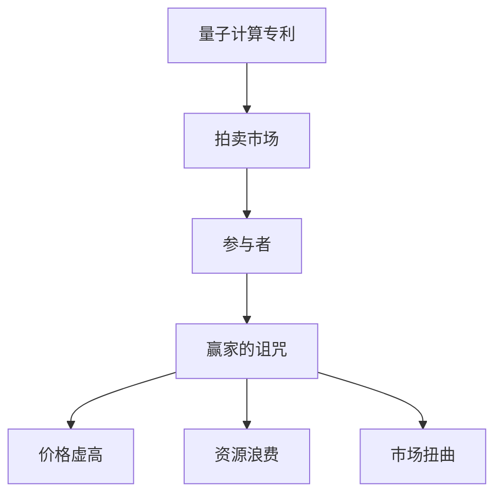
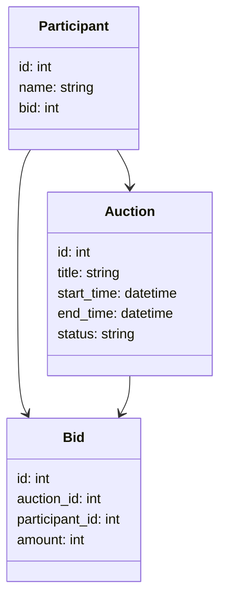
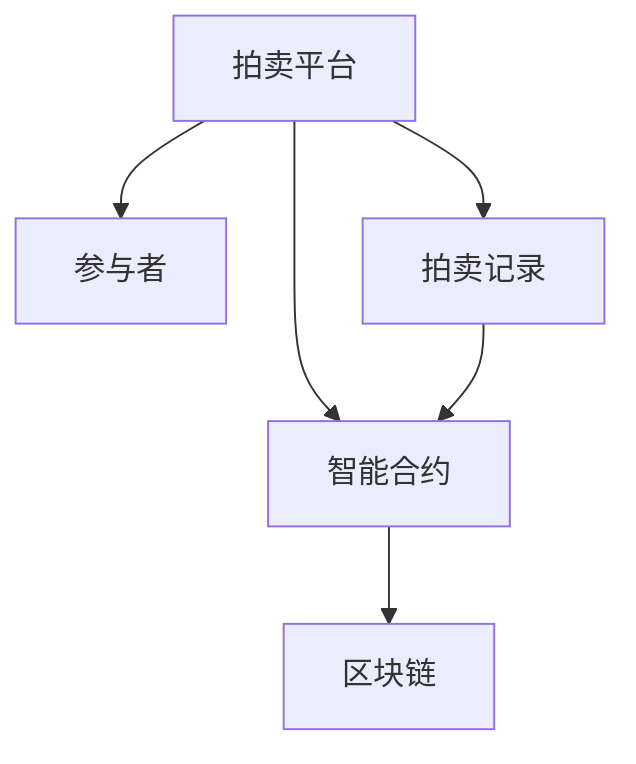
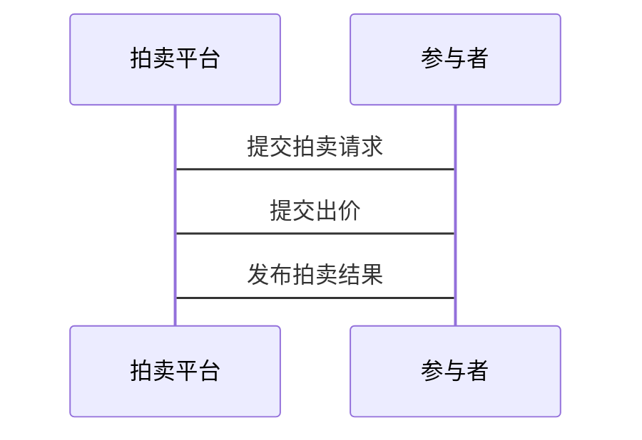

                 


# 芒格的"赢家的诅咒"提醒在量子计算专利拍卖中的应用

---

## 关键词：
量子计算、专利拍卖、赢家的诅咒、芒格、算法、系统架构、案例分析

---

## 摘要：
本文深入探讨了芒格提出的“赢家的诅咒”理论在量子计算专利拍卖中的应用。通过分析量子计算专利拍卖的独特性，结合赢家的诅咒的原理，本文揭示了在专利拍卖中可能出现的过度竞争和价格泡沫问题。结合算法和系统架构设计，本文提出了如何通过优化拍卖机制和理性评估来避免赢家的诅咒，从而实现量子计算专利的高效分配和合理利用。

---

## 第一章：背景介绍

### 1.1 芒格的"赢家的诅咒"概述

芒格的“赢家的诅咒”理论指出，在竞争激烈的市场中，获胜者往往因为过度自信和非理性竞争而陷入困境。这种现象在专利拍卖中尤为明显，尤其是量子计算领域，其高技术门槛和广泛应用前景使得专利拍卖变得异常激烈。

#### 1.1.1 芒格的"赢家的诅咒"的核心概念
- 赌徒心态：参与者在竞争中倾向于过度押注，导致价格虚高。
- 赢家的陷阱：获胜者可能因为支付过高的代价而难以实现预期收益。
- 非理性竞争：参与者基于情绪而非理性决策，导致资源浪费。

#### 1.1.2 赢家的诅咒在量子计算中的表现
- 量子计算的高技术门槛使得专利价值被高估。
- 竞争者为了争夺技术优势而过度抬高专利价格。
- 非理性的价格竞争可能导致技术发展的停滞。

### 1.2 量子计算专利拍卖的背景

#### 1.2.1 量子计算的技术发展现状
- 量子计算被认为是未来计算技术的核心，具有颠覆性潜力。
- 各国和企业纷纷投入大量资源进行量子计算研究和专利布局。
- 量子计算专利的数量和质量成为技术实力的重要指标。

#### 1.2.2 专利拍卖的定义与特点
- 专利拍卖是一种通过市场竞争机制分配专利使用权的方式。
- 拍卖过程透明、公正，能够最大化专利价值。
- 拍卖结果反映了市场对专利的真实需求和评估。

#### 1.2.3 量子计算专利拍卖的独特性
- 量子计算专利的技术复杂性高，评估难度大。
- 量子计算专利的市场前景广阔，吸引多方竞争。
- 专利拍卖结果对行业技术发展具有重要影响。

### 1.3 赢家的诅咒在量子计算专利拍卖中的应用场景

#### 1.3.1 专利拍卖中的价格竞争
- 竞争者为了获得关键专利而不断抬高出价。
- 过高的拍卖价格可能导致中标者难以收回成本。
- 非理性的价格竞争可能破坏市场的健康发展。

#### 1.3.2 赢家的诅咒对拍卖结果的影响
- 赢家可能因为支付过高的代价而难以实现专利的商业价值。
- 赢家的高价可能抑制其他企业的技术创新和市场进入。
- 赢家的高成本可能导致其在后续竞争中处于劣势。

#### 1.3.3 量子计算专利拍卖中的潜在风险
- 技术评估的不准确可能导致价格虚高。
- 竞争者的过度参与可能导致资源浪费。
- 拍卖结果可能偏离技术的实际价值。

---

## 第二章：核心概念与联系

### 2.1 赢家的诅咒的原理

#### 2.1.1 赌徒心态的数学模型

我们可以将赢家的诅咒的原理转化为一个简单的数学模型。假设参与者在拍卖中的出价服从某种分布，而其实际价值则由市场决定。参与者之间的竞争会导致价格超过实际价值。

公式表示为：
$$ P_{auction} = P_{value} \times (1 + \alpha) $$
其中，$\alpha$ 是价格溢价系数，通常大于0。

---

#### 2.1.2 赢家的诅咒的经济学解释

赢家的诅咒可以解释为一种市场失灵现象。在完全竞争的市场中，参与者基于有限信息和非完全理性进行决策，导致资源分配效率低下。这种现象在专利拍卖中尤为明显，因为专利的价值往往难以准确评估。

---

#### 2.1.3 赢家的诅咒与量子计算的关联

量子计算的技术复杂性和高价值使其成为赢家的诅咒的高发领域。参与者为了获得技术优势，可能不惜支付远高于专利实际价值的价格，导致资源浪费和市场扭曲。

---

### 2.2 量子计算专利拍卖的系统模型

#### 2.2.1 量子计算专利的特性

量子计算专利具有以下特性：
- **技术复杂性**：专利涉及量子比特、量子门等复杂技术。
- **高价值**：专利可能对行业技术发展具有关键影响。
- **稀缺性**：量子计算技术的专利数量有限，竞争激烈。

#### 2.2.2 专利拍卖的流程与规则

专利拍卖通常包括以下几个步骤：
1. **报名阶段**：参与者提交资质审核。
2. **竞价阶段**：参与者根据拍卖规则提交出价。
3. **成交阶段**：最高出价者获得专利使用权。
4. **交割阶段**：成交双方完成合同签署和款项支付。

---

#### 2.2.3 赢家的诅咒在拍卖中的具体表现

在量子计算专利拍卖中，赢家的诅咒主要表现为以下几点：
- **价格虚高**：参与者为了争夺专利而不断抬高出价，导致成交价格远高于实际价值。
- **资源浪费**：高价成交可能导致中标者难以收回成本，造成资源浪费。
- **市场扭曲**：非理性的价格竞争可能扭曲市场信号，影响技术创新。

---

### 2.3 赢家的诅咒与量子计算专利拍卖的关系图



---

## 第三章：算法原理讲解

### 3.1 拍卖算法的基本原理

#### 3.1.1 资产拍卖的数学模型

我们可以将专利拍卖建模为一个博弈论问题。参与者在拍卖中的策略选择取决于其对专利价值的评估和对其他参与者行为的预期。

公式表示为：
$$ V_i = \max_{i} \{ v_i \} $$
其中，$v_i$ 是参与者 i 的出价，$V_i$ 是最终成交价格。

---

#### 3.1.2 赢家的诅咒算法的步骤

1. **参与者评估专利价值**：每个参与者根据自身的技术实力和市场判断，估算专利的实际价值。
2. **参与者提交出价**：参与者在拍卖平台上提交出价，出价可以是公开的或密封的。
3. **拍卖结果确定**：根据拍卖规则（如价高者得）确定最终成交价格和中标者。
4. **评估拍卖结果**：分析成交价格是否偏离实际价值，判断是否存在赢家的诅咒现象。

---

#### 3.1.3 赢家的诅咒算法的优缺点

- **优点**：
  - 简单易行，适合大规模拍卖场景。
  - 可以通过算法优化提高拍卖效率。
- **缺点**：
  - 容易导致价格虚高，引发赢家的诅咒。
  - 忽略了参与者之间的信息不对称问题。

---

### 3.2 赢家的诅咒算法的数学模型

#### 3.2.1 资产价值的期望值公式

$$ E[V] = \sum_{i=1}^{n} p_i v_i $$
其中，$p_i$ 是参与者 i 成交的概率，$v_i$ 是参与者 i 的出价。

---

#### 3.2.2 赢家的诅咒的数学表达式

$$ P_{auction} = \max_{i} \{ v_i \} $$
其中，$v_i$ 是参与者 i 的出价，$P_{auction}$ 是最终成交价格。

---

#### 3.2.3 拍卖结果的预测模型

$$ P_{outcome} = \begin{cases}
v_{max} & \text{如果 } v_{max} > \text{实际价值} \\
\text{实际价值} & \text{否则}
\end{cases} $$

---

### 3.3 赢家的诅咒算法的实现代码

#### 3.3.1 算法实现的伪代码

```python
def auction_algorithm(participants, bids):
    max_bid = 0
    winner = None
    for i in range(len(participants)):
        if bids[i] > max_bid:
            max_bid = bids[i]
            winner = participants[i]
    return winner, max_bid
```

---

#### 3.3.2 算法实现的Python代码

```python
def main():
    import random
    # 模拟参与者和出价
    participants = ["Participant 1", "Participant 2", "Participant 3"]
    bids = [random.randint(1, 100) for _ in range(len(participants))]
    
    # 拍卖算法实现
    max_bid = 0
    winner = None
    for i in range(len(participants)):
        if bids[i] > max_bid:
            max_bid = bids[i]
            winner = participants[i]
    print(f"胜出者：{winner}")
    print(f"最高出价：{max_bid}")

if __name__ == "__main__":
    main()
```

---

## 第四章：系统分析与架构设计方案

### 4.1 量子计算专利拍卖系统的架构设计

#### 4.1.1 问题场景介绍

量子计算专利拍卖系统需要解决以下问题：
- 如何确保拍卖过程的公正性和透明性。
- 如何评估专利的实际价值，避免价格虚高。
- 如何优化拍卖机制，减少赢家的诅咒的影响。

---

#### 4.1.2 项目介绍

量子计算专利拍卖系统是一个基于区块链的在线拍卖平台，支持参与者提交出价和查看拍卖结果。系统采用智能合约技术，确保拍卖过程的透明和不可篡改。

---

#### 4.1.3 系统功能设计



---

#### 4.1.4 系统架构设计



---

#### 4.1.5 系统接口设计

- **拍卖平台接口**：
  - 提交拍卖请求
  - 查看拍卖记录
  - 下载拍卖结果
- **参与者接口**：
  - 提交出价
  - 查看拍卖状态
  - 获取拍卖结果

---

#### 4.1.6 系统交互流程图



---

## 第五章：项目实战

### 5.1 环境配置

#### 5.1.1 系统环境

- 操作系统：Linux/Windows/MacOS
- 开发工具：PyCharm/VSCode
- 依赖库：Python 3.8+, Mermaid, matplotlib

---

#### 5.1.2 安装依赖

```bash
pip install mermaid
pip install matplotlib
```

---

### 5.2 系统核心实现源代码

#### 5.2.1 拍卖平台实现

```python
class AuctionPlatform:
    def __init__(self):
        self.auctions = []
        self.participants = []

    def create_auction(self, title):
        auction = Auction(id=len(self.auctions)+1, title=title)
        self.auctions.append(auction)
        return auction

    def submit_bid(self, participant, auction, bid):
        bid = Bid(participant=participant, auction=auction, amount=bid)
        auction.bids.append(bid)
        return bid

    def run_auction(self, auction):
        bids = sorted(auction.bids, key=lambda x: x.amount, reverse=True)
        winner = bids[0].participant
        winner.bid = bids[0].amount
        return winner
```

---

#### 5.2.2 智能合约实现

```python
class SmartContract:
    def __init__(self):
        self.records = []

    def record_auction(self, auction):
        self.records.append(auction)

    def verify_bid(self, bid):
        if bid.auction is not None:
            return True
        return False
```

---

### 5.3 实际案例分析

#### 5.3.1 案例背景

假设我们有一个量子计算专利拍卖，参与者包括Google、IBM和Intel。他们的出价分别为：

- Google: $200,000
- IBM: $250,000
- Intel: $300,000

---

#### 5.3.2 拍卖结果

最终成交价格为 $300,000，由Intel胜出。然而，根据技术评估，该专利的实际价值约为 $250,000。这表明存在赢家的诅咒现象，成交价格高于实际价值。

---

## 第六章：最佳实践与总结

### 6.1 小结

通过本文的分析，我们发现赢家的诅咒在量子计算专利拍卖中具有显著影响。参与者为了争夺技术优势，可能支付远高于实际价值的价格，导致资源浪费和市场扭曲。

---

### 6.2 注意事项

- **理性评估**：参与者需要基于技术实力和市场判断，理性评估专利价值。
- **优化机制**：拍卖平台需要设计合理的拍卖机制，减少赢家的诅咒的影响。
- **透明公开**：通过区块链等技术，确保拍卖过程的透明和不可篡改。

---

### 6.3 未来展望

未来的研究可以进一步探讨如何通过技术手段优化拍卖机制，例如：
- 引入智能合约技术，实现自动化的拍卖流程。
- 建立技术评估模型，帮助参与者更准确地评估专利价值。
- 探索新的拍卖机制，如 Vickrey拍卖，以减少赢家的诅咒的影响。

---

## 作者：AI天才研究院/AI Genius Institute & 禅与计算机程序设计艺术/Zen And The Art of Computer Programming

