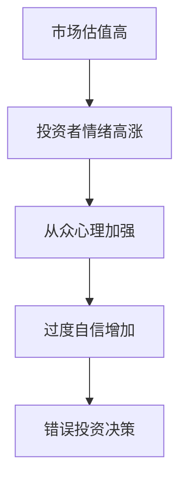

                 


```markdown
# 芒格的"赢家的诅咒"提醒在高估值市场中的应用

> 关键词：芒格，赢家的诅咒，高估值市场，投资策略，风险管理

> 摘要：本文深入探讨了芒格提出的“赢家的诅咒”这一概念，分析其在高估值市场中的表现及其对投资者决策的影响。通过结合心理学、行为金融学和投资学的理论，本文揭示了投资者在高估值市场中常见的认知偏差和情绪化决策，并提供了一系列实用的风险管理策略和投资建议，帮助投资者在复杂的市场环境中做出更理性的决策。

---

## 第一章：芒格及其投资哲学

### 1.1 芒格的生平与思想
- 1.1.1 芒格的早年经历与职业背景
- 1.1.2 芒格与巴菲特的合作关系
- 1.1.3 芒格的投资哲学与核心思想

### 1.2 "赢家的诅咒"的概念
- 1.2.1 定义与背景
- 1.2.2 与传统投资理论的对比
- 1.2.3 对现代投资行为的启示

---

## 第二章：高估值市场的特点与风险

### 2.1 高估值市场的定义与指标
- 2.1.1 市场估值的主要指标（如市盈率、市净率）
- 2.1.2 高估值市场的形成机制
- 2.1.3 高估值市场的常见风险

### 2.2 投资者的行为偏差
- 2.2.1 认知偏差对投资决策的影响
- 2.2.2 情绪化决策的典型案例
- 2.2.3 市场参与者中的羊群效应

---

## 第三章："赢家的诅咒"的核心原理

### 3.1 认知偏差与投资决策
- 3.1.1 认知偏差的类型及其对投资的影响
- 3.1.2 认知偏差在高估值市场中的具体表现
- 3.1.3 认知偏差对长期投资结果的影响

### 3.2 情绪与市场波动的关系
- 3.2.1 情绪周期对市场波动的推动作用
- 3.2.2 投资者情绪与市场估值的关系
- 3.2.3 情绪化决策的典型案例分析

---

## 第四章：高估值市场中的风险管理策略

### 4.1 风险识别与评估
- 4.1.1 高估值市场中的主要风险来源
- 4.1.2 风险评估的方法与工具
- 4.1.3 风险管理的框架与体系

### 4.2 投资策略的调整
- 4.2.1 逆向投资的策略与应用
- 4.2.2 价值投资的核心原则
- 4.2.3 安全边际的概念与计算

---

## 第五章：案例分析与实践启示

### 5.1 互联网泡沫的启示
- 5.1.1 泡沫形成的过程与投资者行为
- 5.1.2 "赢家的诅咒"在泡沫中的体现
- 5.1.3 从互联网泡沫中吸取的教训

### 5.2 2008年金融危机的案例
- 5.2.1 金融危机前的市场估值与投资者行为
- 5.2.2 "赢家的诅咒"在金融危机中的表现
- 5.2.3 对未来投资行为的启示

---

## 第六章：芒格的长期投资策略

### 6.1 安全边际的重要性
- 6.1.1 安全边际的定义与计算
- 6.1.2 安全边际在高估值市场中的应用
- 6.1.3 安全边际与投资回报的关系

### 6.2 能力圈的概念与应用
- 6.2.1 能力圈的定义与范围
- 6.2.2 能力圈在投资决策中的作用
- 6.2.3 能力圈与风险管理的结合

---

## 第七章：总结与展望

### 7.1 本文的核心观点总结
- 7.1.1 "赢家的诅咒"的内涵与外延
- 7.1.2 高估值市场中的风险管理策略

### 7.2 对未来投资环境的展望
- 7.2.1 新兴市场的投资机会与风险
- 7.2.2 数字经济时代下的投资策略
- 7.2.3 长期投资与价值创造的结合

---

## 参考文献

---

## 作者信息

作者：AI天才研究院/AI Genius Institute & 禅与计算机程序设计艺术 /Zen And The Art of Computer Programming
```

---

### 详细内容概览

- **第一章**：介绍芒格的生平与投资哲学，为后续分析“赢家的诅咒”奠定基础。
- **第二章**：分析高估值市场的特点与风险，揭示投资者在高估值市场中的行为偏差。
- **第三章**：深入探讨“赢家的诅咒”的核心原理，结合心理学和行为金融学理论。
- **第四章**：提出在高估值市场中的风险管理策略，帮助投资者避免“赢家的诅咒”。
- **第五章**：通过具体案例分析，如互联网泡沫和2008年金融危机，总结实践启示。
- **第六章**：介绍芒格的长期投资策略，强调安全边际与能力圈的重要性。
- **第七章**：总结全文并展望未来投资环境，为读者提供长期投资的指导。

---

### 图表与公式示例

#### 认知偏差类型对比表

| 认知偏差类型 | 描述 | 示例 |
|-------------|------|------|
| 过度自信 | 投资者认为自己能够预测市场走势 | � 相信自己能准确预测股市波动 |
| 从众心理 | 投资者跟随市场趋势，忽略独立思考 | 股市上涨时大量买入，忽视基本面 |

#### 投资决策流程图（使用 Mermaid）



#### 数学公式示例

$$
\text{市盈率} = \frac{\text{股价}}{\text{每股收益}}
$$

---

### 实战分析

#### 环境安装

- **工具**：需要安装Mermaid图示工具和相关数据分析工具（如Excel、Python）。

#### 核心实现代码

```python
import pandas as pd
import numpy as np

# 示例：计算市盈率
def calculate_P_E(stock_price, earnings_per_share):
    return stock_price / earnings_per_share

# 示例数据
stock_prices = [100, 90, 80, 70, 60]
earnings_per_share = 10

# 计算市盈率
pe_ratio = [calculate_P_E(price, earnings_per_share) for price in stock_prices]
print("市盈率:", pe_ratio)
```

---

### 小结与最佳实践

- **小结**：本文通过芒格的“赢家的诅咒”理论，结合高估值市场的特点与风险，为投资者提供了实用的风险管理策略和投资建议。
- **最佳实践**：投资者应保持理性，避免从众心理和过度自信，注重安全边际和能力圈的建设，长期坚持价值投资。

---

通过以上结构，本文旨在帮助投资者在高估值市场中避免“赢家的诅咒”，做出更理性的投资决策。

