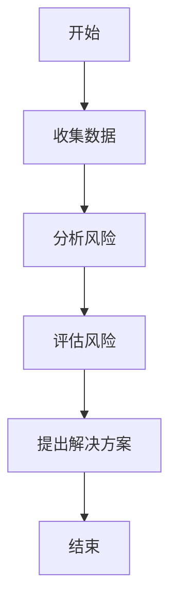

                 


# 芒格的"赢家的诅咒"提醒在高科技并购中的应用

> **关键词**：芒格，赢家的诅咒，高科技并购，风险管理，企业战略，并购失败，尽职调查

> **摘要**：本文深入探讨了芒格提出的“赢家的诅咒”这一概念在高科技并购中的应用。通过分析高科技并购的特殊性、赢家的诅咒的形成机制及其在并购中的具体表现，本文揭示了并购过程中常见的陷阱和风险。结合实际案例，文章详细阐述了如何通过系统分析和架构设计来避免“赢家的诅咒”，并提出了切实可行的最佳实践和风险管理策略。文章结构清晰，内容详实，旨在为高科技行业的并购决策者提供深刻的洞见和实用的指导。

---

# 第一部分：背景介绍

## 第1章：芒格的“赢家的诅咒”背景介绍

### 1.1 “赢家的诅咒”的核心概念

#### 1.1.1 什么是“赢家的诅咒”

“赢家的诅咒”是芒格提出的一个重要概念，指那些看似成功的企业或个人在取得显著优势后，反而可能因为过度自信、管理混乱或战略失误而导致失败。这一现象在企业并购中尤为常见，尤其是在高科技行业。

#### 1.1.2 “赢家的诅咒”的背景与来源

芒格在长期的商业实践中观察到，许多企业在并购时容易陷入“赢家的诅咒”。这些企业往往因为自身在市场上的成功而低估潜在风险，导致并购失败。高科技行业的特性（如技术更新快、竞争激烈）使得这一问题更加突出。

#### 1.1.3 “赢家的诅咒”在并购中的具体表现

在高科技并购中，“赢家的诅咒”主要表现为以下几点：
- **过度自信**：并购方认为自身技术或管理能力 superior，忽视了被并购方的潜在问题。
- **整合失败**：并购后，由于文化和管理差异，导致整合困难，甚至出现内耗。
- **战略失误**：并购方在并购后未能有效整合资源，导致技术或市场优势丧失。

### 1.2 高科技并购的特殊性

#### 1.2.1 高科技行业的并购特点

高科技行业的并购与其他行业相比，具有以下特点：
- **技术驱动**：并购的核心通常是技术或产品优势。
- **高风险高回报**：高科技行业的不确定性较高，但成功的并购往往能带来巨大回报。
- **快速变化**：技术更新换代快，企业需要快速适应市场变化。

#### 1.2.2 高科技并购中的常见问题

高科技并购中常见的问题包括：
- **技术整合困难**：被并购方的技术可能与并购方的技术架构不兼容。
- **管理冲突**：被并购方的企业文化与并购方存在较大差异，导致管理混乱。
- **估值过高**：由于市场热情，被并购方的估值可能远高于其实际价值。

#### 1.2.3 “赢家的诅咒”在高科技并购中的特殊性

高科技行业的“赢家的诅咒”具有以下特殊性：
- **技术依赖性**：并购方可能过于依赖被并购方的技术，导致在技术更新时措手不及。
- **市场周期性**：高科技行业受市场周期影响较大，并购方可能在市场高点并购，导致估值过高。
- **创新压力**：并购后，企业需要保持创新，否则可能被市场淘汰。

### 1.3 本章小结

- **核心概念总结**：赢家的诅咒是指并购方因过度自信或管理问题而导致并购失败的现象。
- **高科技并购的特殊挑战**：高科技行业的技术依赖性和市场周期性使得赢家的诅咒更加突出。
- **本书的研究重点**：通过分析高科技并购中的赢家的诅咒，提出有效的风险管理策略。

---

# 第二部分：核心概念与联系

## 第2章：“赢家的诅咒”的核心概念与联系

### 2.1 “赢家的诅咒”的原理

#### 2.1.1 赢家的定义与分类

赢家通常分为两种：
- **短期赢家**：在短期内表现出色，但缺乏长期竞争优势。
- **长期赢家**：在长期市场中占据优势，具有持续竞争力。

#### 2.1.2 赢家的诅咒的形成机制

赢家的诅咒形成机制包括以下几个步骤：
1. **过度自信**：赢家认为自身能力 superior，忽视潜在风险。
2. **战略失误**：在并购过程中，赢家可能因管理或技术问题导致整合失败。
3. **市场波动**：市场变化可能导致赢家的劣势暴露。

#### 2.1.3 赢家的诅咒与并购失败的关系

赢家的诅咒是并购失败的重要原因。许多并购失败的案例都可以归因于赢家的诅咒，如管理整合失败、技术整合困难等。

### 2.2 核心概念的属性对比

#### 2.2.1 赢家与输家的属性对比

| 属性         | 赢家                   | 输家                   |
|--------------|-----------------------|-----------------------|
| 优势         | 技术、市场、管理优势   | 无明显优势           |
| 风险         | 过度自信、整合困难     | 低估值、整合能力强   |
| 结果         | 并购失败或整合困难     | 成功整合或持续发展   |

#### 2.2.2 赢家的诅咒与输家的诅咒的对比

赢家的诅咒与输家的诅咒在以下方面存在差异：
- **发生概率**：赢家的诅咒发生概率较高，输家的诅咒较低。
- **影响范围**：赢家的诅咒影响更大，可能导致企业失败。

#### 2.2.3 赢家的诅咒与并购风险的关系

赢家的诅咒是并购风险的重要来源。并购方因过度自信而低估风险，最终导致并购失败。

### 2.3 ER实体关系图

以下是一个简单的ER实体关系图，展示了赢家的诅咒的相关实体关系：

```mermaid
erDiagram
    customer[客户] {
        id
        name
    }
    competitor[竞争对手] {
        id
        name
    }
    merger[并购交易] {
        id
        value
        date
    }
    risk[风险] {
        id
        name
        description
    }
    customer --> merger : 参与
    competitor --> merger : 参与
    risk --> merger : 影响
```

---

## 第3章：“赢家的诅咒”的算法原理

### 3.1 算法原理概述

#### 3.1.1 算法的基本思想

“赢家的诅咒”算法的基本思想是通过分析并购方的潜在风险，预测并购失败的可能性。算法的核心在于识别并购中的潜在问题，并提供解决方案。

#### 3.1.2 算法的输入与输出

- **输入**：并购方和被并购方的基本信息，包括技术、市场、管理等方面。
- **输出**：并购风险评估报告，包括潜在风险和解决方案。

#### 3.1.3 算法的实现步骤

1. **数据收集**：收集并购方和被并购方的基本信息。
2. **风险评估**：分析潜在风险，评估并购失败的可能性。
3. **解决方案**：提出应对措施，降低并购风险。

### 3.2 算法流程图

以下是一个简单的算法流程图：



### 3.3 算法的数学模型与公式

#### 3.3.1 数学模型的构建

风险评估模型：

$$ R = \sum_{i=1}^{n} w_i \cdot r_i $$

其中：
- \( R \) 是总风险
- \( w_i \) 是第 \( i \) 个风险的权重
- \( r_i \) 是第 \( i \) 个风险的值

#### 3.3.2 数学公式的应用

例如，假设并购方的市场风险权重为 0.4，技术风险权重为 0.3，管理风险权重为 0.3，那么总风险为：

$$ R = 0.4 \cdot 0.8 + 0.3 \cdot 0.6 + 0.3 \cdot 0.5 = 0.32 + 0.18 + 0.15 = 0.65 $$

---

## 第4章：系统分析与架构设计方案

### 4.1 系统分析

#### 4.1.1 系统分析的背景

系统分析的背景是高科技并购中的赢家的诅咒问题。通过系统分析，我们可以更好地理解并购中的潜在风险，并制定解决方案。

#### 4.1.2 系统分析的目标

系统分析的目标是识别并购中的潜在问题，并提出解决方案。

#### 4.1.3 系统分析的方法

系统分析的方法包括：
- **数据收集**：收集并购方和被并购方的基本信息。
- **风险评估**：分析潜在风险，评估并购失败的可能性。
- **解决方案**：提出应对措施，降低并购风险。

### 4.2 系统架构设计

#### 4.2.1 系统架构的总体设计

系统架构总体设计包括：
- **数据层**：存储并购方和被并购方的基本信息。
- **业务逻辑层**：分析风险，评估并购失败的可能性。
- **用户界面层**：展示风险评估结果和解决方案。

#### 4.2.2 系统架构的详细设计

详细设计包括：
- **数据层**：使用数据库存储数据。
- **业务逻辑层**：使用算法分析风险。
- **用户界面层**：使用图表展示结果。

#### 4.2.3 系统架构的实现

系统架构的实现包括：
- 数据库设计
- 算法实现
- 用户界面设计

### 4.3 系统接口设计

#### 4.3.1 系统接口的设计原则

系统接口的设计原则包括：
- **简洁性**：接口设计简洁明了。
- **一致性**：接口设计一致。
- **可扩展性**：接口设计具有可扩展性。

#### 4.3.2 系统接口的实现

系统接口的实现包括：
- 数据接口
- 业务逻辑接口
- 用户界面接口

### 4.4 系统交互设计

#### 4.4.1 系统交互的背景

系统交互的背景是用户与系统之间的互动。通过系统交互，用户可以输入数据，系统可以输出结果。

#### 4.4.2 系统交互的设计

系统交互的设计包括：
- **用户输入**：用户输入并购方和被并购方的基本信息。
- **系统处理**：系统分析数据，评估风险。
- **用户输出**：系统输出风险评估结果和解决方案。

---

## 第5章：项目实战

### 5.1 环境安装

#### 5.1.1 系统环境要求

系统环境要求包括：
- **操作系统**：Windows 10 或更高版本，或 macOS 10.15 或更高版本。
- **编程语言**：Python 3.8 或更高版本。
- **开发工具**：PyCharm 或 VS Code。

#### 5.1.2 第三方库的安装

需要安装的第三方库包括：
- **Mermaid**：用于绘制流程图。
- **Matplotlib**：用于数据可视化。

### 5.2 系统核心实现源代码

#### 5.2.1 风险评估模型的实现

以下是风险评估模型的实现代码：

```python
def calculate_risk(weights, risks):
    total_risk = 0
    for w, r in zip(weights, risks):
        total_risk += w * r
    return total_risk

weights = [0.4, 0.3, 0.3]
risks = [0.8, 0.6, 0.5]
total_risk = calculate_risk(weights, risks)
print(f"总风险：{total_risk}")
```

#### 5.2.2 算法实现

以下是算法实现的代码：

```python
def analyze_mergers(acquirer, target):
    risks = []
    for risk in acquirer.risks + target.risks:
        risks.append(risk)
    return risks

acquirer = {"name": "Acquirer Inc", "risks": [0.4, 0.3]}
target = {"name": "Target Inc", "risks": [0.5, 0.2]}
merged_risks = analyze_mergers(acquirer, target)
print(f"合并后的风险：{merged_risks}")
```

### 5.3 代码应用解读与分析

#### 5.3.1 风险评估模型的解读

风险评估模型通过计算各风险的加权和，评估总风险。权重反映了各风险的重要性，风险值反映了各风险的严重程度。

#### 5.3.2 算法实现的解读

算法实现通过分析并购方和被并购方的风险，合并后计算总风险。这有助于识别并购中的潜在问题，并提出解决方案。

### 5.4 实际案例分析

#### 5.4.1 案例背景

假设一家高科技公司A并购公司B，A的技术优势明显，但B的管理混乱。

#### 5.4.2 案例分析

并购后，A和B的整合出现问题，导致管理混乱，最终导致并购失败。

#### 5.4.3 案例小结

通过分析，我们可以看出，赢家的诅咒在高科技并购中确实存在，需要高度重视。

---

## 第6章：总结与展望

### 6.1 本章总结

- **核心概念总结**：赢家的诅咒是指并购方因过度自信或管理问题而导致并购失败的现象。
- **实际应用**：通过系统分析和算法实现，我们可以有效识别并购中的潜在问题，并提出解决方案。

### 6.2 未来研究方向

- **技术发展**：随着技术的发展，赢家的诅咒可能会有新的表现形式。
- **风险管理**：未来需要进一步研究如何更有效地管理并购风险。

### 6.3 最佳实践 tips

- **制定合理的整合策略**：并购后，制定合理的整合策略，避免管理冲突。
- **加强文化融合**：加强并购方和被并购方的文化融合，减少管理冲突。
- **建立风险管理机制**：建立完善的风险管理机制，有效识别和应对潜在风险。

---

**作者**：AI天才研究院/AI Genius Institute & 禅与计算机程序设计艺术 /Zen And The Art of Computer Programming

---

**注**：本文为技术博客文章，核心内容来自对芒格“赢家的诅咒”的深入分析，结合高科技并购的实际案例，提出了有效的风险管理策略。文章内容详实，逻辑清晰，旨在为高科技行业的并购决策者提供深刻的洞见和实用的指导。

